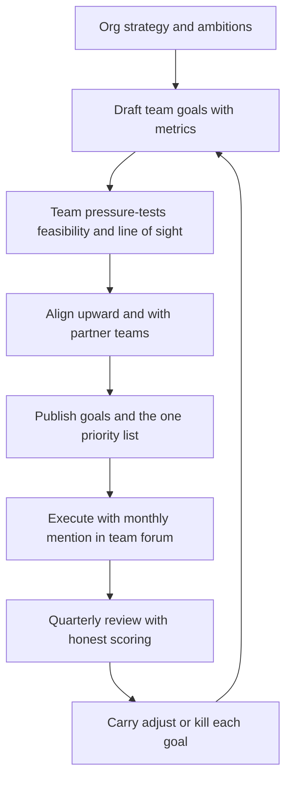

# Goal Setting and Priorities

> **Core skill:** Translating org strategy into a small set of team goals everyone can state from memory, keeping one visible priority list, and defending it by trading scope — not by absorbing everything.

## Why This Matters

Most teams do not suffer from a lack of goals; they suffer from too many, stated too vaguely, owned by no one, and reviewed never. The result is activity without direction: everyone is busy, the roadmap is full, and no one can answer why this quarter's work is this quarter's work. Strategy that never becomes team goals is a document, not a direction.

The engineering manager is the translation layer. Org strategy arrives as ambitions and themes; the team needs three or fewer goals with measurable outcomes that connect daily work to those ambitions. The manager's test is brutal and simple: ask any engineer what the team is trying to accomplish this quarter and why it matters. Consistent answers mean the job is done; blank stares or five different answers mean it is not.

Priorities are the goals' shadow. A goal list without a visible priority list invites everyone to insert their favorite work, and the team absorbs requests silently until capacity is a mystery. One list, publicly maintained, with an explicit way to say no — that is the machinery that makes goals real.

## From Strategy to Team Goals

The translation runs through questions, not documents: what is the org trying to achieve, what does our team uniquely contribute to it, and what would prove we contributed?

| Org Strategy Says | Translation Question | Team Goal Candidate |
|-------------------|----------------------|---------------------|
| "Grow activation in emerging markets" | What does our surface control in that funnel? | Reduce onboarding drop-off on low-bandwidth connections by 40 percent |
| "Become the reliability leader" | Which of our SLOs embarrass us? | Take checkout availability from 99.5 to 99.9 percent |
| "Cut cost of goods sold" | Where is our spend concentrated? | Cut compute cost of the pipeline by 30 percent at equal throughput |
| "Enterprise readiness" | What blocks the biggest deals? | Ship SSO, audit logs, and the compliance report by Q3 |

A goal that cannot name the org ambition it serves is either a hobby or an unexamined inheritance. Both are fine to discover — and neither should survive the review unnamed.

## Goal Formats: OKR or Simpler

| Format | Best When | Risk |
|--------|-----------|------|
| **OKR (objectives and key results)** | Org already runs OKRs; team wants alignment machinery | Cargo-culting metrics that measure motion, not outcome |
| **Three goals, one metric each** | Small team, first year of deliberate goal-setting | Simplicity hiding lack of ambition |
| **Commit/target lists per quarter** | Delivery-dominated teams with heavy roadmap commitments | Commitments crowd out improvement work |
| **No format** | Never | Strategy stays a document; work defaults to loudest voice |

The format matters less than three properties: few enough to remember, measurable enough to falsify, and connected enough to explain. A team running "simpler than OKR" well beats a team running OKR badly every quarter.

## Goals the Team Can State

The memorability test is the cheapest goal audit available.

| Audit Question | Passing Answer Looks Like |
|----------------|---------------------------|
| What are we trying to do this quarter? | The same three goals, in the same words, from every engineer |
| Why does it matter? | A sentence connecting to a customer or business outcome |
| How will we know we got there? | The metric and its target, stated without checking a doc |
| What are we not doing because of this? | A named sacrifice — proof the goal actually constrains |

That last question is the telling one. A goal that has never caused anything to be deprioritized is decoration.

## One Visible Priority List

Priorities live in exactly one place that everyone can see and the team keeps updated.

| Property | Standard | Anti-Pattern |
|----------|----------|--------------|
| Singularity | One list for all team work — roadmap, tech debt, support | A tracker list, a spreadsheet, and a manager's head, all different |
| Visibility | Linkable by anyone, read-mostly, no login wall for stakeholders | Priority truth lives in the manager's status reports |
| Ordering | Strict enough that "the top three" is a stable, quotable phrase | Everything marked high; the list is a bag |
| Change discipline | Re-ordering is a decision with a reason attached | Silent re-ordering discovered by diffing screenshots |
| Line of sight | Every active item traces to one of the three goals | 40 percent of items trace to " miscellaneous" |

## The Line-of-Sight Problem

Individual engineers disengage when they cannot see how their task list connects to the goal — the classic line-of-sight problem. The manager repairs it in two moves: goal statements that mention the user-facing change, and planning conversations that name which goal each epic serves.

| Disconnected Framing | Line-of-Sight Reframe |
|----------------------|------------------------|
| "Refactor the session service" | "Cut login latency in half so the activation goal is reachable — the session service is the blocker" |
| "Upgrade the framework" | "Unblock the two features the enterprise goal needs this quarter" |
| "Pay down test debt" | "Make the release train reliable enough to ship the Q3 goal weekly" |

## Saying No Upward

Scope conversations with your own management are trade-off presentations, not refusals.

| Element | Content |
|--------|---------|
| The fact | Current capacity and the committed goals |
| The request's cost | What moves out or slips if this is added |
| The options | Add and drop X, add and slip Y, or defer to next quarter |
| The recommendation | Your call, with the reason, ready to be overruled |

The manager who brings options gets treated as a partner in the trade. The manager who says "we can't" gets treated as an obstacle to route around — and the work arrives by another path anyway.

## Goal Anti-Patterns

| Anti-Pattern | Symptom | Correction |
|--------------|---------|------------|
| **Too many goals** | Seven goals, none remembered, none traded against | Hard cap at three; the rest are explicitly not goals |
| **Vanity metrics** | Metrics that move when nothing improves — tickets closed, story points | Outcome metrics a customer or the business would notice |
| **Set-and-forget** | Goals written in January, scored in December, never discussed | Monthly mention in team forum; quarterly real review |
| **Inherited pseudo-goals** | Last year's goals copied forward because no one decided | Every goal earns its place each cycle or dies |
| **Activity as outcome** | "Ship the redesign" with no measure of effect | Attach the usage or performance change the ship should cause |
| **Unfalsifiable goals** | No condition under which the goal would be scored missed | Write the miss condition when writing the goal |

## The Quarterly Goal Rhythm



## Practical Applications

**Goal-setting checklist:**

- [ ] Three or fewer goals; each states the outcome, not the activity
- [ ] Every goal names its metric, target, and miss condition
- [ ] Every goal traces to an org ambition in one sentence
- [ ] Any engineer can state the goals unprompted
- [ ] One visible priority list; the top three are quotable
- [ ] Every active item traces to a goal or is explicitly flagged
- [ ] The sacrifices the goals caused are named and recorded
- [ ] Quarterly review is booked when goals are published

**Team goal template:**

```markdown
## Team Goals — [Quarter]

Goal 1: [Outcome statement a customer would notice]
Metric: [Measure] from [baseline] to [target] by [date]
Miss condition: [What result scores this as missed]
Traces to: [Org ambition]
Sacrifices: [What we are not doing because of this goal]

Goal 2: ...
Goal 3: ...

Explicitly not this quarter: [parked items with revisit date]
```

## Common Pitfalls

| Pitfall | Why It Is a Problem | Better Approach |
|---------|---------------------|-----------------|
| **Too many goals** | Nothing is traded off; the list becomes a wish list | Hard cap of three; the sacrifice list proves the cap is real |
| **Vanity metrics** | The metric moves while the customer notices nothing | Outcome measures a user or the business would feel |
| **Set-and-forget** | Goals rot unreviewed; drift goes unnoticed all quarter | Monthly mention, quarterly honest scoring |
| **Invisible priorities** | Work arrives through side doors; capacity disappears | One visible list; changes are decisions with reasons |
| **Saying yes upward by default** | Team absorbs additions until quality and morale erode | Present the trade-off; let the addition displace something |
| **Manager-private goal doc** | The team never internalized what it is for | Goals the team can state without opening the doc |

## Success Indicators

- Random-sampled engineers state the same three goals in similar words
- Every goal was scored honestly at quarter end, including the misses
- The priority list is quoted in stakeholder conversations without prompting
- Additions to the quarter visibly displaced something, every time
- Goal metrics are outcome measures, not activity counts

## Related Topics

- [[02_Planning_Cadences_and_Commitments]]: goals become commitments through the planning cadence
- [[03_Scope_and_Priority_Management]]: the machinery that keeps one priority list honest
- [[04_Progress_Visibility_and_Reporting]]: progress signals report against these goals
- [[05_Organizational_Awareness_and_Influence/00_overview|Organizational Awareness and Influence]]: reading org strategy correctly before translating it
- [[career-path/05_Tech_Lead/04_Team_Delivery_and_Execution_Leadership/00_overview|Delivery and Execution Leadership (Tech Lead)]]: the technical execution layer these goals steer

## Summary

Goal setting and priorities is translation discipline: convert org strategy into three or fewer outcome goals with metrics and miss conditions, publish one visible priority list that every active item traces to, name the sacrifices that prove the goals constrain, and review honestly each quarter. Saying no upward is a trade-off presentation with options, not a refusal. The manager's test: ask five engineers what the team is working toward — identical answers mean the translation landed.
