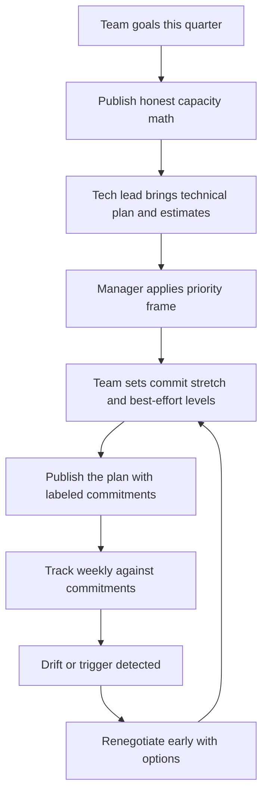

# Planning Cadences and Commitments

> **Core skill:** Creating the conditions for honest plans — real capacity math, commitment levels that mean something, and renegotiation early — without writing the plan yourself or promising privately what the team has not agreed to.

## Why This Matters

A plan is a promise the team makes with its name on it. When the manager builds the conditions for that promise — accurate capacity, clear priorities, a safe space to say "not with this team this cycle" — the plan becomes a commitment stakeholders can build on. When the manager writes the plan alone and hands it down, the team watches dates they never believed in slip exactly as they privately predicted, and the manager learns that plans made without the planners are fiction with a Gantt chart.

The EM's planning role is conditions, not control. The tech lead owns the technical plan — architecture, sequencing, estimation practice. The EM owns capacity truth (is the team actually available for the committed work, minus leave, interrupts, and support load?), priorities (which commitments serve the goals), and the interface upward (what stakeholders hear and when they hear it). Confusing these ownerships produces either a manager-micromanaged plan nobody owns or a tech-lead plan that ignores reality.

Commitment discipline is the trust engine. A team known for meeting commitments or renegotiating them early gets scope authority, patience, and the benefit of the doubt. A team that over-promises and quietly under-delivers gets inspections, escalations, and deadlines set by other people.

## Capacity Honesty

Capacity is what the team can deliver after subtracting everything that is not committed feature work. Managers who plan from nominal headcount produce plans that fail by a third, every quarter, predictably.

| Subtraction | Typical Share | Notes |
|-------------|---------------|-------|
| Nominal capacity | Engineer-days in cycle | The starting fiction |
| Leave and holidays | 5-15 percent | Known in advance; unforgivable to miss |
| Meetings and ceremonies | 10-20 percent | Planning, standups, reviews, cross-team syncs |
| Support and interrupts | 15-30 percent | Measure it — see [[07_Delivery_Interrupts_and_Firefighting]] |
| Code review and mentoring | 5-15 percent | Real work that produces no features |
| New-hire ramp drag | 20-50 percent of a new hire's time plus mentor time | Onboarding costs the team, not just the hire |

A team of eight with two weeks of combined leave, measured 20 percent interrupt load, and one mid-onboarding hire is not an eight-person team this cycle. The manager publishes the math; the number at the bottom is the planning input, not the headcount.

## Commitment Levels

Not all statements about the future carry the same weight, and the difference must be explicit.

| Level | Definition | If It Slips | Used For |
|-------|------------|-------------|----------|
| **Commit** | The team stakes credibility on it; backed by capacity math | A miss — triggers renegotiation and retrospective | External dates, contracted milestones |
| **Stretch** | Attempted after commits are protected | Expected sometimes; no drama | Ambition without bet-the-trust risk |
| **Best-effort** | We will work it in order, no date promised | Nothing — no date was given | Exploration, spikes, nice-to-haves |

The corruption pattern is silent promotion: a stretch goal quoted to leadership as a commitment, a best-effort item becomes "due Friday." The manager polices the labels — every plan states which items are which, and status reports keep the labels attached.

## Planning with the Tech Lead

| Concern | Owner | Collab Pattern |
|---------|-------|----------------|
| Technical approach and sequencing | Tech lead | TL presents; manager probes for risk and re-scoping options |
| Estimation practice | Tech lead | Manager supplies the honest-capacity envelope |
| Capacity truth | Manager | Manager publishes the subtraction math |
| Which commitments serve the goals | Manager | Manager sets the priority frame before estimation |
| Stakeholder commitments | Manager | Manager translates team confidence into external language |

The pair runs planning as a two-voice meeting: the TL on "how and in what order," the manager on "how much and what matters most." When one voice does both, the plan is either technically naive or organizationally deaf.

## Mid-Cycle Renegotiation

Reality changes; honest plans announce the change early.

| Trigger | Renegotiation Move |
|---------|--------------------|
| Scope request arrives | Trade: what leaves, or the date moves — never silent addition |
| Discovery invalidates an estimate | Re-scope the item; surface the new picture this week, not at review |
| Dependency slips | Re-sequence; inform anyone who planned on the date |
| Illness or departure | Recompute capacity; protect top commitments, renegotiate the rest |
| Interrupt spike | Show the measured load; present scope options against it |

The renegotiation format is constant: the fact, the impact on commitments, two or three options, a recommendation, a decision date. Early and with options reads as competence; late and without options reads as failure.

## Planning Anti-Patterns

| Anti-Pattern | What It Looks Like | Damage |
|--------------|--------------------|--------|
| **Planning theater** | Elaborate ceremony producing dates nobody believes | Hours spent; no commitment created |
| **Sandbagging incentives** | Teams pad estimates because honesty got punished last time | Capacity mysteriously "found" for low-value work |
| **Manager-privately-promised dates** | Manager commits upward before the team has estimated | Team inherits a promise; trust breaks in both directions |
| **Feature-factor fiction** | Planning as if the team had zero interrupts and no leave | Every cycle misses by the same predictable third |
| **Stretch-as-commit quoting** | Stretch numbers quoted upward as firm | Credibility spent on ambition that was never funded |
| **Estimate blame** | Post-hoc interrogation of misses | Next cycle's estimates get padded; signal dies |

## The Planning Cadence



## Practical Applications

**Planning cycle checklist:**

- [ ] Capacity math published with every subtraction visible
- [ ] Interrupt load taken from measurement, not folklore
- [ ] Tech lead owns the technical plan; manager owns the envelope and priorities
- [ ] Every item labeled commit, stretch, or best-effort in the published plan
- [ ] No upward promise made before the team has estimated
- [ ] Mid-cycle renegotiation format known to the whole team
- [ ] Last cycle's misses reviewed for estimation learning, not blame

**Mid-cycle renegotiation message template:**

```markdown
Commitment update: [item] — status [amber / red]

What changed: [fact — one sentence]
Impact: [which commitment, how much]

Options:
1. [De-scope X so the commit date holds]
2. [Hold scope, move the date by N days]
3. [Add capacity from Y — cost to Z]

Recommendation: [option] because [reason]
Decision needed by: [date]
```

## Common Pitfalls

| Pitfall | Why It Is a Problem | Better Approach |
|---------|---------------------|-----------------|
| **Planning from headcount** | Leave, interrupts, and ramp eat a third; plans miss on schedule | Publish the subtraction math; plan from the remainder |
| **Private manager commitments** | The team inherits promises it never made; trust breaks twice | Estimate with the team first; promise second |
| **Stretch quoted as commit** | Ambition spends credibility that delivery must repay | Labels travel with the numbers, everywhere |
| **Sandbagging punished, honesty punished harder** | Estimates become insurance; real capacity becomes invisible | Treat misses as estimation data, never as misconduct |
| **Renegotiation only at cycle end** | Small slips compound into big surprises | Any trigger fires the renegotiation within the week |
| **Manager writes the plan alone** | Team watches dates they never believed in slip on schedule | Team plans; manager shapes conditions and priorities |

## Success Indicators

- Commitments are met or renegotiated early in at least nine of ten cycles
- The team can explain the capacity math and the commit/stretch labels
- Estimates improve quarter over quarter without sandbagging growth
- Stakeholders quote the team's own labeled numbers back
- No commitment exists that the team did not agree to

## Related Topics

- [[01_Goal_Setting_and_Priorities]]: goals set the priority frame planning executes
- [[03_Scope_and_Priority_Management]]: the intake machinery that keeps mid-cycle additions honest
- [[04_Progress_Visibility_and_Reporting]]: labeled commitments need honest progress signals
- [[07_Delivery_Interrupts_and_Firefighting]]: the measured interrupt load capacity math depends on
- [[career-path/05_Tech_Lead/04_Team_Delivery_and_Execution_Leadership/01_Delivery_Planning_Leadership|Delivery Planning Leadership (Tech Lead)]]: the TL-side planning practice this pairs with

## Summary

Planning cadences and commitments is conditions, not control: publish honest capacity with every subtraction visible, let the tech lead own the technical plan while the manager owns the envelope and priorities, label every commitment as commit, stretch, or best-effort — and never let the labels separate from the numbers. Renegotiate the moment reality shifts, with facts and options, and treat estimation misses as data rather than discipline problems. The manager's test: does every commitment in the plan carry the team's informed consent?
