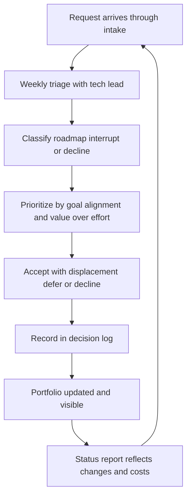

# Scope and Priority Management

> **Core skill:** Treating scope as a negotiated portfolio — every request has a cost, every cost is a decision, and every decision is visible in one place — instead of letting work arrive through hallway conversations.

## Why This Matters

Team capacity is fixed; scope is not. Every request that reaches the team costs the same currency — engineer-days — and when additions arrive without anything leaving, the cost is paid silently: dates slip, quality corners get cut, and the team learns that saying yes to everything is the job. Most "delivery problems" are actually scope-management problems wearing a schedule costume.

The manager's job is to make scope a negotiation instead of an absorption. That requires infrastructure: a single intake point, a visible triage, a decision log, and a default answer of "what should this displace?" rather than "yes." It also requires lightweight prioritization — value against effort is enough. Heavy frameworks (full RICE scoring with committees) become the work instead of serving it.

Scope discipline is also a sanity mechanism. Teams with visible scope decisions argue about priorities in the open, where arguments belong. Teams with invisible scope decisions argue about why everything is late, which is a worse argument with the same energy.

## Every Request Is a Decision

The foundational move: no work enters the team's queue without a decision, and every decision has a cost visible to its requester.

| Request Arrives As | The Decision It Actually Is |
|--------------------|------------------------------|
| "Quick question about the API" that becomes a project | Is this a project? Then: what displaces? |
| Executive ask in a hallway | Same intake, same triage — no side doors for seniority |
| Support ticket that keeps recurring | Fix-forward project or permanent toil? |
| "Small tweak" to a committed feature | Scope change to a commitment — needs the commitment owner |
| Idea from the team itself | Great — still enters the same funnel with the same honesty |

The manager protects the funnel's singularity. The moment requests can bypass intake by reaching an engineer directly, the portfolio becomes a rumor and capacity becomes a mystery.

## The Scope Board

| Board Element | Content | Standard |
|---------------|---------|----------|
| Intake | Every request with requester, value statement, and rough size | Nothing enters the team except through here |
| Triage | Weekly review: classify, estimate roughly, decide or queue | 30 minutes, manager plus tech lead |
| Decision log | What was accepted, deferred, declined — with dates and reasons | Searchable; the answer to "whatever happened to..." |
| Active scope | The committed portfolio with owners | Matches the one priority list from [[01_Goal_Setting_and_Priorities]] |
| Deferred list | Parked with revisit dates | Not a graveyard — items return on schedule |

The decision log is the quiet hero: it converts "no" from a confrontation into a record, and it gives declined requesters a legitimate path back.

## Prioritization: Light Frameworks Only

| Framework | Mechanics | Use When | Anti-Pattern |
|-----------|-----------|----------|--------------|
| **Value / effort** | Rough value score over rough size; sort | Almost always the right default | Pretending precision the inputs do not have |
| **RICE-lite** | Reach times impact over effort, no committees | Comparing a backlog of similar-shaped items | Full RICE with working groups — the framework becomes the work |
| **Strategic alignment** | Which goal does this serve? | Quarterly planning, large items | Everything claims to serve every goal |
| **Cost of delay** | What breaks or compounds if this waits? | Deadline-sensitive items, risk work | Applying it to everything, making everything urgent |

The honest hierarchy: goal alignment first, value/effort second, and any framework only as precise as its crudest input. A prioritization session that produces decimals from gut feelings has not improved on gut feelings; it has hidden them.

## Interrupt Classification and Budgets

Interrupts are scope that arrives wearing urgency. Classify and budget them rather than pretending they will not happen — the full practice lives in [[07_Delivery_Interrupts_and_Firefighting]].

| Class | Examples | Budget Approach |
|-------|----------|-----------------|
| Support | User questions, how-to requests, account fixes | Fixed rotation, capped hours per week |
| Bugs | Production defects, quality escapes | Severity-tiered; sev-1 always in, sev-3 queued |
| Opportunities | Conference talk, internal demo, partnership spike | Quarterly discretionary pool |
| Production issues | Incidents, on-call escalations | Unbudgeted but measured; chronic load triggers system work |

The budget makes the trade explicit: interrupt hours over budget come out of roadmap items, visibly, in the status report — not invisibly, in quality.

## Saying No with Alternatives

"No" without an alternative reads as obstruction; "no" with a path reads as management.

| Instead Of | Say |
|------------|-----|
| "We don't have capacity" | "Not this quarter — it is queued for the Q3 triage on [date]" |
| "That's not our job" | "That sits with the platform team; I will introduce you to their EM" |
| "No" | "Yes, if we drop X — do you want that trade?" |
| "Maybe later" (meaning no) | "Later means January at the earliest; want me to log it with that revisit date?" |

The this-not-that formula is the strongest: every acceptance names its casualty. Requesters who see casualties become self-filtering — they stop bringing items that cannot justify their cost.

## Scope Creep Detection

Scope creep is scope growth without a decision — usually inside a committed item rather than around it.

| Creep Signal | Detection Method |
|--------------|------------------|
| Ticket count per feature climbing | Watch items-per-epic trend at weekly review |
| "While we're in there" additions | Review PR descriptions for unrelated changes |
| Acceptance criteria drifting | Diff the criteria at mid-cycle check |
| Estimate-to-actual divergence on one item | One item at 200 percent while others are fine is creep, not estimation error |
| New stakeholders appearing mid-item | Someone is expanding the audience without a decision |

When creep is detected, the move is a scope conversation with the item owner — re-baseline the item or restore the original boundary, visibly.

## Communicating Scope Decisions

| Audience | What They Need | Channel |
|----------|----------------|---------|
| The requester | The decision, the reason, and the path back | Direct, within the week |
| The team | What entered, what left, and why | Weekly triage notes |
| Stakeholders | Portfolio changes and their date impact | Status report changelog |
| Your manager | Declined items that may escalate | Preview in one-on-one |

## The Scope System



## Practical Applications

**Scope board health checklist:**

- [ ] Single intake point; no side doors, including for seniority
- [ ] Weekly triage held; decisions made or explicitly queued
- [ ] Every acceptance names what it displaced
- [ ] Decision log current and searchable
- [ ] Deferred items carry revisit dates that are actually revisited
- [ ] Interrupt budget visible in the status report when exceeded
- [ ] Creep signals reviewed at weekly scope check

**Scope decision reply template:**

```markdown
Decision on [request]: [Accepted / Deferred to date / Declined]

Reason: [One sentence — goal alignment or value over effort]

If accepted:
- Displaces: [item or date impact]
- Owner: [name]

If deferred:
- Revisit: [date, already on the triage calendar]

Path back if declined: [what would change the decision]
```

## Common Pitfalls

| Pitfall | Why It Is a Problem | Better Approach |
|---------|---------------------|-----------------|
| **Side-door requests** | Seniority bypasses intake; the portfolio becomes fiction | One intake; executives route through it too, politely |
| **Invisible acceptance** | Capacity vanishes; nobody can say what it bought | Every acceptance names its displacement |
| **Framework cosplay** | RICE committees consume the time they were meant to save | Value over effort; precision only as good as inputs |
| **Bare no** | Requesters escalate or route around; the manager becomes the obstacle | No with a path: queue, trade, or revisit date |
| **Scope creep unchallenged** | One item quietly becomes three; the commit date becomes a lie | Creep signals watched weekly; re-baseline or restore |
| **Deferred means never** | The queue loses credibility; requesters push everything to now | Revisit dates honored; some items genuinely return |

## Success Indicators

- No work reaches engineers outside the intake funnel
- Requesters pre-filter: they arrive with displacement candidates
- Decision log answers "what happened to X" without a meeting
- Deferred items resurface on schedule and some get accepted
- Status reports show scope changes with their costs, weekly

## Related Topics

- [[01_Goal_Setting_and_Priorities]]: the goals and priority list the scope board serves
- [[02_Planning_Cadences_and_Commitments]]: scope decisions convert into commitments here
- [[07_Delivery_Interrupts_and_Firefighting]]: interrupts as a classified, budgeted scope class
- [[06_Stakeholder_Relationship_Management]]: the relationships that make scope conversations safe
- [[career-path/05_Tech_Lead/04_Team_Delivery_and_Execution_Leadership/05_Coordinating_Across_Teams|Coordinating Across Teams (Tech Lead)]]: cross-team scope and dependency negotiations

## Summary

Scope and priority management treats the team's capacity as a portfolio: one intake, weekly triage, a decision log, and prioritization no heavier than value over effort against goal alignment. Every acceptance names its casualty, every decline carries a path back, and interrupts are a classified, budgeted scope class rather than an ambush. Scope creep gets detected at weekly review and resolved as a visible re-baseline. The manager's test: can anyone, in one place, see everything the team is working on and why?
