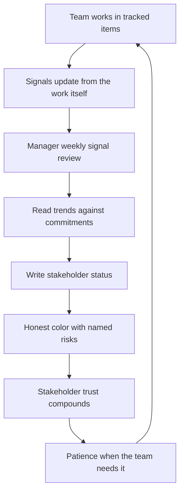

# Progress Visibility and Reporting

> **Core skill:** Building progress signals the team itself keeps current, reading trends instead of collecting anecdotes, and writing status that survives scrutiny — green means green, and red arrives early.

## Why This Matters

The default state of engineering progress is opacity: work happens, and the only way to know where it stands is to ask, and asking is precisely what makes managers the bottleneck. A team whose status lives in the manager's head learns that reporting is an interrogation ritual; a team whose signals update themselves learns that visibility is just how work flows. The manager's job is to design the second system and then mostly stop asking.

Reporting is also a trust asset with a compounding return. Stakeholders who receive honest, predictable, trend-based status stop building private channels to find out "what is really going on" — because the report already tells them. Every surprise withheld from a report is a withdrawal from that trust account, and the balance is checked exactly when the team needs patience most.

The failure modes sit on both ends. Under-reporting hides trouble until it explodes; over-reporting buries signal in noise until readers stop reading. The discipline is a small set of well-designed signals, honestly maintained, delivered at a fixed rhythm, with the manager's judgment layered on top — not the manager as human status scraper.

## Designing Self-Updating Signals

The best progress signal requires zero human minutes to stay current.

| Signal | Source | Updates | Shows |
|--------|--------|---------|-------|
| Cumulative flow or throughput | Ticket transitions in tracker | Automatic | Whether flow is steady, rising, or clogged |
| Commit-to-merge cycle time | Version control and CI | Automatic | Where work stalls — review, QA, deploy |
| Burn-up against commitment | Linked tickets to plan items | Near-automatic | Commit progress against the labeled plan |
| Release frequency | Deploy pipeline | Automatic | Delivery cadence health |
| Open blocker age | Tracker field, owned | Manual but cheap | Whether unblocking works |
| Interrupt load | Ticket class tags | Automatic | Roadmap erosion in real time |

Design rule: every signal answers a question someone actually asks. Dashboards full of charts nobody consults are status theater with nicer fonts.

## The Weekly Signal Review

The manager reads signals weekly — trends, not anecdotes.

| Question | Signal That Answers It | Concern Threshold |
|----------|------------------------|-------------------|
| Is committed work flowing? | Burn-up slope against time remaining | Slope projects a miss |
| Is WIP rising? | In-progress count trend | Steady climb means thrash ahead |
| Are reviews the bottleneck? | Cycle time split by stage | Review queue growing week over week |
| Are interrupts eating the roadmap? | Interrupt-tagged load vs budget | Over budget two weeks running |
| Are we discovering scope? | Items added per epic | Addition rate exceeds completion rate |

One weekly reading pass, thirty minutes, produces the material for both the team conversation and the stakeholder report. Anecdote-driven management — reacting to yesterday's loudest story — is what this replaces.

## Stakeholder Reporting Formats

| Report Element | Content | Standard |
|----------------|---------|----------|
| Status summary | One paragraph: where the commitments stand | Plain sentences, no jargon |
| Trend | Direction of travel versus last period | Better, same, worse — with the driver |
| Risks | Named risks with owner and mitigation | Two or three real ones, not a compliance list |
| Decisions needed | Specific asks with dates | Empty when nothing is needed — not invented |
| Changes since last | Scope and date movements from the decision log | Every change visible, none silent |

## Red-Yellow-Green Honesty

Status color is a trust contract. "Green until it is obviously not" is lying with a color code.

| Color | Honest Definition | Discipline |
|-------|--------------------|------------|
| **Green** | Evidence supports on-time delivery; no unmitigated top risks | If a report reader would be surprised by a slip, it was not green |
| **Yellow** | Credible threat to date or scope; mitigation identified and underway | Yellow must come with the risk named and the plan attached |
| **Red** | Commitment will be missed without intervention; decision needed | Red arrives the week the evidence says so — not the week it becomes undeniable |

The amber trap: staying yellow for six consecutive weeks while the trend line says red. Readers learn the colors are decorative, and the first genuinely green report is doubted too. Color drift corrupts the whole instrument.

## Writing Status That Survives Scrutiny

A good status update can be forwarded anywhere without the manager present to explain it.

| Principle | Weak | Survives Scrutiny |
|-----------|------|-------------------|
| Facts with numbers | "Making good progress" | "9 of 13 items done; burn-up projects completion Nov 12 vs Nov 8 commit" |
| Trend, not snapshot | "API work continues" | "API integration slowed 20 percent — partner endpoint changes; revised estimate Friday" |
| Next, with dates | "Continuing next week" | "Payments sandbox live by Oct 3; first end-to-end test Oct 7" |
| Risks named specifically | "Some risk remains" | "Risk: certification review books 3 weeks out — request submitted Monday" |
| Changes reconciled | Silent date moves | "Checkout date moved Nov 1 to Nov 8 — scope trade decision, log #47" |

## Reporting as a Trust Asset

| Practice | Trust Effect |
|----------|--------------|
| Fixed rhythm, no gaps | Predictability — readers stop fishing for information |
| Bad news first, from the manager | The team's problems arrive from its manager, not around them |
| Numbers that reconcile to artifacts | Reports tie to tracker and decision log — auditable, not narrative |
| Consistent vocabulary | Same terms, week over week; readers build a mental baseline |

Trust compounds quietly until the quarter when the team needs a date moved, a scope cut accepted, or patience on a risk — and discovers the account balance.

## Over-Reporting as Noise

| Noise Pattern | Symptom | Correction |
|---------------|---------|------------|
| Daily long-form updates | Readers skim; nothing lands | Weekly rhythm, exceptions-only between |
| Fifteen-metric dashboard | No signal stands out | Five signals that answer real questions |
| Template compliance writing | Sections filled with filler to fill them | Empty sections are honest — omit them |
| CC-everyone culture | Nobody owns reading it | Named audiences per report type |

## The Reporting System



## Practical Applications

**Reporting system checklist:**

- [ ] Five or fewer signals, each answering a real stakeholder question
- [ ] Signals update from the work itself — no human status collection
- [ ] Weekly signal review on the calendar; trends read, not anecdotes
- [ ] Status report rhythm fixed; bad news leads, from the manager
- [ ] Colors honest: a reader would never be surprised by a slip from green
- [ ] Numbers in reports reconcile to tracker and decision log
- [ ] Decisions-needed section empty most weeks — and that is fine

**Weekly status template:**

```markdown
Status: [Team] — Week of [date]

Commitments: [On track / Watch / At risk] — [one sentence per commit item]

Trend since last week: [Better / Same / Worse] — [driver]

Risks:
- [Risk] — owner [name] — mitigation [action and date]

Decisions needed:
- [Decision ask with date] — [or "none this week"]

Changes since last report: [scope or date movements, decision log refs]
```

## Common Pitfalls

| Pitfall | Why It Is a Problem | Better Approach |
|---------|---------------------|-----------------|
| **Manager as status collector** | Interrogation culture; the manager becomes the bottleneck | Self-updating signals; read, do not scrape |
| **Green until undeniable** | Color becomes fiction; trust collapses at the first surprise | Honest thresholds; red arrives the week the evidence does |
| **Anecdote-driven reads** | Yesterday's loud story steers the week | Weekly trend review over the signal set |
| **Status prose without numbers** | Nothing reconciles; narrative drifts from reality | Facts that tie to tracker artifacts |
| **Over-reporting** | Readers stop reading; real signals drown | Fixed rhythm, five signals, exceptions-only between |
| **Surprise-free reports forever** | Reporting what pleases rather than what is | Bad news first — the report exists for the hard weeks |

## Success Indicators

- Stakeholders quote the report's numbers instead of asking around it
- Private channels for "what is really going on" have dried up
- Signals stay current without the manager asking anyone to update
- Reds arrive early enough that mitigation is still cheap
- Report reading time is under five minutes — and readers actually read it

## Related Topics

- [[01_Goal_Setting_and_Priorities]]: progress reports against the published goals
- [[02_Planning_Cadences_and_Commitments]]: labeled commitments are what status colors describe
- [[05_Delivery_Risk_Ownership]]: the risks section is risk ownership made visible
- [[06_Stakeholder_Relationship_Management]]: reporting is the core stakeholder rhythm
- [[career-path/05_Tech_Lead/04_Team_Delivery_and_Execution_Leadership/07_Delivery_Metrics_and_Health|Delivery Metrics and Health (Tech Lead)]]: the metric design this reporting draws from

## Summary

Progress visibility and reporting is signal design plus honesty: signals that update from the work itself, a weekly trend-reading habit, stakeholder reports in a fixed rhythm with facts that reconcile to artifacts, and colors that mean what they say — green is evidence, yellow names its risk, red arrives early. Reporting is a trust asset that pays out exactly when the team needs patience. The manager's test: could the report be forwarded anywhere, without you, and survive scrutiny?
