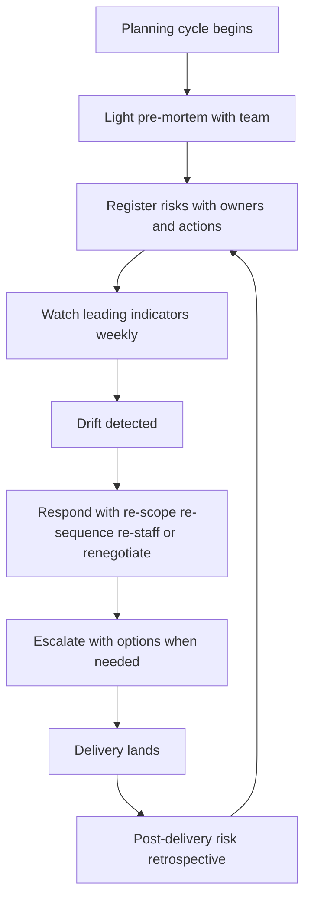

# Delivery Risk Ownership

> **Core skill:** Owning the team's delivery risk posture — staffing, dependencies, scope, external — with named risks, watched leading indicators, and response by options rather than heroics.

## Why This Matters

Delivery rarely fails on technology; it fails on the risks nobody owned. The key person who resigned mid-quarter, the partner team whose API slipped two sprints, the scope that tripled quietly, the compliance review that was "someone else's job" until it blocked the launch. Each was visible weeks earlier as a weak signal — and each became an incident because no one was formally watching.

The EM owns the risk posture because the EM owns the conditions: staffing levels, dependency relationships, scope boundaries, and external commitments. The tech lead owns technical delivery risk — see [[career-path/05_Tech_Lead/04_Team_Delivery_and_Execution_Leadership/04_Delivery_Risk_Management|Delivery Risk Management (Tech Lead)]] — but the manager-level risks live or die with the manager.

Risk ownership is a discipline of small, cheap moves: naming risks before they are uncomfortable, watching leading indicators instead of waiting for lagging ones, and responding to drift with options (re-scope, re-staff, renegotiate) instead of heroics. Heroics are what risk ownership looks like after it has failed.

## Manager-Level Risk Categories

| Category | Typical Risks | Early Signal |
|----------|---------------|--------------|
| **Staffing** | Key departure, attrition cluster, hiring lag, ramp drag, burnout | Disengagement in one-on-ones, offer declines, slow requisition progress |
| **Dependencies** | Partner team slips, unowned interface, third-party vendor delay | Missed integration checkpoints, unanswered emails aging |
| **Scope** | Scope creep, undiscovered complexity, commitment without estimate | Items added per epic rising, estimate-to-actual divergence |
| **External** | Compliance review, legal sign-off, seasonal freeze, market event | Review calendars not booked, approval chains unstarted |
| **Technical** | Architecture bet wrong, perf cliffs, migration stuck | (TL-owned; manager watches its schedule impact) |

The classification matters because each category has a different owner-toolbox: staffing risks are workforce-plan moves, dependency risks are relationship moves, scope risks are decision-log moves, external risks are calendar-and-escalation moves.

## The Risk Register

A simple, living register — not a compliance artifact.

| Field | Content | Standard |
|-------|---------|----------|
| Risk | One-sentence event statement | "Payments partner API ships late" — not "payment risks" |
| Probability | Low / medium / high | Honest gut with rationale, revisited |
| Impact | What breaks if it fires: date, scope, quality | Named commitment, quantified slip |
| Owner | One name — never a team | The person who watches and acts |
| Mitigation | Action underway with date | Not "monitor" — that is no mitigation |
| Review cadence | When this row is next examined | Weekly for top risks, monthly for the rest |

Register hygiene rules: no risk without an owner and a dated action; closed risks get a one-line resolution note (the register is also institutional memory); and the top three risks appear in the stakeholder report every time.

## Risk Conversations in Planning

Risks are cheapest at planning time. A light pre-mortem — "it is three months from now and we missed; what happened?" — surfaces more real risks in twenty minutes than a quarter of status meetings.

| Pre-Mortem Prompt | Risks It Surfaces |
|--------------------|-------------------|
| "We missed the date. What slipped first?" | Dependencies and integration order |
| "The launch shipped but broke. What failed?" | Unowned technical and operational risk |
| "We lost a person mid-quarter. Who had no backup?" | Single points of failure |
| "Scope tripled. What did we not know in January?" | Discovery risk, estimate confidence |
| "Everything took longer. What drained capacity?" | Interrupt load, support, meetings |

The output feeds the register directly: each answer becomes a row with an owner and a mitigation. Running this each planning cycle takes less than half an hour and pays for itself the first time a named risk fires while its mitigation is already underway.

## Leading Indicators

Lagging indicators tell you what already happened. Leading indicators let you act while acting is still cheap.

| Risk | Leading Indicator | Lagging Indicator You Missed |
|------|--------------------|------------------------------|
| Delivery slowdown | Merge rate slowing over two weeks | Date slip announced at review |
| Team overload | WIP rising, cycle time stretching | Quality drop, sick day cluster |
| Attrition | Disengagement signals, one-on-one tone shifts | Resignation letter |
| Dependency slip | Partner checkpoint answers slowing | The slip announcement |
| Scope discovery | Items-per-epic climbing | The mid-cycle re-estimate shock |

The manager's weekly signal review (see [[04_Progress_Visibility_and_Reporting]]) is the natural home for reading these indicators — the same thirty minutes, one more lens.

## Mid-Cycle Drift Response

Drift is the slow deviation between the plan and reality. The response ladder runs from cheapest to most disruptive, and heroics are not on it.

| Response | What It Looks Like | When It Is Right |
|----------|--------------------|------------------|
| **Re-scope** | Cut or simplify items to protect the commitment | Scope is the flexible variable |
| **Re-sequence** | Reorder to de-risk or unblock parallel work | Dependencies shifted, not capacity |
| **Re-staff** | Move people, borrow, or re-pair to the critical path | Skills mismatch is the constraint |
| **Renegotiate** | Move the date or trade scope with stakeholders, early | The commitment itself is no longer honest |
| **Escalate** | Bring your manager in with options | The fix is above your authority |

The pattern in every rung: present facts, impact, and two or three options with a recommendation. Drift handled this way is management; drift absorbed silently until a crisis forces heroics is risk-ownership failure with overtime.

## Escalation Timing

The question every manager gets wrong in both directions: when does a risk become your manager's business?

| Escalate When | Do Not Escalate When |
|---------------|----------------------|
| The mitigation needed exceeds your authority or budget | The mitigation is within your control and underway |
| A stakeholder conflict requires sponsor weight | You have not yet had the direct conversation |
| The slip will be visible above your level | The risk might fire but has not trended worse |
| You need a decision and the decision-maker is above you | You want cover for a decision you should make |

Escalate with the same format as renegotiation: fact, impact, options, recommendation, decision date. Escalating a risk with options is competence; escalating a risk with panic is noise.

## Post-Delivery Risk Retrospective

After significant deliveries — especially the rough ones — the risk question joins the retro: which risks fired, which were named in advance, which surprised us, and what leading indicator would have caught the surprise earlier. The register's closed rows are the raw material.

| Retro Question | Register Improvement |
|----------------|-----------------------|
| Which named risks fired, and did mitigations work? | Keep, revise, or retire the mitigation pattern |
| Which risks fired unnamed? | What category and signal were missed? |
| Which mitigations wasted effort? | Prune over-hedged categories |
| Which escalations were well-timed? | Calibrate the escalation threshold |

## The Risk Ownership System



## Practical Applications

**Risk ownership checklist:**

- [ ] Risk register exists, current, and honest — no "monitor" mitigations
- [ ] Every risk has one named owner and a dated action
- [ ] Light pre-mortem run at each planning cycle
- [ ] Leading indicators read in the weekly signal review
- [ ] Drift answered with options, never absorbed silently
- [ ] Escalations carry facts, impact, options, recommendation
- [ ] Top three risks appear in every stakeholder report
- [ ] Post-delivery retro improves the register

**Risk register entry template:**

```markdown
## Risk: [One-sentence event statement]

Probability: [Low / Medium / High] — [one-line rationale]
Impact: [Named commitment and quantified damage if it fires]
Owner: [One name]
Mitigation: [Action] — [date it completes]
Review: [Weekly / date of next examination]

Escalation trigger: [The condition under which this goes to my manager]
```

## Common Pitfalls

| Pitfall | Why It Is a Problem | Better Approach |
|---------|---------------------|-----------------|
| **Risk register as compliance** | Written once for audit, never read again | Living document; closed rows carry resolution notes |
| **"Monitor" as mitigation** | Watching is not acting; the risk fires on schedule | Every risk has a dated action or an explicit acceptance |
| **Team-owned risks** | Everyone's risk is no one's risk | One named owner per risk, always a person |
| **Waiting for lagging proof** | By the time it is proven, the cheap options are gone | Leading indicators read weekly |
| **Heroics as response** | Overtime hides the drift and burns the team | Options ladder: re-scope, re-sequence, re-staff, renegotiate |
| **Escalation panic or silence** | Too late with no options, or never — both fail | Escalate with facts, impact, options, and a decision date |

## Success Indicators

- Most fired risks were on the register with mitigations underway
- Escalations arrive with options and are received as competence
- No delivery surprise has ever been new information to your manager
- Leading indicators trigger drift responses before commitment impact
- The register improves quarter over quarter through retro learning

## Related Topics

- [[04_Progress_Visibility_and_Reporting]]: leading indicators ride the weekly signal review
- [[02_Planning_Cadences_and_Commitments]]: pre-mortems run inside the planning cadence
- [[01_Workforce_Planning]]: staffing risks are answered with workforce-plan moves
- [[03_Hiring_and_Staffing/00_overview|Hiring and Staffing]]: hiring lag is the most common staffing risk
- [[career-path/02_Senior_Software_Engineer/04_Delivery_and_Execution/07_Risk_Management|Risk Management (Senior)]]: the personal-scale risk practice this scales from

## Summary

Delivery risk ownership is the manager's side of the delivery bet: name the staffing, dependency, scope, and external risks in a living register with one owner and a dated action each, run light pre-mortems at planning, read leading indicators weekly, and answer drift with an options ladder — re-scope, re-sequence, re-staff, renegotiate — escalating with options when the fix is above your authority. Heroics are the failure mode, not the rescue. The manager's test: when the quarter's biggest risk fires, is anyone surprised?
