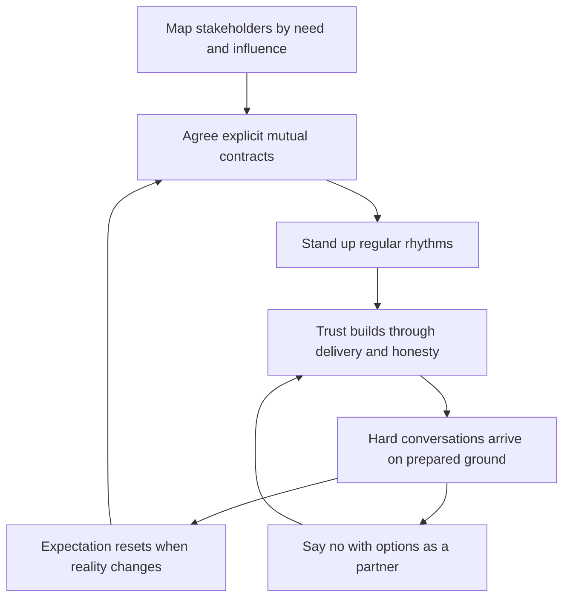

# Stakeholder Relationship Management

> **Core skill:** Mapping who depends on the team and what they need, contracting expectations explicitly, and running regular rhythms so hard conversations happen on ground you prepared.

## Why This Matters

Most stakeholder conflict is not a disagreement about facts — it is the collision of unspoken expectations. The product lead assumed the team would absorb scope flexibly; the manager assumed the roadmap was fixed. The partner team assumed integration support was included; the team assumed it was a new request. Nobody lied; nobody contracted. The EM's job is to make the implicit explicit before it becomes expensive.

Relationships are also the buffer that absorbs bad news. A stakeholder who hears progress honestly every two weeks, and has watched the team deliver small things reliably, extends patience when a date moves. A stakeholder who hears from the team only when something is needed receives every surprise as betrayal. Trust is built in calm quarters and spent in hard ones.

And stakeholders are where "no" actually lands. Scope pressure, deadline pressure, and priority pressure arrive almost entirely through people, and a manager with mapped relationships, explicit contracts, and standing rhythms says no as a partner with options. A manager without them says no as an obstacle — and gets routed around.

## Mapping Stakeholders

The map answers three questions per person: what do they need from the team, what does the team need from them, and how much influence do they carry over the team's work?

| Stakeholder | What They Need From the Team | What the Team Needs From Them | Influence |
|-------------|------------------------------|-------------------------------|-----------|
| Product lead | Predictable delivery, honest trade-offs, technical input early | Priority decisions, requirement clarity, shield from churn | High, daily |
| Partner team EM | Integration commitments kept, advance warning of changes | Their dependency dates, shared API ownership | Medium-high, weekly |
| Your manager | No surprises, progress signals, escalations with options | Air cover, cross-org decisions, budget | High, continuous |
| Sales or customer success | Ship dates they can quote, feature feasibility checks | Realistic promises, early access for key accounts | Medium, spiky |
| Compliance or legal | Advance visibility of regulated changes | Timely reviews, clear requirements | Low until it is everything |
| Support lead | Warning of behavior changes, fixes for top ticket drivers | Ticket trend data feeding prioritization | Low-medium, steady |

Influence-plus-need drives the cadence: high-influence, high-need relationships get standing rhythms; low-both relationships get broadcast reporting.

## Contracts with Stakeholders

A stakeholder contract is a short, explicit statement of mutual expectations — written down, even if only a paragraph.

| Contract Element | Example Content |
|------------------|-----------------|
| What they can expect | Status cadence, commit reliability standard, escalation path, demo rhythm |
| What you need from them | Decision turnaround times, requirement stability windows, review SLAs |
| How changes work | All scope enters the board from [[03_Scope_and_Priority_Management]] — no side channels |
| How bad news travels | From the manager, first, with options — the contract in [[04_Progress_Visibility_and_Reporting]] |

Contracts are renegotiated, not broken silently. When reality changes — capacity drops, strategy shifts — the reset conversation updates the contract rather than violating it.

## Regular Rhythms

| Rhythm | Cadence | Participants | Purpose |
|--------|---------|--------------|---------|
| Demo | Every two weeks | Team plus interested stakeholders | Visible progress; progress that can be seen is not reported, it is shown |
| Steering or roadmap review | Monthly | Key stakeholders, manager | Priority movements, contract updates |
| Partner sync | Weekly or biweekly | Partner team EM or leads | Dependency health, integration dates |
| Skip-level or sponsor touch | Monthly or quarterly | Your manager and their peers | Air cover maintenance, no-surprise alignment |
| Status report | Weekly, written | Everyone on the map | The trust rhythm from [[04_Progress_Visibility_and_Reporting]] |

Rhythms do double duty: they distribute information before it is requested, and they create scheduled venues where hard topics are normal rather than escalations.

## Expectation Resets

When reality changes, the reset is a conversation with the same shape as a scope trade: fact, impact, options, recommendation.

| Reset Trigger | Reset Content |
|---------------|---------------|
| Capacity drop or attrition | What the existing commitments now cost; what stays and what moves |
| Strategy shift from above | Which goals change; the ripple through the roadmap contract |
| A broken commitment | Own it plainly, the recovery plan, and what changed to prevent recurrence |
| Discovery invalidated estimates | New picture, new dates, decision needed |

Resets that come early read as management. Resets that stakeholders discover on their own read as concealment — even when the underlying facts were identical.

## Saying No to Stakeholders

| Situation | The Move |
|-----------|----------|
| Request that breaks capacity | "Yes, if we drop X — here is the trade for your decision" |
| Request outside team mandate | "That is the platform team's surface — I will connect you to their EM" |
| Chronic scope sneaking | Name the pattern in private; re-point to the intake board — kindly, once |
| Pressure beyond your authority | "I will bring this to my manager with the options — you will hear the outcome by Friday" |
| Escalation against you | Escalate first yourself, with full context — never let them be surprised by your manager |

## Building Trust

| Practice | Effect |
|----------|--------|
| Deliver small, deliver often | Reliability at small scale is the evidence for patience at large scale |
| Communicate early, especially bad news | Bad news ages terribly — it compounds into betrayal |
| Make your reasoning visible | Decisions explained once prevent relitigating forever |
| Admit what you do not know | Faux certainty collapses at the first audit |
| Follow through on small promises | The meeting you promised to book — book it |

## Difficult Stakeholder Patterns

| Pattern | What It Looks Like | Response |
|---------|--------------------|----------|
| **Chronic urgency** | Everything is a fire; everything bypasses process | Offer a fast lane with a price: each rush names what it displaces — urgency becomes self-regulating |
| **Scope sneaking** | "Small favors" direct to engineers, never through intake | Re-point to the board, every time; address the pattern privately if it persists |
| **Blame shifting** | Their miss becomes your team's delay in retelling | Facts and timestamps from the decision log; correct the record calmly and immediately |
| **Ghost decision-maker** | Decisions stall; no one owns the call | Escalate the absence of a decision as the risk it is, with a decision date |
| **End-run escalation** | Goes to your manager without telling you | Brief your manager proactively; a pre-briefed manager closes the end-run |

## The Stakeholder System



## Practical Applications

**Stakeholder management checklist:**

- [ ] Stakeholder map current: needs both directions, influence, cadence
- [ ] Explicit contracts with the top three to five stakeholders
- [ ] Demo rhythm running; steering meeting scheduled monthly
- [ ] Partner syncs on the calendar with dependency owners
- [ ] Your manager pre-briefed — never surprised by a stakeholder
- [ ] Every "no" carried at least one alternative or trade
- [ ] Difficult patterns named privately before they are escalated publicly

**Stakeholder contract template:**

```markdown
## Contract: [Team] and [Stakeholder]

What you can expect from us:
- Status: [cadence and format]
- Commitments: [commit reliability standard]
- Change requests: [intake path — scope board only]
- Bad news: [from the EM, first, with options]

What we need from you:
- Decisions: [turnaround standard]
- Requirements: [stability window per cycle]
- Reviews: [SLA where applicable]

Review: [When this contract is next examined]
```

## Common Pitfalls

| Pitfall | Why It Is a Problem | Better Approach |
|---------|---------------------|-----------------|
| **Unspoken expectations** | Collision is guaranteed; the only question is when | Explicit written contracts with top stakeholders |
| **Contact only when needing something** | Every interaction is a withdrawal; the account empties | Standing rhythms deposit trust before withdrawals |
| **Bare no to stakeholders** | Reads as obstruction; invites end-runs | No with options and trades — partner posture |
| **Letting stakeholders reach engineers directly** | Scope sneaks past the board; the portfolio becomes fiction | Re-point every request to intake, kindly and consistently |
| **Surprising your manager** | Stakeholder escalations land on the unprepared | Pre-brief regularly; close the end-run channel |
| **Avoiding the difficult pattern** | Chronic behaviors compound into team damage | Name the pattern privately, early, with specifics |

## Success Indicators

- Stakeholders quote the team's signals rather than fishing around them
- No commitment change has ever been discovered by a stakeholder first
- The word "no" is heard as the start of a trade, not a refusal
- End-run escalations have stopped — or are defused in minutes
- Demos are attended without mandatory invitations

## Related Topics

- [[04_Progress_Visibility_and_Reporting]]: the weekly report is the core stakeholder rhythm
- [[03_Scope_and_Priority_Management]]: contracts route all scope through the board
- [[05_Delivery_Risk_Ownership]]: dependency risks are stakeholder relationships under pressure
- [[07_Manager_Communication/00_overview|Manager Communication]]: the communication craft these conversations run on
- [[career-path/05_Tech_Lead/04_Team_Delivery_and_Execution_Leadership/05_Coordinating_Across_Teams|Coordinating Across Teams (Tech Lead)]]: the IC-level counterpart for cross-team work

## Summary

Stakeholder relationship management is deliberate expectation engineering: map who needs what from the team and what the team needs back, contract it explicitly, stand up regular rhythms that deposit trust before hard quarters withdraw it, and reset expectations openly when reality changes. Say no with options, correct blame-shifting with the decision log, and never let your manager be surprised. The manager's test: when the team needs patience, do stakeholders extend it?
