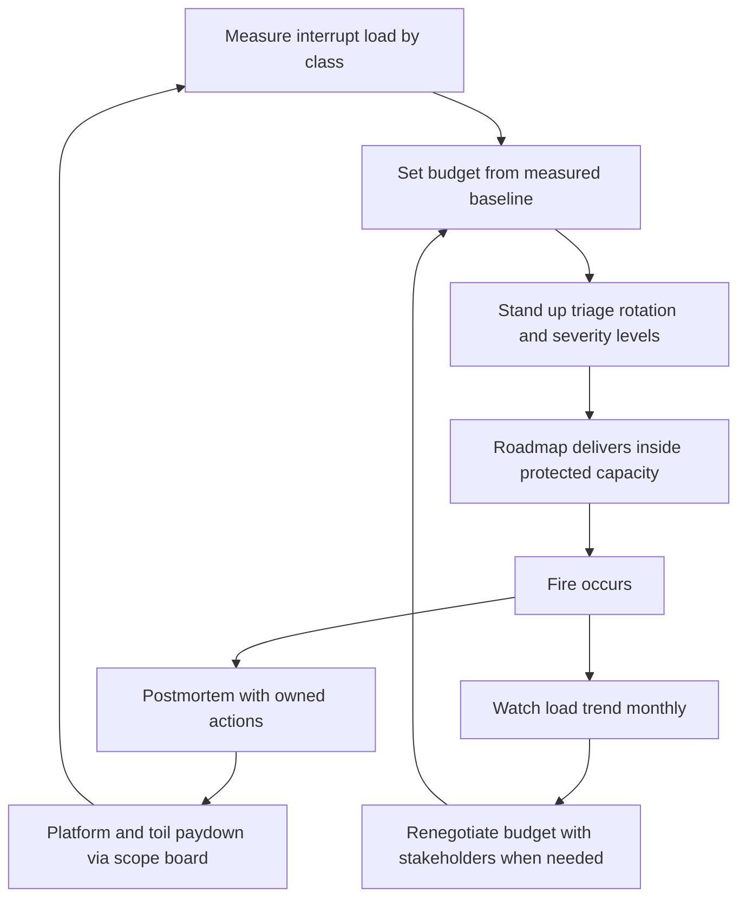

# Delivery Interrupts and Firefighting

> **Core skill:** Measuring interrupt load honestly, bounding it with budgets and rotation, and treating chronic firefighting as a systems defect to pay down — not a team virtue to celebrate.

## Why This Matters

Every team says it is "distracted by interrupts," and almost no team can say how much. Unmeasured, interrupts are invisible capacity theft: the roadmap quietly slips, the team quietly works evenings, and the retro quietly blames estimation. Measured, interrupts become a negotiable portfolio line — visible in the status report, bounded by budget, and reducible by attacking causes.

Firefighting deserves special suspicion. A team that fights fires weekly has not had a bad month; it has an unstable system. Chronic fires trace back to unpaid causes: missing tests, fragile deploys, underprovisioned on-call, a product area that skipped design review. Celebrating heroics in these conditions is celebrating the symptom of a defect — and paying for the celebration in burnout and attrition, because nobody stays long on a team whose plan is routinely torched.

The EM owns this domain because the fixes are managerial: budgets negotiated with stakeholders, rotations staffed fairly, platform investment prioritized against feature work, and protection of the team's focus as a managed resource. The manager is the firewall; that is the job.

## Measuring Interrupt Load

You cannot manage what the team cannot state in numbers.

| Interrupt Class | Measured By | Typical Signal |
|-----------------|-------------|----------------|
| Support requests | Tagged tickets, rotation log | Hours per week, trend |
| Ad-hoc requests | Scope board intake tagged interrupt | Count and size entering per week |
| Production issues | Incident log, on-call escalations | Count by severity, MTTR |
| Cross-team asks | Partner sync actions tagged ask | Frequency, who absorbs them |
| Meetings and "quick calls" | Calendar audit of engineer time | Percent of week in unplanned syncs |

The measurement standard: a single tag or class per item in the existing tracker, reported as a weekly percentage of team capacity. "About a third of our time" becomes "31 percent, down from 38" — and suddenly it is a line item stakeholders can see competing with their own features.

## Interrupt Budgets

A budget converts interrupts from ambush into allocation.

| Budget Element | Design Choice | Rationale |
|----------------|---------------|-----------|
| Size | Fixed percent of capacity — commonly 15-30 percent by team type | Match to measured baseline, then ratchet down |
| Scope | What counts against it: support, ad-hoc, sev-2/3 fixes | Everything unplanned; the plan is the plan |
| Overrun rule | Overruns are reported, and roadmap items visibly move | Makes the trade honest instead of absorbed |
| Protection | Interrupt duty rotation absorbs routine load; others keep focus | One interrupted person beats five context-switching |
| Review | Monthly: is the budget right, and is the trend down? | Budgets drift; causes compound |

## Triage Systems

| Triage Element | Standard |
|----------------|----------|
| Single channel | All interrupts enter one queue — no direct-to-engineer pings |
| Severity levels | Sev-1 drop everything; sev-2 same day; sev-3 this week; sev-4 queued to the board |
| Rotation | Named on-duty engineer per week or day; handoff notes at rotation end |
| Escalation path | Who may declare sev-1, and who may not |
| Fairness | Rotation shared across the team — including seniors and the TL, with judgment |

The rotation is the quiet retention tool: predictable on-duty weeks let engineers plan deep work in their off weeks, instead of every engineer being half-interrupted all of the time.

## Firefighting as Signal

The reframe that changes everything: a fire is not an event, it is a message about the system that produced it.

| Fire Pattern | The System Saying |
|--------------|-------------------|
| Same area fires repeatedly | The design or the tests in that area are insufficient |
| Fires cluster after releases | Deploy pipeline and rollout safety need investment |
| Fires spike when specific people are away | Knowledge concentration — a bus factor problem |
| Fires follow manual operations | Automation debt has come due |
| New fires weekly, no repeats | Quality is not a gate anywhere in the process |

## Paying Down Fire Causes

| Paydown Lever | What It Looks Like | Competes With |
|---------------|--------------------|---------------|
| Postmortem actions | Every sev-1 and repeated sev-2 gets actions with owners and dates — tracked to closure | Feature work; must be protected |
| Platform investment | Test coverage, observability, deploy automation on the worst area | Feature work; requires the scope board |
| Toil automation | Automate the top recurring manual task each quarter | Nothing, if scheduled as first-class work |
| Design review gates | Fires traced to design gaps get a review step in that area | Speed; cheap compared to the fires |
| On-call quality | Runbooks, alerts tuned to signal, paging hygiene | Effort; pays out in MTTR and morale |

The test of seriousness: postmortem actions close at the same priority as committed features. Postmortems whose actions quietly die are theater, and the fires return on schedule.

## The Manager's Protection Role

| Protection Move | Mechanism |
|-----------------|-----------|
| Shielding focus | Rotation absorbs interrupts; everyone else gets plan time |
| Negotiating with stakeholders | Interrupt budget overruns are trades — something leaves the roadmap |
| Charging for work | Support-heavy partners get a capacity conversation, not silent absorption |
| Watching the humans | Chronic on-call load, rising sick days — intervene before resignation |
| Saying the quiet part | "We fight fires because we have not fixed X — here is the plan to fix X" |

Sustainable interrupt load is a retention issue. Teams that live in permanent triage lose their best people first — the ones with options — and the fires get worse as knowledge walks out.

## The Interrupt Management System



## Practical Applications

**Interrupt system checklist:**

- [ ] Interrupt load measured by class and reported weekly as capacity percent
- [ ] Budget set from baseline with a downward ratchet
- [ ] Single triage queue with severity levels; no direct-to-engineer pings
- [ ] Named rotation with handoff notes, shared fairly across the team
- [ ] Every sev-1 and repeated sev-2 gets a postmortem with owned actions
- [ ] Postmortem actions tracked to closure at feature priority
- [ ] Overruns appear in the status report as roadmap impact
- [ ] Top recurring toil automated quarterly

**Interrupt overrun report template:**

```markdown
Interrupt load this cycle: [X percent] against budget [Y percent]

Breakdown: [support A / ad-hoc B / incidents C / partner asks D]
Driver: [the one or two real causes]

Roadmap impact: [named items slowed or moved]

Options:
1. [Accept the trade — these items move]
2. [Protect the roadmap — stakeholders absorb or defer the demand]
3. [Fund the fix — invest in the cause this quarter]

Recommendation: [option] because [reason]
```

## Common Pitfalls

| Pitfall | Why It Is a Problem | Better Approach |
|---------|---------------------|-----------------|
| **Unmeasured interrupts** | Invisible theft; every plan misses mysteriously | One tag, one weekly percentage, one trend line |
| **Heroics celebrated** | Rewards the symptom; punishes the people who fixed the causes | Celebrate fire prevention; fund the postmortem actions |
| **Everyone on-call always** | Five half-interrupted engineers beat one interrupted — but deliver nothing | Rotation concentrates the pain and protects focus |
| **Postmortems without closure** | Actions die quietly; fires return on schedule | Actions tracked at feature priority to closure |
| **Silent absorption** | Stakeholders never see what interrupts cost | Overruns reported as roadmap trades |
| **Interrupts as identity** | "We are a reactive team" becomes an excuse for instability | Chronic firefighting is a defect with a paydown plan |

## Success Indicators

- Interrupt load is a weekly number everyone can quote
- The trend is down quarter over quarter without service degradation
- Fires repeat less; postmortem actions close on time
- Off-rotation engineers get uninterrupted deep-work time
- Nobody is quietly absorbing interrupts outside the rotation

## Related Topics

- [[03_Scope_and_Priority_Management]]: interrupts are a scope class with classification and budget
- [[02_Planning_Cadences_and_Commitments]]: measured interrupt load is a capacity subtraction
- [[05_Delivery_Risk_Ownership]]: chronic firefighting is a named risk with a paydown plan
- [[06_Stakeholder_Relationship_Management]]: interrupt budgets are negotiated with stakeholders
- [[02_Team_Formation_and_Health/00_overview|Team Formation and Health]]: burnout from chronic triage is a team-health failure

## Summary

Delivery interrupts and firefighting is measurement plus boundaries plus causality: measure the load by class, budget it against roadmap capacity, absorb routine interrupts through a fair rotation, and read every chronic fire as a system defect with an owned paydown plan. Report overruns as visible trades, celebrate prevention over heroics, and treat sustainable interrupt load as the retention issue it is. The manager's test: is firefighting exceptional — and when it happens, does the same fire ever come back?
