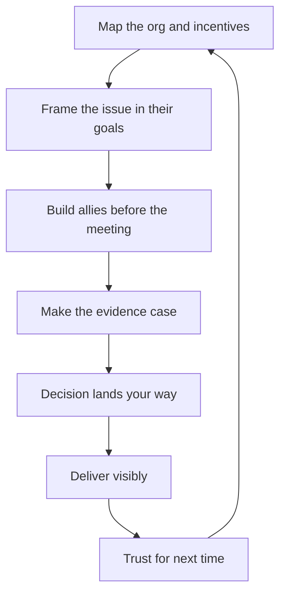

# Organizational Awareness and Influence

> **Core capability:** The engineering manager reads the organization — its strategy, incentives, and decision flows — and moves the team's interests through it: securing investment, surviving re-orgs, and shaping decisions before they harden.

## Why This Matters

Teams do not live in a vacuum. Budgets, roadmaps, headcount, and re-orgs are decided in rooms the team is not in. The manager who cannot read the organization learns about decisions after they land; the manager who can shapes them while they are still soft.

This is also the self-protection layer for the team: the EM who understands incentives and alliances can prevent their team from absorbing another team's risk, win scarce investment, and translate executive language into team reality — and back.

## Topics in This Capability Area

| Topic | Core Skill | When It Matters |
|-------|------------|-----------------|
| [[01_Reading_the_Organization]] | Mapping strategy, incentives, and real decision paths | First months in a new org; strategy shifts |
| [[02_Influence_Strategies_for_Managers]] | Choosing how to move decisions and people | Investment cases; contested priorities |
| [[03_Securing_Investment_and_Headcount]] | Making the case for team resources | Budget cycles; capability gaps |
| [[04_Managing_Up]] | Managing the relationship with your own manager | Continuously; expectation alignment |
| [[05_Navigating_Reorgs_and_Change]] | Guiding the team through structural change | Announced re-orgs; leadership changes |
| [[06_Cross_Org_Relationships]] | Building alliances beyond your team | Shared platforms; peer manager relations |
| [[07_Politics_as_Ethics]] | Distinguishing influence from politics; ethical lines | Every influence attempt; pressure moments |

## How Influence Moves

Influence is a loop built on delivered credibility, not a one-shot persuasion.

## What Changes from Tech Lead to Engineering Manager

| Activity | Tech Lead | Engineering Manager |
|----------|-----------|---------------------|
| Org map | Knows technical counterparts | Owns the strategy/incentive map |
| Investment | Supplies technical case | Owns the case, the pitch, and the ask |
| Managing up | Keeps manager informed | Runs the relationship deliberately |
| Re-orgs | Reassures team technically | Owns the narrative, the plan, and morale |

## Practical Applications

### Org Influence Checklist

- [ ] You can draw the org's real decision paths, not just the org chart
- [ ] Your team's work is stated in the language of the current strategy
- [ ] Investment cases pair user or revenue impact with cost, not tech wishes
- [ ] Your manager is never surprised by your escalation
- [ ] Peer managers hear problems from you before their teams do
- [ ] The team hears re-org news from you, with context, before rumor fills in
- [ ] Influence attempts survive the ethics test: would the team approve?

## Common Pitfalls

| Pitfall | Why It Is a Problem | Better Approach |
|---------|---------------------|-----------------|
| **Org chart realism** | Decisions flow through influence, not reporting lines | Map who actually decides and what they care about |
| **Tech-first pitches** | Executives fund outcomes, not architectures | Lead with user or revenue impact |
| **Going quiet in re-orgs** | Rumor fills the vacuum; anxiety compounds | Communicate what is known, unknown, and next |
| **Politics by another name** | Manipulation corrodes trust when exposed | Transparent advocacy the team could audit |

## Success Indicators

- The team's needs appear in plans and budgets you helped shape
- Your proposals are anticipated — allies arrive pre-briefed
- Escalations are rare because alignment happens earlier
- The team survives re-orgs with clarity, not whiplash
- Your influence reputation is transparent advocacy, not maneuvering

## Related Capabilities

- [[04_Delivery_Leadership_for_Managers/00_overview|Delivery Leadership for Managers]]: delivery outcomes fund the influence budget
- [[07_Manager_Communication/00_overview|Manager Communication]]: the communication system influence runs on
- [[career-path/05_Tech_Lead/01_The_Tech_Lead_Role_and_Operating_Model/06_Working_With_Stakeholders|Working With Stakeholders (Tech Lead)]]: the lead-level counterpart
- [[career-path/02_Senior_Software_Engineer/06_Communication_and_Influence/03_Influence_Without_Authority|Influence Without Authority (Senior)]]: the foundation this scales

## Summary

Organizational awareness and influence is the manager's radar and engine: read the real organization, frame the team's work in its language, secure resources with evidence, manage up without surprises, guide the team through change, and keep influence on the ethical side of the line. The teams that thrive are usually led by managers who saw the turns early.
