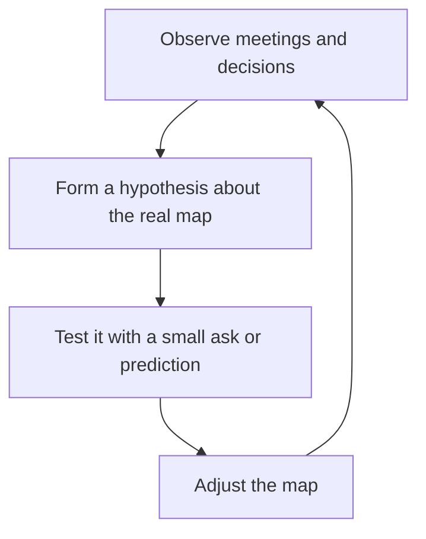

# Reading the Organization

> **Core skill:** Building and maintaining a working map of the organization — what it is actually optimizing for, who really decides, and where influence flows — so the team is positioned before decisions harden.

## Why This Matters

The org chart is a legal fiction. It shows reporting lines and titles, but almost nothing about how the company actually works: which priorities are real, whose opinion carries weight, which meetings produce decisions, and what your chain-up is personally measured on. Managers who navigate by the chart alone are repeatedly surprised — by budgets that evaporate, by re-orgs that come from nowhere, by priorities that shift without announcement.

The map is a decision-making asset. It tells you when to ask (budget timing), what to emphasize (the language of current strategy), who to pre-wire (the real deciders), and when to stay quiet (when the wind is blowing against your ask). Teams do not suffer from their manager knowing too much about the organization; they suffer from the manager learning the rules after the game has been played.

The map is never finished. People move, strategies shift, incentives change. Reading the organization is a continuous practice with a cadence — not a one-time onboarding exercise.

## The Four Layers of the Map

| Layer | Question It Answers | Where You Observe It |
|-------|---------------------|----------------------|
| Strategy | What the company is actually optimizing for this quarter and year | All-hands, roadmap reviews, what gets killed |
| Incentives | What your chain-up is personally measured on | Their goals, their reporting, what they surface upward |
| Decision flows | Where things are actually decided, and by whom | Which meetings decide versus inform; who is in the room |
| Informal power | Who is trusted and listened to, regardless of title | Whose advice is sought, whose objections kill proposals |

The layers interact: a strategy shift changes incentives, which changes decision flows, which reshuffles informal power. When one layer moves, re-read all four.

## Reading Sessions

Staff meetings and leadership forums are data sources, not obligations. What to extract from each:

| Meeting | What It Is Actually For | What to Extract |
|---------|-------------------------|-----------------|
| Staff meeting | Air traffic control and alignment | Which topics get time, which get killed; who defers to whom |
| All-hands | Signal broadcast | Strategy language; what leadership wants repeated |
| Budget review | Resource allocation | Which teams win, which arguments win, the real timing |
| Planning review | Commitment setting | What is treated as fixed, what is negotiable |
| Incident review | Blame and learning | How failure is attributed; who protects whom |

Attend with a reading question: "What did I learn about how this place works?" A meeting that never answers it is not a reading session.

## Building the Map Over Time



The map is built in cycles: observe, hypothesize, test with a low-stakes prediction, adjust. Each cycle sharpens the next. Keep predictions in a private log so the map's accuracy is measured, not felt.

## Using the Map

| Situation | Map Insight | Action |
|-----------|-------------|--------|
| Timing an ask | Budget cycle and decision calendar known | Align asks to the cycle; never ask in a freeze |
| Anticipating re-orgs | Strategy shift detected early | Prepare the team narrative before the announcement |
| Translating priorities | Strategy language known | Restate team work in that language |
| Choosing allies | Informal power mapped | Pre-wire with the trusted voices, not just the titled ones |
| Protecting the team | Risk absorption patterns known | See incoming risk before it lands |

The map's value is predictive: it should let you say "this is likely to happen" and be right often enough to act on it.

## Practical Applications

### Org Map Review Checklist

- [ ] I can state the company's current strategy in one sentence
- [ ] I can name what my manager and their manager are measured on
- [ ] I know the three meetings where my team's interests are actually decided
- [ ] I can name the two or three people whose support decides contested questions
- [ ] I have tested at least one prediction against the map this quarter
- [ ] I know when the next budget and planning cycles start

### Map Template

```markdown
## Strategy Snapshot — [quarter]
- Company priority 1: [what is being optimized]
- Company priority 2: [what is being optimized]
- What is being de-emphasized: [X]

## My Chain-Up Incentives
| Person | Measured on | What they report upward |
|--------|-------------|-------------------------|
| [Manager] | [metric] | [metric] |

## Decision Map
| Decision type | Decided by | Forum | Pre-wired by |
|---------------|------------|-------|--------------|
| [Budget] | [name] | [meeting] | [who] |

## Predictions This Quarter
- [date]: [prediction] -> [outcome]
```

## Common Pitfalls

| Pitfall | Why It Is a Problem | Better Approach |
|---------|---------------------|-----------------|
| **Chart navigation** | Reporting lines are not decision lines | Map who decides, not who reports |
| **One-time mapping** | The org moved and the map did not | Re-read the four layers quarterly and after strategy shifts |
| **Attendance without extraction** | Sitting in meetings teaches nothing | Enter every forum with a reading question |
| **Confusing activity with influence** | The loudest voice is not the trusted one | Watch whose advice is sought, not who speaks most |
| **Map as gossip** | Secondhand rumor builds a false map | Test hypotheses with small, safe predictions |

## Success Indicators

- You predicted the last re-org or priority shift before it was announced
- Your asks land inside the budget window with time to spare
- The team's work is described in the language of current strategy
- You can name the real deciders for each type of team-relevant decision
- Your private prediction log shows a rising hit rate

## Related Topics

- [[02_Influence_Strategies_for_Managers]]: the map is the input to influence
- [[04_Managing_Up]]: your manager is a key node in the map
- [[05_Navigating_Reorgs_and_Change]]: reading early makes change survivable
- [[06_Cross_Org_Relationships]]: peers are map sensors
- [[07_Manager_Communication/00_overview|Manager Communication]]: the cascade system the map feeds

## Summary

Reading the organization means building a living map of strategy, incentives, decision flows, and informal power — and testing it against reality until it predicts. The chart tells you who reports to whom; the map tells you who decides, what wins, and when to move. Maintained on a cadence, it converts organizational surprise into advance notice.
