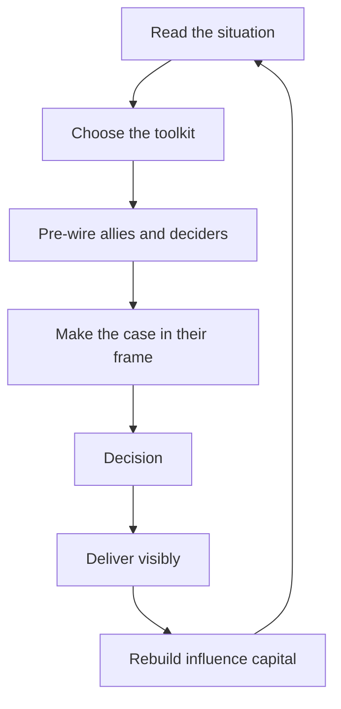

# Influence Strategies for Managers

> **Core skill:** Moving decisions and people through evidence, coalitions, framing, and reciprocity — choosing the right strategy for the situation and spending influence capital like a budget.

## Why This Matters

Managers are handed authority over their team, but almost everything that matters to the team is decided outside that authority: budgets, headcount, cross-team priorities, platform investments, re-org shapes. Authority gets you compliance inside your team; influence gets you outcomes everywhere else.

The good news is that influence is learnable and observable. The bad news is that most managers default to one of two broken modes: arguing louder (evidence alone rarely moves contested decisions) or going quiet and hoping (hoping is not a strategy). Effective influence is a toolkit chosen by situation, and it runs on a renewable resource — trust — that must be spent deliberately and replenished by delivery.

## The Influence Toolkit

| Tool | What It Is | When It Works | Failure Mode |
|------|-----------|---------------|--------------|
| Evidence-based proposal | Data, options, and a recommendation | Routine asks; decisions that respond to facts | Facts alone against entrenched interests |
| Coalition building | Pre-wiring allies before the meeting | Contested decisions with multiple stakeholders | Reads as lobbying if done in secret |
| Framing | Stating the case in their goals, not yours | When your ask is not their priority | Feels manipulative if the frame is false |
| Reciprocity | Giving first, asking later | Ongoing relationships; favor flows | Transactional debt if kept as a ledger |
| Escalation | Moving the decision up with options | Blocked by a single peer; time-critical | Burns capital; strictly last resort |

## Choosing by Situation

| Situation | Characteristic | Primary Strategy |
|-----------|----------------|------------------|
| Routine | Low stakes, recurring, fits precedent | Evidence-based proposal, moved fast |
| Urgent | Time-critical; decision needed now | Pre-wire the decider, then escalate if blocked |
| Contested | Multiple stakeholders with opposing goals | Coalition building plus framing |
| Entrenched | A fixed position with history behind it | Reciprocity and patient pressure; rarely one argument |
| Lost | Decision already made against you | Disagree-and-commit; preserve capital |

The first question is never "how do I persuade" but "what kind of situation is this." Strategy follows situation.

## Framing: Their Goals, Not Yours

| Your ask | Bad framing (yours) | Good framing (theirs) |
|----------|---------------------|-----------------------|
| Two engineers for the platform team | "We are understaffed" | "The migration slips four weeks without dedicated capacity" |
| Delaying a feature for reliability | "The architecture is fragile" | "We protect the Q4 launch from outage risk" |
| Learning time for the team | "We want to modernize" | "Attrition risk drops when engineers work on current tech" |

Framing is not lying. The ask is identical; the frame connects it to what the audience already cares about. If no true frame exists in their goals, the ask may genuinely not be in their interest — reconsider it.

## Influence Capital as a Budget

- Every ask spends capital; every delivered commitment replenishes it
- Capital is built in small moments: responding fast, never surprising, crediting others
- Capital decays: an unspent balance erodes with time and with every broken trust elsewhere
- The richest managers spend rarely and deliver always

Track it loosely but honestly. After a large ask, rebuild before the next one.

## The Ethics Gate

Before any influence attempt, run the transparency test: would the team approve of this tactic if they saw it? Would the decider approve of being pre-wired if they knew? Influence that fails the test is manipulation, and manipulation is a loan against trust that eventually forecloses.



## Disagree and Commit

Sometimes the decision lands against you despite good strategy. The manager's discipline is then visible commitment: the decision is implemented as if it were yours, because continuing to fight after the decision costs the team more than the wrong decision does. Disagree once, in private, with evidence; then commit in public, fully.

## Practical Applications

### Influence Plan Checklist

- [ ] I named the real decider and what they care about
- [ ] I chose the strategy from the situation, not from habit
- [ ] Allies are pre-wired before the meeting, not after
- [ ] The case is framed in their goals and backed by evidence
- [ ] The ask spends capital I can afford and will replenish
- [ ] The ethics test passes: the team would approve the tactic

### One-Page Influence Plan

```markdown
## Decision I Need
- [what decision, made by whom, by when]

## The Decider
- What they are measured on: [X]
- What they already believe: [X]
- What would make this easy for them: [X]

## Allies
- [who] — what they gain: [X] — asked to say: [X]

## The Case
- Their goal: [X]
- Our ask in their frame: [X]
- Evidence: [X]

## The Path
- [pre-wire conversation 1] -> [pre-wire conversation 2] -> [decision meeting]
```

## Common Pitfalls

| Pitfall | Why It Is a Problem | Better Approach |
|---------|---------------------|-----------------|
| **Persuading louder** | Facts alone rarely move contested decisions | Match strategy to the situation |
| **Pre-wiring in secret** | Exposure reads as manipulation | Tell deciders you are checking alignment |
| **Frames that strain** | A false frame is discovered and doubles the damage | Use only frames that survive scrutiny |
| **Spending without replenishing** | Capital runs out exactly when needed most | Deliver visibly between asks |
| **Fighting settled decisions** | Costs team energy and your credibility | Disagree once privately, then commit fully |

## Success Indicators

- Contested decisions go your way more often than chance
- Allies approach you with opportunities before you ask
- People describe your influence as straightforward, not slick
- Your asks are anticipated because pre-wiring works
- You can disagree and commit without visible residue

## Related Topics

- [[01_Reading_the_Organization]]: influence starts with the map
- [[03_Securing_Investment_and_Headcount]]: the investment case is influence applied
- [[06_Cross_Org_Relationships]]: coalitions live in peer networks
- [[07_Politics_as_Ethics]]: the ethical boundary of every tactic
- [[career-path/02_Senior_Software_Engineer/06_Communication_and_Influence/03_Influence_Without_Authority|Influence Without Authority (Senior)]]: the foundation this formalizes

## Summary

Influence for managers is a toolkit chosen by situation — evidence, coalitions, framing, reciprocity, and last-resort escalation — spent from a capital account that delivery replenishes. Every tactic passes the transparency test, and every lost decision ends in clean disagree-and-commit. The manager who masters this moves the team's interests before decisions harden; the manager who ignores it watches the team absorb other people's choices.
