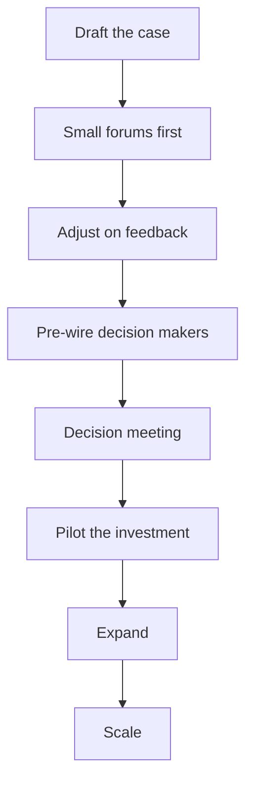

# Securing Investment and Headcount

> **Core skill:** Building the case for team resources — quantified problem, proposed solution, expected return, risks, and rejected alternatives — and steering it through the budget cycle to approval.

## Why This Matters

Every team has a case for more resources; almost none have a case that survives contact with a budget review. The difference between a request that dies in the room and one that lands is rarely the team's quality — it is the case's anatomy. Executives fund outcomes and risk reduction, not wishes and architectures.

Headcount is the hardest form of investment because it is recurring cost with delayed, uncertain return: a hire costs fully-loaded salary before producing anything, and the payoff arrives a quarter or more later. Managers who treat headcount as an entitlement lose it; managers who treat it as an investment case win it — and the discipline protects them from hiring into the wrong problem.

## The Investment Case Anatomy

| Component | What It Must Contain | Fatal Version |
|-----------|----------------------|---------------|
| Problem cost | The current cost, quantified: time, revenue, risk | "We are struggling" |
| Proposed solution | What you will do, with scope and owners | "We need more people" |
| Expected return | What changes for users or revenue, by when | "It will help" |
| Risks | What could go wrong and the mitigation | No risk section at all |
| Alternatives rejected | What else you considered and why not | Pretending no alternatives exist |

Every component answers a question the approver will ask. If the case has no quantified problem cost, the approver supplies their own — usually lower — estimate.

## The Headcount Case

| Dimension | The Argument | The Honesty Requirement |
|-----------|--------------|-------------------------|
| Build vs buy vs borrow | Hire, contract, or grow from within | Show you compared all three routes |
| Ramp time | Months to full productivity, not days | Never count the hire as productive in month one |
| Fully-loaded cost | Salary plus overhead, tooling, recruiting | Give the total, not just base salary |
| Capacity math | What committed work the hire unblocks | Show displacement, not just addition |
| Timing | When the gap bites if unfunded | Name the slip date |

The build-borrow-buy question comes first: durable need → hire; time-boxed need → contractor; one-level skill gap with a motivated person → grow internally. Approvers fund the cheapest honest route; a case that skips the comparison invites the approver to make it for you, less favorably.

## Timing to Budget Cycles

- Know the cycle: when planning starts, when asks are due, when the freeze hits
- Align the case to the cycle; a great case outside the window is next year's case
- Enter the cycle with the case pre-drafted, not drafted inside it
- If the cycle is annual, schedule a mid-cycle checkpoint for changed circumstances

## Pre-Wiring

By the time the case reaches the formal meeting, no one in the room should be hearing it for the first time:

| Stakeholder | Pre-Wire Conversation |
|-------------|----------------------|
| Your manager | The case, its numbers, and the timing; get their amendments first |
| Finance or planning | The cost model and the return framing |
| Competing peers | Their concerns; where your case complements theirs |
| A friendly skeptic | The strongest objection, in advance |

The formal meeting then becomes ratification of an already-aligned decision. If the meeting produces genuine surprise, the pre-wiring failed.

## Presenting

1. Present in small forums first: your manager, a peer review, a friendly exec
2. Adjust the case on what you learn; the second version is always better
3. Present to the real forum with a pre-wired audience and a clear recommendation
4. Ask for the decision explicitly — name the date and the amount



## Incremental Asks

The smallest fundable version of the ask is the best first ask:

| Stage | Ask | Approval Bar | Evidence Produced |
|-------|-----|--------------|-------------------|
| Pilot | One contractor or a small spike | Low | Proof the approach works |
| Expansion | A team slot or budget line | Medium | Pilot results, demand data |
| Scale | Full team or program | High | Proven delivery and return |

Each stage funds the evidence for the next. Incremental asks also fail cheaply: a pilot that dies costs a fraction of a program that dies.

## Failed Case Retrospectives

When the case is declined, the manager's job is diagnosis, not sulking:

- Ask the approver for the real objection — the stated reason is often not the full one
- Re-run the anatomy: which component was weakest — problem cost, return, or trust in delivery?
- Note what the approver funded instead; that reveals the actual priority
- Repair the case and the relationships, and time the next attempt

A declined case with a written retrospective is usually a funded case in the next cycle.

## Practical Applications

```markdown
## Investment Case — [team/initiative]

## The Problem
- Current cost: [quantified: hours, revenue, incidents, attrition]
- Evidence: [data source, date]

## The Ask
- What: [hire / contractor / budget / tooling]
- Fully-loaded cost: [$]
- Ramp or setup time: [weeks/months]

## The Return
- What changes for users or revenue: [X]
- By when: [date]
- How it will be measured: [metric]

## Risks and Mitigations
- [risk] -> [mitigation]

## Alternatives Rejected
- [alternative] — rejected because [reason]

## Timing
- Decision needed by: [date] — because [deadline driver]
```

Checklist before submitting:

- [ ] Problem cost is quantified with a source
- [ ] Fully-loaded cost is stated
- [ ] Build-borrow-buy was explicitly compared
- [ ] The approver's frame is used
- [ ] Decision makers are pre-wired
- [ ] The ask is the smallest fundable version

## Common Pitfalls

| Pitfall | Why It Is a Problem | Better Approach |
|---------|---------------------|-----------------|
| **Wish-based problem cost** | Approvers discount unsourced numbers | Quantify from data with a source |
| **Hiding ramp time** | The hire is counted as productive on day one | State ramp time and net capacity |
| **One big ask** | Large asks fail loudly and fund nothing | Pilot, expand, scale |
| **First hearing in the meeting** | Surprise turns approvers defensive | Pre-wire until the meeting ratifies |
| **No retrospective after decline** | The same case fails again next cycle | Diagnose, repair, retime |
| **Entitlement framing** | "We deserve it" funds nothing | Frame as investment with return |

## Success Indicators

- Your last two asks landed inside the budget window
- Approvers can restate your case in their own words
- The team's funded work matches the cases you submitted
- Declined cases produced documented lessons that changed the next case
- You have a reputation for cases honest about cost and ramp time

## Related Topics

- [[01_Reading_the_Organization]]: timing and framing come from the map
- [[02_Influence_Strategies_for_Managers]]: the case is moved by influence, not filed
- [[04_Managing_Up]]: your manager is the case's first stop
- [[06_Cross_Org_Relationships]]: competing asks are negotiated with peers
- [[career-path/05_Tech_Lead/01_The_Tech_Lead_Role_and_Operating_Model/06_Working_With_Stakeholders|Working With Stakeholders (Tech Lead)]]: the technical half of the case

## Summary

Securing investment and headcount is a case craft: quantify the problem, propose the solution, state the return, own the risks, and show the alternatives — then steer the case through the budget cycle with pre-wiring, small forums, and incremental asks. Declined cases become retrospectives, and the discipline of honest cost and ramp time becomes the reputation that funds the next cycle.
