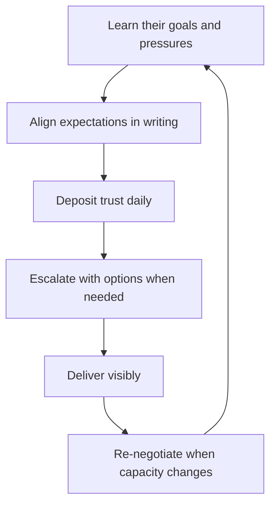

# Managing Up

> **Core skill:** Running the relationship with your own manager as a deliberate partnership — their goals understood, your trust bank full, expectations explicit, and escalation always carrying options.

## Why This Matters

Your manager is the gatekeeper for everything the team needs: budget, headcount, protection, decisions, air cover. Most managers treat this relationship reactively — they answer questions, report status, and hope. Reactive managing up leaves your team's fate to your manager's mood, memory, and other priorities.

Deliberate managing up is not flattery or politics; it is stakeholder management for the stakeholder with the most leverage over your team. You study their goals and pressures the way you study any customer, you engineer the information flow so they are never surprised, and you use the relationship to buy the team what it needs. A well-managed manager is a sponsor; an unmanaged one is a wildcard.

## Your Manager as Stakeholder

| Dimension | What to Learn | How to Learn It |
|-----------|---------------|-----------------|
| Goals | What they are measured on, this quarter and year | Their goals doc; what they report upward |
| Pressures | What keeps them up at night | Their questions, their escalations, their mood cycles |
| Style | How they take information: verbal or written, detail or summary | Observe; ask them directly once |
| Boundaries | What they never want to hear about secondhand | Their reactions to surprises |
| Leverage | What you can do for them | Your team's delivery, your early warnings, your calm |

The relationship is symmetrical in interest, not in power: you need their support, and they need your delivery and truth. The manager who sees this as mutual gets treated like an asset; the manager who sees only the power asymmetry gets treated like an obstacle.

## The Trust Bank

| Deposit | Withdrawal |
|---------|------------|
| No surprises — bad news early, with a plan | Surprising them in a meeting |
| Delivering on every ask, on time | Missing commitments silently |
| Pushing back with options, not complaints | Escalating problems without solutions |
| Discretion — never embarrassing them | Sharing their confidences |
| Visible team results | Taking credit that belongs to the team |

The rule: the account must be positive before you make a big withdrawal (a large ask, a hard conversation, an escalation). If the account is empty, rebuild before spending.

## Expectation Alignment

Capacity changes, and expectations must be re-negotiated when they do:

- When scope grows, restate what it displaces in the same conversation
- When capacity drops, re-negotiate commitments before they slip, not after
- Write the agreed expectation down; verbal alignment evaporates
- Re-confirm quarterly: "Here is what I understand you need from us, and what we need from you"

Misalignment is usually not malice; it is two people holding different stale versions of the same agreement.

## Escalation Done Right

Escalate only when a peer-level resolution failed and the decision matters. When you do:

1. State the decision needed, not the grievance
2. Give the history in three sentences or less
3. Present two or three options with trade-offs
4. Make a recommendation
5. Name the deadline driver

Escalation with options and a recommendation is a request for a decision; escalation with complaints only is a request for your manager to do your job.

## Disagreeing with Your Manager

- Disagree in private, never in front of their peers or your team
- Bring evidence: numbers, customer impact, risk
- Frame it as serving the same goal, not opposing them
- If they decide against you, commit visibly — the team watches how you handle it
- Preserve the relationship for the next disagreement; the last one is over

## Using Your 1:1s

Your 1:1 with your manager is not their meeting — it is half yours:

| Slot | Content |
|------|---------|
| Their agenda | What they need from you; status, decisions, help |
| Team health | Signals they cannot see: morale, attrition risk, friction |
| Risks | What is forming, with early options |
| Growth asks | Development, exposure, opportunities for you |
| Alignment check | Are we still aiming at the same target? |

If your 1:1s are entirely their agenda, you are a status report, not a partner.

## When Your Manager Is Weak or Absent

| Situation | Approach |
|-----------|----------|
| No decisions, no direction | Decide within your authority; document; inform after |
| Absent, unreachable | Build the peer and skip-level network; protect the team from the vacuum |
| Politically toxic | Insulate the team from the noise; never let their behavior become your team's excuse |
| Leaves you to hang | Keep escalation trails in writing; build sponsors above and beside |

Managing around a weak manager is not betrayal — it is protecting the team's interests when the assigned sponsor is not fulfilling the role. Keep the relationship workable, keep your ethics intact, and never make your team pay for your manager's shortcomings.



## Practical Applications

### Managing Up Checklist

- [ ] I know what my manager is measured on this quarter
- [ ] My manager has never been surprised by my bad news
- [ ] Every escalation carried options and a recommendation
- [ ] My 1:1 agenda includes team health and growth, not just status
- [ ] Capacity changes trigger immediate expectation re-negotiation
- [ ] The trust bank is positive before I make big asks

### 1:1 Agenda Template

```markdown
## Manager 1:1 — [date]
- Their asks since last time: [X] — status: [done/at risk]
- Decisions I need from them: [X] by [date]
- Team health signal: [morale/attrition/friction]
- Risk forming: [X] — options: [A/B]
- My growth ask: [X]
- Alignment check: [still aligned / drifting because]
```

## Common Pitfalls

| Pitfall | Why It Is a Problem | Better Approach |
|---------|---------------------|-----------------|
| **Surprising them** | One surprise erases ten deposits | Bad news travels first, with a plan |
| **Complaint-only escalation** | Makes you look like the problem | Escalate decisions with options |
| **Absorbing scope silently** | Capacity erodes; the slip is blamed on you | Restate displacement in the same breath |
| **Disagreeing in public** | Damages them and therefore you | Private, evidence-based disagreement |
| **Giving away your 1:1** | You become a status feed, not a partner | Claim half the agenda deliberately |
| **Mistaking alignment for agreement** | Nods are not commitments | Write expectations down |

## Success Indicators

- Your manager pre-empts your asks because they know the team's needs
- Escalations produce decisions, not friction
- Capacity changes are re-negotiated before they become slips
- Your manager defends the team in rooms you are not in
- 1:1s end with clear commitments from both sides

## Related Topics

- [[01_Reading_the_Organization]]: your manager is a node in the org map
- [[02_Influence_Strategies_for_Managers]]: managing up is influence with one stakeholder
- [[03_Securing_Investment_and_Headcount]]: the case's first stop is your manager
- [[05_Navigating_Reorgs_and_Change]]: your manager's information needs spike during change
- [[career-path/02_Senior_Software_Engineer/06_Communication_and_Influence/02_Stakeholder_Communication|Stakeholder Communication (Senior)]]: the foundation this scales

## Summary

Managing up is deliberate stakeholder management for the person with the most leverage over your team: learn their goals and pressures, keep the trust bank positive through no surprises and delivered asks, align expectations in writing, escalate with options, and use 1:1s for team health and growth. Done well, your manager becomes a sponsor; done passively, they become a wildcard that the team's future depends on.
