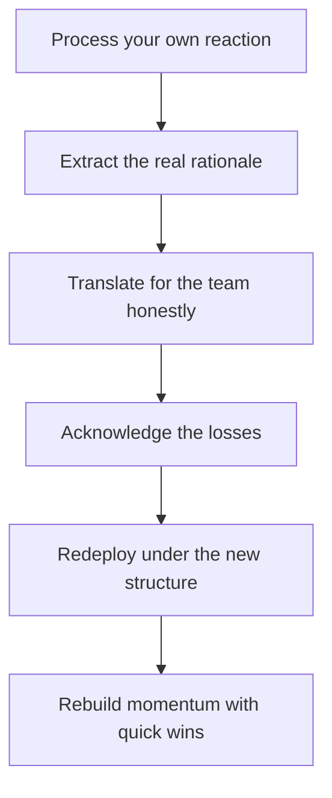

# Navigating Reorgs and Change

> **Core skill:** Guiding the team through structural change imposed from above — processing your own reaction first, extracting the real rationale, translating honestly, and rebuilding momentum on the other side.

## Why This Matters

Re-orgs are periodic weather in most companies, and they are the moments when managers earn their keep. The team looks to the manager for meaning, stability, and a path forward — while the manager themselves may have just received the news minutes before, with the same incomplete information and the same anxiety.

The difference between a team that weathers a re-org and one that fractures is almost entirely the manager's handling of the first two weeks: whether the news is delivered with honesty and context, whether grief is acknowledged before direction is given, and whether the team is redeployed into a structure that makes sense to them. The manager's own reaction is the first thing that must be processed — confusion and fear multiply as they travel down the chain.

## Process Your Own Reaction First

Your team will read your state before they hear your words. If you arrive panicked, they panic; if you arrive falsely cheerful, they distrust everything after.

- Give yourself a window to react privately — an hour, an evening — before you speak to the team
- Separate what is fact from what is fear; only facts get communicated
- Identify what you personally lose (scope, reports, projects) and process it separately from what the team needs
- Do not vent to the team; vent to a peer, a mentor, or a coach

The rule: your confusion, multiplied, becomes their chaos. Process first, communicate second.

## Extract the Real Rationale

Before translating the change, understand it — asking up is part of the job:

| Question to Ask Up | Why It Matters |
|--------------------|----------------|
| What problem is this change solving? | The rationale is the translation key |
| What stays the same? | Anchors the team in continuity |
| What is still undecided? | Prevents you from over-committing |
| How will success be measured now? | The team needs the new target |
| What is the timeline? | Sets the expectation window |

If leadership cannot articulate a rationale, say so honestly — "the decision is made; the reasoning has not been shared" is a legitimate, honest message.

## Translate for the Team

The cascade must be honest, including what is unknown:

| What the team needs to hear | Example |
|----------------------------|---------|
| What changes | "We report to the Platform group now" |
| What it means for us | "Funding decisions move to a different budget line" |
| What we do differently | "Planning cadence changes to monthly" |
| What stays the same | "Our mission and our projects are unchanged" |
| What is unknown | "Whether the team name survives is not decided" |
| What happens next | "Town hall Thursday; our team sync Friday" |

Never fill unknown gaps with invented certainty — the team will discover the invention and generalize the distrust.

## Grief Handling

Re-orgs carry real losses: projects killed, teams split, rituals broken, trust dented. Grief must be acknowledged before redirection:

- Name the loss plainly: "The work we did on X is ending. It was good work."
- Give people space to react; silence, frustration, and sadness are legitimate
- Do not rush to silver linings — "at least we..." lands as dismissal
- Only after acknowledgment, move to the future: "Here is what we build now"

A team that feels heard moves on in days; a team that is told to move on without being heard carries the loss for months.

## Redeploying the Team Under the New Structure

| Step | Action |
|------|--------|
| Map the new structure | Who owns what, where the interfaces are |
| Re-negotiate commitments | Old commitments under new ownership get explicit re-decisions |
| Redraw roles | Every person gets a clear new position and reason |
| Re-establish rituals | Syncs, reviews, and retros re-anchored to the new shape |
| Re-set the north star | The team's mission restated in the new context |

Redeployment is not just re-reporting lines — it is rebuilding the team's sense of purpose under a new frame.

## Your Role in the New Shape

Sometimes the change affects you directly: your scope shrinks, your reports move, your role is redefined. Handle it with the same discipline you ask of the team:

- Separate your career disappointment from the team's needs; do not leak one into the other
- Take the new role seriously from day one, visibly
- If you are genuinely displaced, advocate for yourself separately — through your manager, not through the team

## Rebuilding Momentum

| Lever | Action |
|-------|--------|
| Quick wins | Ship something small and visible within two weeks |
| New relationships | Introduce the team to new counterparts deliberately |
| New rituals | Replace lost traditions with ones fitting the new shape |
| Forward focus | Celebrate the first success under the new structure |
| Personal outreach | One-on-one energy checks with every report |



## Re-Org Survival Patterns

- **Visible value**: deliver loudly in the new shape; visibility resets with structure
- **Flexible scope**: hold the mission, release the territory; the team that adapts is kept
- **Strong peer network**: sponsors and allies exist outside the org chart and survive it
- **Documented delivery**: when structures churn, the record of outcomes is the constant

## Practical Applications

### Re-Org Handling Checklist

- [ ] I processed my own reaction before speaking to the team
- [ ] I extracted the real rationale from leadership
- [ ] The team heard what changes, what stays, what is unknown, what is next
- [ ] Losses were named and acknowledged before redirection
- [ ] Every person has a clear position in the new structure
- [ ] A quick win is scheduled within two weeks
- [ ] I know my own position and have handled it separately from the team's needs

### Team Announcement Template

```markdown
## What is happening
- [the change, plainly]

## What changes for us
- [list]

## What stays the same
- [list]

## What is still undecided
- [list]

## What happens next
- [timeline and forums]

## Where to bring questions
- [channels, 1:1s, follow-up dates]
```

## Common Pitfalls

| Pitfall | Why It Is a Problem | Better Approach |
|---------|---------------------|-----------------|
| **Broadcasting your own panic** | Fear multiplies as it travels | Process privately first |
| **Inventing certainty** | Unknowns get filled with guesses that unravel | Say what is known, unknown, and next |
| **Skipping the grief** | Unacknowledged loss blocks all forward motion | Name the loss before the future |
| **Holding old commitments silently** | Old promises collide with new reality | Explicitly re-decide commitments |
| **Fighting the re-org visibly** | Costs you credibility and the team's focus | Disagree privately if at all; then commit |
| **Neglecting your own position** | Displaced managers leak resentment into the team | Handle your career separately, through proper channels |

## Success Indicators

- The team can restate the change and its rationale in their own words
- Morale dipped and recovered within a month
- Commitments were re-decided explicitly, with no zombie promises
- Delivery resumed and a visible win landed within weeks
- Your own position, however it landed, is handled without team contamination

## Related Topics

- [[01_Reading_the_Organization]]: early reading turns re-orgs into anticipation
- [[04_Managing_Up]]: extraction and advocacy run through your manager
- [[06_Cross_Org_Relationships]]: the peer network survives structure changes
- [[07_Manager_Communication/00_overview|Manager Communication]]: cascade and announcement craft carry the change
- [[02_Team_Formation_and_Health/00_overview|Team Formation and Health]]: rebuilding the team's shape and trust

## Summary

Navigating re-orgs is a sequence with a strict order: process your own reaction first, extract the real rationale, translate honestly including the unknowns, acknowledge grief before redirection, redeploy with clear positions, and rebuild momentum through quick wins and new relationships. The manager who runs the sequence keeps the team intact through change; the manager who skips steps trades a re-org for a slow-motion attrition event.
