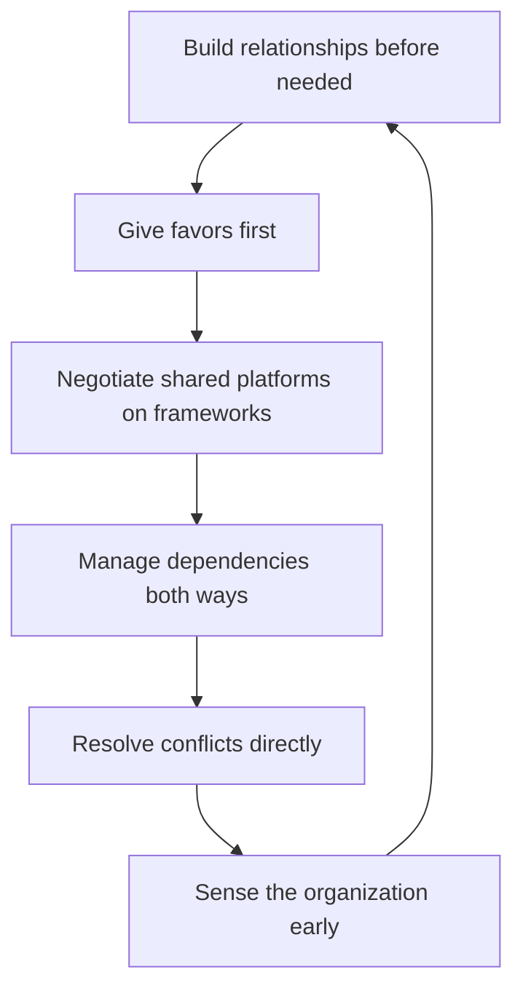

# Cross-Org Relationships

> **Core skill:** Building a network of peer managers before it is needed — a favor economy, negotiated shared platforms, managed dependencies, and an early-warning sensor for the whole organization.

## Why This Matters

The team's biggest external risks are rarely decided by executives alone; they are shaped by peer managers — the platform lead who deprioritizes your migration, the product manager who over-promises your capacity, the other EM whose team keeps breaking your integration. These relationships are negotiable, but only if they exist before the conflict.

A peer network built when times are good is the difference between a negotiation and a fight when times are tight. It is also the organization's early-warning system: peers hear about strategy shifts, budget moves, and re-orgs before they are announced, and a manager with a real network learns about trouble in time to act instead of react.

## Building Before Needed

| Activity | Cadence | What It Builds |
|----------|---------|----------------|
| One-on-one lunches or coffees | Monthly with key peers | Personal trust and context |
| Joint retros | When systems touch | Shared understanding of failures |
| Shared problem-solving | Ad hoc | Working-level trust |
| Cross-team demos | Quarterly | Visibility and respect |
| Peer review of plans | Before planning cycles | Early alignment |

The currency of the network is proximity before need. Relationships started with a request are weak; relationships started with curiosity are strong.

## The Favor Economy

- Give first, ask later; favors granted are deposits into a shared account
- Track nothing — a ledger of favors turns reciprocity into debt collection
- Make the favor visible enough to be known, modest enough to be repaid
- Ask for favors early in a relationship's life; small asks build the muscle
- When you receive, acknowledge and reciprocate naturally, not mechanically

The favor economy works because people remember who helped them and who only took. Your reputation in the network is the summary of your giving-to-taking ratio.

## Shared Platform Negotiations

Platforms and shared infrastructure are where peer relationships become business:

| Negotiation Point | The Question | Approach |
|-------------------|--------------|----------|
| Cost splits | Who pays for the shared platform? | Usage-based allocation, agreed in advance |
| Roadmap priorities | Whose needs go first? | Shared priority framework; explicit trade-off decisions |
| Ownership | Who maintains what? | Clear interface boundaries and on-call splits |
| Change windows | When can things break? | Published calendars with exception process |

The principle: negotiate the framework before the specific conflict. Teams that agree on how to decide are rarely stuck on a single decision.

## Cross-Org Dependency Management

### As Customer

- Treat dependency teams like vendors: contracts, SLAs, escalation paths
- Give them roadmap visibility into your demand — surprises flow both ways
- Escalate late only; early warning builds their goodwill

### As Provider

- Publish your commitments and capacity like a product
- Tell dependents about changes before they break — change notice is a courtesy with compounding returns
- When you must deprioritize a dependent, say so early with alternatives

| Role | Commitments You Owe | What You Should Demand |
|------|---------------------|------------------------|
| Customer | Clear requirements, early demand signals, prompt feedback | Realistic dates, change notice, working escalation |
| Provider | Change notice, honest dates, interface stability | Early warnings, aligned priorities |

## Org-Wide Initiatives

Cross-cutting initiatives — standards, communities of practice, hiring drives, diversity programs — are where visibility is built:

- Contribute visibly to at least one initiative outside your team
- Choose initiatives where your team's strengths show
- Use them to meet people you would never meet through your own roadmap
- Never treat them as optional charity; they are network infrastructure

## Peer Conflict Resolution

| Step | Action |
|------|--------|
| 1 | Go direct first — the conversation is almost always easier than imagined |
| 2 | Frame as shared problem: "our teams keep colliding on X" |
| 3 | Bring data and options, not blame |
| 4 | Agree on the fix and the follow-up |
| 5 | Escalate only if the peer is unwilling or unable — with the peer informed first |

Conflict resolution with peers is the same discipline as with anyone else, minus the authority: direct first, escalate reluctantly, and always with the other party aware.

## The Network as Sensor

The peer network is your early-warning system:

- Budget shifts, strategy pivots, re-org rumors, hiring freezes — heard first through peers
- Ask your network what they are hearing, monthly
- Return the favor: share what you know that matters to them
- Distinguish signal from noise; the network amplifies both



## Practical Applications

### Network Health Checklist

- [ ] I have one-on-one relationships with the peers my team depends on
- [ ] I gave something before I asked for something this quarter
- [ ] Shared platform agreements have explicit cost and priority frameworks
- [ ] My team's dependents get change notice before breakage
- [ ] No peer conflict is older than two weeks without a direct conversation
- [ ] I heard at least one organizational signal through the network this month

### Peer Network Map

```markdown
## Peer Network — [quarter]
| Peer | Why They Matter | Relationship Health | Last Contact | Next Step |
|------|-----------------|---------------------|--------------|-----------|
| [name] | [dependency/shared platform] | [strong/weak] | [date] | [lunch, joint retro] |

## Shared Platforms
| Platform | Cost split | Priority framework | Owner |
|----------|------------|--------------------|--------|
| [X] | [usage-based] | [agreed/undefined] | [team] |

## Dependencies
| Dependency | Direction | Change notice in place | Escalation path |
|------------|-----------|------------------------|-----------------|
| [X] | [we provide/we consume] | [yes/no] | [path] |

## Early Signals This Quarter
- [signal] — source: [peer] — action: [X]
```

## Common Pitfalls

| Pitfall | Why It Is a Problem | Better Approach |
|---------|---------------------|-----------------|
| **Building at need time** | Requests without relationship read as transactions | Invest before the conflict |
| **Keeping a favor ledger** | Turns reciprocity into debt collection | Give first; track nothing |
| **Negotiating each conflict fresh** | Every fight restarts from zero | Agree frameworks before conflicts |
| **Silent dependency changes** | Breakage without notice burns trust | Publish change notice early |
| **Escalating past peers** | Bypassing burns the relationship and often fails | Direct first, always |
| **Isolated management** | Lone managers learn news last | Run the network as a sensor |

## Success Indicators

- Peers reach out to you with opportunities and warnings before official channels
- Shared platform decisions move through agreed frameworks, not crises
- Dependency changes are announced before they break anything
- Conflicts with peers resolve in direct conversations
- You consistently hear organizational signals early enough to act

## Related Topics

- [[01_Reading_the_Organization]]: peers are nodes and sensors in the map
- [[02_Influence_Strategies_for_Managers]]: coalitions are built from peer networks
- [[05_Navigating_Reorgs_and_Change]]: the network survives structure changes
- [[04_Delivery_Leadership_for_Managers/00_overview|Delivery Leadership for Managers]]: dependencies are delivery reality
- [[career-path/02_Senior_Software_Engineer/06_Communication_and_Influence/07_Conflict_Resolution|Conflict Resolution (Senior)]]: the direct-first discipline formalized

## Summary

Cross-org relationships are built before they are needed: monthly proximity, a favor economy with no ledger, framework-based platform negotiations, dependency management in both directions, visible contribution to org-wide initiatives, and direct-first conflict resolution. The network doubles as an early-warning sensor that turns organizational news into advance notice — the difference between a manager who reacts to the org and one who sees it coming.
