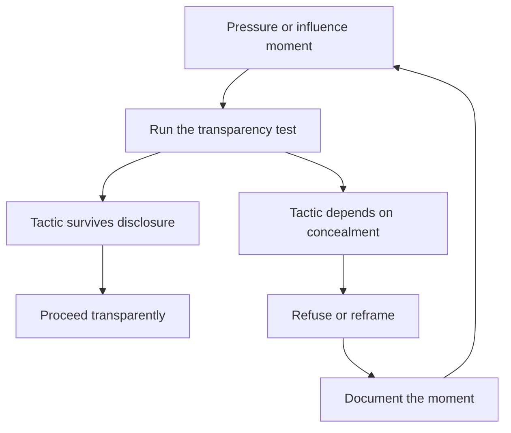

# Politics as Ethics

> **Core skill:** Distinguishing the neutral reality of organizational power from dirty politics, holding firm ethical lines — transparency, credit, information honesty, commitment honesty — and teaching the team to navigate the same waters.

## Why This Matters

"Office politics" is usually discussed as a disease, but power moves through organizations whether or not anyone acknowledges it: budgets are won with allies, decisions are shaped before meetings, reputations precede facts. The manager who pretends politics does not exist surrenders the team's interests to those who play; the manager who plays dirty forfeits the trust that the team's future runs on.

The manager's real task is to practice politics as ethics — using the levers of organizational influence while staying on lines the team could audit. This is not a compromise position; it is the only sustainable one. Dirty politics wins meetings and loses careers; ethical influence builds a reputation that compounds.

## Politics Defined

| Dimension | Neutral politics | Dirty politics |
|-----------|------------------|----------------|
| Definition | How power moves: influence, alliances, framing | Hidden agendas, credit theft, sabotage |
| Visibility | Would survive disclosure | Depends on concealment |
| Tools | Evidence, coalitions, framing, reciprocity | Manipulation, misrepresentation, exclusion |
| Relationship to trust | Builds it | Spends it |
| Outcome | The team's interests advanced transparently | Individual wins, collective damage |

The same skill set serves both columns. The difference is not technique — it is the line.

## The Manager's Ethical Lines

| Line | The Rule | Violation Example |
|------|----------|-------------------|
| Transparency | Would the team approve of this tactic if they saw it? | Pre-wiring a decision while pretending it is open |
| Credit flow | Give it away; never take what the team earned | Presenting the team's work as your idea |
| Information honesty | No spin up or down; shape facts, never invent them | Framing a layoff as a "growth opportunity" |
| Commitment honesty | No fake deadlines, no invented urgency | Promising a date you know is fiction to buy space |

These four lines cover the majority of ethical failures in management. When in doubt, apply the transparency test and the credit test.

## Grey Zones

Not everything is black and white. Common grey zones and how to navigate them:

| Grey Zone | The Tension | Ethical Handling |
|-----------|-------------|------------------|
| Selective emphasis | Presenting the strong parts of the case | Fine — as long as the weak parts survive scrutiny |
| Strategic timing | Choosing when to raise an issue | Fine — as long as delay does not mislead |
| Coalition exclusion | Not everyone is in every conversation | Fine — as long as the excluded are not deceived |
| Framing | Stating the case in the audience's terms | Fine — as long as the frame is true |
| Discretion | Not sharing everything you know | Fine — as long as it is labeled as not-shareable |

The test for a grey zone: would the person affected accept the behavior if they knew the full context? If the answer is no, it is not grey.

## Teaching the Team Healthy Politics

The team watches the manager navigate the org — and learns:

- Make decision processes visible: "This was decided in the platform forum; these are the levers that shaped it"
- Explain influence openly: "I pre-wired the budget owner because this ask needed prior context"
- Model credit flow: the team sees you give credit up, down, and sideways
- Coach individuals on their own influence: how to pre-wire, how to frame, when to escalate
- Normalize the ethics test in team conversations: "Would we be comfortable if this were public?"

A team that understands how decisions actually happen is harder to manipulate and easier to lead.

## When to Refuse

There are moments when the manager is asked to misrepresent — by leadership, by peers, by pressure:

| Request | Refusal |
|---------|---------|
| Spin a layoff as voluntary | "I will communicate honestly or not at all" |
| Fake a deadline to force team speed | "I will not invent dates" |
| Hide a problem from stakeholders | "I will report it early, with the plan" |
| Take credit for another team's work | "That belongs to team X" |
| Write a false performance review | "I will write what is true and defensible" |

Refusal has a cost — but the cost of compliance is compounding: each conceded line makes the next easier to cross, and the team's trust is the first casualty.

## Documenting Ethics Pressure Moments

When pressure to misrepresent arrives, write it down:

- What was asked, by whom, in what context
- What you said and did
- Who else was present or aware
- The outcome and any follow-up

The record protects you if the moment is later disputed, and the discipline of writing forces clarity about your own lines. A manager who cannot write down what happened should ask why.



## Practical Applications

### Ethics Self-Audit Checklist

- [ ] Every influence attempt this quarter would survive team scrutiny
- [ ] Credit for the team's work went to the team, visibly
- [ ] No message I sent spun facts up or down
- [ ] No deadline I committed to was invented
- [ ] Grey-zone decisions passed the disclosure test
- [ ] Pressure moments were documented

### Pressure Moment Log

```markdown
## Ethics Log — [date]
- What was asked: [X]
- By whom and context: [X]
- What I said and did: [X]
- Who else was aware: [X]
- Outcome: [X]
- Lesson for next time: [X]
```

## Common Pitfalls

| Pitfall | Why It Is a Problem | Better Approach |
|---------|---------------------|-----------------|
| **Purity as policy** | Refusing all politics abandons the team to the players | Play the game, on the line |
| **Line-creep** | Small concessions normalize larger ones | Apply the transparency test every time |
| **Credit hoarding** | The team learns their work disappears upward | Give credit away, loudly |
| **Spin as kindness** | Softened truth is discovered as manipulation | Shape facts honestly; never invent them |
| **Unrecorded pressure** | Disputed moments become your word against theirs | Document ethics pressure as it happens |

## Success Indicators

- The team would pass your influence tactics under scrutiny
- People describe you as straight, even when they disagree with you
- The team's work is credited to the team in rooms you are not in
- You have refused a misrepresentation and the relationship survived
- Your ethics log shows moments handled, not avoided

## Related Topics

- [[01_Reading_the_Organization]]: the map shows where the power is; ethics governs how you use it
- [[02_Influence_Strategies_for_Managers]]: the toolkit and the line that bounds it
- [[06_Cross_Org_Relationships]]: trust is the network's currency and ethics its mint
- [[career-path/02_Senior_Software_Engineer/06_Communication_and_Influence/03_Influence_Without_Authority|Influence Without Authority (Senior)]]: the individual foundation this scales

## Summary

Politics is the neutral reality of how power moves in organizations; ethics is the line that separates influence from manipulation. The manager holds four lines — transparency, credit flow, information honesty, and commitment honesty — navigates grey zones by the disclosure test, teaches the team healthy politics through visible processes, and refuses and documents the moments when misrepresentation is demanded. The reputation built on that line compounds into the team's most durable asset.
