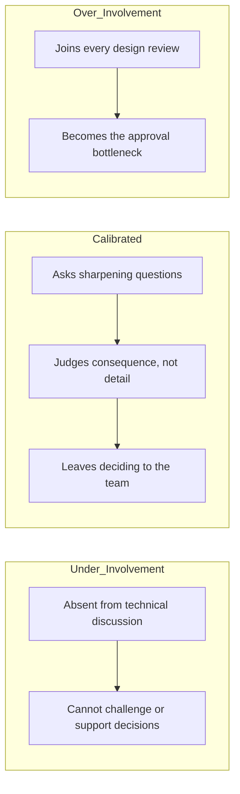

# Technical Context for Managers

> **Core capability:** The engineering manager maintains enough technical depth to participate meaningfully in technical decisions, assess risk honestly, and hire and grow engineers — while resisting the pull to become the team's decision maker again.

## Why This Matters

The classic fork: managers who abandon technical depth lose the team's respect and their own judgment (they cannot challenge an estimate, smell architectural risk, or evaluate a senior candidate); managers who cling to it become bottleneck tech leads with a manager title, and the team stops deciding.

The skill is calibrated participation: knowing the system well enough to ask questions that sharpen thinking, well enough to know when a decision is consequential, and disciplined enough to leave the deciding to the people closest to the work. Technical currency is the entry ticket to credibility; restraint is what keeps it.

## Topics in This Capability Area

| Topic | Core Skill | When It Matters |
|-------|------------|-----------------|
| [[01_Maintaining_Technical_Currency]] | Staying technically current without doing the work | Continuously; technology shifts |
| [[02_Participating_in_Technical_Decisions]] | Calibrated involvement in architecture and design | Design reviews; consequential decisions |
| [[03_Risk_Assessment_with_Limited_Depth]] | Assessing technical risk as a non-practitioner | Roadmaps; incident reviews; vendor choices |
| [[04_Supporting_the_Tech_Lead_Partnership]] | Making the TL/EM partnership produce results | Continuously; role-clarity moments |
| [[05_Hiring_and_Growing_with_Technical_Judgment]] | Applying technical judgment to people decisions | Senior interviews; promotion cases |
| [[06_When_the_Manager_Is_Also_the_Tech_Lead]] | Operating the combined role deliberately | Small teams; unfilled TL roles |
| [[07_Technology_Adoption_and_Governance]] | Governing new technology without freezing it | Framework debates; platform decisions |

## The Calibration Spectrum

The manager's job is to live in the middle band — and know when to slide deliberately.

## What Changes from Tech Lead to Engineering Manager

| Activity | Tech Lead | Engineering Manager |
|----------|-----------|---------------------|
| Design reviews | Facilitates and decides | Attends selectively; asks risk questions |
| Architecture | Owns direction | Owns consequences: cost, staffing, timeline |
| Technical risk | Manages it technically | Translates it into business risk terms |
| Code | Writes some, credibly | Reads occasionally; decides never (usually) |
| Tech adoption | Sets standards | Governs process; ratifies outcomes |

## Practical Applications

### Technical Calibration Checklist

- [ ] You can explain the system architecture and its top three risks unaided
- [ ] You attend design reviews where decisions are consequential — not all of them
- [ ] You can evaluate whether an estimate, migration plan, or vendor claim is credible
- [ ] The tech lead decides technical direction; you decide investment and consequence
- [ ] Senior hiring loops include your calibrated technical signal
- [ ] Your questions sharpen thinking more often than they redirect it
- [ ] When you code, it is a spike or a gesture of solidarity — never the critical path

## Common Pitfalls

| Pitfall | Why It Is a Problem | Better Approach |
|---------|---------------------|-----------------|
| **Technical fade** | Loses judgment credibility; rubber-stamps | Scheduled technical learning; system walks |
| **Ghost tech lead** | Team waits for manager's approval on everything | Explicit decision boundaries with the TL |
| **Reliving glory days** | Codes the fun parts; blocks the team's growth | Pair as guest, not owner; mentor, don't take |
| **Governing by veto** | Innovation freezes; team routes around you | Guardrails and ratification, not pre-approval |

## Success Indicators

- The team makes technical decisions at the right level without waiting on you
- Your questions in reviews change outcomes for the better — occasionally, memorably
- Tech leads seek your participation as support, not surveillance
- Senior candidates are evaluated with your credible technical signal
- Architecture conversations include you without needing you

## Related Capabilities

- [[04_Delivery_Leadership_for_Managers/00_overview|Delivery Leadership for Managers]]: technical depth keeps delivery reading honest
- [[01_People_Development/00_overview|People Development]]: technical judgment powers people decisions
- [[career-path/05_Tech_Lead/03_Technical_Direction_and_Architecture/00_overview|Technical Direction and Architecture (Tech Lead)]]: the layer you partner with, not own
- [[career-path/06_Software_Architect/00_overview|Software Architect]]: where deep technical direction lives

## Summary

Technical context for managers is calibrated participation: stay current enough to judge consequence and credibility, join the decisions that matter, support the tech lead's ownership, apply technical judgment to people work, and govern technology without freezing it. Depth earns the seat; restraint keeps it useful.
