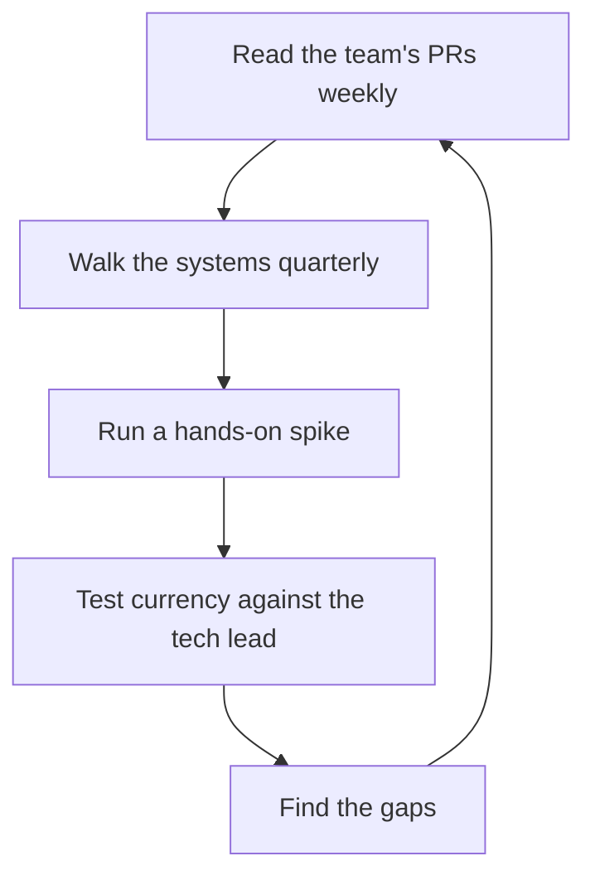

# Maintaining Technical Currency

> **Core skill:** Staying technically current without doing the work — reading the team's code and PRs, walking the systems, and testing your own understanding on a schedule that beats decay.

## Why This Matters

Technical currency decays on a clock. The manager's distance from code grows with every week of meetings, the frameworks the team uses churn faster than any outsider can follow, and the identity shift from "engineer who manages" to "manager who used to engineer" is silent — until the day you cannot evaluate a vendor claim, challenge an estimate, or understand the incident you must explain upward.

Currency is the entry ticket to credibility. The team forgives a manager who does not write code; it does not forgive a manager who cannot read the system. Every other managerial capability — risk assessment, hiring judgment, tech lead support — runs on the base layer of knowing what the team actually does. Currency is maintained deliberately, or it is lost by default.

## Why Currency Decays

| Decay Force | Mechanism | Countermeasure |
|-------------|-----------|----------------|
| Distance from code | You stop writing; reading becomes optional | Scheduled code reading, weekly |
| Meeting load | Calendar fills; learning time is never urgent | Protected time, on the calendar |
| Framework churn | Stack shifts faster than outsider knowledge | Selective tracking of what the team uses |
| Skill atrophy | Old expertise fades without practice | Quarterly hands-on spikes |
| Confidence illusion | Past competence is mistaken for current competence | Regular currency tests |

The decay is not a character flaw; it is physics. The only question is whether the schedule compensates for it.

## Currency Strategies

| Strategy | Cadence | What It Buys |
|----------|---------|--------------|
| Read the team's PRs | Weekly | The system's actual shape; who is doing what |
| System walks with engineers | Quarterly | Architecture as it lives, with context |
| Tech talks and internal demos | Monthly | What the industry and the org are doing |
| Hands-on spikes | Quarterly, protected time | Muscle memory; honest calibration of difficulty |
| Selective reading | Continuous | Papers, newsletters, docs on what matters now |

### The PR Reading Habit

- Read the team's merged PRs weekly — the diff is the system's diary
- Focus on the files that matter: architecture, data, critical paths
- Comment rarely; ask in reviews only when a question sharpens the work
- Watch for what changes shape: new patterns, growing modules, recurring fixes

### The System Walk

Every quarter, one engineer leads a walk through a system the manager does not fully know: the flow, the pain points, the debt, the scariest part. The walk is the manager's chance to ask naive questions with a guide — the highest-leverage learning hour of the quarter.

### The Quarterly Spike

Pick a small, real problem and solve it in the team's stack — a weekend or a few evenings, explicitly not production critical. The spike re-calibrates your sense of difficulty, which is the thing that decays fastest. A manager who recently struggled with the framework is a manager who cannot be snowed by estimates.

## The Currency Indicators Test

Can you, unaided:

- Explain the system's architecture and its top three risks?
- Debate an estimate credibly — challenge the assumptions, not the arithmetic?
- Challenge a vendor claim about the team's stack?
- Read a design doc and ask questions that change it for the better?
- Follow an incident discussion to its technical root?

A "no" on any of these is not a verdict; it is a to-do list.

## Currency vs Depth

| Dimension | Engineer depth | Manager breadth |
|-----------|----------------|-----------------|
| Systems known | One or two, deeply | All the team's systems, usefully |
| Skill level | Expert practitioner | Informed judge and questioner |
| Time cost | Continuous | Scheduled and bounded |
| Failure mode | Depth without breadth misses org context | Breadth without base loses credibility |

The manager's currency target is calibrated breadth: enough to judge, not enough to build. If you find yourself deeper than the team's specialists in anything, you are probably spending the wrong hours.

## Staying Honest About Decay

Calibration requires an external reference:

- Quarterly, ask the tech lead: "Where is my understanding of the system stale?"
- Compare your mental model of the architecture to the actual codebase, yearly
- Take the currency test with the tech lead as examiner, not with yourself
- Accept that decay is continuous; the question is only the slope



## Practical Applications

### Currency Maintenance Checklist

- [ ] I read the team's PRs this week
- [ ] A system walk is scheduled this quarter
- [ ] My quarterly spike is on the calendar with protected time
- [ ] I can explain the architecture and top three risks unaided
- [ ] I have challenged an estimate or vendor claim in the last month
- [ ] The tech lead has told me where my understanding is stale this quarter

### Quarterly Spike Plan

```markdown
## Spike — [quarter]
- Problem: [small, real, non-critical]
- Stack: [the team's actual stack]
- Time box: [dates] — protected, on the calendar
- Success: [working solution / honest difficulty calibration]
- Learning to report back: [what surprised me about difficulty]
```

## Common Pitfalls

| Pitfall | Why It Is a Problem | Better Approach |
|---------|---------------------|-----------------|
| **Living on past depth** | Old expertise masquerades as current knowledge | Test currency against the current stack |
| **Reading instead of doing** | Passive consumption does not recalibrate difficulty | Quarterly hands-on spikes |
| **PRs as surveillance** | Reviewing to police undermines trust | Read to understand; comment rarely |
| **Depth where breadth is needed** | Specialist hours miss the manager's job | Target calibrated breadth |
| **Self-calibration** | The decaying instrument cannot measure itself | External checks: tech lead, system walks |
| **Untimed learning** | Learning without a schedule loses to the calendar | Protected, recurring time |

## Success Indicators

- You can explain the architecture and its risks unaided
- Engineers bring you design questions because your questions sharpen them
- Estimates and vendor claims are challenged credibly when they should be
- The team's stack changes do not surprise you
- The tech lead's quarterly honesty report has shrinking gaps

## Related Topics

- [[02_Participating_in_Technical_Decisions]]: currency is the entry ticket to participation
- [[03_Risk_Assessment_with_Limited_Depth]]: currency powers risk judgment
- [[04_Supporting_the_Tech_Lead_Partnership]]: the tech lead is the calibration reference
- [[05_Hiring_and_Growing_with_Technical_Judgment]]: currency powers people decisions
- [[04_Delivery_Leadership_for_Managers/00_overview|Delivery Leadership for Managers]]: current judgment keeps delivery reading honest

## Summary

Technical currency is maintained on a schedule, not by aspiration: weekly PR reading, quarterly system walks, monthly talks, protected hands-on spikes, and selective reading — verified by a currency test against the tech lead. The target is calibrated breadth, not engineer depth, and the honesty practice is continuous because decay is continuous. A manager who knows the system can judge it; a manager who does not can only hope.
