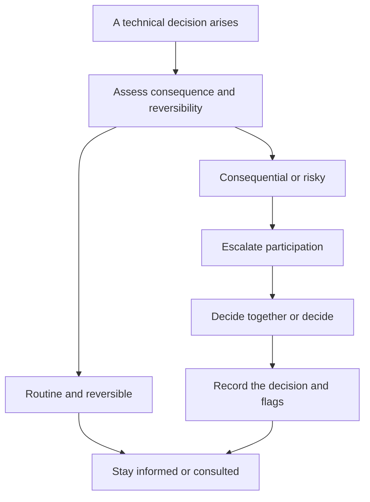

# Participating in Technical Decisions

> **Core skill:** Calibrated involvement in technical decisions — informed or consulted by default, escalating participation when the decision is consequential, and sharpening designs with questions instead of redirecting them.

## Why This Matters

The manager's participation in technical decisions is a dial, not a switch. At one extreme, the manager is absent: the team decides everything, and the manager cannot defend, fund, or explain the choices — nor notice when a decision carries hidden risk. At the other, the manager is the decider: the team stops thinking, the tech lead becomes a title, and every design waits for the manager's blessing.

The skill is knowing where the dial sits for each decision and moving it deliberately. Most decisions belong to the team, with the manager informed. A small set — consequential, cross-team, high-risk, or personnel-impacting — earns deeper participation. The manager who participates in everything is a bottleneck; the manager who participates in nothing is a passenger.

## The Participation Spectrum

| Level | What It Means | When It Fits |
|-------|---------------|--------------|
| Informed | You hear about the decision after it is made | Routine, reversible, low-risk choices |
| Consulted | Your input is sought before the decision | Most design decisions; your questions add value |
| Co-decider | You and the team decide together | Consequential technical choices |
| Decider | You make the call | Risk, cost, or cross-team impact dominates |

## The Default Position

Default to informed or consulted. The team closest to the work has the best technical information, and their ownership of decisions is the engine of their growth. Your default participation is the question — the one that sharpens thinking without redirecting it.

State the default explicitly so the team knows where they stand: "Design decisions are yours; I want to hear about them before they ship. If a decision is consequential, cross-team, or expensive, we decide together."

## When to Escalate Participation

| Trigger | Example | Level to Move To |
|---------|---------|------------------|
| Consequential | The data model the whole product builds on | Co-decider |
| Cross-team | The API other teams will integrate against | Co-decider |
| Personnel impact | The rewrite that removes a whole skill area | Co-decider |
| High risk | The migration with no rollback path | Decider |
| Cost | The infrastructure commitment with a large bill | Decider |
| Irreversible | The platform choice that will not be changed | Co-decider at minimum |

The trigger is not "interesting" or "I have opinions" — it is consequence. If the decision is cheap to reverse, the team decides.

## The Question Toolkit for Design Reviews

When you attend a design review, your instrument is questions, not opinions:

| Question | What It Surfaces |
|----------|------------------|
| What breaks? | The failure modes the design did not name |
| What does this cost? | Ongoing cost of ownership, not just build cost |
| What happens when it fails? | Degradation, recovery, and rollback |
| Who maintains it? | The long-term owner and their capacity |
| What are we not doing? | The alternatives implicitly rejected |
| What changes next year? | The assumptions with a shelf life |

These questions work because they are cheap to answer well and expensive to answer badly — and they keep the manager in judge mode, not designer mode.

## Staying in Question Mode

The temptation is to redirect: "Have you considered X?" becomes "Do X." The discipline:

- Ask the question; let the team answer it
- If the team's answer is sound, the design stands — even if you would have chosen differently
- If the team cannot answer, that is the finding — a design that cannot answer "what breaks" is not ready
- Reserve direct opinions for the escalated decisions where you are co-decider or decider

The manager's question that changes the outcome once is worth more than the manager's opinion that is ignored ten times.

## Recording Your Participation

Keep a lightweight record of what you flagged and what was decided:

- Decisions where you raised a risk: note the risk and the resolution
- Decisions you ratified with reservations: note the reservation and the date
- Decisions where you escalated participation: note why

The record serves two purposes: it keeps you honest about where the dial was, and it gives you the material to explain technical choices upward.

## The Re-Entry Problem

After absence — a long stretch away from technical discussion, a re-org, a new domain — the temptation is to opine from stale context. The discipline is the reverse:

1. Rebuild context first: read the design doc, the ADRs, the recent diffs
2. Attend as a listener; ask questions, make no judgments
3. Calibrate with the tech lead: what changed while you were away?
4. Only then participate at your normal level

A manager who re-enters with fresh questions earns the room; a manager who re-enters with stale opinions loses it.



## Practical Applications

### Participation Checklist

- [ ] I know the dial position for every live technical decision
- [ ] My default is informed or consulted — not decider
- [ ] I attended the design reviews where decisions were consequential
- [ ] My questions sharpened the design; I did not redirect it
- [ ] Flagged risks and reservations are recorded
- [ ] After any absence, I rebuilt context before opining

### Design Review Participation Record

```markdown
## Design Reviews — [month]
| Design | Dial | My Questions | Flags | Outcome |
|--------|------|--------------|-------|---------|
| [X] | [consulted] | [what breaks?] | [rollback undefined] | [decided with flag] |

## Decisions Ratified with Reservations
- [date]: [decision] — reservation: [X] — revisit by: [date]
```

## Common Pitfalls

| Pitfall | Why It Is a Problem | Better Approach |
|---------|---------------------|-----------------|
| **Deciding everything** | The team stops thinking; you become the bottleneck | Default to informed; escalate by consequence |
| **Ghost participation** | Absence from consequential decisions leaves risk unowned | Escalate when consequence, risk, or cost triggers |
| **Redirecting designs** | Your opinion replaces the team's thinking | Ask the question; let the team answer it |
| **Stale re-entry** | Opinions from outdated context lose the room | Rebuild context before participating |
| **Unrecorded flags** | Raised risks vanish without a trace | Record flags, reservations, and outcomes |

## Success Indicators

- The team decides routine technical matters without you
- Consequential decisions include your calibrated participation
- Your design-review questions change outcomes for the better, occasionally and memorably
- Engineers can name the decisions that are theirs and the ones that are yours
- Your participation record shows deliberate dial positions, not drift

## Related Topics

- [[01_Maintaining_Technical_Currency]]: currency earns the seat in the room
- [[03_Risk_Assessment_with_Limited_Depth]]: risk questions are the manager's instrument
- [[04_Supporting_the_Tech_Lead_Partnership]]: the tech lead owns direction; you own consequence
- [[07_Technology_Adoption_and_Governance]]: adoption decisions are where the dial matters most
- [[career-path/05_Tech_Lead/01_The_Tech_Lead_Role_and_Operating_Model/02_The_Tech_Lead_Engineering_Manager_Partnership|TL-EM Partnership (Tech Lead)]]: the lead-side view of the same division

## Summary

Participating in technical decisions is a calibrated dial: informed or consulted by default, escalated deliberately when a decision is consequential, cross-team, risky, costly, or irreversible. The manager's instrument is the sharpening question — what breaks, what it costs, what happens on failure, who maintains it — and the discipline is staying in question mode, recording flags, and rebuilding context after absence. The team that decides freely and the manager who judges consequence are the same healthy system.
