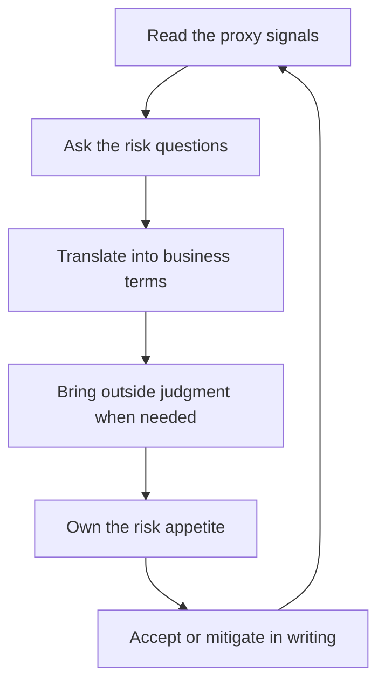

# Risk Assessment with Limited Depth

> **Core skill:** Assessing technical risk without deep expertise — reading proxy signals, asking the questions that surface risk, translating risk into business terms, and owning the risk appetite decision.

## Why This Matters

The manager is accountable for risk the team cannot see and specialists will not carry: the migration that could slip the quarter, the dependency that could collapse, the vendor claim that could be fiction. Yet the manager rarely has the depth to audit the technical substance directly. The gap between accountability and depth is closed by method, not by expertise.

The method has three parts: read the proxy signals that correlate with risk, ask the questions that force risk into the open, and translate what you find into business terms — revenue exposure, user impact, compliance — that the organization can actually weigh. The manager who masters this can own risk in domains where they could never build the system.

## Proxy Signals

When you cannot audit the substance, read the signals around it:

| Signal | What It Correlates With | How to Read It |
|--------|-------------------------|----------------|
| Team confidence distribution | Hidden disagreement | Ask every engineer for a private confidence score; wide spread is a flag |
| Estimate divergence | Unknown scope | Wildly different estimates for the same work signal unexamined assumptions |
| Novelty of technology | Unknown unknowns | First use of a stack or pattern carries discovery risk |
| Migration size | Surface area of breakage | More moving parts, more ways to break |
| Blast radius | Cost of failure | How many users, teams, and systems are touched by a failure |
| Recent churn in the area | Unstable foundation | Frequently rewritten modules are signals of unsolved problems |

Signals do not prove risk; they point where the questions go.

## Questions That Surface Risk

| Question | What It Forces Into the Open |
|----------|------------------------------|
| What is the rollback? | Whether failure is reversible and how hard |
| What have we not tested? | The untested corners of the plan |
| Which dependency is scariest? | The single point of failure in the chain |
| What breaks first? | The earliest failure mode and its cost |
| What is the plan's weakest assumption? | The belief the whole plan rests on |
| What would make this twice as hard? | The hidden scale and failure dependencies |

These questions work without depth because they are structural: anyone can ask what the rollback is, and the quality of the answer tells you how much the plan has been stress-tested.

## Risk Translation

Technical risk becomes decision material only in business terms:

| Technical Risk | Business Translation |
|----------------|----------------------|
| Migration may slip two months | Two months of delayed revenue features; competitors gain ground |
| Cache dependency has no fallback | Peak-hour outage risk affecting all logged-in users |
| Data pipeline lacks validation | Compliance exposure; wrong numbers in regulatory reporting |
| Single engineer holds the system | Key-person risk: departure stalls the roadmap |
| Legacy module cannot be tested | Every change there is a small production incident gamble |

The translation rule: name the exposure, the population affected, and the timing. "High risk" is a feeling; "outage risk for all logged-in users at peak" is a decision input.

## When to Bring Outside Judgment

Some assessments exceed the manager's method:

| Situation | Outside Judgment |
|-----------|------------------|
| Architecture-level risk | Architect review or design audit |
| Vendor claims | Independent technical evaluation |
| Security posture | Security review |
| Large migration | External or senior-peer review of the plan |
| Recurring incidents | Post-incident analysis with a fresh set of eyes |

Bringing outside judgment is not an admission of weakness; it is the correct move when the stakes exceed the method. The cost of the review is small against the cost of the wrong decision.

## The Manager as Risk Owner

The deepest part of the role: someone must decide how much risk the organization accepts, and that someone is usually the manager.

- Decide risk appetite explicitly: what is acceptable to lose, for what gain
- Accept risks in writing: "I accept the migration risk through Q3; the mitigation is X"
- Communicate accepted risk upward — silently accepted risk becomes a surprise later
- Revisit the appetite when the stakes change

| Risk Appetite Decision | Example |
|------------------------|---------|
| Accept | Ship with a known defect when the cost of delay exceeds the cost of the defect |
| Mitigate | Add the fallback before launch; delay the feature |
| Transfer | Insure, outsource, or move the risk to a party that can carry it |
| Avoid | Do not do the thing; the risk exceeds any return |



## Practical Applications

### Risk Review Checklist

- [ ] I know the team's confidence distribution on the current big plan
- [ ] Every major plan has a named rollback
- [ ] The scariest dependency is identified and monitored
- [ ] Technical risks are translated into exposure, population, and timing
- [ ] Outside judgment was brought in where stakes exceeded my method
- [ ] Accepted risks are written down and communicated upward

### Risk Register Template

```markdown
## Risk Register — [quarter]
| Risk | Signal | Business Translation | Appetite Decision | Owner | Revisit |
|------|--------|----------------------|-------------------|-------|---------|
| [X] | [estimate spread] | [$ exposure, users, timing] | [accept/mitigate/transfer/avoid] | [name] | [date] |

## Accepted Risks
- [risk] — accepted because [rationale] — communicated to [stakeholder] on [date]

## Decisions Brought to Outside Judgment
- [decision] — reviewer: [name] — verdict: [X] — action: [X]
```

## Common Pitfalls

| Pitfall | Why It Is a Problem | Better Approach |
|---------|---------------------|-----------------|
| **Fake depth** | Pretending to audit substance you cannot judge | Read proxy signals and structural questions instead |
| **Risk as feeling** | "It feels risky" decides nothing | Translate to exposure, population, and timing |
| **Silent acceptance** | Uncommunicated risk becomes a surprise later | Accept risks in writing, upward |
| **Endless mitigation** | Over-engineering safety starves delivery | Decide appetite explicitly; mitigate to the line |
| **Skipping outside judgment** | Pride costs more than the review | Bring experts when stakes exceed method |
| **Register as ritual** | A filled template that no one reads | Revisit risks on a schedule; change decisions when they move |

## Success Indicators

- You can name the team's top three risks and their business translations
- Plans you reviewed all have named rollbacks
- Accepted risks are documented, not assumed
- Outside reviews happened before decisions, not after incidents
- The team brings you risk early because your questions find it

## Related Topics

- [[01_Maintaining_Technical_Currency]]: currency makes the signals readable
- [[02_Participating_in_Technical_Decisions]]: risk is the trigger for escalated participation
- [[07_Technology_Adoption_and_Governance]]: adoption risk is the governance core
- [[04_Delivery_Leadership_for_Managers/00_overview|Delivery Leadership for Managers]]: risk ownership is delivery's guardrail

## Summary

Risk assessment without depth is a method, not a miracle: read proxy signals like confidence spread and estimate divergence, ask the structural questions that force risk into the open, translate findings into business terms, bring outside judgment when stakes exceed the method, and own the risk appetite decision in writing. The manager who runs the method can hold risk in any domain — and the team that sees risk owned, named, and translated trusts the direction it is given.
