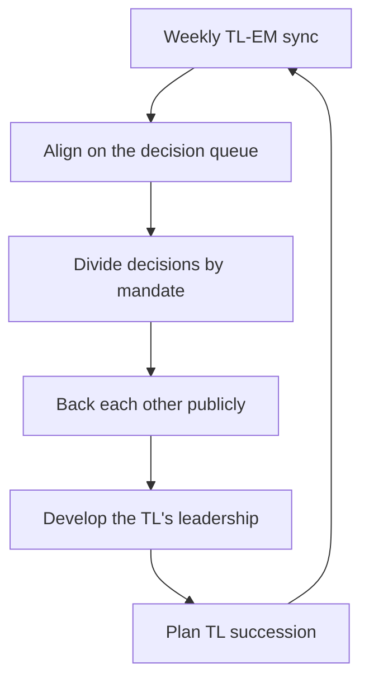

# Supporting the Tech Lead Partnership

> **Core skill:** Running the TL-EM partnership as a force multiplier — complementary mandates, a working rhythm, clean decision division, public backing, and deliberate development of the tech lead as a leader.

## Why This Matters

The tech lead and the engineering manager are the team's two hemispheres. The TL owns the system and its direction; the EM owns the people and the conditions they work in. A team with both roles in genuine partnership gets technical direction that is funded, staffed, and protected — and people management that is informed by what the work actually demands.

When the partnership is weak, the team pays twice: either the TL and EM drift apart (technical decisions without people context, people decisions without technical reality) or they collide (two bosses, conflicting instructions, politics between the chairs). The partnership is not a relationship that happens; it is an operating model that must be built, maintained, and occasionally repaired — and the EM carries most of the responsibility for building it.

## Complementary Mandates

| Domain | Tech Lead Owns | Engineering Manager Owns |
|--------|----------------|--------------------------|
| System | Direction, architecture, technical quality | Cost, staffing, timeline consequences |
| People | Technical growth, code review culture | Careers, performance, conditions |
| Delivery | Technical execution and sequencing | Commitments, capacity, stakeholder alignment |
| Risk | Technical risk identification | Risk appetite and business translation |
| Communication | Technical decisions upward | Team representation and context down |

The boundary is not rigid — it is a shared understanding that gets re-negotiated as the team changes. What must be rigid is the public face: the team should never be able to play the two roles against each other.

## The Operating Rhythm

A weekly TL-EM sync is the minimum viable partnership:

| Agenda Slot | Content |
|-------------|---------|
| System pulse | What changed, what is concerning, what is next |
| People signals | Who is thriving, who is struggling, who is at risk |
| Decision queue | What needs deciding, by whom, by when |
| Boundary check | Any decision that crossed the line |
| Alignment | Are we telling the team the same story? |

Beyond the weekly sync: joint attendance at consequential reviews, shared incident retrospectives, and a standing rule that either can call an emergency alignment when a disagreement is about to become public.

## Dividing Decisions

| Decision Type | Default Owner | When It Moves |
|---------------|---------------|---------------|
| Technical direction | TL | When cost or staffing cannot support it — EM joins |
| People decisions | EM | When technical impact is large — TL consulted |
| Delivery commitments | EM with TL input | When feasibility is contested — joint decision |
| Technical risk | TL identifies; EM owns appetite | Always joint visibility |
| Team process | EM owns; TL co-designs | When process touches technical work |

Write the division down when the team is healthy, so the document exists when it is not.

## Backing the TL Publicly

The rule: disagreements are private; alignment is public.

- When the TL makes a technical call, back it in front of the team — even if you would have chosen differently
- If you must override, do it privately, with reasoning, and let the TL deliver the corrected version to the team where possible
- Never let your skepticism of the TL become the team's sport
- Credit the TL for technical wins the same way you credit the team for delivery wins

Public backing is not surrender; it is the price of the TL's authority, and the TL's authority is the team's technical effectiveness.

## When TL and EM Disagree

| Situation | Path |
|-----------|------|
| Technical judgment differs | Discuss with evidence; default to the TL's domain unless consequence is large |
| Cost or people impact differs | EM owns the consequence; TL gets the full reasoning |
| Genuine deadlock | Escalate together, presenting both positions — never one behind the other's back |
| Public disagreement risk | Emergency alignment before it becomes visible |

The escalation path between TL and EM is a shared decision to escalate, not a complaint channel. When the pair escalates jointly with both positions stated, the organization gets a better decision and the partnership gets stronger.

## Developing the TL

The EM grows the TL as a leader:

- Delegate progressively: stakeholder exposure, budget input, hiring participation
- Give feedback on leadership behavior, not just technical output
- Coach the hard conversations: saying no, delivering bad news, managing upward
- Protect the TL's development time the way you protect the team's
- Make the TL's growth an explicit goal in your own planning — the team's ceiling is often the TL's growth

A TL who grows into leadership is the EM's successor pipeline and the team's future.

## When There Is No TL

Coverage is deliberate and temporary:

- The manager covers technical direction only until a TL exists
- State the interim explicitly: "I am holding the TL seat until we fill it"
- Push technical decision-making down to senior engineers wherever possible
- Make finding and growing a TL a named priority, with a date

Coverage that becomes permanent is the combined role — a different operating model with its own risks (see [[06_When_the_Manager_Is_Also_the_Tech_Lead]]).

## TL Succession

| Stage | Action |
|-------|--------|
| Spot | Identify the senior engineer with the scope and appetite |
| Grow | Give them TL-sized problems with EM backing |
| Announce | Make the transition explicit with a timeline |
| Hand over | The outgoing TL exits the role cleanly — no ghost ownership |
| Support | The new TL gets a defined onboarding and a working partnership |

A clean TL handover is a team event: roles, rituals, and decision rights transfer visibly, so the team's trust transfers with them.



## Practical Applications

### Partnership Health Checklist

- [ ] The weekly TL-EM sync ran this week with both agendas
- [ ] Decision boundaries are written down and current
- [ ] I have backed the TL publicly this month
- [ ] No disagreement is older than a week without a private conversation
- [ ] The TL's development has a named goal and progress
- [ ] If there is no TL, the interim coverage is explicit and dated

### TL-EM Sync Agenda

```markdown
## TL-EM Sync — [date]
- System pulse: [changes, concerns, next]
- People signals: [thriving, struggling, at risk]
- Decision queue:
  - [decision] — owner: [TL/EM] — by: [date]
- Boundary check: [any crossed lines this week]
- Alignment: [same story / drift: X]
- TL development: [growth moment or coaching note]
```

## Common Pitfalls

| Pitfall | Why It Is a Problem | Better Approach |
|---------|---------------------|-----------------|
| **Two bosses** | Unclear boundaries let the team play chairs against each other | Write and maintain the decision division |
| **Public disagreement** | Undermines the TL's authority permanently | Disagree privately; align publicly |
| **Sync drift** | Without a rhythm, alignment decays into surprises | Protect the weekly sync as non-negotiable |
| **TL as worker, not leader** | The team's ceiling becomes the TL's current scope | Develop the TL deliberately |
| **Permanent coverage** | Manager-as-TL becomes the combined role by default | Date the interim; grow a successor |

## Success Indicators

- The team cannot tell where one mandate ends and the other begins — because it does not matter
- Disagreements resolve privately and strengthen the relationship
- The TL brings you risk early, knowing you will own the appetite decision
- The TL's leadership scope grows visibly each quarter
- A TL transition — into or out of the role — lands cleanly

## Related Topics

- [[02_Participating_in_Technical_Decisions]]: the decision division in practice
- [[03_Risk_Assessment_with_Limited_Depth]]: the TL identifies; you own appetite
- [[06_When_the_Manager_Is_Also_the_Tech_Lead]]: what happens when the roles merge
- [[01_People_Development/00_overview|People Development]]: the TL is a growth project like any report
- [[career-path/05_Tech_Lead/01_The_Tech_Lead_Role_and_Operating_Model/02_The_Tech_Lead_Engineering_Manager_Partnership|TL-EM Partnership (Tech Lead)]]: the lead-side view of the same operating model

## Summary

The TL-EM partnership is an operating model: complementary mandates, a weekly rhythm, a written decision division, public backing with private disagreement, joint escalation, and deliberate development of the TL as a leader. When there is no TL, coverage is explicit and dated; when the TL leaves, succession is a visible team event. The pair that runs the model doubles the team's ceiling — and the pair that neglects it halves the team's trust.
