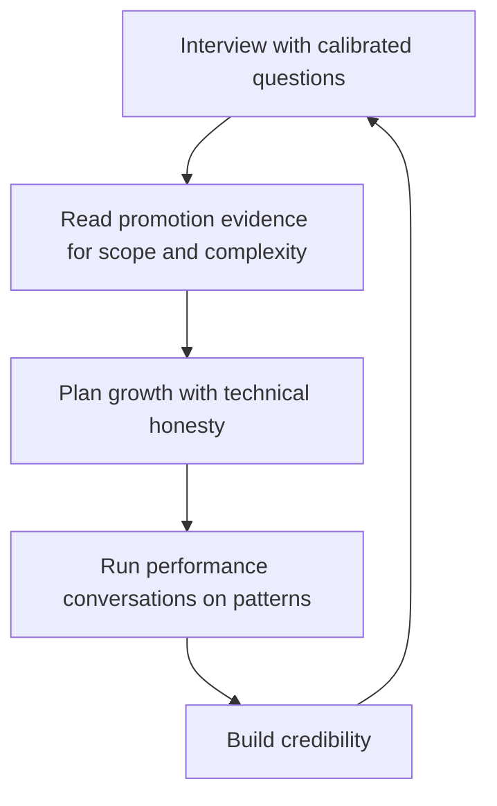

# Hiring and Growing with Technical Judgment

> **Core skill:** Applying technical judgment to people processes — interviewing seniors, evaluating promotion cases, and running growth and performance conversations with credibility, without pretending to be the deepest technical mind in the room.

## Why This Matters

People decisions are where technical judgment pays its largest dividend and exacts its largest penalty. A mis-hired senior costs a year of salary, team velocity, and morale; a promotion granted on weak evidence sets a precedent the team will follow; a performance conversation about technical quality that the manager cannot ground in reality destroys the manager's credibility with everyone who hears about it.

The manager does not need to be the best engineer in the room — but must be able to judge engineering quality when it matters. That means knowing your own limits, pairing your judgment with the team's best technical voices, reading evidence for scope and complexity rather than volume, and keeping the technical line of every people decision honest.

## Interviewing Seniors

| Practice | Why It Works |
|----------|--------------|
| Calibrated questions | Ask what the candidate actually built, at what scope, with what trade-offs |
| Knowing your limits | You cannot out-interview a specialist in their domain — do not try |
| Pairing with strong interviewers | Your technical signal plus theirs; you judge the person, they judge the craft |
| Probing for ambiguity | How they handled unclear requirements reveals seniority more than syntax |
| Checking for ownership | Did they own the outcome, or contribute to someone else's? |

The manager's interview contribution is judgment of the person — ownership, honesty, communication, growth trajectory — while the technical interviewers judge craft. A senior candidate who cannot explain their own trade-offs is a flag no algorithm question will catch.

### Red Flags Only Technical Judgment Catches

- Vague ownership: "we" did everything, no personal decisions
- Trade-off amnesia: cannot name what they chose against
- Blame patterns: every failure was someone else's stack
- Depth theater: fluent in one framework, hollow everywhere else

## Evaluating Promotion Cases

| Evidence Dimension | What to Look For | Weak Version |
|--------------------|------------------|--------------|
| Scope | Did the work span systems, teams, or orgs? | Work within one ticket |
| Complexity | Did they solve hard problems, not just many? | High volume, low difficulty |
| Ambiguity growth | Did they handle less-defined problems over time? | Same-shaped work, larger count |
| Impact | Did the outcome change anything that matters? | Activity without outcomes |
| Judgment | Did they make the right trade-offs, and own them? | Correct work, borrowed decisions |

Reading promotion evidence as a non-expert means leaning on the TL's technical assessment for the craft dimension while you judge the trajectory dimension — scope growth, ambiguity handling, and impact — where you have full standing.

## Growth Planning with Technical Honesty

| Question | Purpose |
|----------|---------|
| Which skills matter now, for the current work? | Grounds growth in reality |
| Which skills matter next, for the trajectory? | Names the gap honestly |
| What is the weakest link in their current role? | Focuses the plan |
| Who on the team can teach this? | Finds the growth path inside the team |
| What does the TL say about their technical ceiling? | Calibrates ambition against evidence |

Growth plans fail when they are generic ("keep learning") or flattering ("you are doing great"). Technical honesty means naming the gap — kindly, specifically, and with a path.

## Performance Conversations About Technical Quality

- Use the TL's input: the TL owns the technical evidence; you own the conversation
- Talk in patterns, not instances: "the last three reviews showed the same testing gap" beats "this one bug"
- Ground every claim in observable behavior: designs, reviews, incidents, decisions
- Separate skill from situation: "the migration failed because scope was unknown" is different from "the engineer cannot plan"
- Write what is defensible: if the performance doc would not survive an appeal, fix the doc

The manager who runs technical performance conversations on evidence can have the hard ones; the manager who runs them on impressions cannot have any.

## Technical Judgment as Credibility Currency

| Moment | What Credible Technical Judgment Buys |
|--------|---------------------------------------|
| Hiring debates | Your voice counts in the room |
| Promotion panels | Your cases survive scrutiny |
| Performance reviews | Hard messages land as fair |
| Team conflict about quality | You can arbitrate without taking sides |
| Growth planning | The team trusts the plan's honesty |

Credibility is spent in every people decision and replenished by demonstrated judgment — asking the sharp question in an interview, reading the promotion evidence fairly, running the hard review on patterns. It is the same compounding asset as everywhere else in management, and it is built or burned in the rooms where people's careers are decided.



## Practical Applications

### People-Technical Judgment Checklist

- [ ] Senior interviews pair my judgment with strong technical interviewers
- [ ] Promotion cases are read for scope, complexity, ambiguity, impact, and judgment
- [ ] The TL's technical input is sought before every technical performance conversation
- [ ] Performance claims are grounded in observable behavior
- [ ] Growth plans name the real gap and the path
- [ ] Every people decision with a technical dimension is defensible in writing

### Promotion Case Review Template

```markdown
## Promotion Case — [person]
- Level sought: [X]
- Scope evidence: [systems/teams/orgs touched]
- Complexity evidence: [hardest problem, with trade-offs]
- Ambiguity growth: [how their problems changed over time]
- Impact: [what changed for users or the org]
- TL technical assessment: [X]
- My trajectory assessment: [X]
- Decision: [support / gaps / next checkpoint]
```

## Common Pitfalls

| Pitfall | Why It Is a Problem | Better Approach |
|---------|---------------------|-----------------|
| **Solo technical verdicts** | Your depth is not the room's depth | Pair with strong technical interviewers |
| **Volume as evidence** | Many easy tickets are not seniority | Read for scope, complexity, and ambiguity |
| **Impression-based reviews** | Undefensible claims destroy the conversation | Ground in observable behavior and patterns |
| **Flattering growth plans** | Kind words with no gap help no one | Name the gap with a path |
| **Skipping the TL** | The craft dimension goes unjudged | The TL owns technical evidence; you own the conversation |

## Success Indicators

- Senior candidates you championed outperformed their hiring level
- Promotion cases you wrote survived scrutiny
- The team describes your reviews as fair and evidence-based
- Engineers bring you quality conflicts because you arbitrate credibly
- Your technical questions in people processes are quoted as the sharp ones

## Related Topics

- [[01_Maintaining_Technical_Currency]]: currency is the base of credible judgment
- [[04_Supporting_the_Tech_Lead_Partnership]]: the TL supplies the craft evidence
- [[03_Hiring_and_Staffing/00_overview|Hiring and Staffing]]: the processes technical judgment feeds
- [[01_People_Development/00_overview|People Development]]: growth plans are the delivery mechanism

## Summary

Hiring and growing with technical judgment means knowing your limits and pairing around them: calibrated interview questions with strong technical interviewers, promotion evidence read for scope and complexity rather than volume, growth plans that name the real gap, and performance conversations grounded in patterns and the TL's technical input. Judgment is the credibility currency of every people decision — and it compounds exactly like the trust it is made of.
