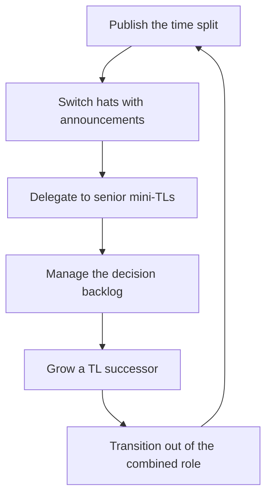

# When the Manager Is Also the Tech Lead

> **Core skill:** Operating the combined manager-plus-TL role deliberately — an explicit time split, announced hat-switching, delegation to senior engineers, and a dated plan to grow out of the role.

## Why This Matters

On small teams, in startups, and wherever a TL seat sits unfilled, the manager carries both mandates: people and conditions, system and direction. The combined role is survivable and often necessary — but it is a different operating model from either role alone, with failure modes that are specific and predictable.

The danger is not that the work is hard; it is that the role drifts. Without a deliberate design, the manager-TL slowly becomes a bottleneck (all decisions wait), or a ghost (people work starves while technical work glows), or a burnout (both mandates compete for one calendar). The combined role must be run as a temporary, designed configuration — with an exit plan — or it becomes a permanent structural flaw.

## The Combined Role Reality

| Mandate | What It Demands | What It Costs When Neglected |
|---------|-----------------|------------------------------|
| Manager | 1:1s, performance, conditions, representation | Attrition, disengagement, invisible problems |
| Tech lead | Direction, design, review, quality | Drift, debt, stalled decisions |
| Both | Calendar, energy, attention | The role's scarcest resource: you |

The arithmetic is unforgiving: the combined role has two full jobs and one brain. The only sustainable response is to shrink the technical half through delegation and to time-box the whole arrangement.

## The Explicit Time Split

- Decide the split by the team's stage: early team → technical heavy; stable team → management heavy
- Publish the split to the team: "Thursdays are my technical days; Mondays are people days"
- Protect the split against the urgent; the urgent is always technical
- Rebalance quarterly — the team's needs move

| Team Stage | Suggested Split | Rationale |
|------------|-----------------|-----------|
| Forming, no direction | 60% technical | Direction first; people work still weekly |
| Stable, senior-heavy | 40% technical | Delegation covers most technical work |
| Scaling | 30% technical | People and hiring dominate |

## Hat-Switching Discipline

The combined role's signature failure is invisible hat changes: a 1:1 that becomes a design review, a design review that becomes a performance conversation.

- Announce the hat: "Manager hat now: this is about your growth" / "TL hat now: this is about the design"
- Keep the hats in their rooms: manager topics in 1:1s, technical topics in design forums
- When a conversation crosses over, say so and reschedule the other half
- The team must always know which hat is speaking — it is the only way they can respond correctly

## The Decision Backlog Risk

One brain, two mandates — and every decision queues on it:

| Backlog Symptom | Cause | Fix |
|-----------------|-------|-----|
| Design reviews pile up | You are the only reviewer | Delegate review to seniors; review the reviews |
| 1:1s slip first | Technical urgency wins the calendar | 1:1s are non-negotiable; the split is published |
| Decisions wait for you | Authority never moved down | Move decision rights to seniors explicitly |
| Rework from late input | You opine at the end, not the start | Set review expectations and deadlines |

The backlog is managed by moving authority, not by working faster. Every decision that can be made by a senior engineer with clear criteria should be.

## Combined-Role Failure Modes

| Failure Mode | Pattern | Prevention |
|--------------|---------|------------|
| Bottleneck | Every design and decision waits for you | Delegate decision rights; review outcomes |
| Neglected people work | 1:1s thin out; conditions decay silently | Published split; non-negotiable people time |
| Neglected technical depth | Management consumes the calendar; direction drifts | Protected technical days; quarterly spikes |
| Hero mode | You do the critical work yourself | Senior engineers as mini-TLs; resist the pull |
| Role drift | The arrangement becomes permanent silently | Dated exit plan reviewed quarterly |

## Delegation Targets: Senior Engineers as Mini-TLs

The combined role's survival strategy is shrinking the technical half:

- Name a senior engineer as design owner for each major system
- Delegate review authority with criteria: "You approve anything inside X's scope"
- Give seniors the visible TL work — running design reviews, owning technical risk lists
- Grow them toward the TL role as the exit path

Delegation is not abandonment; it is the team's technical depth being exercised instead of monopolized.

## Transitioning Out

The combined role is temporary by design. The exit plan:

| Stage | Action |
|-------|--------|
| Recognize | The team has grown past the combined model; split roles become necessary |
| Grow | The mini-TL who can take the seat — deliberate development, not hope |
| Hire | If no internal candidate, a TL requisition with the same rigor as any hire |
| Hand over | Transfer direction, decision rights, and rituals visibly |
| Rebalance | The manager half re-expands into the full EM role |

The cleanest handover happens when the successor has already been making real decisions for months — the transition formalizes what already works.



## Practical Applications

### Combined Role Checklist

- [ ] The time split is explicit, published, and quarterly reviewed
- [ ] Hats are announced when they switch
- [ ] 1:1s have not slipped for technical reasons this month
- [ ] Senior engineers own named systems and their decisions
- [ ] The decision backlog has a queue, an owner, and deadlines
- [ ] The exit plan has a date and a named successor trajectory

### Weekly Split Planner

```markdown
## Combined Role Week — [date]
- People time: [days/hours] — 1:1s, reviews, conditions
- Technical time: [days/hours] — design, review, spikes
- Delegated this week: [decision] -> [senior engineer]
- Backlog watch: [oldest waiting decision, age]
- Mini-TL development: [growth moment or coaching note]
- Exit plan progress: [successor step completed]
```

## Common Pitfalls

| Pitfall | Why It Is a Problem | Better Approach |
|---------|---------------------|-----------------|
| **Silent hat switches** | The team cannot respond correctly to the wrong hat | Announce every hat change |
| **1:1s as the flexible slot** | People work decays first and silently | Publish the split; protect people time |
| **Holding all decisions** | You become the queue's only server | Delegate decision rights with criteria |
| **Hero engineering** | The critical path runs through you | Give the critical work to the team |
| **Permanent by default** | The combined role persists past its usefulness | Dated exit plan, reviewed quarterly |

## Success Indicators

- The team can name the split and which hat is speaking
- Decisions move without you for delegated scopes
- 1:1s run on schedule with quality, not leftovers
- A senior engineer is visibly growing into the TL seat
- The exit plan has moved forward this quarter

## Related Topics

- [[01_Maintaining_Technical_Currency]]: the combined role's technical half still needs maintenance
- [[02_Participating_in_Technical_Decisions]]: your dial positions change when you hold the TL seat
- [[04_Supporting_the_Tech_Lead_Partnership]]: the partnership model this role replaces temporarily
- [[03_Hiring_and_Staffing/00_overview|Hiring and Staffing]]: the TL requisition is part of the exit plan

## Summary

When the manager is also the tech lead, survival is design: an explicit published time split, announced hat-switching, decision rights delegated to senior mini-TLs, and a dated plan to grow or hire a TL successor. The combined role is a temporary configuration, not an identity — run deliberately, it carries a small team through its early stages; run by default, it becomes the bottleneck that caps the team's growth.
