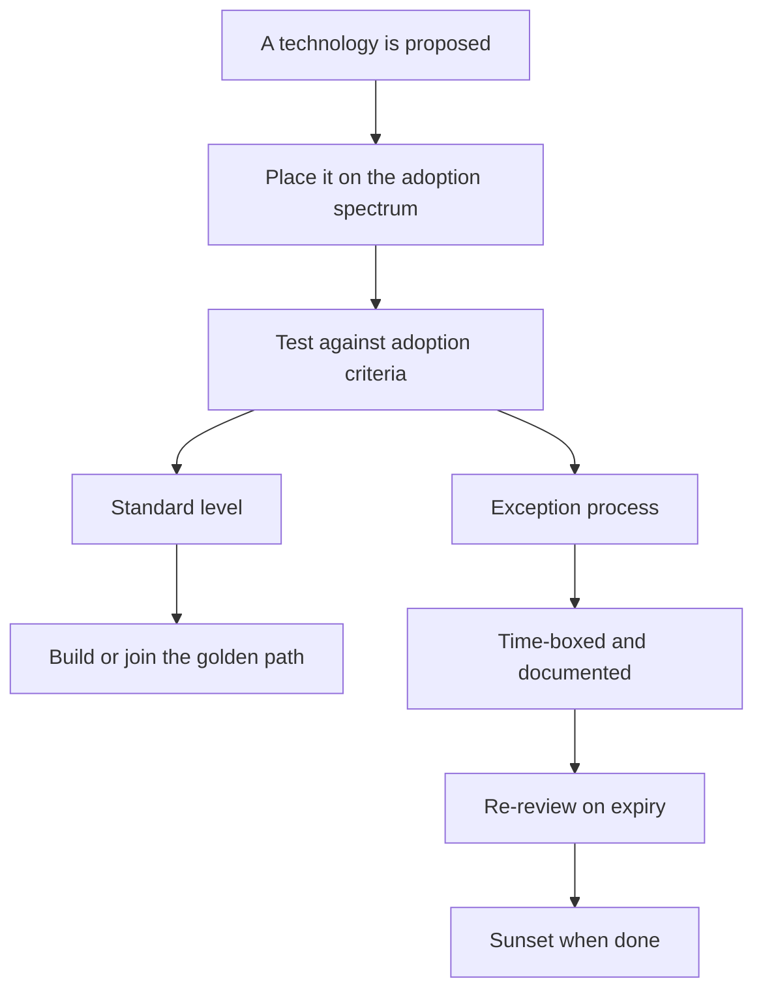

# Technology Adoption and Governance

> **Core skill:** Governing technology adoption without freezing it — an explicit adoption spectrum, fast documented exceptions, golden paths that make the right thing easy, and the discipline to sunset what is done.

## Why This Matters

Technology governance sits between two failures. Without it, every team picks its own stack, the platform fragments, support costs compound, and the organization's technical surface becomes unmanageable. With the wrong kind of it — approval boards, mandatory standards, veto culture — innovation freezes, engineers route around the process, and governance becomes the thing everyone lies to.

The manager's job is the middle: an explicit spectrum of permissiveness, adoption criteria that catch the expensive mistakes without slowing the good ones, an exception process that is fast and honest, and golden paths that make the right choice the easy choice. Governance is not a gate; it is a design problem — how do the team's choices stay aligned with the organization's interests without the team feeling governed?

## The Adoption Spectrum

| Level | Meaning | Examples | Governance Burden |
|-------|---------|----------|-------------------|
| Default-free | Anything goes; no opinion | Internal scripts, small libraries | None |
| Recommended | Preferred when it fits | The team's primary framework, standard tooling | None — guidance |
| Standard | Expected unless an exception is approved | Deployment pipeline, auth library, observability stack | Exception process |
| Banned | Not permitted, for explicit reasons | EOL runtimes, unlicensed tools, known-bad patterns | Refusal with reasons |

The spectrum is published, so the team knows the cost of each choice in advance. The mistake is treating everything as standard or everything as default-free — either the team is governed into submission or governed not at all.

## Adoption Criteria

| Criterion | The Question | Why It Matters |
|-----------|--------------|----------------|
| Supportability | Can we run this when it breaks? | A tool without internal support is an incident generator |
| Security | Does it meet our security bar? | Adoption is a security decision too |
| Talent pool | Can we hire and grow people in it? | Exotic stacks become key-person risk |
| Exit cost | How hard to leave this later? | Cheap entry with an expensive exit is a trap |
| Maintenance trajectory | Is it alive and healthy? | Dead projects become governance debt |

A technology that fails two criteria needs a serious conversation; one that fails three should not be adopted on a whim.

## The Exception Process

Exceptions are how governance stays honest — the process must be fast, documented, and time-boxed:

| Element | Design |
|---------|--------|
| Speed | Decision in days, not months; a named owner |
| Documentation | One page: what, why, what it replaces, exit plan |
| Time-box | The exception expires; re-review on a date |
| Cost | The exception holder owns support and migration |
| Route | Straight to the tech lead and manager — no committee |

A good exception process is used: if no one ever files an exception, the process is either perfect or terrifying.

## Golden Paths as Governance

The strongest governance makes the right thing the easy thing:

- Provide the blessed path: scaffold, templates, CI, deployment — all working
- Make the golden path the default in every project template
- Measure deviation: when teams leave the path, ask why — the path may be wrong
- Improve the path on feedback; golden paths that ignore their users become the thing teams escape

Governance by convenience beats governance by approval. A team that chooses the golden path because it is faster does not need to be policed.

## Tech Radar as Communication

The adoption spectrum is communicated, not filed:

| Ring | Meaning |
|------|---------|
| Adopt | We use this deliberately; new work should too |
| Trial | Promising; being evaluated in a controlled way |
| Assess | Watching; not for production yet |
| Hold | Do not start new work on this; sunsetting or superseded |

The radar is refreshed quarterly and published. It answers the team's standing question — "can we use X?" — before it is asked.

## Governance Participation Upward

The manager's governance duty runs both directions:

- Represent the team's tooling needs in org-wide standards discussions
- Push back when org standards ignore team reality — with evidence
- Feed real adoption data upward: what is working, what is drifting, what is costly
- Volunteer the team for piloting new org standards

Governance is a shared system; a manager who only consumes it is part of the problem.

## Sunsetting Technology

The hardest governance is retiring what exists:

| Stage | Action |
|-------|--------|
| Identify | The technology that is EOL, costly, or superseded |
| Quantify | The cost of keeping it: support, risk, opportunity |
| Plan | Migration path, owners, timeline, rollback |
| Communicate | Users and dependents get notice and a migration window |
| Execute | Kill it on the date; resist the last-minute reprieves |
| Celebrate | Make sunsetting a visible, normal practice |

Teams that never sunset accumulate governance debt: shadow technologies, orphaned platforms, and a codebase that runs on the memory of departed engineers.

## Governance Debt

| Debt Type | Symptom | Cost | Treatment |
|-----------|---------|------|-----------|
| Shadow tech | Teams adopt without process | Unsupported systems, security gaps | Exception process that is fast enough to use |
| Orphaned platforms | No owner, no roadmap | Every change is risky archaeology | Named owners or decommissioning |
| Stale standards | Standards no one believes | Teams route around them | Refresh on a cadence; kill the dead ones |
| Approval rot | Process slows everything | The team lies to the process | Measure cycle time; shrink the gate |



## Practical Applications

### Governance Checklist

- [ ] The adoption spectrum is published and current
- [ ] New technology goes through the criteria, not the mood
- [ ] Exceptions are fast, documented, and time-boxed
- [ ] The golden path is the easy path in every project template
- [ ] The tech radar is refreshed this quarter
- [ ] At least one technology is scheduled for sunsetting or review

### Exception Request Template

```markdown
## Technology Exception — [tool]
- What: [tool and version]
- Why: [the need, in outcomes]
- What it replaces: [X]
- Criteria score: supportability [X] security [X] talent [X] exit cost [X]
- Time-box: expires [date]
- Owner of support and migration: [name]
- Decision: [approved/declined] by [name] on [date]
```

## Common Pitfalls

| Pitfall | Why It Is a Problem | Better Approach |
|---------|---------------------|-----------------|
| **Veto culture** | Innovation freezes; teams route around the gate | Spectrum plus fast exceptions |
| **Unpublished rules** | The team learns standards from rejections | Publish the spectrum and radar |
| **Process as the product** | Slow approvals become the thing to game | Measure cycle time; shrink the gate |
| **No sunsetting** | Governance debt compounds silently | Schedule sunsets like any delivery work |
| **Local-only governance** | The team's standards ignore the org and vice versa | Participate upward with evidence |
| **Golden path neglect** | The blessed path rots; teams escape it | Improve the path on feedback |

## Success Indicators

- New technology decisions take days, not months — including the noes
- The team can name the spectrum and the exception route
- Shadow technology appears rarely and is caught early
- Sunsets happen on schedule with clean migrations
- The tech radar is a document people actually read

## Related Topics

- [[01_Maintaining_Technical_Currency]]: currency keeps the criteria honest
- [[02_Participating_in_Technical_Decisions]]: adoption decisions are where participation escalates
- [[03_Risk_Assessment_with_Limited_Depth]]: adoption risk is assessed with the same method
- [[06_When_the_Manager_Is_Also_the_Tech_Lead]]: the combined role often owns governance alone
- [[04_Delivery_Leadership_for_Managers/00_overview|Delivery Leadership for Managers]]: governance serves delivery; delivery feeds governance

## Summary

Technology adoption and governance is a design problem: an explicit adoption spectrum, criteria that catch expensive mistakes, a fast documented exception process, golden paths that make the right thing easy, a tech radar that communicates, upward participation in org standards, and the discipline to sunset what is done. Governance that gates everything freezes the team; governance that guides everything — and is measured by how rarely it is needed — compounds the organization's technical health.
