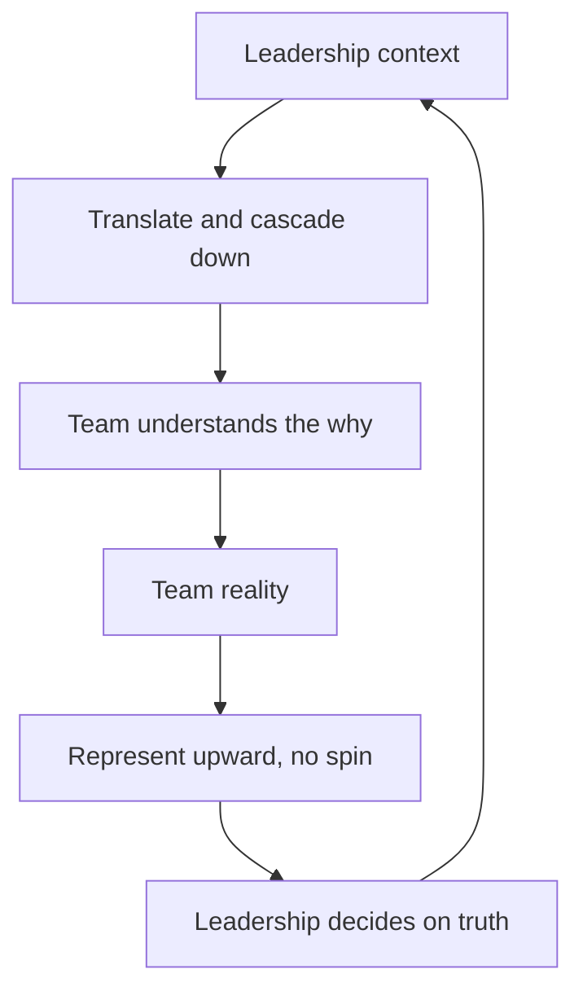

# Manager Communication

> **Core capability:** The engineering manager runs a communication system — cascading context down, representing the team accurately up, and keeping information flowing so that decisions are made with the best available truth.

## Why This Matters

Managers are information routers with judgment attached. Context from leadership never reaches the team intact unless the manager translates it; team reality never reaches leadership accurately unless the manager represents it without spin. Both directions fail quietly: the team learns strategy from rumor, and leadership learns of trouble from customers.

Communication is also the manager's visible craft — writing and speaking on behalf of people who cannot be in the room. The team's reputation, budget, and morale are built or eroded in meetings and documents the team never sees.

## Topics in This Capability Area

| Topic | Core Skill | When It Matters |
|-------|------------|-----------------|
| [[01_Cascading_Context_Downward]] | Translating strategy and change for the team | Re-orgs, strategy shifts, bad news |
| [[02_Representing_the_Team_Upward]] | Representing team reality without spin | Staff meetings; performance summaries |
| [[03_Difficult_Announcements]] | Delivering bad news with clarity and dignity | Layoffs, cancellations, denied promotions |
| [[04_Meeting_Facilitation_for_Managers]] | Running meetings that produce decisions | Every recurring meeting you own |
| [[05_Written_Communication_for_Managers]] | Writing documents that carry decisions | Strategy memos, reviews, announcements |
| [[06_Communication_Rhythms_and_Channels]] | Designing the team's information flow | Team formation; information overload |
| [[07_Listening_and_Feedback_Loops]] | Building ears: hearing what is not said | Continuously; trust erosion checks |

## The Communication System

Both directions must flow for the system to work; block either and distortion fills the gap.

## What Changes from Tech Lead to Engineering Manager

| Activity | Tech Lead | Engineering Manager |
|----------|-----------|---------------------|
| Strategy | Interprets it for technical work | Cascades it; owns the translation |
| Representation | Represents technical positions | Represents people, performance, and risk |
| Bad news | Supports the announcement | Owns delivery, Q&A, and aftermath |
| Writing | Design docs and ADRs | Memos, reviews, announcements, cases |
| Meetings | Facilitates technical discussion | Owns the team's meeting portfolio |

## Practical Applications

### Communication System Checklist

- [ ] Leadership messages reach the team translated, with context, within days
- [ ] The team's reality reaches leadership without embellishment
- [ ] Bad news is delivered in person (or live call), prepared, with space for reactions
- [ ] Recurring meetings have purposes, agendas, and decisions — or die
- [ ] Important decisions live in writing, findable by the team
- [ ] The channel map (what goes where) is known and not overloaded
- [ ] You hear about problems through built ears before they arrive via escalation

## Common Pitfalls

| Pitfall | Why It Is a Problem | Better Approach |
|---------|---------------------|-----------------|
| **Hoarding context** | Team builds conspiracy theories from fragments | Share what you can; label what you cannot |
| **Cheerleading up** | Leadership decides on fiction; trust collapses later | Represent reality; pair problems with options |
| **Bad news by memo** | Feels cowardly; questions fester unanswered | Live delivery; follow-up in writing |
| **Meeting sprawl** | Calendar fills; decisions thin out | Audit recurring meetings ruthlessly |

## Success Indicators

- The team quotes strategy accurately — because the translation landed
- Leadership trusts your summaries without independent verification
- Difficult announcements land clean: heard, understood, survivable
- Decisions are findable in writing months later
- Information reaches people at the right time through known channels

## Related Capabilities

- [[02_Team_Formation_and_Health/00_overview|Team Formation and Health]]: communication quality is team health infrastructure
- [[05_Organizational_Awareness_and_Influence/00_overview|Organizational Awareness and Influence]]: influence runs on this system
- [[career-path/02_Senior_Software_Engineer/06_Communication_and_Influence/00_overview|Communication and Influence (Senior)]]: the foundation this formalizes
- [[career-path/05_Tech_Lead/01_The_Tech_Lead_Role_and_Operating_Model/06_Working_With_Stakeholders|Working With Stakeholders (Tech Lead)]]: the lead-level counterpart

## Summary

Manager communication is a system, not a talent: cascade context down with translation, represent the team upward without spin, deliver bad news with dignity, run meetings that decide, write documents that persist, design the channel map, and build ears for what is not said. The manager is the team's information immune system — distortions stop with you.
