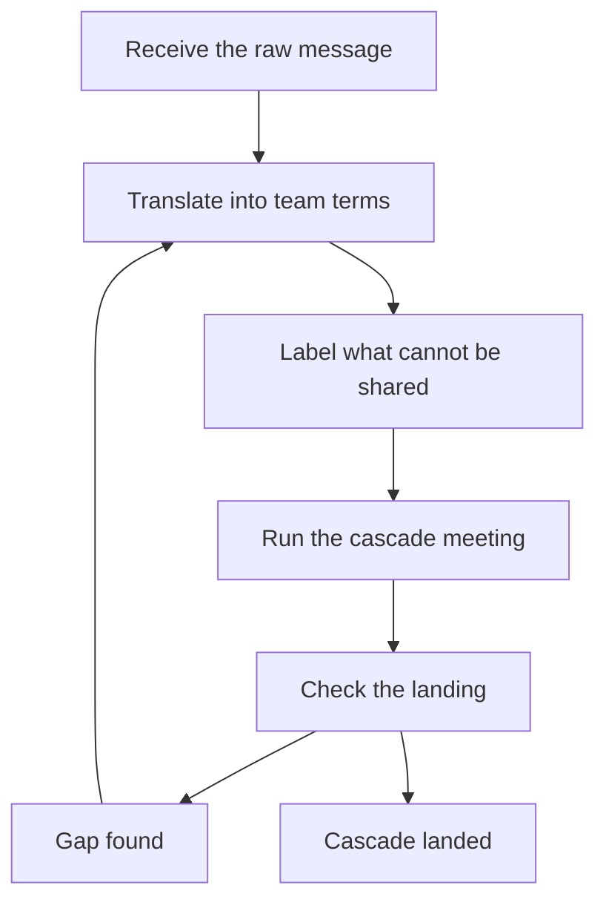

# Cascading Context Downward

> **Core skill:** Translating strategy and change for the team — what changes, what it means for us, what we do differently — so context survives the journey down without decay or distortion.

## Why This Matters

Context decays as it travels. A leadership decision arrives at the manager as a paragraph of rationale; by the time it has passed through two more mouths it is a rumor with a mood attached. The team does not need the raw signal — it needs the translation: what changes, what it means for this team, and what the team does differently as a result.

The cost of decay is paid in behavior. Teams that only half-understand strategy hedge their work, build the wrong things, and answer customers with invented certainty. Teams that receive translated context — including the honest unknown parts — commit to the direction with their eyes open. Cascading is the manager's most frequent communication act, and its quality is the team's information baseline.

## Why Cascades Decay

| Decay Force | Mechanism | Countermeasure |
|-------------|-----------|----------------|
| Nuance stripping | Each layer keeps facts, loses reasoning | Re-attach the why at every layer |
| Mood distortion | Tone compounds: worry becomes panic, hope becomes hype | Deliver the facts and the uncertainty separately |
| Selective memory | Listeners keep what affects them | Repeat the core message in multiple forms |
| Time decay | Context evaporates into the urgent | Re-cascade at milestones, not just at announcement |

The manager's rule: never forward a message without translating it. A raw forward is a decay event.

## Translating Strategy to Team Terms

| Raw Strategy | The Translation |
|--------------|-----------------|
| "We are shifting to a platform model" | What changes: we build shared services; What it means for us: our feature backlog shrinks; What we do differently: design for reuse first |
| "Cost discipline this half" | What changes: travel and tooling tighten; What it means: hiring pauses; What we do differently: proposals must show the cost line |
| "Quality is the top priority" | What changes: launch criteria harden; What it means: schedules flex; What we do differently: define done as verified, not merged |

Every translation answers three questions: what changes, what it means for us, what we do differently. If a cascade cannot answer all three, the message is not ready.

## The Cascade Meeting Format

| Segment | Content | Duration |
|---------|---------|----------|
| Share | The news, plainly, from leadership's own words | 5 minutes |
| Translate | What changes, means for us, we do differently | 10 minutes |
| Q&A | Questions answered honestly, unknowns labeled | 15 minutes |
| Capture | Concerns and open questions recorded with owners | 5 minutes |

The format's job is bidirectional: the team hears the translation, and the manager hears where the translation does not hold. Concerns captured in the meeting are not optional — they are the manager's upward feed.

## What Cannot Be Shared

Honesty includes labeling what cannot be shared yet:

| Label | Meaning | Example |
|-------|---------|---------|
| Confidential | Known, but not public yet | Unannounced headcount numbers |
| Not-yet-known | Genuinely undecided | Team structure after the re-org |
| Not-decided | Under discussion, no outcome | Which projects survive the prioritization |

The rule: label the category, never fake the category. The team can tolerate "I cannot share that yet"; it cannot tolerate "I do not know" when you do know.

## Bad News Cascades

The rules are different when the news is bad:

- Sooner than comfortable — delay only multiplies the rumor version
- In person or on a live call — never by memo for the first telling
- Structure it: what is known, what is unknown, what happens next
- Prepare for reactions: space, acknowledgment, no rush to silver linings
- Follow up in writing after the live delivery, with the same structure

Bad news delivered late and by memo is a trust event; bad news delivered early and in person is a leadership event.

## Checking Cascade Landing

The cascade is not complete until the team can restate it:

- Ask in team meetings: "How would you explain the new direction to a new joiner?"
- Listen for the distortion: what the team repeats reveals what it understood
- Check the behavior: are decisions changing the way the cascade implied?
- Re-cascade when the restatement reveals a gap

Landing checks are quick and revealing — the gap between what you said and what the team restates is the actual message that landed.

## Over-Cascade as Noise

Not everything deserves a meeting:

| Test | Passes | Fails |
|------|--------|-------|
| Does it change behavior? | The team does something differently | Purely informational |
| Does it need discussion? | Questions will arise | A doc answers them |
| Is it urgent? | Waiting for the next rhythm costs | It can ride the weekly update |

Every cascade that does not change behavior is noise that devalues the next real one. The manager's cascade portfolio has a budget, and the budget is the team's attention.



## Practical Applications

### Cascade Checklist

- [ ] I translated the message: what changes, what it means for us, what we do differently
- [ ] Unknowns are labeled honestly — confidential, not-yet-known, or undecided
- [ ] Bad news was delivered in person, sooner than comfortable
- [ ] The meeting captured concerns with owners and dates
- [ ] The team can restate the direction in their own words
- [ ] I did not hold a meeting for news that changes no behavior

### Cascade Brief Template

```markdown
## Cascade Brief — [date]
- The news: [leadership's message, verbatim core]
- What changes: [list]
- What it means for us: [list]
- What we do differently: [list]
- What is known: [list]
- What is unknown: [list] — labeled [confidential / not-yet-known / undecided]
- What happens next: [timeline, forums]
- Concerns raised: [list] — owners: [names] — follow-up by: [date]
```

## Common Pitfalls

| Pitfall | Why It Is a Problem | Better Approach |
|---------|---------------------|-----------------|
| **Raw forwarding** | Nuance dies; the why never arrives | Translate every message before it travels |
| **Inventing certainty** | Fabricated unknowns unravel into distrust | Label unknowns honestly |
| **Late bad news** | The rumor version always arrives first | Deliver sooner than comfortable |
| **One-way cascade** | Concerns never surface; translation never corrects | Capture and own the concerns |
| **Cascade sprawl** | Every message gets a meeting; attention devalues | Spend cascade meetings on behavior changes only |

## Success Indicators

- The team restates strategy in their own words, accurately
- The team's behavior changes match the cascade's intent
- Unknowns are labeled honestly and the team trusts the labels
- Bad news travels through you before rumor — consistently
- The team's questions reveal understanding, not confusion

## Related Topics

- [[02_Representing_the_Team_Upward]]: the downward cascade's counterpart
- [[03_Difficult_Announcements]]: the hardest cascades, done properly
- [[06_Communication_Rhythms_and_Channels]]: where cascades live in the channel map
- [[05_Organizational_Awareness_and_Influence/00_overview|Organizational Awareness and Influence]]: the strategy map feeds the translation
- [[career-path/05_Tech_Lead/05_Team_Development_and_Mentoring_Leadership/07_Team_Technical_Communication|Team Technical Communication (Tech Lead)]]: the lead-level counterpart for technical context

## Summary

Cascading context downward is translation work: every message becomes what changes, what it means for us, and what we do differently — delivered through a meeting format that captures concerns, labeled honestly where sharing is limited, checked for landing, and rationed so attention is not spent on noise. The manager who translates instead of forwards gives the team the one thing rumor cannot: a direction they understand well enough to commit to.
