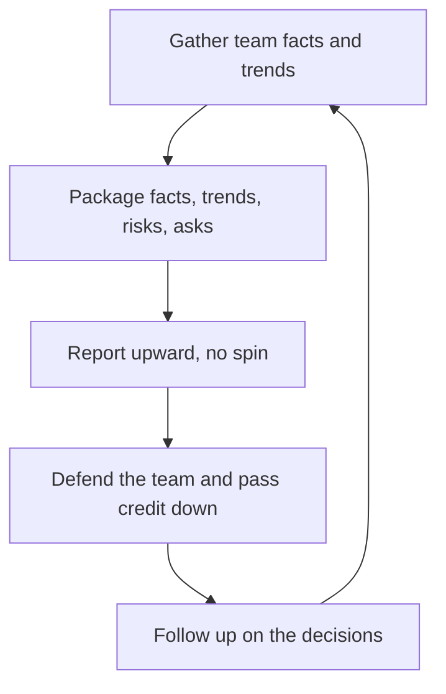

# Representing the Team Upward

> **Core skill:** Representing the team's reality to leadership without spin — packaging facts, trends, risks, and asks so the organization decides against truth, and defending the team in rooms where it is not present.

## Why This Matters

The team is judged entirely by its representation upward. Its work, its risks, and its people are summarized in meetings the team never attends, by the manager who is the only witness. Spin in either direction corrupts the system: cheerleading upward gets the team commitments it cannot keep; defeatism upward starves the team of the resources it deserves.

Representation is also protection. The manager takes incoming fire so the team can work, passes credit down so the team is seen, and carries accountability up so the team learns the real consequences of its choices. A team that trusts its representation can focus on the work; a team that suspects it is being spun, up or down, starts managing its own narrative — which is always worse.

## Representing Without Spin

| Spin Direction | Pattern | Cost |
|----------------|---------|------|
| Upward spin | Painting progress rosier than reality | Commitments the team cannot keep |
| Downward spin | Softening the team's real state for leadership | Decisions made on fiction |
| Credit spin | Taking team credit upward | The team learns its work vanishes |
| Blame spin | Offering the team as the cause | Attrition, fear, silence |

The discipline is boring: represent the facts, trends, risks, and asks — and let the judgment about them happen in the open.

## Team Reality Packaging

The upward representation package has four components:

| Component | Content | Frequency |
|-----------|---------|-----------|
| Facts | What shipped, what moved, what is true | Weekly |
| Trends | What is improving or eroding over time | Monthly |
| Risks | What is forming, with early options | As they form |
| Asks | What the team needs, with the case | At decision points |

Facts carry dates and numbers; trends carry the direction and the evidence; risks carry the mitigation options, not just the alarm; asks carry the cost and the return. If a component is missing, the package is incomplete and leadership will fill the gap with its own assumptions.

## Performance Summaries Upward

- Evidence-based: outcomes, dates, and impact — not adjectives
- Fair: the same standard applied to everyone, favorites and all
- Honest about the range: the team has strong and weak weeks; summarize the truth
- Written to survive scrutiny: if the summary would not survive an appeal, fix the summary

Performance summaries upward are the seed of every promotion and every performance conversation; inaccurate seeds grow inaccurate outcomes.

## Defending the Team

| Action | What It Looks Like |
|--------|--------------------|
| Taking incoming fire | Intercepting blame, absorbing the storm, investigating calmly |
| Passing credit down | Naming the people, in the rooms that matter |
| Passing accountability up | Owning the team's misses at your level, honestly |
| Translating the team's constraints | Capacity, risk, and context that leadership does not see |

Defending the team is not shielding it: accountability still flows, misses still land — but they land on you first, and the team learns the truth in your debrief, not in a leadership blast.

## Asking for Things Upward

Every ask upward follows the same shape:

1. The need: what the team requires — resources, a decision, protection
2. The case: cost, return, and timing
3. The options: two or three routes with trade-offs
4. The recommendation: your pick, and why

Asks without options read as complaints; asks without a recommendation read as homework for your manager.

## When the Team Is Wrong

Representation stays honest even when it hurts:

- Represent the miss accurately upward — the organization plans against truth
- Then work the fix internally: coaching, process, accountability
- Never represent the team as better than it is to avoid the hard conversation
- Never represent the team as worse than it is to make a point

The team that sees you represent them honestly through a miss — and then help them fix it — trusts you more than the team that was protected from one painful meeting.

## Your Manager's Information Needs

| Question | Answer |
|----------|--------|
| What do they need? | Facts, trends, risks, asks — in that discipline |
| When do they need it? | Before it is asked for; no surprises |
| In what form? | Their style: written summary, bullet brief, or conversation |
| What do they never want? | Secondhand discovery of team news |

The no-surprises reputation is the compounding asset: built by delivering the truth early enough to act, and spent by a single secondhand discovery.



## Practical Applications

### Representation Checklist

- [ ] Every upward summary contains facts, trends, risks, and asks
- [ ] Bad news traveled up before it was asked for
- [ ] Credit for team work went to named people
- [ ] Misses were represented honestly and owned at my level
- [ ] Asks carried options and a recommendation
- [ ] My manager has not discovered team news secondhand this quarter

### Weekly Upward Brief Template

```markdown
## Team Brief — [week]
## Facts
- Shipped: [X] — moved: [Y] — true: [Z]

## Trends
- Improving: [X] — evidence: [Y]
- Eroding: [X] — evidence: [Y]

## Risks
- [risk] — early options: [A/B] — decision needed by: [date]

## Asks
- [ask] — cost: [X] — return: [Y] — options: [A/B] — recommendation: [A]
```

## Common Pitfalls

| Pitfall | Why It Is a Problem | Better Approach |
|---------|---------------------|-----------------|
| **Cheerleading up** | Leadership plans against fiction; trust collapses later | Represent reality; pair problems with options |
| **Defeatism up** | The team starves while leadership discounts every ask | Facts, trends, risks, and asks — complete |
| **Credit hoarding** | The team learns its work vanishes upward | Name the people, loudly |
| **Shielding the team** | Protected misses become repeated misses | Represent honestly, then coach the fix |
| **Ask without options** | Reads as a complaint or homework | Always carry options and a recommendation |
| **Secondhand surprises** | One discovery erases the no-surprises balance | Truth travels up first |

## Success Indicators

- Leadership trusts your summaries without independent verification
- The team is described accurately in rooms it is not in
- Credit for the team's work is attributed to the team, by name
- Misses are owned at your level and fixed at the team level
- Your manager has never discovered team news secondhand

## Related Topics

- [[01_Cascading_Context_Downward]]: the upward counterpart of the same system
- [[05_Written_Communication_for_Managers]]: representation lives in writing
- [[07_Listening_and_Feedback_Loops]]: you can only represent what you actually hear
- [[career-path/05_Tech_Lead/01_The_Tech_Lead_Role_and_Operating_Model/06_Working_With_Stakeholders|Working With Stakeholders (Tech Lead)]]: the lead-level representation discipline

## Summary

Representing the team upward is the discipline of truth with protection: package facts, trends, risks, and asks without spin; summarize performance on evidence; defend the team by taking fire and passing credit; ask with options and recommendations; and represent honestly even when the team is wrong — then fix it internally. The no-surprises reputation is the asset, and it compounds with every early truth delivered and every named credit given.
