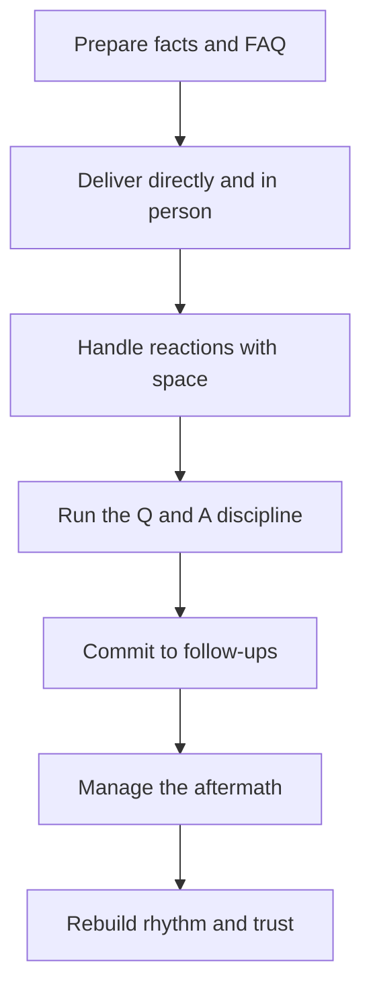

# Difficult Announcements

> **Core skill:** Delivering bad news with clarity and dignity — prepared facts, direct opening, space for real reactions, disciplined Q&A, and visible composure that is real rather than performed.

## Why This Matters

Difficult announcements are the moments that define a manager's reputation with the team. Re-orgs, cancellations, layoffs, denied promotions, policy changes — the team will remember the delivery of these long after it forgets the delivery of anything else. A botched announcement costs trust that took years to build; a well-handled one, paradoxically, can strengthen it.

The team's bar is not "make it painless" — the news is painful and cannot be made otherwise. The bar is: prepared, honest, human, and structured. The team needs to know what happened, why, what happens next, and that the person delivering it is present for the aftermath. Every element of the announcement is a skill: preparation, delivery, reaction handling, Q&A discipline, and the long aftermath.

## Announcement Types

| Type | What Makes It Difficult | The Core Message |
|------|-------------------------|------------------|
| Re-org | Identity and security shaken | Structure changes; mission and people valued |
| Project cancellation | Meaning and effort lost | The work mattered; the decision is strategic |
| Layoffs | Livelihoods and fear | The decision, the rationale, the support |
| Denied promotion | Career expectations broken | The decision and the honest path forward |
| Policy changes | Autonomy and trust reduced | The policy, the reason, the process |

Each type has a different emotional center — but the delivery craft is the same.

## Preparation

| Element | Action |
|---------|--------|
| Facts | What is decided, exactly; nothing speculative |
| Rationale | Why, in terms the team can weigh |
| What stays the same | The anchors of continuity |
| Support | What is provided: severance, time, process, help |
| FAQ | The questions you expect, with honest answers |
| Follow-up plan | When and how questions get answered after |

Preparation is complete when you can answer the hardest expected question without inventing anything.

## Delivery Principles

- In person or on a live call — never by memo for the first telling
- Direct opening: the news in the first two sentences; no warm-up, no burying the lede
- Humanity without drowning: acknowledge the impact plainly, without performing grief
- Structure: what happened, why, what stays, what next
- One voice: the manager delivers; leadership supports, not interrupts

The opening is the moment of truth. "I have difficult news: our team is being restructured" beats ten minutes of preamble — the team hears the preamble as delay and the news as worse than it is.

## Handling Reactions

| Reaction | What It Looks Like | Handling |
|----------|--------------------|----------|
| Anger | Raised voices, pointed questions | Stay calm, do not match it, do not take it personally |
| Silence | The room goes dead | Sit with it; name it: "This is a lot to absorb" |
| Tears | Visible grief | Space and acknowledgment; no rushing |
| Questions | Rapid-fire, repeated | Answer what is answerable; hold the line on what is not |
| Withdrawal | People check out | Follow up individually; watch for the quiet ones |

The discipline: do not rush the reaction. The team needs time before it can hear the next sentence; a manager who pushes through the reaction loses the rest of the message.

## The Q&A Discipline

- Answer what is known — fully
- Label what is unknown — honestly: "That is not yet decided"
- Hold what is not shareable — clearly, without pretending: "I cannot share that yet, and I will when I can"
- Commit to follow-ups: every unanswered question gets an owner and a date
- Never invent: one fabricated answer corrupts the entire announcement

| Category | Handling |
|----------|----------|
| Known | Answered fully |
| Unknown | Labeled as undecided, with a date to revisit |
| Not shareable | Named as such, with a commitment to the earliest honest share |

## Aftermath

The announcement is a moment; the aftermath is the reputation:

- Individual follow-ups: every affected person gets a 1:1 with time to talk
- Morale signals: watch participation, silence, and attrition patterns
- Rumors: correct them fast — the vacuum after an announcement breeds fiction
- The follow-up commitments: deliver every one, visibly
- Rebuild rhythm: normal rituals resume quickly; normalcy is the recovery

## Your Own Visible Composure

The team watches the manager's state during and after:

- Composure that is real, not performed: you are affected too, and honesty about that is strength
- Process your own reaction in advance, so the delivery is about the team
- Do not vent in the room; vent to peers, mentors, or a coach
- Be present in the days after — visibility in the aftermath matters more than eloquence in the moment



## Practical Applications

### Announcement Prep Checklist

- [ ] Facts are exact; nothing speculative is included
- [ ] The rationale is stated in team terms
- [ ] What stays the same is named
- [ ] Support details are concrete and known
- [ ] The hardest expected question has an honest answer
- [ ] Delivery is in person or live, with a direct opening
- [ ] Follow-up owners and dates are set before the meeting

### Announcement Prep Template

```markdown
## Announcement Prep — [topic]
- The news, in one sentence: [X]
- The rationale: [X]
- What stays the same: [X]
- What is known: [X]
- What is unknown: [X]
- What is not shareable: [X] — earliest honest share: [date]
- Support provided: [X]
- Expected questions and answers:
  - [Q] -> [A]
  - [Q] -> [A]
- Follow-ups: [question] — owner: [name] — by: [date]
```

## Common Pitfalls

| Pitfall | Why It Is a Problem | Better Approach |
|---------|---------------------|-----------------|
| **Burying the lede** | The team hears delay as avoidance and the news as worse | Direct opening, first two sentences |
| **By memo first** | Feels cowardly; questions fester unanswered | Live delivery; writing as follow-up |
| **Rushing the reaction** | Pushed-through grief blocks the rest of the message | Sit with silence; acknowledge before continuing |
| **Inventing answers** | One fabrication corrupts the whole announcement | Known, unknown, not-shareable — labeled |
| **Vanishing after** | The announcement without aftermath is abandonment | Individual follow-ups; visible presence |
| **Performed composure** | Fake calm reads as indifference | Process your own reaction; be honestly human |

## Success Indicators

- The team can restate the announcement's facts without distortion
- Reactions were given space and follow-ups were delivered
- Rumors were corrected fast, from your voice
- Affected individuals received timely 1:1s
- The team's trust in your delivery survived — and often strengthened

## Related Topics

- [[01_Cascading_Context_Downward]]: announcements are the hardest cascades
- [[05_Organizational_Awareness_and_Influence/00_overview|Organizational Awareness and Influence]]: re-orgs are where announcements and change meet
- [[07_Listening_and_Feedback_Loops]]: aftermath listening tells you how it landed
- [[career-path/05_Tech_Lead/07_Incident_Leadership_and_Production_Excellence/02_Communication_Under_Pressure|Communication Under Pressure (Tech Lead)]]: the lead-level version of the same composure

## Summary

Difficult announcements are a craft with a sequence: prepare exact facts and honest answers, deliver directly and in person with the news in the first two sentences, give reactions real space, run the Q&A on known-unknown-not-shareable lines, commit to follow-ups, and stay visibly present through the aftermath. The team will remember the delivery long after the news itself — and a manager who handles it with honesty and humanity earns trust that no easy announcement ever could.
