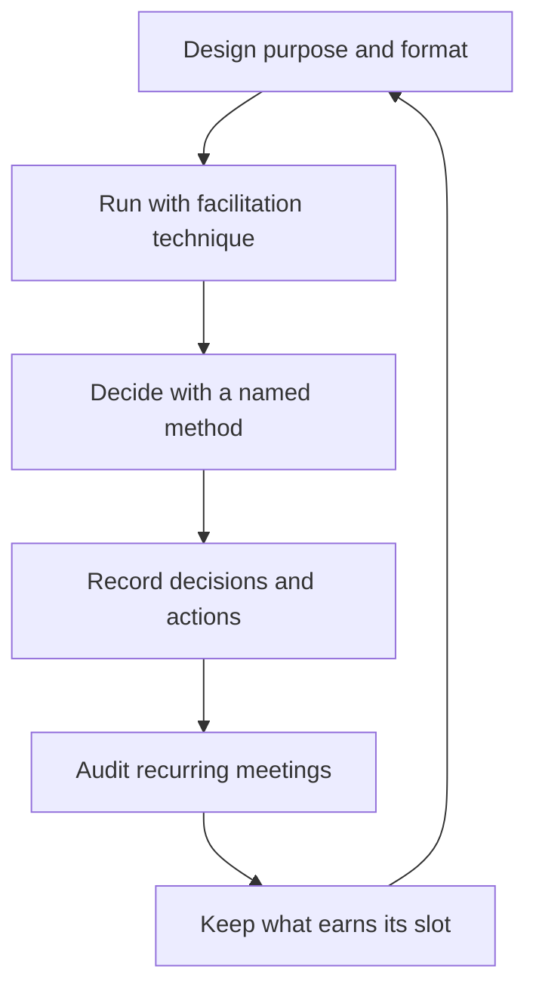

# Meeting Facilitation for Managers

> **Core skill:** Running the manager's meeting portfolio as a designed system — every meeting with a purpose, a decision format, and a record, and every recurring meeting audited until it earns its slot.

## Why This Matters

The manager's calendar is the team's operating system. The 1:1s, team meetings, planning sessions, stakeholder syncs, and problem-solving forums are where information flows, decisions get made, and culture gets enacted. A manager who runs meetings by default — inheriting agendas, drifting formats, endless updates — converts the team's most expensive resource, its attention, into overhead.

Well-facilitated meetings are a competitive advantage: decisions get made in the room instead of in the hallway, everyone relevant leaves knowing what was decided and why, and the team's time is spent on thinking rather than reporting. The craft is design — purpose, attendees, format, decision method — plus facilitation technique and the ruthless audit of everything recurring.

## The Manager's Meeting Portfolio

| Meeting | Purpose | Cadence | Decision Format |
|---------|---------|---------|-----------------|
| 1:1s | Individual context, growth, signals | Weekly | Mostly none — conversation |
| Team meeting | Alignment, ceremony, shared context | Weekly | Consent on process items |
| Planning | Commitments and sequencing | Monthly or quarterly | Decide-and-consult |
| Stakeholder sync | Status, risks, alignment | Weekly or biweekly | None — information |
| Problem-solving | Unblocking, escalated issues | As needed | Decide in the room |

Every meeting type has a distinct job. When two meetings start doing the same job, one of them is redundant.

## Meeting Design

| Element | The Question | Design Rule |
|---------|--------------|-------------|
| Purpose | Why does this meeting exist? | One sentence; if none, no meeting |
| Attendees | Who must be in the room? | Decisions need deciders; information goes to docs |
| Pre-reads | What can be read instead of presented? | Read first, discuss after |
| Agenda | What will we decide or produce? | Outcomes, not topics |
| Decision format | How does this meeting decide? | Named method, stated upfront |
| Duration | How long does this need? | Shortest honest length; end early |

Design happens before the invite, not in the room. A meeting with a designed purpose and format runs itself; an undesigned one runs on whoever talks most.

## Facilitation Techniques

| Technique | When to Use | How It Works |
|-----------|-------------|--------------|
| Silent writing | Generating ideas without dominance | Everyone writes first; then share |
| Round-robin | Ensuring every voice is heard | Each person speaks in turn, no interruption |
| Devil's advocate | Stress-testing a popular direction | One named skeptic argues against |
| Parking lot | Keeping the meeting on track | Off-topic items captured for later |
| Pre-reads | Flipping presentation to discussion | Read before; meeting is conversation |

The techniques exist to manage participation — the meeting's scarce resource is not time, it is the distribution of voices in it.

## Decision Methods in Meetings

| Method | What It Is | When to Use | Risk |
|--------|------------|-------------|------|
| Consent | No reasoned objection blocks | Team process, rituals, low-stakes | Silent objections if rushed |
| Consensus | Genuine agreement sought | High-commitment, high-stakes | Endless discussion; lowest common denominator |
| Decide-and-consult | Decider consults, then decides | Most operational decisions | Consultation feels fake if rushed |
| Decide (manager) | The manager owns the call | Time-critical, accountability-heavy | Team disengages if overused |

Name the method when the decision starts: "We will use consent — speak if this blocks you" or "I will decide after hearing everyone." Unnamed decision methods default to whoever is loudest.

## Recurring Meeting Audits

Every recurring meeting must re-earn its slot:

| Audit Question | Action If Failing |
|----------------|-------------------|
| What did this meeting decide this month? | If nothing: kill it |
| Could this be a doc or async thread? | If yes: shrink it |
| Does the agenda match the purpose? | If no: redesign it |
| Are the right people in the room? | If no: fix attendance |
| Could it be half as long? | If yes: shrink it |
| Who would miss it if it vanished? | If no one: kill it |

Audit quarterly, with the team's input. The team knows which meetings are theater; asking them is the fastest audit.

## Meeting Notes and Decision Records

- Every decision-bearing meeting produces a record: what was decided, by whom, why
- Decisions land in a findable place: a decision log, the doc, the tracker
- Action items carry owners and dates
- The record is the meeting's product; the discussion is the process

A meeting without a record is a rumor with a calendar invite. Six months later, the decision log answers "why did we do this?" — and it is the same log that prevents re-litigating settled choices.

## Energy Management

- Meeting-free days or blocks: deep work survives only where meetings do not go
- Morning decisions: the freshest hours for the consequential calls
- Meeting batching: consecutive meetings beat scattered ones
- The default no: every new recurring invite starts as a rejection, pending a case

The manager's calendar is the team's calendar; the team's energy follows the manager's example.



## Practical Applications

### Meeting Design Checklist

- [ ] Every meeting I own has a one-sentence purpose
- [ ] Decisions have a named method before discussion starts
- [ ] Pre-reads replace presentations wherever possible
- [ ] Participation techniques ensure quiet voices are heard
- [ ] Every decision-bearing meeting produced a record
- [ ] Recurring meetings were audited this quarter

### Agenda Template

```markdown
## [Meeting Name] — [date]
- Purpose: [one sentence]
- Decision format: [consent / consensus / decide-and-consult / decide]
- Pre-reads: [docs, read before]
- Agenda:
  1. [item] — [outcome wanted] — [owner] — [minutes]
  2. [item] — [outcome wanted] — [owner] — [minutes]
- Parking lot: [items deferred]
- Decisions to record: [list]
- Actions: [owner] — [due date]
```

## Common Pitfalls

| Pitfall | Why It Is a Problem | Better Approach |
|---------|---------------------|-----------------|
| **Status-update meetings** | Reporting belongs in docs, not rooms | Flip to discussion with pre-reads |
| **Unnamed decision methods** | The loudest voice decides by default | Name the method when discussion starts |
| **Attendance by habit** | Invitees rot in meetings they do not need | Invite by purpose; let people decline safely |
| **No record** | Decisions become rumors and re-litigation | Decision log for every decision-bearing meeting |
| **Meeting sprawl** | Calendar fills; thinking thins out | Quarterly audits; kill, shrink, redesign |
| **Dominant voices** | The room hears the confident, not the informed | Silent writing and round-robin |

## Success Indicators

- Decisions get made in meetings, not deferred to hallways
- Attendees leave knowing what was decided and why
- Recurring meetings have shrunk or died on audit, not lingered
- The decision log answers "why did we choose this" months later
- The team reports meeting load as reasonable, not oppressive

## Related Topics

- [[06_Communication_Rhythms_and_Channels]]: the meeting portfolio lives in the channel map
- [[02_Representing_the_Team_Upward]]: stakeholder syncs are representation moments
- [[01_People_Development/00_overview|People Development]]: the 1:1 is the portfolio's core instrument
- [[career-path/02_Senior_Software_Engineer/06_Communication_and_Influence/04_Facilitation|Facilitation (Senior)]]: the individual craft this formalizes

## Summary

Meeting facilitation for managers is meeting design: a portfolio of meetings each with a purpose, a named decision method, pre-reads, participation techniques for quiet voices, and a record that outlives the room — audited quarterly so every recurring meeting earns its slot. The manager who designs meetings treats the team's attention as the scarce resource it is, and the team that meets less and decides more is the team that wins.
