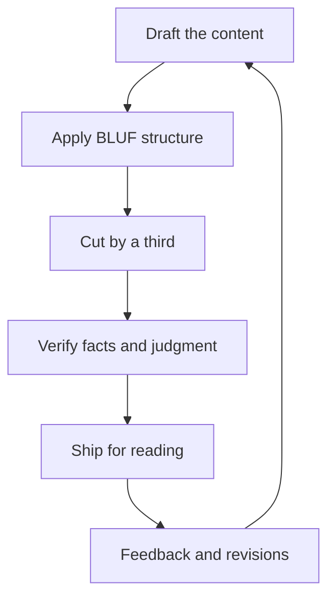

# Written Communication for Managers

> **Core skill:** Writing documents that carry decisions — BLUF-first structure, context, rationale, and implications — plus performance writing that is factual, specific, and defensible.

## Why This Matters

Writing is the manager's durable voice. Meetings evaporate; documents persist. The memo the manager writes about a strategy shift, the performance review that justifies a promotion, the announcement that explains a policy — these outlive the room and get read by people who were not there, including people who will judge the manager's judgment.

Written communication is also the manager's leverage: a well-structured document lets the team absorb context on their own time, turns meetings from presentation into discussion, and creates the record that keeps decisions honest. Poor writing costs the same time but delivers none of it — burying the point, softening the truth, or leaving the reader to reconstruct the decision from fragments.

## The Manager Writing Portfolio

| Document | Purpose | Reader | Frequency |
|----------|---------|--------|-----------|
| Announcements | Change and policy, clearly | The team | As needed |
| Strategy memos | Direction and rationale | Team and stakeholders | Quarterly |
| Performance docs | Assessment and growth | The individual | Per cycle |
| Promotion cases | Evidence for advancement | Reviewers | Per case |
| Stakeholder updates | Status and risk | Leadership | Weekly or monthly |

Each document type has its own discipline, but they share one spine: the reader should never have to work to find the point.

## Writing That Carries Decisions

The BLUF structure — bottom line up front:

| Element | Content | Position |
|---------|---------|----------|
| BLUF | The decision or message in one or two sentences | First |
| Context | The background the reader needs | Second |
| Rationale | Why this decision, why now | Third |
| Implications | What changes, for whom, by when | Fourth |

Example: "We are delaying the reporting upgrade to Q2 — the migration needs the capacity. The migration slips two weeks per month of delay, and Q2 delivery absorbs the impact. Your planning should assume the current timeline holds."

The reader who reads only the first paragraph still gets the decision; the reader who reads everything gets the reasoning. That is the test of the structure.

## Document-Driven Decisions

The memo culture — read first, discuss after:

- The document carries the proposal and its reasoning
- The meeting discusses the document, not the topic from zero
- Decisions reference the document: "Per the migration memo, we proceed"
- The document outlives the discussion as the decision's record

| Meeting Style | Document Style |
|---------------|----------------|
| Present and persuade from scratch | Read first, decide in the room |
| Whoever talks loudest shapes the outcome | The written case shapes the outcome |
| Decisions live in minutes and memory | Decisions live in the document |

The discipline costs the writer time and saves everyone else's — which is exactly the right trade for a manager.

## Performance Writing

Performance documents are legal-grade communication: they will be reread, quoted, and possibly appealed.

| Principle | Example |
|-----------|---------|
| Factual | "Shipped X on date, met the SLO" — not "did great work" |
| Specific | "The review found the caching gap in three incidents" — not "quality issues" |
| Behavior-based | "Repeatedly escalated late, after impact" — not "poor communicator" |
| Patterned | "Three consecutive quarters of missed estimates" — not "one bad quarter" |
| Defensible | Every claim survives a reader asking "what is the evidence?" |

If a performance sentence would embarrass you in an appeal, rewrite it before it ships. The document is not the manager's opinion; it is the evidence with the conclusion attached.

## Writing for Scrolling

The reader's attention is a scarce currency:

- Structure carries the message: headings, short paragraphs, bullets
- Bolding discipline: bold only what must survive a skim
- Tables for comparisons; prose for reasoning
- The first paragraph carries the decision; the rest earns its keep
- Cut ruthlessly: if a sentence does not change anything, delete it

| Weak Pattern | Strong Pattern |
|--------------|----------------|
| A paragraph of preamble | The decision in the first two sentences |
| Walls of text | Headings, bullets, one idea per paragraph |
| Bold everywhere | Bold only on what must not be missed |
| Vague adjectives | Numbers, dates, and named outcomes |

## The Writing Process

- Draft: get the content out, poorly if needed
- Sleep: distance is the cheapest editor
- Cut by a third: the first draft's length is a habit, not a requirement
- Read aloud: the ear catches what the eye forgives
- Ship with the reader's question answered on the first screen

The manager's writing improves in public: each document is a sample of judgment, and the team reads them all.

## AI-Assisted Drafting Ethics

AI drafting is a tool with lines:

- Your judgment: the decisions, trade-offs, and facts are yours to verify
- Your voice: the document reads as you, not as the model
- Your responsibility: you own every claim and implication
- Disclosure where sensitive: performance and personnel writing warrants transparency about assistance
- Never delegate the judgment: a draft is a starting point, not a verdict

The test: if the document were read back to the team, would it sound like you and hold up as yours? Drafting help is fine; authored judgment is not optional.



## Practical Applications

### Writing Checklist

- [ ] The decision or message is in the first two sentences
- [ ] Context, rationale, and implications follow in order
- [ ] Every claim has evidence behind it
- [ ] Bold is reserved for what must survive a skim
- [ ] The draft was cut by a third after a night of distance
- [ ] The document sounds like me and I own every line

### Memo Template

```markdown
## Memo: [Title] — [date]
## Bottom line
- [The decision or message, in two sentences]

## Context
- [What the reader needs to know]

## Rationale
- [Why this decision, why now]

## Implications
- [What changes — for whom, by when]
- [What does not change]

## Follow-up
- [Questions to: owner] — [decisions needed by: date]
```

## Common Pitfalls

| Pitfall | Why It Is a Problem | Better Approach |
|---------|---------------------|-----------------|
| **Burying the point** | Readers skim past the decision | BLUF: decision first |
| **Vague performance writing** | Undefensible claims fail the reader and the appeal | Facts, specifics, behavior, patterns |
| **Preamble prose** | The reader's attention dies before the message | Cut the warm-up; lead with the change |
| **Meeting instead of memo** | The room re-derives what a doc could carry | Document-driven decisions |
| **First draft shipping** | The unedited draft reads as the judgment | Sleep, cut, read aloud |
| **Ghost-written judgment** | AI output without your judgment and voice | Draft with tools; own the document |

## Success Indicators

- Readers can state the decision after a thirty-second skim
- Performance documents survive scrutiny without revision
- Meetings start from documents instead of presentations
- The team quotes your memos accurately months later
- Your writing sounds like you — consistently

## Related Topics

- [[02_Representing_the_Team_Upward]]: representation lives in the written brief
- [[04_Meeting_Facilitation_for_Managers]]: documents feed the meetings that decide
- [[career-path/02_Senior_Software_Engineer/06_Communication_and_Influence/01_Technical_Writing|Technical Writing (Senior)]]: the craft foundation
- [[career-path/02_Senior_Software_Engineer/06_Communication_and_Influence/02_Stakeholder_Communication|Stakeholder Communication (Senior)]]: audience discipline at the individual level

## Summary

Written communication for managers is decision infrastructure: BLUF-first documents that carry context, rationale, and implications; a memo culture where reading precedes discussion; performance writing grounded in facts, specifics, and behavior; structure designed for skimmers; a process of draft, sleep, and cut; and AI assistance bounded by your judgment and voice. The manager's writing is the team's durable memory — and the reader who finds the point in the first paragraph is the reader who trusts the writer.
