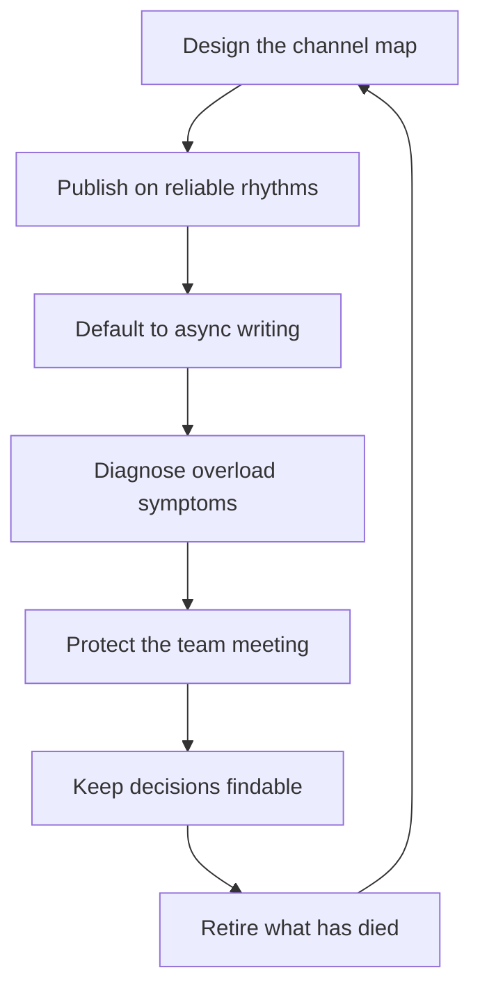

# Communication Rhythms and Channels

> **Core skill:** Designing the team's information system — a channel map that routes each message to its right home, publishing rhythms that never skip, and an overload diagnosis that keeps attention high and noise low.

## Why This Matters

Information flows whether or not it is designed — but undesigned flow produces the classic failures: urgent news buried in a chat thread, decisions scattered across documents no one can find, meetings duplicating what a doc already said, and a team that checks five channels because anything could be anywhere. The cost is not just attention; it is trust. When the team cannot find the truth, it invents it.

The manager's job is to design the system: every message type gets a home, every home gets a rhythm, and the whole map is small enough that the team holds it in their heads. A designed information system makes the right behavior the default — the team stops asking "where do I find this?" and starts asking "what do we decide?"

## The Channel Map

| Message Type | Home | Why |
|--------------|------|-----|
| Urgent | Page or direct call | Interrupts by design, rarely |
| Decisions | Document or decision log | Findable, durable, quotable |
| Discussion | Chat thread | Conversational, searchable |
| Ceremony | Meeting | Shared context and ritual |
| Updates | Published brief | Read on the reader's schedule |
| Questions | Designated channel | Answered once, seen by all |

The map's test: a new joiner can route any message correctly on day one. If the team asks "where does this go?" the map is not designed.

## Publishing Rhythms

| Rhythm | Cadence | Content |
|--------|---------|---------|
| Weekly update | Weekly | Facts, trends, risks, asks |
| Deep-dive | Monthly | One topic, thoroughly |
| Retro and plan | Quarterly | What we learned, what we commit to |

Rhythms are the system's heartbeat: they must run even when nothing is urgent, because their value is in the reliability, not the content. A skipped rhythm is a signal that the manager's discipline has lapsed — and the team notices.

| Rhythm | Rule |
|--------|------|
| Weekly update | Same day, same format, no exceptions |
| Monthly deep-dive | One owner, one topic, published before the meeting |
| Quarterly retro and plan | The team's calendar anchor |

## Async-First Defaults

- Default to writing: a doc or thread before a meeting
- Meetings only for what async cannot do: decisions needing discussion, ceremony, hard news
- Writing quality is a team skill: invest in it — templates, review, examples
- Async discipline: read before the meeting, respond in the thread, never re-decide in the room

Async-first is not anti-meeting; it is meeting protection. The meetings that remain are the ones that genuinely need the room.

## Information Overload Diagnosis

Overload is a system failure, not a user failure:

| Symptom | Likely Cause | Fix |
|---------|--------------|-----|
| Too many channels | No channel map; every project made its own | Consolidate; retire the redundant |
| Too much CC | Fear-driven copying | Define the read list; stop the fear loop |
| Message floods | No publishing rhythm; everything is "urgent" | Rhythms and homes; urgent is scarce by design |
| Repeated questions | Answers not findable | Decision log and archives; point to them |
| Meeting creep | Async not working | Fix the async; audit the meetings |

The diagnosis rule: when the team is drowning, the first question is what is wrong with the system, not what is wrong with the team.

## The Team Meeting Design

The recurring team meeting must justify itself every quarter:

| Element | Design |
|---------|--------|
| Why it exists | Alignment and ceremony — not status updates |
| Agenda pattern | One shared topic, one decision, one learning |
| Not-status-updates | Status lives in the weekly brief; the room is for thinking |
| Participation | Designed voices, not report rotation |
| Cadence | Weekly or biweekly; the same slot, always |

The team meeting is the team's shared space. If it becomes a status theater, the team will send one representative and check out — and the manager will have lost the one room where the whole team breathes together.

## Archives and Findability

Decisions must be findable six months later:

- One decision log, not scattered threads
- Documents named by decision, not by date alone
- The archive is linked from the channel map — one hop from anywhere
- When a question repeats, the answer's home is improved, not just repeated

The findability test: can the team answer "why did we choose this?" in under five minutes? If not, the archive is decoration.

## Retiring Channels and Rituals

Systems accrete; design subtracts:

| Retire When | How |
|-------------|-----|
| A channel duplicates another | Merge; redirect; archive |
| A ritual runs on habit | Kill it; the silence tells you what it was for |
| A document is never read | Delete or fold into the archive |
| A rhythm skips twice | Fix or kill — a broken rhythm is worse than none |

Retirement is announced and clean: the team should never wonder whether a channel still means anything. Dead channels are where rumors breed.



## Practical Applications

### Information System Checklist

- [ ] Every message type has one designated home
- [ ] A new joiner could route any message on day one
- [ ] The weekly update has not skipped this quarter
- [ ] Decisions live in a findable log, one hop from anywhere
- [ ] The team meeting is ceremony and thinking, not status
- [ ] Overload symptoms were diagnosed and fixed this quarter
- [ ] At least one channel or ritual was retired this year

### Channel Map Template

```markdown
## Team Channel Map — [date]
| Message Type | Home | Response Expectation |
|--------------|------|----------------------|
| Urgent | [page/call] | [minutes] |
| Decisions | [decision log] | [n/a] |
| Discussion | [channel] | [hours] |
| Ceremony | [team meeting] | [attendance] |
| Updates | [weekly brief] | [read by Friday] |
| Questions | [channel] | [by end of day] |

## Rhythms
- Weekly update: [day] — format: [brief]
- Monthly deep-dive: [topic owner]
- Quarterly retro and plan: [dates]

## Findability
- Decision log: [link]
- Archive: [link]
```

## Common Pitfalls

| Pitfall | Why It Is a Problem | Better Approach |
|---------|---------------------|-----------------|
| **Channel sprawl** | Messages scatter; nothing is findable | One home per message type |
| **Skipped rhythms** | Reliability dies; the team stops reading | Same day, same format, always |
| **Status-update meetings** | The room wastes the team's best hours | Ceremony and thinking; status goes to the brief |
| **Fear-driven CC** | Inbox noise rises; the real messages drown | Define read lists; stop the loop |
| **Unfindable decisions** | Re-litigation and rumor fill the gap | Decision log, linked from the map |
| **Zombie channels** | Dead channels breed confusion and rumors | Retire loudly and cleanly |

## Success Indicators

- The team routes messages correctly without asking
- Publishing rhythms ran without gaps for a quarter
- The team meeting produces decisions and shared context, not yawns
- Six-month-old decisions are findable in minutes
- The channel map has shrunk or held steady — never grown silently

## Related Topics

- [[01_Cascading_Context_Downward]]: cascades flow through the designed map
- [[04_Meeting_Facilitation_for_Managers]]: the meeting portfolio is part of the system
- [[05_Written_Communication_for_Managers]]: async quality powers the map
- [[02_Team_Formation_and_Health/00_overview|Team Formation and Health]]: information design is team health infrastructure
- [[career-path/02_Senior_Software_Engineer/06_Communication_and_Influence/00_overview|Communication and Influence (Senior)]]: the individual habits this formalizes

## Summary

Communication rhythms and channels are an information system design: a channel map that gives every message one home, publishing rhythms that never skip, async-first defaults that protect meetings, overload diagnosis that fixes systems rather than blaming people, a team meeting that is ceremony and thinking, findable archives, and clean retirement of what has died. The team that knows where truth lives spends its attention on the work — and the manager who designs the system earns that clarity.
