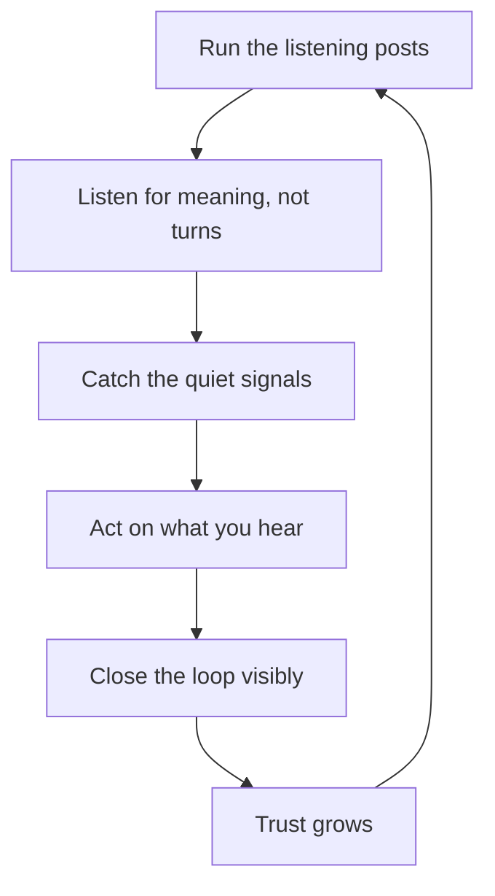

# Listening and Feedback Loops

> **Core skill:** Building ears — listening at the level of meaning, running listening posts that catch the quiet signals, and closing loops visibly so the team knows its voice changes things.

## Why This Matters

Most team problems announce themselves long before they become crises — in a 1:1 that goes quiet, a retro that stops producing, a channel that dies, a pattern of silence around one topic. The manager who hears these signals early intervenes cheaply; the manager who waits for escalation intervenes expensively, or too late.

Listening is not a passive talent; it is an instrument with levels, posts, and calibration. The manager who listens at the level of facts misses the feelings that explain the facts; the manager who listens only in formal settings misses what is said in the hallway. And listening without closing the loop is worse than not listening — it teaches the team that speaking up changes nothing.

## Listening Levels

| Level | What You Hear | What It Misses |
|-------|---------------|----------------|
| Waiting to talk | The pause before your turn | Everything |
| Listening to facts | What happened | Why it matters to them |
| Listening for feelings | The emotional weight | The meaning underneath |
| Listening for meaning | What they are really asking or fearing | Nothing |

The manager's target is the fourth level: hearing the request under the complaint, the fear under the question, the resignation under the silence. Level is a choice, and it can be practiced in every 1:1.

## Listening Posts

| Post | What It Catches | Cadence |
|------|-----------------|---------|
| 1:1s | Individual reality, growth, friction | Weekly |
| Team channel | Day-to-day texture and tone | Continuous |
| Skip-levels | The manager's own blind spots | Quarterly |
| Retro tone | What the team names and what it avoids | Per retro |
| Hallway and DM patterns | The informal signal | Continuous |

The posts work as a system: the formal posts give structure, the informal posts give early warning. A manager who only reads the formal posts hears the filtered version.

## Skip-Level Meetings

Skip-levels are the manager's check on their own representation:

| Element | Design |
|---------|--------|
| Cadence | Quarterly, every report's report |
| Format | Conversation, not review — no managers present |
| Questions | What is working, what is not, what would you change |
| Action | Act on what you hear — visibly, without exposing sources |
| Trust | Nothing said travels back attributed |

The discipline is protection: the skip-level works only if people can speak freely. Act on patterns, not individuals; fix the system, not the messenger.

## Anonymous Feedback Channels

| When They Help | When They Poison |
|----------------|------------------|
| Catching what fear silences | Becoming a complaint inbox with no accountability |
| Surfacing patterns early | Enabling anonymous attacks with no recourse |
| Complementing named feedback | Replacing the courage to speak directly |

Anonymous channels are a diagnostic, not a culture. The goal is a team where the named channel works; the anonymous channel exists for the gap until it does.

## Closing the Loop Visibly

The feedback loop's final stage is the most important:

| Stage | Action |
|-------|--------|
| Hear | The signal arrives through a listening post |
| Act | Something changes, or a reasoned no is given |
| Close | "You said X, we did Y" — in the team's own words, publicly |
| Repeat | The next loop is easier because the last one closed |

The visible close is what converts listening into trust. "You said, we did" said out loud teaches the team that its voice has purchase — and silence after feedback teaches the opposite, permanently.

## Listening for What Is NOT Said

The quiet signals:

| Signal | Possible Meaning |
|--------|------------------|
| A 1:1 goes flat | Disengagement, burnout, or bad news being held |
| A topic gets avoided | Fear, shame, or a landmine someone stepped on |
| One person stops speaking | They spoke and nothing changed — or they are protecting something |
| The retro goes quiet | Trust is gone; the team does not believe the ritual |
| The channel dies | The real conversation moved somewhere you cannot hear |

Silence is data with a lag: by the time it is loud, it is expensive. The manager's job is to notice the pattern early and name it gently: "I have noticed the retros have gone quiet — what changed?"

## Manager Listening Self-Audit

| Question | Honest Answer |
|----------|---------------|
| In my last 1:1, was I waiting for my turn or listening for meaning? | [level] |
| When did I last hear something important from an informal post? | [date] |
| Have I closed a loop visibly this month — you said, we did? | [yes/no] |
| What topic has the team stopped raising? | [name it] |
| What would my team say about my listening? | [ask them] |

The audit runs quarterly, and the hardest question — what has the team stopped saying — is the one that matters most.



## Practical Applications

### Listening Checklist

- [ ] My 1:1s are listening sessions, not status exchanges
- [ ] Skip-levels ran this quarter, with action taken
- [ ] A loop closed visibly this month — you said, we did
- [ ] I have named one quiet signal and asked about it gently
- [ ] Anonymous feedback, where it exists, fed action not noise
- [ ] I asked the team what they would change about my listening

### Loop Log Template

```markdown
## Feedback Loop Log — [quarter]
| Signal | Source Post | Action Taken | Loop Closed |
|--------|-------------|--------------|-------------|
| [X] | [1:1 / skip-level / retro / channel] | [Y] | [date, how] |

## Quiet Signals
- [topic going unspoken] — noticed: [date] — hypothesis: [X] — gentle ask made: [date]

## Self-Audit
- Listening level this quarter: [level]
- Most recent visible close: [date, what]
```

## Common Pitfalls

| Pitfall | Why It Is a Problem | Better Approach |
|---------|---------------------|-----------------|
| **Waiting for the turn** | The meeting becomes your monologue with pauses | Listen for meaning; ask what is underneath |
| **Formal-only ears** | The filtered version is all you hear | Run the informal posts as well |
| **Exposing skip-level sources** | The channel dies the day a source is burned | Act on patterns; never attribute |
| **Listening without closing** | The team learns that speaking changes nothing | Close loops visibly, in their words |
| **Ignoring silence** | Quiet signals arrive late and expensive | Name the silence gently, early |
| **Anonymous poison** | Unaccountable complaints corrode the culture | Keep anonymous diagnostic; build the named channel |

## Success Indicators

- Problems reach you early, through built ears, not escalation
- The team speaks up in forums — and what it says changes things
- Skip-levels produce action the team can name
- The team uses "you said, we did" language back at you
- Silence patterns are caught before they become exits

## Related Topics

- [[01_Cascading_Context_Downward]]: the cascade's landing is verified by listening
- [[03_Difficult_Announcements]]: aftermath listening tells you how it landed
- [[06_Communication_Rhythms_and_Channels]]: listening posts live in the channel map
- [[01_People_Development/00_overview|People Development]]: the 1:1 is the listening instrument
- [[career-path/02_Senior_Software_Engineer/06_Communication_and_Influence/07_Conflict_Resolution|Conflict Resolution (Senior)]]: early listening prevents late conflict

## Summary

Listening and feedback loops are the manager's instrument: listen at the level of meaning, run formal and informal posts as a system, hold skip-levels that protect their sources, keep anonymous channels diagnostic, and close every loop visibly with "you said, we did." The quiet signals — the 1:1 gone flat, the topic avoided, the retro gone silent — are the expensive ones, and the manager who hears them early, and proves the hearing by acting, builds the trust that makes every other communication discipline work.
