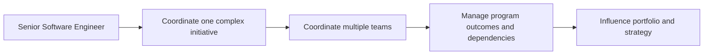

# Technical Program Manager

> **Positioning:** A cross-team delivery path focused on coordinating and driving complex technical initiatives to completion while managing dependencies, risks, decisions, and stakeholder alignment.

## What This Path Is

A Technical Program Manager, or TPM, coordinates initiatives that span multiple teams or systems. The role combines program management with enough technical depth to understand architecture, integration, sequencing, operational risk, and the consequences of technical decisions.

The TPM is not simply a project administrator. The role creates clarity across boundaries: what must happen, who depends on whom, which risks matter, what decisions are blocked, and whether the initiative is still likely to deliver its intended outcome.

## Primary Outcomes

- A coordinated plan for a multi-team technical initiative
- Dependencies and integration risks made visible and actively managed
- Decisions made at the right time by the right people
- Transparent progress, risk, and trade-off communication
- Cross-team delivery that produces the intended business or technical outcome
- Lessons that improve future programs

## Capability Areas

| Capability | TPM behavior | Existing vault anchor |
|---|---|---|
| Program structure | Defines outcomes, workstreams, milestones, and governance | [[PMBOK v8 - Overview]] |
| Technical integration | Understands system boundaries, interfaces, and integration sequence | [[SEBoK v2 - Overview]] |
| Dependency management | Tracks and resolves dependencies across teams and suppliers | [[software-engineering-note/09_Software_Engineering_Management/08_Risk_Management_and_Control]] |
| Risk and issue management | Escalates important uncertainty and coordinates mitigation | [[PMBOK v8 - Overview]] |
| Stakeholder alignment | Creates shared context among technical and business groups | [[BABOK v3 - Overview]] |
| Decision facilitation | Helps the right people make timely, documented decisions | [[software-engineering-note/03_Software_Design/07_Design_Rationale_and_Decisions]] |
| Benefits and outcomes | Keeps delivery connected to value, not only activity completion | [[PMBOK v8 - Overview]] |

## Typical Progression

## Signals for Moving Forward

- You enjoy connecting people, systems, and workstreams.
- You can understand enough technical detail to identify integration risk without taking over implementation.
- You communicate bad news early and help groups decide what to do next.
- You are comfortable coordinating people who do not report to you.
- You measure progress by outcomes, dependencies, and risk reduction, not by meeting volume.

## Evidence to Build

- Program charter
- Integrated roadmap and milestone plan
- Dependency map
- RAID log: risks, assumptions, issues, and decisions
- Technical integration plan
- Governance and escalation model
- Program status report
- Benefits realization review
- Program retrospective

## Nearby Paths

- [[career-path/13_Project_and_Program_Manager/00_overview|Project or Program Manager]]: formal delivery management
- [[career-path/05_Tech_Lead/00_overview|Tech Lead]]: direct technical coordination within a team or system
- [[career-path/11_Engineering_Manager/00_overview|Engineering Manager]]: people and team leadership
- [[career-path/03_Staff_Engineer/00_overview|Staff Engineer]]: cross-team technical influence
- [[career-path/14_Product_Manager/00_overview|Product Manager]]: product outcomes and customer value

## Suggested Future Note Route

1. [[PMBOK v8 - Overview]]
2. [[body-of-knowledge/PMBOK/04_Governance_Performance_Domain]]
3. [[body-of-knowledge/PMBOK/08_Stakeholders_Performance_Domain]]
4. [[body-of-knowledge/PMBOK/10_Risk_Performance_Domain]]
5. [[SEBoK v2 - Overview]]
6. [[body-of-knowledge/System Engineer BOK/06_Technical_Management_Processes]]
7. [[software-engineering-note/09_Software_Engineering_Management/07_Estimation_and_Planning]]
8. [[software-engineering-note/09_Software_Engineering_Management/08_Risk_Management_and_Control]]

## Sources

- [Engineering Ladders: Technical Program Manager](https://www.engineeringladders.com/TechnicalProgramManager.html)
- [PMI: The Standard for Program Management, Fifth Edition](https://www.pmi.org/standards/program-management-fifth-edition)
- [[PMBOK v8 - Overview]]
- [[SEBoK v2 - Overview]]

## Related

- [[00_Career_Path_Overview]]
- [[career-path/02_Senior_Software_Engineer/00_overview|Senior Software Engineer]]
- [[career-path/11_Engineering_Manager/00_overview|Engineering Manager]]
- [[career-path/13_Project_and_Program_Manager/00_overview|Project and Program Manager]]
