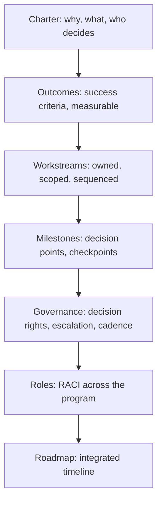

# Program Structure and Charter

> **Core capability:** The TPM defines the program's shape — outcomes, workstreams, milestones, governance, and the charter that gives the initiative legitimacy, scope, and decision rights.

## Why This Matters

Multi-team initiatives fail most often before any code is written: unclear outcomes, nobody knows who decides, teams assume different scope boundaries, and the program drifts because it was never chartered. The TPM's first job is structural clarity — a program charter that answers what we are doing, why, who decides, and what success looks like — and a workstream structure that makes the work manageable and ownable.

Without structure, coordination is reactive firefighting. With it, teams can coordinate through the structure rather than through the TPM personally — which is the definition of a program that scales.

## Topics in This Capability Area

| Topic | Core Skill | When It Matters |
|-------|------------|-----------------|
| [[01_Program_Charter]] | Writing the charter that legitimizes and scopes the initiative | Program initiation |
| [[02_Outcome_Definition_and_Success_Criteria]] | Defining measurable outcomes, not just deliverables | Before any planning |
| [[03_Workstream_Decomposition]] | Breaking the program into owned, manageable workstreams | Program design |
| [[04_Milestone_Planning]] | Sequencing key moments and decision points | Program planning |
| [[05_Governance_Structure]] | Designing decision rights, escalation paths, and review cadence | Program setup |
| [[06_Program_Organization_and_Roles]] | Defining RACI across teams, sponsors, and stakeholders | Team formation |
| [[07_Program_Roadmap_and_Sequencing]] | Integrating workstream plans into a coherent program timeline | Planning and replanning |

## The Program Structure Framework

Structure is fractal — every workstream gets the same treatment.

## Practical Applications

### Program Charter Checklist

- [ ] Program purpose and expected outcomes are stated in one paragraph
- [ ] Scope is bounded: what is in, what is explicitly out
- [ ] Decision rights are named: who decides architecture, scope, schedule, budget
- [ ] Governance cadence is defined: steering committee, program reviews, team syncs
- [ ] Workstreams are decomposed with named leads and clear interfaces
- [ ] Key milestones have dates, decision gates, and owners

## Common Pitfalls

| Pitfall | Why It Is a Problem | Better Approach |
|---------|---------------------|-----------------|
| **Charter-as-email** | No formal agreement; scope creeps immediately | Written charter, sponsor-signed, visible to all |
| **Activity-as-outcome** | Success measured by things done, not value created | Define outcomes in terms of changed state |
| **Governance-by-surprise** | Decisions escalate unpredictably | Pre-defined decision rights and escalation paths |

## Success Indicators

- Every team can state the program's outcome in one sentence
- Decision rights are exercised without re-litigation
- Workstream leads operate within their charter autonomously
- The roadmap survives the first quarter with adjustments, not abandonment

## Related Capabilities

- [[02_Technical_Integration_and_Architecture/00_overview|Technical Integration and Architecture]]: structure drives integration planning
- [[03_Dependency_Management/00_overview|Dependency Management]]: workstream decomposition reveals dependencies
- [[career-path/05_Tech_Lead/04_Team_Delivery_and_Execution_Leadership/00_overview|Delivery and Execution Leadership (Tech Lead)]]: the team-level counterpart
- [[career-path/13_Project_and_Program_Manager/00_overview|Project and Program Manager]]: the formal PM discipline

## Summary

Program structure is the TPM's foundation: a charter that legitimizes the initiative, outcomes defined before workstreams, governance that names decision rights before they are needed, and a roadmap that integrates multiple team plans into one coherent timeline. Programs fail in structure before they fail in execution — the TPM prevents that.