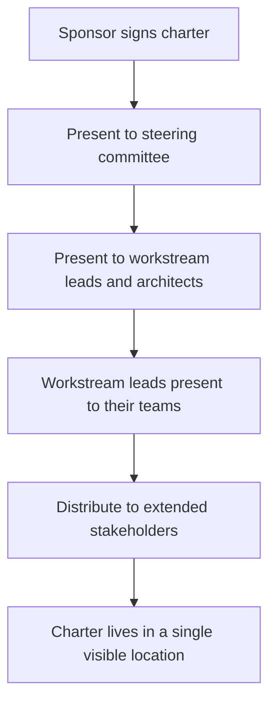

# Program Charter

> **Core skill:** Writing the charter that legitimizes the program — purpose, outcome, scope, decision rights, and governance — and getting sponsor sign-off so the program starts with authority, not ambiguity.

## Why This Matters

Programs without charters are programs that drift. Without a written charter, every scope decision is a negotiation from scratch, every resource conflict escalates sideways, and the program's reason for existing gets reinterpreted by whoever speaks loudest in the room. The charter is the program's constitution: it answers "why are we doing this, what are we doing, and who decides" before those questions turn into disputes.

A signed charter does more than document — it transfers authority. The sponsor's signature says the program is real, resources are committed, and the TPM has the mandate to coordinate across organizational boundaries. Programs that start with charter sign-off survive their first scope challenge; programs that start with an email do not.

## Charter Anatomy

Every program charter answers seven questions. If any is missing, the charter is incomplete and the gap will surface as a conflict later.

| Section | Question It Answers | Why It Matters |
|---------|---------------------|----------------|
| **Purpose** | Why does this program exist? What problem or opportunity does it address? | Aligns stakeholders on the reason, not just the ask |
| **Outcome** | What state will exist when the program succeeds? | Defines success in changed-state terms, not activity terms |
| **Scope** | What is in scope? What is explicitly out of scope? | Prevents scope creep by naming the boundary before the pressure starts |
| **Decision Rights** | Who decides architecture, scope changes, schedule adjustments, and budget? | Prevents governance-by-surprise and escalation chaos |
| **Governance** | What forums exist, what is their authority, what is their cadence? | Creates predictable decision-making rhythm |
| **Resources** | What people, teams, and budget are committed? | Makes capacity allocation visible and accountable |
| **Risks and Constraints** | What known risks and hard constraints bound the program? | Surfaces assumptions before they become blockers |

The charter is as long as it needs to be and no longer. A program charter that runs past four pages has drifted into planning territory. The planning documents — roadmap, milestone schedule, RACI — are separate artifacts that the charter authorizes but does not contain.

## Sponsor Sign-Off

The charter is not done until the sponsor signs it. Sign-off is not a rubber stamp — it is the moment the sponsor formally accepts accountability for the program's existence and resource commitment.

| Step | What Happens | TPM's Role |
|------|-------------|------------|
| **Draft** | The TPM writes the charter from discovery interviews with stakeholders and sponsor | Owns the draft; ensures every section is answered |
| **Review** | Sponsor and key stakeholders read, comment, and suggest changes | Facilitates the review; resolves conflicting input |
| **Align** | A meeting where remaining ambiguities are resolved in the room | Runs the meeting; captures decisions in real time |
| **Sign** | Sponsor signs; the charter is published to all program participants | Ensures the signed charter is the single source of truth |

A sponsor who hesitates to sign is raising a legitimate signal. The TPM treats hesitation as diagnostic: which section is the sponsor not ready to commit to? Address that section; do not proceed without resolution. A program that launches with an unsigned charter is a program whose sponsor has reserved the right to disown it later.

## Communicating the Charter

Signing is not communicating. The charter must reach every person whose work or priorities it affects. The TPM runs a deliberate communication cascade.



The charter is not a secret document. It lives in a shared location — wiki, document store, program homepage — where any participant can reference it. Every scope conversation begins by pointing at the charter's scope section. Every escalation begins by pointing at the charter's decision rights section.

## The Charter as a Living Document

The charter is not frozen. It changes when the program's context changes, but it changes deliberately — never through drift.

| Trigger | Example | Response |
|---------|---------|----------|
| **Outcome shift** | Leadership redefines what success means | Re-charter: new sponsor sign-off on revised outcome and scope |
| **Resource change** | A committed team is reassigned | Charter amendment: update resource section, re-sign |
| **Scope expansion** | A new stakeholder with authority demands inclusion | Charter amendment or re-charter depending on magnitude |
| **Organizational change** | Reorganization moves teams or changes sponsorship | Re-charter if the sponsor changes; amendment if reporting lines shift |

The TPM maintains a charter version history. Every change is dated, attributed, and communicated through the same cascade that launched the original charter. A charter that drifts without version control is worse than no charter — it pretends to have authority while the ground has already shifted.

## When to Re-Charter

Re-chartering is the nuclear option: tear up the old charter and write a new one. It is the right response when the program's fundamental premise has changed, and patching the old charter would create a document that contradicts itself.

| Situation | Action |
|-----------|--------|
| Sponsor changes and new sponsor redefines purpose | Re-charter |
| Outcome redefined by executive decision | Re-charter |
| Scope expands beyond 30 percent of original | Re-charter |
| Program absorbed into a larger initiative | Re-charter or close |
| Team structure reorganized across the program | Amendment, not re-charter |
| Milestones shift but outcome holds | Amendment, not re-charter |

Re-chartering resets the program's legitimacy. The TPM archives the old charter with a close note explaining why it was replaced, then runs the full charter process — draft, review, align, sign, communicate — with the new premise as the starting point.

## Practical Applications

**Charter launch checklist:**

- [ ] Purpose is stated in one paragraph that any team member can repeat
- [ ] Outcome is defined as a changed state, not a list of deliverables
- [ ] Scope section has an explicit "out of scope" sub-section with at least three items
- [ ] Decision rights are named: architecture owner, scope change authority, schedule owner, budget authority
- [ ] Governance cadence is specified: steering committee frequency, program review frequency, team sync frequency
- [ ] Sponsor has signed and the signed copy is published
- [ ] Communication cascade is complete: every workstream lead has presented to their team
- [ ] Charter location is known and linked from every program artifact

**Charter section template:**

```markdown
## Purpose
[One paragraph: what problem or opportunity, why now, what happens if we do nothing]

## Outcome
[One paragraph: the changed state that defines success — observable, measurable]

## Scope
### In Scope
- [Item 1]
- [Item 2]

### Out of Scope
- [Item 1]
- [Item 2]

## Decision Rights
| Decision Area | Decision Maker | Consulted | Informed |
|---------------|---------------|-----------|----------|
| Architecture   | [Name/Role]   | [Names]   | [Names]  |
| Scope Change   | [Name/Role]   | [Names]   | [Names]  |
| Schedule       | [Name/Role]   | [Names]   | [Names]  |
| Budget         | [Name/Role]   | [Names]   | [Names]  |

## Governance
| Forum | Frequency | Authority | Membership |
|-------|-----------|-----------|------------|
| Steering Committee | [Cadence] | [Decision scope] | [Members] |
| Program Review     | [Cadence] | [Decision scope] | [Members] |

## Resources
- Teams committed: [list]
- Key roles: [list]
- Budget: [amount or reference]

## Risks and Constraints
- [Known risk 1]
- [Hard constraint 1]
```

## Common Pitfalls

| Pitfall | Why It Is a Problem | Better Approach |
|---------|---------------------|-----------------|
| **Charter as email thread** | No formal agreement; scope creeps from day one; no single source of truth | Written charter in a single document, signed, published |
| **Outcome section lists deliverables** | The charter defines success as "build X" instead of "achieve Y state" | Write the outcome as the changed state the deliverables enable |
| **No "out of scope" section** | Every unstated exclusion becomes a future scope argument | Name at least three explicit exclusions at charter time |
| **Decision rights left vague** | Every decision escalates to the sponsor; the program chokes on governance latency | Name the decider for architecture, scope, schedule, and budget explicitly |
| **Sponsor sign-off skipped** | The program has no authority; resource commitments are soft and revocable | Require sponsor signature before the program is declared launched |
| **Charter written but never communicated** | Teams operate on assumptions, not the charter; the document is irrelevant | Run the communication cascade methodically; verify teams received and understood |

## Success Indicators

- Every workstream lead can state the program's purpose and outcome in one sentence
- Scope challenges are resolved by referencing the charter's scope section, not by escalating
- Decision rights are exercised at the level named in the charter without re-litigation
- The charter version history shows deliberate amendments, not silent drift
- Sponsor references the charter when communicating about the program externally

## Related Topics

- [[02_Outcome_Definition_and_Success_Criteria]]: the outcome section written in detail
- [[05_Governance_Structure]]: the governance framework the charter authorizes
- [[06_Program_Organization_and_Roles]]: the roles and decision rights the charter names
- [[career-path/13_Project_and_Program_Manager/00_overview|Project and Program Manager]]: the formal discipline that informs charter practice

## Summary

The program charter is the program's constitution: purpose, outcome, scope, decision rights, governance, resources, and risks in a single signed document. It transfers authority from sponsor to program, creates a single source of truth for every scope and governance question, and establishes the TPM's mandate to coordinate across organizational boundaries. A program without a signed charter is a program without a foundation — it will drift until someone writes one, or until it dies from ambiguity.