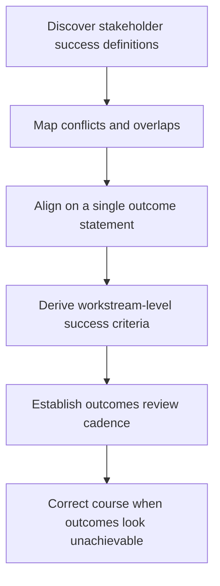

# Outcome Definition and Success Criteria

> **Core skill:** Defining program outcomes as changed states — not activities, not outputs — with measurable success criteria that create alignment across stakeholders and give the program a finish line.

## Why This Matters

Programs are funded to change something: a metric moves, a user behavior shifts, a cost drops, a risk is retired. But most program documents describe what will be built, not what will be different when it is built. When success is defined as launch, the program succeeds the moment something ships — regardless of whether anything actually improved. That is how organizations spend millions and wonder why nothing changed.

The TPM's outcome definition work is the program's steering mechanism. A well-defined outcome tells every workstream what good looks like, allows stakeholders to align on a shared definition of success, and creates a finish line that the program crosses — or does not cross — honestly. Without it, the program is a collection of projects that may or may not add up to anything.

## Outcome vs Output vs Benefit

The distinction is not semantic. Confusing these three is how programs claim success while delivering no value.

| Term | Definition | Example | Measured By |
|------|------------|---------|-------------|
| **Output** | What the program produces — a system, a feature, a document, a process change | A new payment platform is deployed to production | Delivery metrics: on time, on budget, meets spec |
| **Outcome** | The changed state the output enables — what is different for users, the business, or the system | Checkout abandonment drops from 42 percent to 28 percent | Business or user metrics measured before and after |
| **Benefit** | The value the outcome creates — revenue, cost savings, risk reduction, strategic position | Annual revenue increase of 4.2 million from recovered abandoned carts | Financial or strategic impact, often measured post-program |

Outputs are the program's deliverable. Outcomes are the program's success. Benefits are why the program was funded. The TPM defines outcomes at charter time, tracks outputs during execution, and ensures benefits measurement is designed into the program — even if measurement extends past the program's close.

## SMART Criteria at Program Scale

SMART criteria work at the program level when adapted for multi-team, multi-quarter scope. The standard definition needs stretching.

| Criterion | Standard Definition | Program-Scale Adaptation | Example |
|-----------|--------------------|--------------------------|---------|
| **Specific** | Clear and unambiguous | Specific enough that every workstream can derive its own metrics from it | "Merchant onboarding time drops from 14 days to 3 days" |
| **Measurable** | Quantifiable | Measurable with instrumentation that exists or is built into the program scope | Conversion rate measured by analytics pipeline built in workstream 2 |
| **Achievable** | Realistic given constraints | Achievable given the program's scope, timeline, and committed resources | A 50 percent reduction when the program scope covers the entire funnel |
| **Relevant** | Aligned with organizational goals | Relevant to the sponsor's OKRs and the funding rationale | Tied to the company's stated annual revenue target |
| **Time-bound** | Has a deadline | Time-bound at the outcome level, with intermediate milestones for progress measurement | "By Q3, measured 90 days post-launch to allow behavioral change to settle" |

Program outcomes often require multiple measurement points: an immediate post-launch measurement to confirm the output works, and a delayed measurement to confirm the outcome materialized. The TPM builds both into the program timeline.

## Stakeholder Alignment on Outcomes

Different stakeholders want different outcomes from the same program. The TPM's job is to surface those differences early — before workstreams build toward conflicting definitions of success.



| Stakeholder | Typical Outcome Bias | TPM's Alignment Move |
|-------------|---------------------|----------------------|
| **Sponsor** | Revenue, cost, strategic position | Translate into measurable metrics the program can influence |
| **Engineering** | System health, scalability, technical debt reduction | Ensure technical outcomes are explicit and valued, not assumed |
| **Product** | User behavior, adoption, engagement | Align product metrics with program-level outcome measurement |
| **Operations** | Reliability, support burden, incident rate | Build operational outcomes into the success criteria from the start |
| **Compliance/Legal** | Risk reduction, audit readiness, regulatory compliance | Make compliance outcomes measurable, not binary-pass-fail at the end |

The alignment session is a working meeting — not a presentation. The TPM brings a draft outcome statement, walks the room through each stakeholder's version of success, maps the overlaps and conflicts, and drives toward a single outcome statement everyone can commit to. Statements that cannot be reconciled become explicit trade-offs: "we are optimizing for adoption in the first quarter, with reliability targets relaxing by 0.5 nines until Q2."

## The Outcomes Review Cadence

Outcomes are not measured once at the end. The TPM builds a review cadence that checks whether the program is still on track to achieve its outcomes — and whether the outcomes themselves are still the right ones.

| Review | Frequency | Purpose | What Gets Examined |
|--------|-----------|---------|-------------------|
| **Outcome health check** | Monthly | Are leading indicators moving in the right direction? | Proxy metrics, early signals, workstream progress against outcome-aligned milestones |
| **Outcome gate review** | At major milestones | Does the current trajectory support the outcome? Go/no-go on program continuation | Full outcome measurement against baseline, risk to outcome achievement |
| **Outcome redefinition** | On trigger | Has the outcome become irrelevant or unachievable? | Sponsor direction change, external market shift, resource loss that makes the outcome impossible |

The TPM runs outcome health checks as part of the program review cadence. A health check that shows leading indicators moving the wrong way triggers a deeper investigation — not a program pause, but a signal that the program's theory of change may be wrong. Gate reviews are decision points: continue, adjust scope, or stop. The sponsor owns the gate decision; the TPM owns the evidence that informs it.

## Leading vs Lagging Indicators

Program outcomes are lagging — they materialize after the work is done. The TPM defines leading indicators that predict whether the outcome is on track while there is still time to adjust.

| Outcome (Lagging) | Leading Indicator | Measurement Frequency | Action if Off Track |
|--------------------|-------------------|-----------------------|---------------------|
| Checkout abandonment drops from 42 percent to 28 percent | User completion rate in integration test environment | Weekly during integration | Investigate UX friction; escalate to product |
| Merchant onboarding time drops from 14 days to 3 days | Average onboarding step duration in beta with 5 pilot merchants | Biweekly during beta | Identify bottleneck step; adjust process or tooling |
| System handles 10x peak load | Load test results at 50 percent, 80 percent, and 100 percent of target | At each integration milestone | Add capacity; re-architect bottleneck component |
| Zero critical security findings in post-launch audit | Security review findings per component during development | Per workstream delivery | Fix before component integration; do not defer to end |

Leading indicators are the TPM's early-warning system. Every program outcome should have at least one leading indicator with a defined measurement method, frequency, and owner.

## Practical Applications

**Outcome definition checklist:**

- [ ] Outcome is stated as a changed state, not as a deliverable or activity
- [ ] Outcome has a baseline measurement from before the program started
- [ ] Outcome has a target measurement and a date by which it will be measured
- [ ] Every workstream can trace its scope to at least one program outcome
- [ ] Leading indicators are defined for every outcome with measurement method and owner
- [ ] Stakeholder alignment session has been conducted and conflicts are resolved
- [ ] Outcomes review cadence is built into the program governance calendar

**Outcome statement template:**

```markdown
## Program Outcome
[Measurable changed state] by [date], measured by [method], from a baseline of [current state].

## Success Criteria
| Criterion | Baseline | Target | Measurement Method | Measurement Date |
|-----------|----------|--------|--------------------|------------------|
| [Criterion 1] | [Value] | [Value] | [Method] | [Date] |
| [Criterion 2] | [Value] | [Value] | [Method] | [Date] |

## Leading Indicators
| Indicator | Current | Target Trend | Owner | Check Frequency |
|-----------|---------|-------------|-------|-----------------|
| [Indicator 1] | [Value] | [Direction] | [Name] | [Cadence] |
```

## Common Pitfalls

| Pitfall | Why It Is a Problem | Better Approach |
|---------|---------------------|-----------------|
| **"Success = launch"** | The program claims victory the moment something ships; the outcome may never materialize | Define success as the changed state; launch is a milestone, not the outcome |
| **Outcome too vague to measure** | "Improve user experience" is a wish, not a criterion; nobody knows when it is done | Make it specific: "Reduce average task completion time from 4 minutes to 90 seconds" |
| **No baseline measurement** | Without a baseline, you cannot prove the program changed anything | Measure the current state before the program starts; if you cannot, build measurement into the first workstream |
| **Outcomes defined without stakeholders** | The TPM's definition is irrelevant if the sponsor and stakeholders use different definitions | Run the alignment session; do not proceed until outcome is agreed |
| **Measuring only at the end** | You discover the outcome was unachievable when the program is over and resources are gone | Build leading indicators and monthly health checks into the governance cadence |
| **Confusing outputs with outcomes** | Milestone completion is reported as outcome progress; the real outcome may be diverging silently | Track outputs and outcomes separately; link them but do not conflate them |

## Success Indicators

- Every program participant can state the program's outcome in one sentence that matches the charter
- Stakeholders use the same success criteria in their own planning and reviews
- Leading indicators provide actionable signal at least one quarter before the outcome measurement date
- Outcome health checks surface trajectory problems early enough for the program to adjust
- The program's close report measures outcomes against the charter's stated criteria, not just delivery milestones

## Related Topics

- [[01_Program_Charter]]: the outcome is the charter's centerpiece
- [[04_Milestone_Planning]]: milestones are checkpoints on the path to the outcome
- [[07_Benefits_and_Outcome_Measurement/00_overview|Benefits and Outcome Measurement]]: measuring benefits after the program closes
- [[05_Stakeholder_Alignment/00_overview|Stakeholder Alignment]]: the alignment work that makes outcomes shared
- [[career-path/13_Project_and_Program_Manager/00_overview|Project and Program Manager]]: the benefits-realization discipline PMs bring

## Summary

Outcome definition is the TPM's steering wheel: define success as the changed state the program exists to create, measure it with SMART criteria adapted to program scale, align stakeholders on a single definition before workstreams begin, and build a review cadence that checks trajectory — not just at the end but continuously. A program with a clear outcome knows when it is done; a program without one never finishes, it just stops.