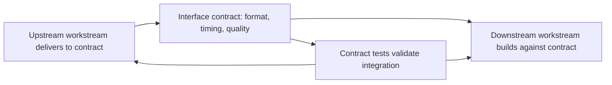

# Workstream Decomposition

> **Core skill:** Breaking program scope into owned, manageable workstreams with clear charters, defined interface contracts, and named leads — so that coordination happens through the structure, not through the TPM personally.

## Why This Matters

A program is too large for one team and too interconnected for independent teams with no structure. The TPM's decomposition work turns an amorphous scope into a set of workstreams that teams can own, execute, and integrate. Decomposition is not just about breaking work into pieces — it is about creating a structure where each piece has clear ownership, clear boundaries, and clear interfaces to the pieces around it.

Bad decomposition creates workstreams that overlap in scope, step on each other's dependencies, or leave gaps that nobody owns. Good decomposition creates workstreams that operate with autonomy within their charter and coordinate only at defined interface points. The TPM's goal is to make the structure do the coordination work so the TPM does not have to be the coordination work.

## Principles of Workstream Decomposition

Workstreams are not arbitrary slices. They follow principles that maximize ownership, minimize coordination overhead, and align with organizational reality.

| Principle | What It Means | Test |
|-----------|---------------|------|
| **Ownable** | One team or lead can own the workstream end to end | Can you name one person accountable for this workstream's outcome? |
| **Coherent** | The work within the workstream belongs together — shared domain, shared technology, shared user journey | Would splitting this workstream create more coordination than combining it? |
| **Bounded** | The workstream's scope has clear edges; what is in and what is out are explicit | Can the workstream lead describe their boundary in one sentence? |
| **Autonomous** | The workstream can make most decisions and execute most work without cross-workstream coordination | What percentage of the workstream's tasks require another workstream's output? |
| **Integrable** | The workstream produces outputs that connect to other workstreams at defined, stable interfaces | Are the interface points named, contracted, and owned? |
| **Right-sized** | The workstream fits the available team's capacity and timeline | Can the assigned team deliver this scope within the program timeline? |

A workstream that violates multiple principles is a decomposition failure. The most common failures are under-bounded workstreams — nobody knows where the edges are — and over-coupled workstreams — every task requires coordination with another workstream.

## The Workstream Charter

Every workstream gets a mini-charter. It is the same structure as the program charter, scaled down.

| Section | Program Charter | Workstream Charter |
|---------|-----------------|--------------------|
| Purpose | Why the program exists | Why this workstream exists within the program |
| Outcome | Changed state the program achieves | Changed state this workstream delivers to the program |
| Scope | What the program includes and excludes | What this workstream builds and does not build |
| Decision Rights | Who decides architecture, scope, schedule, budget | Who decides technical approach, scope trades, sequencing within the workstream |
| Dependencies | Not in charter; tracked separately | Upstream inputs this workstream needs, downstream consumers of its outputs |
| Milestones | Program-level decision gates and commitments | Workstream-level deliverables and integration points |
| Team | Key roles and resource commitments | Named team members, workstream lead, technical owner |

The TPM does not write every workstream charter. The workstream lead writes the charter; the TPM reviews it for coherence with the program charter and for interface consistency with adjacent workstreams. A workstream charter that contradicts the program charter or another workstream's charter is a defect the TPM catches and resolves before execution begins.

## Interface Contracts Between Workstreams

The interface contract is the agreement between two workstreams about what each will provide and consume. Without contracts, integration is guesswork; with them, workstreams integrate against a known specification.



| Contract Element | What It Specifies | Example |
|-----------------|-------------------|---------|
| **Data contract** | Schema, format, semantics, validation rules of data exchanged | "The Payment API accepts a JSON payload matching schema v2.1 at POST /authorize" |
| **Timing contract** | When the upstream workstream delivers and what availability SLAs apply | "Merchant service available for integration testing by milestone M2; 99 percent uptime during beta" |
| **Quality contract** | Acceptable defect rates, performance thresholds, error handling expectations | "Response time under 200ms at p95; error rate below 0.1 percent; all errors return standard error codes" |
| **Behavioral contract** | Expected system behavior at the interface — what happens in edge cases | "Duplicate authorization requests are idempotent; timeout after 30 seconds triggers fallback" |
| **Change contract** | How the contract evolves: who can change it, notification period, versioning | "Schema changes require 2-week notice; breaking changes require program-level approval" |

Interface contracts are living documents. The TPM ensures every interface between workstreams has a contract, that both workstream leads have agreed to it, and that contract changes follow the agreed change process.

## The Workstream Lead Role

The workstream lead owns a workstream the way the TPM owns the program. The TPM's relationship with workstream leads is the program's backbone.

| Responsibility | Workstream Lead Owns | TPM Supports |
|----------------|---------------------|-------------|
| Workstream charter | Writes and maintains | Reviews for program coherence |
| Workstream plan | Builds and tracks | Integrates into program roadmap |
| Team execution | Runs daily standups, unblocks team, manages workstream risks | Escalation target for risks the workstream cannot resolve |
| Interface compliance | Ensures workstream meets its interface contracts | Facilitates cross-workstream negotiation when contracts need to change |
| Stakeholder reporting | Reports workstream status | Aggregates into program-level reporting |
| Scope changes | Proposes workstream scope changes | Approves or escalates; ensures program-level coherence |

The workstream lead is the TPM's primary operating partner. A program with strong workstream leads is manageable; a program without them is a program where the TPM is doing every job. The TPM invests early in clarifying the workstream lead role and ensuring every lead has the authority and context to operate autonomously.

## Scope Boundaries Between Workstreams

The most common decomposition failure is unclear or overlapping scope boundaries. The TPM actively manages boundaries to prevent gaps and overlaps.

| Boundary Problem | Symptom | TPM's Response |
|-----------------|---------|----------------|
| **Overlap** | Two workstreams claim the same component or user journey | Clarify ownership; explicitly assign the disputed scope to one workstream and remove it from the other |
| **Gap** | A required capability is not claimed by any workstream | Identify the gap; create a new workstream, expand an existing one, or negotiate scope with the sponsor |
| **False boundary** | Two workstreams are so coupled they cannot operate independently | Merge them or redesign the decomposition to create a genuine interface |
| **Organizational mismatch** | Workstream boundaries do not align with team boundaries | Align workstreams to teams, or negotiate team realignment; a workstream that spans teams creates coordination overhead for every task |

The TPM maintains a scope map — a visual or tabular representation of every workstream's scope — and reviews it with workstream leads at program initiation and at every major milestone. A scope gap discovered during integration testing is a decomposition failure; the TPM catches gaps at the map level before execution.

## Practical Applications

**Workstream decomposition checklist:**

- [ ] Every workstream has a named lead who accepts accountability
- [ ] Every workstream has a written charter consistent with the program charter
- [ ] Every interface between workstreams has a documented contract agreed by both sides
- [ ] Scope boundaries are mapped; no overlaps, no gaps
- [ ] Every workstream lead can describe their scope in one sentence
- [ ] Workstream autonomy is tested: what percentage of tasks require cross-workstream coordination?
- [ ] Organizational alignment: workstream boundaries match team boundaries

**Interface contract template:**

```markdown
## Interface: [Upstream Workstream] to [Downstream Workstream]

### Data Contract
- Format: [e.g., JSON over HTTPS, gRPC protobuf, Avro on Kafka]
- Schema: [link to schema definition]
- Validation: [rules for valid and invalid inputs]

### Timing Contract
- Available for integration: [date]
- Availability SLA: [e.g., 99.5 percent during business hours]
- Latency SLA: [e.g., p95 under 200ms]

### Quality Contract
- Acceptable error rate: [percentage]
- Error handling: [standard error format, retry semantics]
- Performance threshold: [target and measurement method]

### Change Process
- Non-breaking changes: [notice period, approval process]
- Breaking changes: [notice period, approval process, versioning strategy]
- Contract owner: [name, workstream lead from upstream side]
```

## Common Pitfalls

| Pitfall | Why It Is a Problem | Better Approach |
|---------|---------------------|-----------------|
| **Workstreams by org chart only** | Work that should be together is split because teams are split; coordination multiplies | Decompose by coherence first, then align to teams; challenge the org structure if it produces bad decomposition |
| **No interface contracts** | Every integration is a surprise; downstream workstreams build against assumptions that break at integration time | Define and agree on contracts before any downstream workstream begins building |
| **Workstream leads without authority** | Leadership assigns a name but not the decision rights; the lead escalates everything | Clarify decision rights in the workstream charter; sponsor reinforces the lead's authority |
| **Scope boundaries left implicit** | Overlaps and gaps surface during execution when they are expensive to fix | Map scope boundaries explicitly; review with all leads at program initiation |
| **Too many workstreams** | Coordination overhead exceeds execution throughput; the TPM becomes a full-time coordinator | Decompose to the minimum number of workstreams that can own coherent scope; combine small ones |
| **Giant workstreams** | A single workstream consumes most program resources; it is a program within a program without its own TPM | Sub-decompose large workstreams; assign the sub-workstream lead role explicitly |

## Success Indicators

- Workstream leads operate autonomously; TPM involvement is by exception, not by default
- Interface contracts are referenced during integration, not challenged
- Scope disputes between workstreams are resolved by referencing charters and scope maps
- No scope gaps are discovered after the program moves into execution
- Every workstream lead reports progress in terms of their workstream charter's outcome, not just task completion

## Related Topics

- [[01_Program_Charter]]: the program charter that workstream charters derive from
- [[04_Milestone_Planning]]: milestones that align workstream timelines
- [[02_Technical_Integration_and_Architecture/00_overview|Technical Integration and Architecture]]: interface contracts are the integration plan's foundation
- [[03_Dependency_Management/00_overview|Dependency Management]]: dependencies between workstreams drive the dependency management plan
- [[06_Program_Organization_and_Roles]]: the workstream lead role in the broader program organization

## Summary

Workstream decomposition is the TPM's structural design work: break the program into ownable, coherent, bounded workstreams; give every workstream a charter, a named lead with authority, and clear interface contracts with adjacent workstreams; map scope boundaries to catch gaps and overlaps before execution begins. A well-decomposed program coordinates through its structure — workstream leads manage within their boundaries, interface contracts manage between them, and the TPM manages the whole.