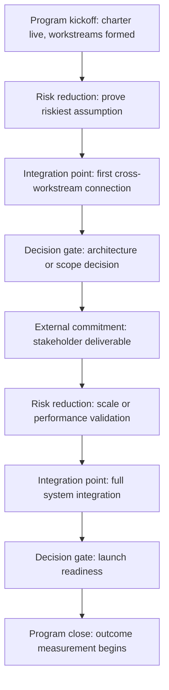

# Milestone Planning

> **Core skill:** Designing a milestone-driven program cadence where every milestone earns its place — external commitments, integration points, decision gates, and risk reduction — and every milestone is honest about what it represents.

## Why This Matters

Programs without milestones run on hope. The calendar advances and teams report "on track" until the moment they are not — and then everyone is surprised. Milestones create accountability points where the program proves to itself and its stakeholders that it is where it claims to be.

But milestones are only as good as their design. A milestone that just says "Phase 2 complete" measures nothing. A milestone that is always green is not a milestone — it is a decoration. The TPM designs milestones that expose truth: external commitments the program must meet, integration points where components meet for the first time, decision gates where the program chooses its next move, and risk-reduction milestones that retire uncertainty before it can kill the program.

## Four Types of Program Milestones

Every program milestone falls into one of four categories. The TPM ensures the program has enough of each type — and that no type is missing.

| Type | Purpose | Example | What Makes It Honest |
|------|---------|---------|---------------------|
| **External commitment** | A date promised to someone outside the program | "Regulatory filing deadline: September 15" | The date is real and immutable; missing it has consequences the program cannot absorb |
| **Integration point** | Two or more workstreams connect their work for the first time | "Payment service integrates with merchant onboarding in staging" | Both sides have something real to connect; integration is testable and verifiable |
| **Decision gate** | The program makes a significant choice about scope, architecture, or continuation | "Architecture decision: monolith vs microservices for the order engine" | The decision is framed, options are documented, decider is named, and the program acts on the result |
| **Risk reduction** | A known uncertainty is retired through evidence | "Load test at 80 percent of target throughput completes successfully" | The risk was named before the milestone; the milestone produces data that proves the risk is resolved or still present |

A program with only external commitment milestones is reactive. A program with only decision gate milestones has no delivery cadence. The TPM balances all four types so the program rhythm is predictable and informative.

## Milestone Sequencing

Milestones do not sit at equal intervals. They cluster where risk concentrates, where workstreams intersect, and where decisions must precede investment.



The TPM sequences milestones to create progressive confidence. The first quarter retires the riskiest assumptions while the program still has time to adjust. Integration points are sequenced so that each one connects workstreams in order of dependency — upstream before downstream. Decision gates are placed before large investments so the program commits resources after it has information, not before.

## The Milestone-Driven Program Cadence

Milestones are not just dates on a calendar — they drive the program's operating rhythm. Every milestone creates a cycle of preparation, execution, and reflection.

| Phase | Duration | What Happens | TPM's Role |
|-------|----------|-------------|------------|
| **Prep** | 1-2 weeks before milestone | Workstream leads confirm readiness; risks are surfaced; go/no-go criteria are reviewed | Runs the prep review; escalates readiness gaps |
| **Milestone event** | The milestone date | The milestone is met or missed; evidence is produced and recorded | Declares the milestone result honestly; communicates to stakeholders |
| **Post-mortem** | Within 1 week after milestone | What went well, what went wrong, what the program will do differently for the next milestone | Facilitates the post-mortem; captures and assigns action items |
| **Re-plan** | Within 1 week after post-mortem | Adjust the roadmap and milestones based on what the program learned | Updates the roadmap; re-communicates to stakeholders |

The milestone cadence is the TPM's primary tool for keeping the program honest. A milestone that passes with no prep review was not a real milestone. A milestone that is missed with no post-mortem will be missed again for the same reasons.

## Keeping Milestones Honest

The most common program pathology is the evergreen milestone — always green, never meaningful. The TPM designs milestones that resist gaming.

| Anti-Pattern | What It Looks Like | Honest Alternative |
|--------------|--------------------|--------------------|
| **Vague milestone** | "Architecture complete" — who decides? what evidence? | "Architecture Decision Record published and reviewed by architect and two workstream leads" |
| **Self-reported milestone** | Workstream leads declare their own milestones green with no external evidence | Milestone requires demonstrable artefact: running code, test results, signed decision document |
| **Always-green milestone** | The milestone has never been red in three quarters — it is too soft to fail | Redefine the milestone to measure something that can fail; if it cannot fail, it is not measuring anything |
| **Milestone-as-date** | "M3: June 1" with no description of what M3 means | Every milestone has a one-sentence description of the state change it represents |
| **No go/no-go criteria** | The milestone passes by default because nobody defined what passing means | Define pass criteria before the milestone cycle begins; criteria cannot be changed during the cycle |

The TPM asks one question about every milestone: "How would we know if we failed this milestone?" If the answer is unclear, the milestone is not honest. Redefine it until failure is observable and the program cannot pretend it passed.

## Milestone-Level Risk Buffering

Not all milestones have equal certainty. The TPM builds risk buffers into milestone dates based on the uncertainty of the work leading to them.

| Uncertainty Level | Buffer | Example Work |
|-------------------|--------|-------------|
| **Low** | 5-10 percent of remaining timeline | Well-understood technology, experienced team, similar work done before |
| **Medium** | 15-25 percent | New integration but known technology, mixed-experience team |
| **High** | 30-40 percent | Novel technology, new team, external dependency with uncertain delivery |
| **Unknown** | Do not set a firm milestone date | Set a checkpoint to reassess; milestone date is set after the checkpoint |

Buffers are not padding — padding hides uncertainty, buffer acknowledges it. The TPM communicates buffers transparently: "The milestone date is June 15 with a confidence range of May 30 to July 1, depending on the load test results at M2." Stakeholders who hear a single date assume it is a promise; stakeholders who hear a confidence range understand it is a plan.

## Practical Applications

**Milestone design checklist:**

- [ ] Every milestone has a one-sentence description of the state change it represents
- [ ] Every milestone has explicit go/no-go criteria defined before the milestone cycle begins
- [ ] The program has at least one milestone of each type: external commitment, integration point, decision gate, risk reduction
- [ ] Risk reduction milestones are sequenced early — before the program loses the ability to adjust
- [ ] Every milestone has an owner who is accountable for declaring readiness
- [ ] Milestone dates have confidence ranges; high-uncertainty milestones include explicit buffers
- [ ] The milestone cadence includes prep review, event, post-mortem, and re-plan phases

**Milestone definition template:**

```markdown
## Milestone: [Name]
- **Type:** [External Commitment / Integration Point / Decision Gate / Risk Reduction]
- **Date:** [Target date] (confidence range: [earliest] to [latest])
- **Description:** [One sentence: what state change this milestone represents]
- **Owner:** [Name]
- **Go/No-Go Criteria:**
  - Go: [Evidence that must exist for the milestone to pass]
  - No-Go: [Conditions under which the milestone is declared not met]
- **Dependencies:** [Other milestones or workstream deliveries this depends on]
- **Risk Buffer:** [Percentage and rationale]
```

## Common Pitfalls

| Pitfall | Why It Is a Problem | Better Approach |
|---------|---------------------|-----------------|
| **Milestones as decorative dates** | The program has milestones nobody takes seriously; they drift without consequence | Every milestone must have go/no-go criteria and a consequence for missing |
| **Only delivery milestones** | The program measures progress by output, not by risk retirement or decision closure | Balance delivery milestones with decision gates and risk reduction milestones |
| **Milestones set by the calendar alone** | "Monthly milestones" produce arbitrary checkpoints that do not correspond to meaningful program events | Set milestones where the work naturally clusters: after risk retirement, at integration points, before major investment |
| **No prep review** | Milestone readiness is discovered on the milestone date; surprises are guaranteed | Run a prep review 1-2 weeks before every milestone with go/no-go criteria |
| **Missed milestone with no post-mortem** | The program absorbs the miss and moves on; the same causes produce the next miss | Every miss triggers a post-mortem within one week; action items are assigned and tracked |
| **Buffer as secret padding** | The TPM knows the date is soft but stakeholders do not; trust erodes when the date moves | Communicate confidence ranges transparently; stakeholders plan against ranges, not single dates |

## Success Indicators

- No milestone is a surprise — go/no-go criteria flag risk at the prep review, not on the milestone date
- Missed milestones produce post-mortems with assigned action items that are tracked to resolution
- Stakeholders quote milestone dates as ranges, not single points
- Risk reduction milestones produce evidence that genuinely retires uncertainty
- Decision gate milestones produce decisions that the program acts on within the same cycle

## Related Topics

- [[03_Workstream_Decomposition]]: workstream milestones roll up to program milestones
- [[05_Governance_Structure]]: governance forums are the venues where milestone decisions are made
- [[07_Program_Roadmap_and_Sequencing]]: the roadmap is the visual integration of milestones across workstreams
- [[04_Risk_and_Issue_Leadership/00_overview|Risk and Issue Leadership]]: risk reduction milestones connect to the risk register
- [[career-path/13_Project_and_Program_Manager/00_overview|Project and Program Manager]]: milestone management as a formal discipline

## Summary

Milestone planning is the TPM's accountability architecture: design four types of milestones — external commitments, integration points, decision gates, and risk reduction — sequence them for progressive confidence, back every milestone with go/no-go criteria defined before the cycle begins, and build a cadence of prep review, event, post-mortem, and re-plan that keeps the program honest. A milestone that cannot fail is not a milestone; a milestone that fails without consequence is not managed.