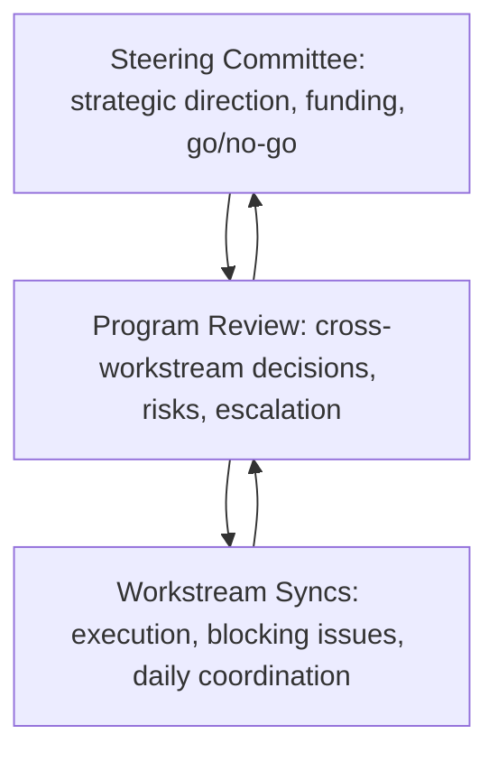

# Governance Structure

> **Core skill:** Designing program governance that names decision rights before they are needed, creates forums with clear authority and cadence, and builds escalation paths that resolve issues at the lowest competent level.

## Why This Matters

Governance is the program's decision-making operating system. Without designed governance, every decision escalates unpredictably — sometimes to the wrong person, sometimes to nobody, sometimes to a meeting that was never scheduled. Programs with bad governance feel chaotic: decisions are made and unmade, authority is unclear, and the TPM spends half the week chasing approvals that should have been pre-wired.

Good governance is boring by design. Stakeholders know which forum decides what, decisions stick, and escalation follows a predictable path. The TPM designs governance once at program initiation, then operates it — tweaking the cadence and membership as the program evolves, but never improvising the structure mid-flight.

## Governance vs Management

Governance and management are different functions. Confusing them is the root cause of most governance dysfunction.

| Dimension | Governance | Management |
|-----------|------------|------------|
| **Purpose** | Decision-making: what should we do, should we continue, who decides | Execution: how do we do it, are we on track, what is blocking us |
| **Questions it answers** | "Should we change scope?" "Does this program still make sense?" "Who resolves this cross-team conflict?" | "Is the workstream on schedule?" "What is blocking the team?" "What is the risk burn-down this month?" |
| **Frequency** | Less frequent: monthly, quarterly, at decision gates | More frequent: weekly, biweekly, daily for team-level |
| **Membership** | Decision-makers with organizational authority: sponsor, senior stakeholders | Execution leads: TPM, workstream leads, architects |
| **Artifacts** | Decisions, approvals, charter amendments | Status reports, risk registers, milestone tracking |

The governance layer decides; the management layer executes. When governance tries to manage, it micromanages. When management tries to govern, decisions lack authority and get reversed. The TPM keeps the boundary clear and enforces it: a governance forum that starts discussing task-level status has drifted into management territory.

## Governance Forums

A well-designed program has three tiers of governance, each with distinct authority, membership, and cadence.



| Forum | Authority | Membership | Cadence | TPM Role |
|-------|-----------|------------|---------|----------|
| **Steering Committee** | Approves charter and charter changes; authorizes scope, budget, and schedule changes; makes go/no-go decisions at major gates | Sponsor, senior stakeholders from affected organizations, TPM | Monthly or at decision gates | Prepares materials; presents options with recommendations; records decisions |
| **Program Review** | Resolves cross-workstream issues; approves interface contract changes; accepts or rejects risk mitigations; escalates to steering committee when authority is insufficient | TPM, workstream leads, architect, key technical leads | Biweekly | Runs the meeting; maintains the agenda; tracks action items |
| **Workstream Syncs** | Day-to-day execution decisions; blocking issue resolution; progress tracking | Workstream lead, team members | Daily or multiple times per week | Observes or does not attend; relies on workstream lead |

The TPM owns the program review meeting. It is the program's operating heartbeat — the forum where workstream leads surface problems, dependencies are negotiated, and risks are reviewed. A program review that is just status reporting is a wasted hour. The TPM drives the agenda toward decisions: what needs to be decided, who needs to be in the room, and what information they need to decide.

## The Escalation Path

Escalation is not failure. It is the governance system working as designed: an issue that cannot be resolved at one level rises to the next. The TPM designs the escalation path so that everyone knows where to send a problem and what to expect when it arrives.

| Level | Who Can Escalate | What Gets Escalated | Expected Response Time |
|-------|------------------|--------------------|------------------------|
| **Workstream lead to TPM** | Workstream leads, team members | Blockers the workstream cannot resolve alone; dependency delays; scope change requests | 24 hours for acknowledgment; resolution or next escalation within 3 business days |
| **TPM to Program Review** | TPM, workstream leads | Cross-workstream conflicts; risks that require program-level response; issues affecting program outcome | Next scheduled program review, or emergency session within 48 hours |
| **Program Review to Steering Committee** | TPM, sponsor | Scope, budget, or schedule changes beyond TPM authority; program continuation decisions; conflicts between organizational stakeholders | Next scheduled steering committee, or emergency session within 1 week |

Every escalation carries three pieces of information: the issue stated clearly, the impact if unresolved, and the options the escalator has already considered. Escalation without options is delegation upward — the TPM rejects it and asks the escalator to come back with a recommendation.

## Designing the Governance Cadence

Governance cadence is not arbitrary. It balances decision-making speed against meeting overhead, and it changes as the program moves through phases.

| Program Phase | Governance Need | Cadence Adjustment |
|---------------|----------------|--------------------|
| **Initiation** | Charter approval, resource commitment, workstream formation | Accelerated: weekly steering updates until charter is signed |
| **Planning** | Milestone approval, interface contract sign-off, risk register review | Normal cadence: biweekly program reviews, monthly steering |
| **Execution** | Cross-workstream issue resolution, risk monitoring, scope change control | Normal cadence; increase program review frequency if risk level is high |
| **Integration** | Integration issue triage, defect prioritization, go/no-go for launch | Accelerated: program reviews may become daily during critical integration windows |
| **Close** | Outcome measurement, lessons learned, benefit handoff | Light: final steering committee close-out; program review ends |

The TPM adjusts cadence proactively — not in response to a crisis. When the program enters integration, the TPM announces the accelerated cadence before the first integration issue lands. When the program moves to close, the TPM winds down governance forums deliberately rather than letting them atrophy.

## Governance Anti-Patterns

Most governance dysfunction follows predictable patterns. The TPM recognizes and corrects them.

| Anti-Pattern | What It Looks Like | Correction |
|-------------|--------------------|------------|
| **Steering committee as status meeting** | 90 minutes of workstream leads reading slides; no decisions made | Pre-read materials sent 48 hours before; meeting time reserved for decisions only |
| **Decision by absenteeism** | Key deciders skip governance meetings; decisions stall or are made without them | Require named delegates with decision authority; reschedule if quorum cannot be met |
| **Governance inflation** | Every stakeholder demands their own governance forum; the program has six steering committees | Merge forums with overlapping membership and authority; one steering committee per program |
| **Escalation bypass** | Stakeholders escalate directly to the sponsor, bypassing the TPM and program review | Publicize the escalation path; the sponsor redirects bypassers to the TPM |
| **Meeting without authority** | The program review meets but cannot decide anything — every decision must go to steering | Redefine program review authority; give it explicit decision rights within boundaries |
| **Governance-free program** | There are no defined forums; decisions happen in hallways and are forgotten | Stand up governance immediately; even lightweight governance beats no governance |

## Practical Applications

**Governance design checklist:**

- [ ] Three tiers defined: steering committee, program review, workstream syncs
- [ ] Every forum has a written charter: authority, membership, cadence, decision scope
- [ ] Escalation path is documented and communicated to every program participant
- [ ] Steering committee membership includes sponsor and all stakeholders with organizational authority
- [ ] Program review agenda is decision-driven, not status-driven
- [ ] Cadence adjustment triggers are defined for each program phase
- [ ] Forum attendance rules are explicit: who must attend, who may send a delegate, who is optional

**Governance forum charter template:**

```markdown
## Forum: [Name]
- **Authority:** [What decisions this forum can make without escalation]
- **Escalation Target:** [Which forum receives issues beyond this forum's authority]
- **Membership:**
  - Chair: [Name]
  - Required: [Names — must attend or send delegate with authority]
  - Optional: [Names]
- **Cadence:** [Frequency, day, time, duration]
- **Agenda Structure:**
  1. Decisions needed (pre-read materials sent 48 hours before)
  2. Risks requiring attention (top 3 by severity)
  3. Escalations from lower-tier forums
  4. Status by exception only (red items only)
- **Decision Recording:** [Where decisions are recorded and how they are communicated]
```

## Success Indicators

- Decisions made in governance forums stick — no re-litigation between meetings
- Escalation follows the designed path; the sponsor redirects bypass attempts to the TPM
- Steering committee meetings end with decisions, not action items to gather more information
- Program review meetings allocate at least 60 percent of time to decisions and risks, not status
- Governance cadence adjusts at phase transitions without the TPM having to argue for it

## Related Topics

- [[01_Program_Charter]]: the governance section of the charter names the forums and decision rights
- [[06_Program_Organization_and_Roles]]: governance forums are populated by the roles defined in the program organization
- [[04_Milestone_Planning]]: decision gate milestones are the steering committee's primary agenda items
- [[06_Decision_Facilitation/00_overview|Decision Facilitation]]: running governance meetings as decision forums
- [[career-path/13_Project_and_Program_Manager/00_overview|Project and Program Manager]]: governance as a formal program management discipline

## Summary

Governance is the program's decision-making operating system: three tiers of forums with clear authority and cadence, an escalation path that resolves issues at the lowest competent level, and a deliberate separation between governance — which decides — and management — which executes. The TPM designs governance at program initiation and operates it throughout, adjusting cadence at phase transitions and correcting anti-patterns before they become the program's culture. Good governance is boring; bad governance is the program's most expensive invisible cost.