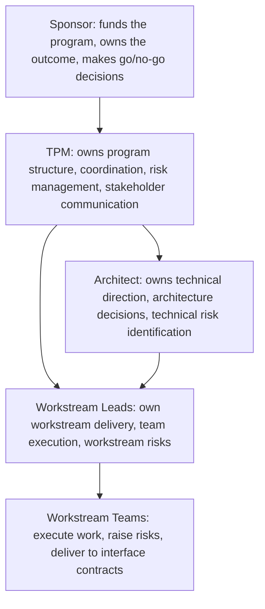

# Program Organization and Roles

> **Core skill:** Defining RACI at program scale — sponsor, TPM, workstream leads, architects, and stakeholders — with role clarity that survives organizational boundaries and matrixed team structures.

## Why This Matters

Programs operate across organizational lines. People report to their functional managers, not to the program, yet the program needs them to act with clear accountability. Without designed role clarity, matrixed participants default to their home organization's priorities, decisions fall between roles, and the TPM discovers at the worst moment that nobody thought they owned the integration test plan.

The TPM's organizational design work is not about drawing boxes on a chart. It is about defining who is accountable for what, who must be consulted before a decision, and who needs to be informed after — and then socializing that clarity so that everyone in the program operates from the same understanding of who does what.

## RACI at Program Scale

RACI is the standard accountability framework, but applying it at program scale requires more precision than the standard four-category model provides.

| Role | Definition | Program Example | How Many |
|------|------------|-----------------|----------|
| **Responsible (R)** | Does the work — executes tasks, produces deliverables | Workstream teams build the components; architects produce designs | Many per activity |
| **Accountable (A)** | Answers for the outcome — one person who says "yes, this is done right" | The workstream lead is accountable for the workstream's deliverables | Exactly one per activity |
| **Consulted (C)** | Provides input before the decision or action — two-way communication | Architects consulted on technical approach; legal consulted on compliance scope | Few, targeted |
| **Informed (I)** | Notified after the decision or action — one-way communication | Extended stakeholders informed of milestone results; sponsor informed of escalated risks | Many, broadcast |

The TPM applies RACI to program-level activities, not to every task. Program-level RACI covers: charter approval, scope changes, milestone go/no-go, architecture decisions, risk acceptance, interface contract changes, and program communication.

| Activity | Accountable | Responsible | Consulted | Informed |
|----------|------------|-------------|-----------|----------|
| Charter approval | Sponsor | TPM | Workstream leads, architects, key stakeholders | All program participants |
| Scope change | Sponsor (major), TPM (minor within charter bounds) | TPM (frames impact), workstream leads (estimate impact) | Architects, affected stakeholders | All workstream leads |
| Architecture decision | Architect | Architect (designs options), TPM (facilitates) | Workstream leads, senior engineers | All program participants |
| Milestone go/no-go | TPM | Workstream leads (provide evidence) | Architect, sponsor | Stakeholders, dependent programs |
| Risk acceptance | TPM (within program), Sponsor (program-threatening) | Risk owner (proposes mitigation) | Architect, affected workstream leads | Steering committee |

The accountable column is the program's backbone. Every program-level activity must have exactly one accountable person. If accountability is shared, it is owned by nobody. If accountability is unassigned, it is discovered too late.

## Core Program Roles

Every program role has a defined scope of authority and a set of expectations. The TPM documents these before the program launches and ensures every role-holder understands and accepts them.



| Role | Authority | Key Expectations | Common Failure Mode |
|------|-----------|-----------------|--------------------|
| **Sponsor** | Approves charter, authorizes resources, makes go/no-go decisions, resolves cross-organizational conflicts | Attends steering committee; makes timely decisions when escalated to; protects the program from organizational turbulence | Absentee sponsor: signs the charter and disappears; TPM cannot get decisions |
| **TPM** | Owns program structure and process; escalates risks; facilitates cross-workstream decisions; communicates to stakeholders | Maintains program artifacts; runs program review; keeps stakeholders aligned; surfaces problems early | TPM as administrator: runs meetings and tracks status but does not drive decisions or surface risks |
| **Workstream Lead** | Owns workstream scope, plan, and team; makes workstream-level technical and scope decisions | Delivers to workstream charter; meets interface contracts; reports honestly on progress and risks | Lead without ownership: escalates every decision; team does not see the lead as accountable |
| **Architect** | Owns technical direction and architecture decisions across the program | Produces architecture designs; identifies technical risks; participates in technical decision forums | Ivory-tower architect: designs in isolation; workstreams discover the design does not work in practice |
| **Stakeholder** | Provides requirements, accepts or rejects scope changes that affect their domain, receives program communication | Engages in charter and milestone reviews; provides timely input when consulted; respects decision rights | Stakeholder as blocker: withholds input until the last moment, then objects to decisions already made |

## Role Clarity Across Organizational Boundaries

The program's biggest organizational challenge is that participants report to someone else. The TPM does not manage anyone's performance, career, or compensation — yet the program needs them to act with program-first accountability during program hours.

| Challenge | Why It Happens | TPM's Approach |
|-----------|---------------|-----------------|
| **Split loyalty** | Functional manager gives conflicting priorities; program work gets deprioritized | Secure sponsor commitment to protect program participants' time; make the program commitment visible to functional managers |
| **Role ambiguity** | Two people think they own the same thing; a third person thinks nobody owns it | Publish RACI before execution; review at program kickoff; clarify at the first sign of ambiguity |
| **Authority without resources** | A workstream lead is named but the team still reports to their functional manager who controls their time | Workstream lead negotiates team allocation with functional managers before the program starts; TPM escalates if allocation is not honored |
| **Matrix-induced delay** | Decisions that need functional manager approval stall because the manager is not in the program's governance cadence | Identify decision dependencies on functional managers early; invite them to relevant governance forums or pre-brief them |

The TPM cannot solve the matrix. But the TPM can make the program's expectations explicit, secure sponsor backing for resource commitments, and surface matrix conflicts early — before they become execution blockers.

## The TPM's Role Boundaries

The TPM role has clear boundaries. Crossing them creates confusion and erodes trust.

| The TPM Does | The TPM Does Not Do |
|--------------|--------------------|
| Defines program structure and processes | Manage people — performance, career, hiring, firing |
| Facilitates decisions | Make technical decisions that belong to architects or tech leads |
| Escalates risks and issues | Own risks that belong to workstream leads — the TPM tracks, the lead owns |
| Communicates program status to stakeholders | Communicate workstream-level status in place of the workstream lead |
| Maintains the program roadmap | Maintain workstream-level plans — the workstream lead owns the detail |
| Runs program review and governance forums | Run workstream standups or team ceremonies |

The TPM who manages people loses the neutral facilitator position. The TPM who makes technical decisions without authority loses the engineering team's trust. The TPM who does the workstream lead's job loses the ability to hold the workstream lead accountable. Role boundaries are not bureaucracy — they are the structure that makes the program's accountability system work.

## Practical Applications

**RACI definition checklist:**

- [ ] Every program-level activity has exactly one accountable person
- [ ] RACI is published before program execution begins
- [ ] Every role-holder has confirmed they understand and accept their RACI entries
- [ ] RACI is reviewed at program kickoff with all participants present
- [ ] Role boundaries are explicit: what the TPM does and does not do is documented
- [ ] Functional manager dependencies are identified and addressed before the program starts

**Role description template:**

```markdown
## Role: [Name]
- **Accountable to:** [Role — sponsor, TPM, steering committee]
- **Authority:** [What decisions this role can make without escalation]
- **Key Responsibilities:**
  - [Responsibility 1]
  - [Responsibility 2]
- **Time Commitment:** [Percentage or hours per week]
- **RACI Summary:**
  - Accountable for: [activities]
  - Responsible for: [activities]
  - Consulted on: [activities]
  - Informed of: [activities]
- **Escalation Path:** [Who this role escalates to when authority is insufficient]
```

## Common Pitfalls

| Pitfall | Why It Is a Problem | Better Approach |
|---------|---------------------|-----------------|
| **Shared accountability** | Two people are accountable for the same outcome; each assumes the other is handling it | One accountable person per activity; if two people seem equally accountable, the program has the wrong decomposition |
| **RACI as a one-time exercise** | RACI is created at kickoff and never referenced again; roles drift as the program evolves | Review RACI at every major milestone; update when roles, scope, or organizational structure changes |
| **TPM as catch-all accountable** | The TPM's name is in every accountable cell because nobody else stepped up | Push accountability to the role that controls the work; TPM is accountable for program structure, not for every workstream deliverable |
| **Stakeholder consulted too late** | Stakeholders are informed of decisions that affect them instead of being consulted before | Identify consultation points in the RACI; build consultation into the milestone timeline with explicit deadlines for input |
| **Matrix ignored during planning** | The program plan assumes full-time dedication from people who have other responsibilities | Verify allocation with functional managers; build the plan on committed capacity, not hopeful capacity |

## Success Indicators

- Every program participant can state their role, their accountability, and who they escalate to
- RACI is referenced during decision-making — "this is your accountability, not mine" is a productive conversation
- Workstream leads operate within their authority; TPM involvement is by exception
- No activity falls between roles — gaps are identified and filled before they become blockers
- Functional managers honor program commitments because the sponsor made them visible and non-negotiable

## Related Topics

- [[01_Program_Charter]]: the decision rights section of the charter maps to the RACI
- [[05_Governance_Structure]]: governance forums are populated by the roles defined here
- [[03_Workstream_Decomposition]]: the workstream lead role and interface ownership
- [[02_Technical_Integration_and_Architecture/00_overview|Technical Integration and Architecture]]: the architect and tech lead roles in the program organization
- [[career-path/13_Project_and_Program_Manager/00_overview|Project and Program Manager]]: role definition as a formal PM discipline

## Summary

Program organization is accountability design: RACI at program scale with exactly one accountable person per activity, core roles defined with explicit authority and expectations, role boundaries that keep the TPM in the facilitator position, and matrix-aware planning that secures commitment from functional managers before the program starts. A program with clear roles runs on defined accountability; a program without it runs on whoever steps up — and on whoever steps away.