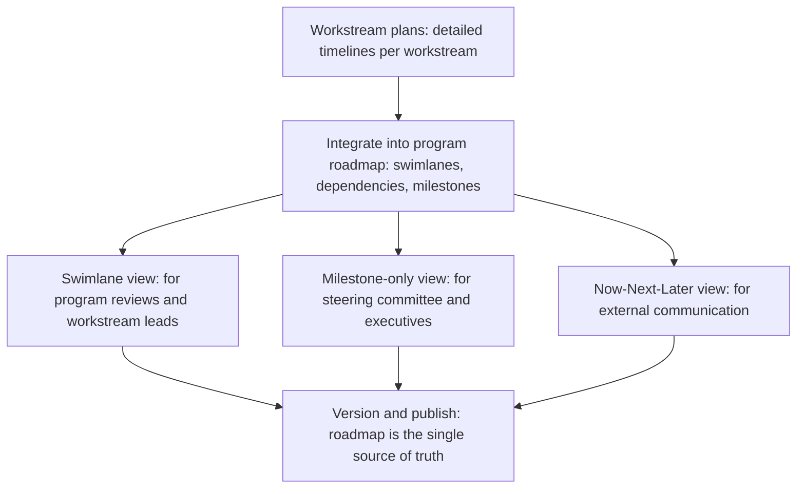

# Program Roadmap and Sequencing

> **Core skill:** Integrating workstream plans into a single program roadmap, with visual conventions that communicate clearly to different audiences, and a versioning discipline that keeps the roadmap honest as the program evolves.

## Why This Matters

The program roadmap is the single artifact that answers "what happens when" for everyone involved. It integrates multiple workstream timelines into one coherent view, shows dependencies and decision points, and gives stakeholders a shared mental model of the program's trajectory. Without a roadmap, each workstream's plan lives in isolation, and nobody — not the TPM, not the sponsor, not the teams — can see how the pieces fit together.

But a roadmap is only as good as its communication design. The same roadmap data needs to be presented differently to the steering committee, the workstream teams, and external stakeholders. A roadmap that is too detailed for the sponsor is ignored; a roadmap that is too abstract for the teams is useless. The TPM designs the roadmap for its audiences and maintains it as a living artifact that reflects the program's current truth.

## Integrating Workstream Plans

The program roadmap is not a collection of workstream roadmaps. It is an integration view that shows relationships, not just parallel timelines.

| Integration Element | What It Shows | Why It Matters |
|--------------------|--------------|----------------|
| **Workstream swimlanes** | Each workstream's key deliverables on a timeline | Shows who delivers what; reveals parallel vs sequential work |
| **Milestone markers** | Program-level milestones across all workstreams | Shows the program's accountability points in one view |
| **Dependency lines** | Arrows connecting deliverables that depend on each other | Reveals the critical path; shows what blocks what |
| **Decision gates** | Points where the program makes a significant choice | Shows when decisions are needed and which workstreams are affected |
| **Integration windows** | Periods when workstreams connect and validate together | Shows when the program shifts from building to integrating |
| **Risk indicators** | Visual markers for high-risk deliverables or dependencies | Focuses attention on the parts of the plan most likely to shift |

The TPM builds the roadmap from workstream plans but does not simply aggregate them. Aggregation produces a timeline; integration produces a program view. The TPM adds the dependency lines, the decision gates, and the risk indicators that are invisible when viewing workstreams in isolation.

## Visual Roadmap Conventions

Different roadmap formats serve different needs. The TPM chooses the format for the audience.

| Format | Best For | What It Communicates | Limitation |
|--------|----------|---------------------|------------|
| **Swimlane timeline** | Program reviews, workstream leads | Who does what, when; dependencies between workstreams; parallel vs sequential flow | Can become cluttered with too many workstreams |
| **Milestone-only view** | Steering committee, executive stakeholders | Key decision points and commitments; program-level progress | Hides the workstream detail that explains why a milestone is at risk |
| **Dependency network** | Risk reviews, dependency management sessions | What depends on what; the critical path; single points of failure | Not time-based; does not show when things happen |
| **Now-Next-Later** | External stakeholders, broad communication | Strategic direction without false precision on dates | Too coarse for execution-level planning |



The TPM maintains one master roadmap — the swimlane view — and derives the other views from it. Multiple master roadmaps that get out of sync is a common failure mode. The master roadmap is the single source of truth; every other view is a projection of it.

## Roadmap Communication to Different Audiences

The same program communicates differently to different audiences. The TPM tailors the roadmap message without changing the roadmap truth.

| Audience | What They Need | How Much Detail | Communication Cadence |
|----------|----------------|-----------------|----------------------|
| **Steering Committee** | Decisions needed, risks to outcome, milestone status (by exception — red items only) | Low: milestone-level only; no workstream detail | Monthly or at decision gates |
| **Workstream Leads** | Dependencies on their workstream, upcoming integration points, milestones that affect their plan | High: full swimlane view with dependency lines | Biweekly; more frequent during integration |
| **Workstream Teams** | Their workstream's deliverables and dependencies; how their work connects to program milestones | Medium: their swimlane in detail; others in summary | Per workstream cadence |
| **Extended Stakeholders** | Program trajectory, key dates that affect their domain, decisions that require their input | Low to medium: milestone view plus relevant swimlane detail | Monthly; on-demand for decision input |
| **External Partners** | Commitments that affect them, integration dates, dependency delivery dates | Low: externally committed milestones only | As needed; coordinated with partner management |

The TPM never sends the same roadmap artifact to every audience. The steering committee does not need the swimlane view; the workstream leads do not need the milestone-only view. Tailoring is not hiding information — it is presenting the information each audience needs to act on.

## Roadmap Updates and Versioning

The roadmap changes. The program discovers new information, milestones shift, dependencies are renegotiated. The TPM's versioning discipline ensures that changes are tracked, communicated, and understood — not absorbed silently until the roadmap is unrecognizable.

| Change Type | Example | Update Process |
|-------------|---------|----------------|
| **Milestone date shift within buffer** | A milestone moves from June 15 to June 22, still within its confidence range | Update roadmap; note in program review; no formal re-communication required |
| **Milestone date shift beyond buffer** | A milestone that was June 15 with range to July 1 moves to July 20 | Update roadmap; communicate to all affected audiences with reason and impact; record in version history |
| **Dependency added or removed** | A new dependency is discovered between workstreams | Add to roadmap; notify both workstream leads; review in next program review |
| **Workstream scope change** | A workstream's deliverables change, affecting downstream workstreams | Update roadmap; renegotiate affected interface contracts; communicate to all affected audiences |
| **Program re-baseline** | Multiple milestones shift; the roadmap is fundamentally re-planned | Version the roadmap as a new major version; archive the old version; run the full communication cascade |

The TPM versions the roadmap explicitly. Every published version has a version number, a date, and a change log summarizing what changed and why. The current roadmap is always the latest version; archived versions are preserved so that the program can answer "what did we commit to, and when did it change?"

| Version Element | Example |
|----------------|---------|
| Version number | v2.3 |
| Date | 2026-10-05 |
| Change summary | "M4 (Integration test complete) moved from Oct 15 to Oct 30 due to Workstream 2 dependency delay. M5 unchanged." |
| Author | TPM name |
| Distribution | Audiences notified |

## Sequencing Principles

The roadmap is not just a timeline — it is a sequence. The order in which work happens determines how much risk the program carries at any point and when value arrives.

| Principle | What It Means | Roadmap Implication |
|-----------|---------------|--------------------|
| **Risk first** | Riskiest work is sequenced earliest, while the program has maximum schedule slack | High-risk deliverables appear in the first third of the roadmap |
| **Dependency order** | Upstream workstreams deliver before downstream workstreams need their outputs | Dependency lines flow left to right; no dependency points backward |
| **Integration progressive** | Components integrate in increasing complexity — pair integration before full system integration | Integration windows escalate: component pairs, then subsystems, then full system |
| **Value pacing** | Value-delivering milestones are spaced so stakeholders see progress, not a single big bang | At least one externally visible milestone per quarter |
| **Decision before investment** | Major resource commitments follow decision gates, not precede them | Decision gates appear before workstreams that depend on the decision outcome |

The TPM reviews the roadmap against these principles at every version. A roadmap where high-risk deliverables are in the last month, or where a decision gate comes after the work that depends on it, is a roadmap that will break.

## Practical Applications

**Roadmap quality checklist:**

- [ ] All workstreams are represented with key deliverables on the timeline
- [ ] Program-level milestones are marked and connected to the workstreams that contribute to them
- [ ] Dependency lines connect deliverables across workstreams — explicit, not assumed
- [ ] Decision gates are placed before the work that depends on the decision outcome
- [ ] High-risk deliverables and dependencies are visually flagged
- [ ] The roadmap has a version number, date, and change log
- [ ] Audience-specific views are derived from the master roadmap, not maintained separately
- [ ] The roadmap is published in a single shared location accessible to all program participants

**Roadmap version header template:**

```markdown
# Program Roadmap: [Program Name]
**Version:** [vX.Y] | **Date:** [YYYY-MM-DD] | **Author:** [TPM Name]

## Changes Since Previous Version
- [Change 1: what changed, why, impact]
- [Change 2: what changed, why, impact]

## Audience Views
- [Link to swimlane view — for program reviews]
- [Link to milestone view — for steering committee]
- [Link to Now-Next-Later view — for external communication]
```

## Common Pitfalls

| Pitfall | Why It Is a Problem | Better Approach |
|---------|---------------------|-----------------|
| **Roadmap as Gantt chart dump** | 200-line Gantt chart with every task; nobody reads it; the real plan lives in workstream leads' heads | Keep the roadmap at deliverable and milestone level; workstream-level detail lives in workstream plans |
| **One roadmap for all audiences** | The steering committee gets workstream detail they ignore; the teams get milestone summaries that are useless | Derive audience-specific views from a single master roadmap |
| **No dependency lines** | The roadmap shows parallel timelines; dependencies are invisible until a workstream is blocked | Draw explicit dependency lines between deliverables; make the critical path visible |
| **Unversioned roadmap drift** | The roadmap changes silently; stakeholders reference different versions; nobody knows which is current | Version every roadmap publication; archive old versions; publish change logs |
| **Now-Next-Later as a hiding tactic** | The TPM uses low-detail views to avoid committing to dates the program needs to manage | Use Now-Next-Later for external communication only; internal execution lives on the swimlane view with dates |
| **Roadmap not updated after milestone shifts** | The published roadmap is weeks out of date; workstream leads maintain their own shadow roadmaps | Update the roadmap within one week of any significant change; re-communicate to affected audiences |

## Success Indicators

- Any program participant can find the current roadmap within 30 seconds
- Workstream leads reference the roadmap in their own planning and status reporting
- Dependency lines on the roadmap accurately reflect the program's actual dependencies
- The roadmap version history tells a coherent story of the program's evolution
- Steering committee members can read the milestone view without asking the TPM to explain it

## Related Topics

- [[04_Milestone_Planning]]: program milestones are the roadmap's primary markers
- [[03_Workstream_Decomposition]]: workstream swimlanes are the roadmap's structural backbone
- [[03_Dependency_Management/00_overview|Dependency Management]]: dependency lines on the roadmap connect to the dependency register
- [[05_Stakeholder_Alignment/00_overview|Stakeholder Alignment]]: roadmap communication is a stakeholder alignment tool
- [[career-path/13_Project_and_Program_Manager/00_overview|Project and Program Manager]]: roadmap management as a formal PM practice

## Summary

The program roadmap is the integrated view of what happens when: workstream swimlanes with deliverable-level detail, program milestones marking accountability points, dependency lines revealing the critical path, decision gates placed before investment, and audience-specific views derived from a single versioned master. The TPM maintains the roadmap as the program's single source of truth — updated within a week of any significant change, versioned with a change log, and communicated to the audience that needs it in the format they can act on.