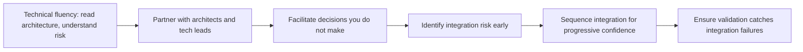

# Technical Integration and Architecture

> **Core capability:** The TPM understands system boundaries, interfaces, and integration sequences at sufficient depth to identify risk, challenge assumptions, and keep technical decisions aligned with program outcomes.

## Why This Matters

The TPM is not the architect and not the tech lead. But a TPM without enough technical context cannot distinguish a one-week integration from a three-month one, cannot challenge an optimistic dependency assumption, and cannot facilitate a technical decision because they cannot frame the options. Technical integration is the TPM's credibility layer — the depth that earns the right to coordinate technical work.

The skill is calibrated: enough depth to ask the right questions, recognize when a technical risk is being hand-waved, and know when to bring in the real technical authority. Not enough depth to make architecture decisions. The TPM who makes technical decisions without authority loses the team; the TPM who cannot understand them loses the program.

## Topics in This Capability Area

| Topic | Core Skill | When It Matters |
|-------|------------|-----------------|
| [[01_Technical_Fluency_for_TPMs]] | Maintaining enough technical context to be credible | Continuously; new domains |
| [[02_Understanding_System_Boundaries_and_Interfaces]] | Reading architecture diagrams for integration risk | Program planning |
| [[03_Integration_Sequencing]] | Planning the order in which components come together | Milestone planning |
| [[04_Technical_Risk_Identification]] | Spotting architecture and integration risks early | Before they become blockers |
| [[05_Working_with_Architects_and_Tech_Leads]] | Partnering with technical authorities productively | Every technical decision |
| [[06_Technical_Decision_Facilitation]] | Running decision forums where the TPM frames but does not decide | Architecture trade-off discussions |
| [[07_Integration_Testing_and_Validation_Strategy]] | Ensuring the program has an integration validation plan | Before system-level testing |

## The TPM's Technical Depth

The TPM owns the integration flow; technical authorities own the technical content.

## Practical Applications

### Technical Integration Checklist

- [ ] System architecture is understood at the boundary level for every workstream
- [ ] Integration points are mapped with interface contracts and owners
- [ ] Integration sequence is planned with progressive integration milestones
- [ ] Technical architects and tech leads are named for each major decision area
- [ ] Integration testing strategy exists and is resourced
- [ ] Technical risks are registered with technical owners and mitigation plans

## Common Pitfalls

| Pitfall | Why It Is a Problem | Better Approach |
|---------|---------------------|-----------------|
| **TPM as pseudo-architect** | Makes technical decisions without authority or depth | Facilitate; bring the right authority to the table |
| **Zero technical context** | Cannot challenge estimates or spot integration risk | Maintain calibrated fluency; ask engineers to explain |
| **Integration as afterthought** | Components work alone, fail together | Sequence integration from day one |

## Success Indicators

- Integration risks surface in planning, not in integration testing
- Technical decisions have named deciders and happen on program timeline
- Architects and tech leads seek the TPM's facilitation for cross-team decisions
- Integration validation catches failures before user-facing testing

## Related Capabilities

- [[01_Program_Structure_and_Charter/00_overview|Program Structure and Charter]]: structure defines integration points
- [[03_Dependency_Management/00_overview|Dependency Management]]: technical dependencies are a subset of program dependencies
- [[career-path/06_Software_Architect/00_overview|Software Architect]]: the architecture authority the TPM partners with
- [[career-path/05_Tech_Lead/03_Technical_Direction_and_Architecture/00_overview|Technical Direction and Architecture (Tech Lead)]]: the team-level technical lead

## Summary

Technical integration for TPMs means calibrated technical depth: reading architecture well enough to spot risk, facilitating decisions you do not make, sequencing integration for progressive confidence, and ensuring the program validates what was integrated. The TPM earns a seat at the technical table by making the technical conversation productive — not by dominating it.