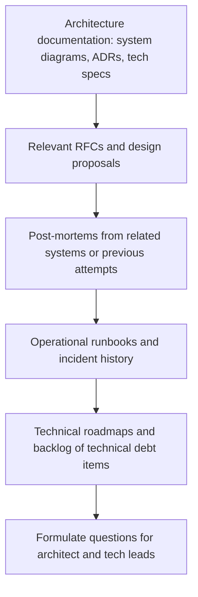

# Technical Fluency for TPMs

> **Core skill:** Maintaining calibrated technical depth — enough to ask the right questions, recognize when a risk is being hand-waved, and know when to bring in the real technical authority — without pretending to be the architect.

## Why This Matters

The TPM who cannot read an architecture diagram cannot spot an integration risk. The TPM who cannot distinguish a one-week integration from a three-month one cannot challenge an optimistic dependency assumption. And the TPM who cannot follow a technical discussion cannot facilitate it — they can only take notes and hope the right people are in the room.

But the TPM is not the architect and not the tech lead. The skill is calibration: enough technical depth to be credible, enough self-awareness to know where the depth stops, and enough judgment to delegate technical decisions to the people who are qualified to make them. The TPM who makes architecture decisions without authority loses the engineering team's trust. The TPM who cannot understand the decisions being made loses the program.

## What to Know, What to Delegate

Calibrated fluency means knowing which technical areas the TPM must understand and which areas the TPM must trust to others.

| Area | TPM Must Know | TPM Delegates To |
|------|--------------|-----------------|
| **System architecture** | Read architecture diagrams; identify system boundaries, interfaces, and data flows; spot single points of failure | Design the architecture; choose technologies; define component internals |
| **Integration patterns** | Understand API paradigms (REST, gRPC, event-driven, message queues); recognize tight vs loose coupling | Design the integration; choose the protocol; implement the integration |
| **Data models** | Read entity-relationship diagrams; understand data ownership and flow between systems | Design the schema; normalize the data model; choose the database |
| **Infrastructure** | Understand deployment models (cloud, on-prem, hybrid); recognize capacity and scaling risks | Design the infrastructure; choose the cloud services; configure the deployment pipeline |
| **Testing strategy** | Understand test levels (unit, integration, system, acceptance); recognize gaps in test coverage | Design the test plan; write the tests; choose testing tools |
| **Performance and scaling** | Read load test results; recognize when performance is trending in the wrong direction | Design performance tests; optimize bottlenecks; tune the system |
| **Security** | Understand the threat model at a high level; recognize when security review is being deferred | Design security controls; conduct penetration testing; implement security measures |

The TPM's technical knowledge is broad and shallow — broad enough to span every workstream's domain, shallow enough to know when to pull in depth. The TPM who goes deep in one area loses the breadth that the program role requires.

## Maintaining Currency Across Domains

Programs span multiple technical domains, and the TPM must maintain enough context in each to be credible. Currency fades fast — the TPM who stops learning becomes the TPM who cannot follow the conversation.

| Strategy | How It Works | Time Investment |
|----------|-------------|----------------|
| **Architecture walkthroughs** | The architect walks the TPM through the system architecture at program initiation; the TPM asks questions until they can explain it back | 2-4 hours at program start; 1 hour per major change |
| **Technical brown-bags** | Workstream teams present their technical approach to the TPM and each other; format: 30 minutes of presentation, 15 minutes of questions | 45 minutes per workstream per quarter |
| **Design review attendance** | The TPM attends technical design reviews as an observer; listens for assumptions, dependencies, and risks | 1-2 hours per significant design review |
| **Curated reading** | The TPM maintains a short reading list: the program's architecture decision records, the relevant RFCs, the key post-mortems | 1-2 hours per week |
| **One-on-one technical syncs** | The TPM meets individually with the architect, tech leads, and senior engineers to discuss technical risks and context | 30 minutes per key technical role per month |

The TPM does not become an expert in every domain. The goal is to know enough to ask "what happens if this assumption is wrong?" and to recognize when the answer is evasive.

## Knowing When You Do Not Know

The most important technical skill for a TPM is recognizing the boundary of their own knowledge. The TPM who pretends to understand something they do not loses credibility irreparably.

| Situation | Wrong Response | Right Response |
|-----------|---------------|----------------|
| A technical term is used that the TPM does not know | Nod and pretend to follow; hope context clarifies it | "I do not know that term — can you give me a one-minute explanation so I can follow the rest?" |
| Two engineers disagree on a technical approach and the TPM cannot evaluate the trade-offs | Pick one based on who sounds more confident | "I am not the right person to evaluate these trade-offs. Let us bring in the architect and frame both options for a decision." |
| A workstream lead claims a technical risk is "handled" with no detail | Accept the assurance and move on | "Help me understand what 'handled' means here — what specific mitigation is in place, and how would we know if it is not working?" |
| The TPM is asked a technical question in a stakeholder meeting | Guess; provide a plausible-sounding answer | "That is a technical question I want to get right. Let me confirm with the architect and get back to you by end of day." |

The TPM who admits ignorance gains credibility; the TPM who bluffs loses it. Technical fluency is not about knowing everything — it is about knowing what you know, knowing what you do not know, and knowing who does know.

## The TPM's Technical Reading List

A TPM on a new program builds technical context through a deliberate reading sequence. The artifacts already exist; the TPM's job is to consume them in the right order.



The reading list produces questions, not answers. The TPM reads to understand enough to ask informed questions; the architect and tech leads provide the answers. The TPM who reads architecture docs to make architecture decisions is reading the wrong material for the wrong purpose.

## Technical Questions the TPM Always Asks

Certain questions surface technical risk regardless of domain. The TPM keeps these questions ready and asks them in every design review, every integration planning session, and every technical status update.

| Question | What It Surfaces | When to Ask |
|----------|-----------------|-------------|
| "What is the riskiest assumption in this design?" | Unvalidated assumptions that could invalidate the approach | Every design review |
| "What happens when this component is unavailable?" | Missing fallback, resilience, and error-handling design | Every system boundary discussion |
| "What does this depend on that we do not control?" | External dependencies, third-party risk, API stability concerns | Every integration planning session |
| "How will we know this is working correctly in production?" | Missing observability, monitoring, and alerting design | Every launch readiness review |
| "What is the rollback plan if this does not work?" | Missing reversibility planning; irreversible changes | Every deployment and migration discussion |
| "Who else needs to review this before we proceed?" | Missing stakeholder input; decision made in a silo | Every technical decision forum |

These questions do not require deep technical expertise to ask. They require the TPM to be paying attention and to trust their instinct when an answer feels incomplete or evasive.

## Practical Applications

**Technical fluency self-assessment checklist:**

- [ ] I can read the program's architecture diagram and explain it back to the architect
- [ ] I can identify every system boundary and interface point in the architecture
- [ ] I know which technical decisions the architect owns and which the workstream tech leads own
- [ ] I can name the three riskiest technical assumptions in the program
- [ ] I have read the program's architecture decision records and understand why key choices were made
- [ ] I know when my technical knowledge is insufficient and who to bring in
- [ ] I spend at least one hour per week on deliberate technical context-building

**Technical context-building plan template:**

```markdown
## Technical Context Plan: [Program Name]

### Architecture Understanding
- [ ] Architecture walkthrough with architect — scheduled for [date]
- [ ] Read architecture decision records — [link]
- [ ] Map system boundaries and interfaces — [artifact link]

### Domain Familiarity
- [ ] Workstream 1 brown-bag — scheduled for [date]
- [ ] Workstream 2 brown-bag — scheduled for [date]
- [ ] Key technology primers — [topics to research]

### Ongoing Currency
- [ ] Weekly design review attendance — [recurring meeting]
- [ ] Monthly one-on-one with architect — [recurring]
- [ ] Post-mortem reading list — [links]
```

## Common Pitfalls

| Pitfall | Why It Is a Problem | Better Approach |
|---------|---------------------|-----------------|
| **TPM as pseudo-architect** | Makes technical decisions without the depth to evaluate trade-offs; loses engineering trust | Facilitate technical decisions; bring the architect to the table; frame options without choosing them |
| **Zero technical context** | Cannot challenge estimates, spot integration risks, or follow technical discussions; becomes an administrator, not a TPM | Invest in deliberate context-building; ask engineers to explain; build the reading list |
| **Deep-diving on one technology** | Becomes the expert on one area and loses the broad view the program needs; other workstreams feel neglected | Maintain breadth; go deep only when the program genuinely needs a TPM who bridges a specific gap |
| **Accepting technical assurances at face value** | "It will be fine" is not a risk mitigation; the TPM who accepts it owns the surprise when it is not fine | Ask "how do we know?" until there is evidence; escalate when assurances replace analysis |
| **Technical vocabulary without understanding** | Uses terms incorrectly in stakeholder meetings; engineers correct the TPM publicly or — worse — stop correcting and stop trusting | Admit gaps; ask for explanations; build vocabulary deliberately, not by guessing from context |
| **Skipping technical context for "soft" programs** | Assumes a program with less code has less technical risk; discovers integration surprises anyway | Every program has technical dimensions; assess, do not assume, the technical depth required |

## Success Indicators

- The architect and tech leads seek the TPM's facilitation for cross-team technical discussions
- The TPM can explain the program's architecture to a new stakeholder without the architect in the room
- Technical risks surface in the TPM's program review before they surface in the architect's design review
- Engineers describe the TPM as "technically credible" — not "the person who decides" but "the person who asks the right questions"
- The TPM knows what they do not know and says so without hesitation

## Related Topics

- [[02_Understanding_System_Boundaries_and_Interfaces]]: the reading of architecture diagrams that technical fluency enables
- [[04_Technical_Risk_Identification]]: the risks that technical fluency helps the TPM spot
- [[05_Working_with_Architects_and_Tech_Leads]]: the partnership that calibrated fluency makes productive
- [[06_Technical_Decision_Facilitation]]: the facilitation skill that depends on enough technical context to frame options
- [[career-path/06_Software_Architect/01_Architecture_Fundamentals/04_Architecture_Decision_Making|Architecture Decision Making (Architect)]]: the deep technical skill the TPM complements, not duplicates

## Summary

Technical fluency for TPMs is calibrated depth: broad enough to span every workstream's domain, shallow enough to know when to pull in the real technical authority, and honest enough to admit the boundary. The TPM builds context through architecture walkthroughs, design review attendance, and a deliberate reading list — not to make technical decisions, but to ask the questions that surface risk, to recognize when an assurance is evasive, and to facilitate the conversation that gets the right decision from the right people.