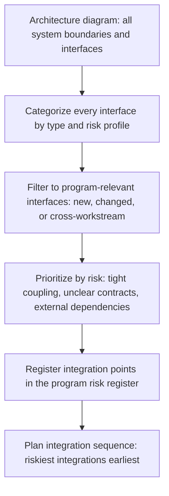

# Understanding System Boundaries and Interfaces

> **Core skill:** Reading architecture diagrams for integration risk — identifying system boundaries, interface types, and integration points — so that the TPM knows where the program's technical risk concentrates before integration begins.

## Why This Matters

Every integration failure happens at a boundary. Two systems that work perfectly in isolation fail when connected because the interface was underspecified, the data contract was misunderstood, or the boundary condition nobody thought about actually happens. The TPM who cannot read an architecture diagram for boundaries and interfaces cannot see where the program's technical risk lives — and cannot plan integration sequencing, dependency management, or risk mitigation around it.

This is not about designing systems. It is about reading the architecture artifacts that already exist — or ensuring they get created — and extracting the integration implications that the architects and engineers may not have surfaced. The TPM reads boundaries the way a building inspector reads load-bearing walls: not to design them, but to know which ones matter and which ones will fail first under stress.

## Reading Architecture Diagrams for Integration Risk

Architecture diagrams are not decoration. They are maps of risk. The TPM reads them for four things: boundaries, interfaces, data flow, and coupling.

| What to Look For | How to Spot It | Why It Matters for Integration |
|-----------------|---------------|-------------------------------|
| **System boundaries** | Boxes that represent separate systems, services, or components — especially those owned by different teams | Every boundary is a potential integration failure point; boundaries between teams carry organizational risk on top of technical risk |
| **Interface types** | Arrows, lines, or annotations showing how systems communicate: API calls, events, message queues, file transfers, shared databases | Different interface types carry different integration risks; a synchronous API has different failure modes than an asynchronous event |
| **Data flow direction** | Arrow direction: who calls whom, who publishes, who consumes | Upstream failures cascade downstream; downstream changes can break upstream assumptions |
| **Coupling indicators** | Shared databases, synchronous call chains, tight schema dependencies | Tight coupling means changes in one system force changes in another; integration windows become serialized and long |

The TPM does not critique the architecture. The TPM asks: "At this boundary, what happens when one side changes? What happens when one side is unavailable? What is the contract between these two systems, and where is it written down?" If the architect or tech lead cannot answer, the boundary is an integration risk.

## Interface Types and Their Integration Risks

Different interface types carry different integration profiles. The TPM categorizes every interface in the program's architecture by type to understand the integration risk landscape.

| Interface Type | How It Works | Integration Risk Profile | TPM's Focus |
|---------------|-------------|-------------------------|-------------|
| **Synchronous API (REST, gRPC)** | Caller waits for response; tight temporal coupling | Caller is blocked if provider is unavailable; latency compounds across call chains; versioning changes break callers | Availability SLAs; versioning strategy; timeout and retry design; circuit breakers |
| **Asynchronous messaging (Kafka, RabbitMQ, SQS)** | Producer publishes; consumer processes independently; loose temporal coupling | Schema evolution must be managed; message ordering and duplication risks; consumer lag can build undetected | Schema registry and versioning; dead-letter queues; consumer lag monitoring |
| **Event-driven (webhooks, event streams)** | Producer emits events; consumers react; loose coupling at design time | Event schema is the contract; missing events are silent failures; event storm cascades can overwhelm consumers | Event schema documentation; event completeness guarantees; consumer registration and discovery |
| **Shared database** | Multiple systems read/write the same database; tight coupling | Schema change in one system breaks others; no API contract to enforce; data ownership is ambiguous | Data ownership clarity; schema change process; access control; migration coordination |
| **File transfer (SFTP, S3, batch processing)** | Producer writes file; consumer reads file; temporal decoupling but format coupling | File format is the contract; format changes break consumers silently; error handling is often ad-hoc | File format specification; schema validation; error file handling; retry and reconciliation |
| **Shared library or SDK** | Multiple systems depend on the same code artifact; tight coupling at build time | Library version changes force coordinated upgrades; breaking changes cascade across all consumers | Versioning and deprecation policy; release notes; consumer upgrade tracking |

The TPM maps every interface in the program to one of these types and records the integration risk profile. An interface with no documented type is an interface with no understood risk — and it goes on the risk register until it is understood.

## Identifying Integration Points from System Maps

An integration point is where two systems or workstreams must connect for the program to succeed. Not every boundary is an integration point; the TPM identifies the subset that carries program-level risk.



| Filter Question | If Yes | If No |
|----------------|--------|-------|
| Is this a new interface created by the program? | Integration point — no existing behavior to reference; contract must be designed and validated | Existing interface — lower risk unless the program is changing it |
| Is this interface shared between workstreams? | Integration point — cross-workstream coordination required; organizational risk on top of technical risk | Within-workstream interface — managed by the workstream lead |
| Is one side of this interface owned outside the program? | Integration point — external dependency; the program cannot control the other side's timeline or quality | Both sides owned within the program — the program controls both ends |
| Is the interface contract undocumented or stale? | Integration point — the contract is the integration risk; document it before integration begins | Documented contract — lower risk; validate that the documentation matches reality |

The TPM produces an integration point register: a list of every program-relevant interface, categorized by type, prioritized by risk, and assigned an owner on each side. This register drives the integration sequence plan.

## Interface Contract Documentation

The TPM does not write interface contracts. But the TPM ensures they exist for every integration point, and that they contain the minimum information needed to plan integration.

| Contract Element | What It Answers | TPM Verification Question |
|-----------------|-----------------|--------------------------|
| **Data schema** | What data flows across this interface, in what format? | "Where is the schema documented, and how is it versioned?" |
| **Semantics** | What does the data mean? What are the valid values and edge cases? | "What happens if a field is null? What are the enumerated values and their meanings?" |
| **Error handling** | What errors can occur, and how are they communicated? | "What error codes exist? What does the consumer do when it receives each one?" |
| **Performance** | What are the latency and throughput expectations? | "What is the p95 latency target? What throughput must this interface support at peak?" |
| **Availability** | What uptime or reliability does the provider commit to? | "What is the SLA? What happens when the provider is unavailable?" |
| **Versioning** | How does the interface evolve? What is a breaking change? | "How are breaking changes handled? What is the deprecation window?" |
| **Ownership** | Who owns each side of the interface? | "Who do I call at 3 AM if this interface is failing?" |

The TPM audits interface contracts, not writes them. The audit question is: "If I gave this contract to the downstream workstream lead, could they build against it without asking the upstream workstream lead any questions?" If the answer is no, the contract is incomplete.

## Practical Applications

**Interface audit checklist:**

- [ ] Every system boundary in the architecture diagram is categorized by interface type
- [ ] Every cross-workstream interface has a documented contract
- [ ] Every interface contract answers the seven elements: schema, semantics, error handling, performance, availability, versioning, ownership
- [ ] External dependencies are identified and flagged in the integration point register
- [ ] Integration points are prioritized by risk for sequencing
- [ ] The integration point register is reviewed with the architect and workstream leads

**Integration point register template:**

```markdown
## Integration Point Register: [Program Name]

| ID | Interface | Type | Upstream Owner | Downstream Owner | Contract Status | Risk Level | Notes |
|----|-----------|------|----------------|------------------|-----------------|------------|-------|
| IP-01 | Payment API to Order Service | Sync REST | WS2 Lead | WS1 Lead | Drafted | High | New interface; schema v2 under design |
| IP-02 | Order Events to Fulfillment | Async Kafka | WS1 Lead | WS3 Lead | Signed | Medium | Existing topic; new event types being added |
| IP-03 | User Service (external) to Auth | Sync gRPC | External: User Platform Team | WS4 Lead | Undocumented | Critical | External dependency; no SLA; contract must be negotiated |
```

## Common Pitfalls

| Pitfall | Why It Is a Problem | Better Approach |
|---------|---------------------|-----------------|
| **Assuming the architecture diagram is accurate** | Diagrams are often aspirational or outdated; the real system behaves differently | Validate the diagram with the engineers who own the systems; ask "is this still accurate?" |
| **Treating all interfaces as equal** | Some interfaces carry trivial risk; others carry program-killing risk; treating them equally wastes attention and misses threats | Categorize and prioritize; focus the TPM's attention on the integration points that matter most |
| **Interface contract as a one-time document** | The contract is written at program start and never updated; integration proceeds against a stale specification | Review contracts at every integration milestone; update when either side changes |
| **Ignoring organizational boundaries** | Two systems with a perfect technical interface but different VP-level owners have organizational risk the TPM must manage | Flag cross-organizational interfaces; engage stakeholders from both organizations early |
| **Shared database treated as "no interface"** | Teams assume the database is neutral ground; schema changes in one team silently break another | Treat shared databases as the tightest form of coupling; require explicit schema change coordination |

## Success Indicators

- The integration point register exists and is referenced during integration planning
- Every cross-workstream interface has a documented contract that both sides have agreed to
- Architecture diagrams are validated against reality — not just accepted as accurate
- External dependencies are identified and flagged before they become surprises
- Interface changes trigger contract updates, not silent drift

## Related Topics

- [[01_Technical_Fluency_for_TPMs]]: the technical context that enables boundary and interface reading
- [[03_Integration_Sequencing]]: the integration plan built from the integration point register
- [[04_Technical_Risk_Identification]]: the risks that surface when boundaries are unclear
- [[03_Dependency_Management/00_overview|Dependency Management]]: cross-workstream interfaces are dependencies to manage
- [[career-path/06_Software_Architect/01_Architecture_Fundamentals/04_Architecture_Decision_Making|Architecture Decision Making (Architect)]]: the architecture authority that designs the boundaries the TPM reads

## Summary

Understanding system boundaries and interfaces is the TPM's risk-reading skill: categorize every interface by type and risk profile, filter to the integration points that carry program-level risk, ensure every cross-workstream interface has a documented contract, and prioritize the riskiest boundaries for early integration. The TPM does not design interfaces — but the TPM who cannot read them cannot plan the program that integrates them.