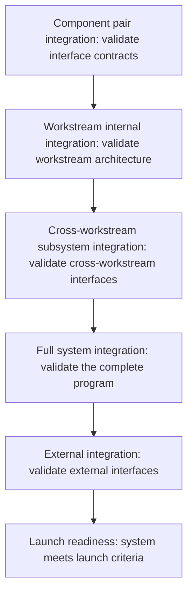

# Integration Sequencing

> **Core skill:** Planning the order in which components and workstreams integrate — progressive, risk-first, with each integration milestone producing confidence that survives the next one — so that integration failures surface early, not at launch.

## Why This Matters

Integration is where programs succeed or fail. Components that work perfectly in isolation fail at their first connection because assumptions did not match. The difference between a program that discovers this in month two — with time to adjust — and a program that discovers it in month eight — with a launch date next week — is integration sequencing.

The TPM does not design the integration. But the TPM designs the sequence: which components integrate first, in what order, and at what milestones. The sequence is the program's technical risk retirement plan. It puts the riskiest connections earliest, builds complexity progressively, and ensures that by the time the program reaches system-level integration, the components have already proven they can talk to each other in pairs and small groups.

## Progressive Integration Strategy

Progressive integration is the opposite of big-bang integration. Components connect in increasing scope — pairs first, then subsystems, then the full system — so that each level of integration is built on the confidence earned at the previous level.

| Level | What Integrates | Goal | Failure Surface |
|-------|----------------|------|----------------|
| **Component pair** | Two components that share an interface | Validate the interface contract works in both directions; find contract mismatches | One interface — failure is isolated and fast to debug |
| **Workstream internal** | All components within one workstream | Validate that the workstream's internal architecture works end to end | One workstream — failure is contained within the workstream's ownership |
| **Cross-workstream subsystem** | Two or three workstreams whose components form a coherent subsystem | Validate cross-workstream interfaces and data flow | A few interfaces — failure is scoped to a small group of workstreams |
| **Full system** | All workstreams, all components | Validate the entire program's integration; find emergent behaviors at scale | Every interface — failure is expensive to debug and risks the program timeline |
| **External integration** | The program's system with external systems not under program control | Validate external interfaces, SLAs, and failure modes | External interfaces — failure may be outside the program's ability to fix |

The TPM sequences the levels so that each one completes before the next begins. Pair integration starts while workstreams are still building; subsystem integration starts after pairs are stable; full system integration starts after subsystems are verified. The sequence is not a waterfall — pairs and subsystems overlap — but the dependency is enforced: no full system integration until subsystem integration passes.

## Integration Milestones

Every integration level has a milestone. The milestone is not "integration started" — it is "integration passed," with defined pass criteria.



| Milestone | Pass Criteria | Who Declares | TPM Verification |
|-----------|--------------|-------------|-----------------|
| **Pair integration complete** | Interface contract tests pass; both sides confirm the contract behaves as specified | Both component owners | Review test results; confirm any contract changes are documented |
| **Workstream integration complete** | Workstream's internal end-to-end tests pass; all internal interfaces verified | Workstream lead | Review test report; confirm readiness for cross-workstream integration |
| **Subsystem integration complete** | Cross-workstream tests pass; data flows correctly across workstream boundaries; contract tests pass on both sides | Workstream leads of the integrated workstreams | Review test results; confirm interface contracts are stable |
| **Full system integration complete** | End-to-end system tests pass; performance within targets; error handling verified; no critical or high-severity defects open | Architect and TPM jointly | Review test report; confirm defect backlog is triaged and accepted |
| **External integration complete** | External interface tests pass; SLA verification complete; failure mode testing complete | TPM and external partner lead | Review test results; confirm external partner sign-off |
| **Launch readiness** | All integration milestones passed; launch criteria met; rollback plan tested; monitoring in place | TPM, with steering committee approval | Present integration evidence to steering committee |

Every integration milestone produces evidence — test results, contract verification, performance data — that the TPM reviews and archives. A milestone declared without evidence is not complete; the TPM rejects it and asks for the data.

## Parallel vs Sequential Integration

Not all integration must be sequential. The TPM identifies which integration activities can run in parallel and which must wait for predecessors.

| Can Run in Parallel | Must Be Sequential |
|--------------------|--------------------|
| Component pair integrations that do not share components | Subsystem integration depends on the pairs within that subsystem passing |
| Workstream internal integrations across different workstreams | Full system integration depends on all subsystems passing |
| Integration test environment setup and test data preparation | External integration depends on full system integration passing (internal system must be stable first) |
| Non-functional testing (performance, security) on stable subsystems | Performance testing at full system scale depends on full system integration |
| External integration with multiple external partners (if partners are independent) | External integration with a partner that depends on another partner's system |

The TPM works with the architect to identify the dependency graph between integration activities and builds the schedule to maximize parallelism without violating dependency order. The goal is the shortest schedule that maintains progressive confidence — not the shortest possible schedule at the cost of skipping integration levels.

## The Integration Schedule

The integration schedule is not the program schedule. It is the subset of the program timeline dedicated to integration activities, and it drives the most critical dependencies in the program.

| Schedule Element | How to Build It | TPM's Focus |
|-----------------|----------------|------------|
| **Integration windows** | Block time on the calendar for each integration level; start with the target launch date and work backward | Ensure windows are long enough for the integration scope; resist pressure to compress integration time |
| **Environment availability** | Reserve integration environments for each window; confirm environment readiness before the window starts | Environment conflicts are the most common integration schedule killer; lock environments early |
| **Data readiness** | Ensure test data is available for each integration level; data must exercise edge cases, not just happy paths | Test data is often the last thing prepared and the first thing that blocks integration; track data readiness as a dependency |
| **Participant availability** | Confirm which engineers must be available during each integration window; block their calendars | Integration needs the people who built the components; do not let them be scheduled for other work during integration windows |
| **Rollback windows** | After each integration milestone, reserve time for fixes before the next level begins | A milestone passed with known defects becomes a debt that compounds at the next level |

The TPM publishes the integration schedule as a separate artifact from the program roadmap. It is more detailed, more technical, and more subject to change as integration discoveries are made. The integration schedule lives with the technical team; the program roadmap lives with stakeholders.

## Practical Applications

**Integration sequencing checklist:**

- [ ] Integration levels are defined: pair, workstream, subsystem, full system, external
- [ ] Every integration level has a milestone with explicit pass criteria
- [ ] Integration sequence is risk-first: riskiest interfaces integrate earliest
- [ ] Dependency graph between integration activities is mapped; parallel work is identified
- [ ] Integration environments are reserved and confirmed for every integration window
- [ ] Test data plan exists and is tracked as a dependency for each integration level
- [ ] Participant availability is confirmed for every integration window
- [ ] Rollback and fix windows are scheduled between integration levels

**Integration schedule template:**

```markdown
## Integration Schedule: [Program Name]

| Window | Level | Dates | Components/Workstreams | Environment | Pass Criteria | Owner |
|--------|-------|-------|----------------------|-------------|---------------|-------|
| I-01 | Pair: Payment API to Order | Oct 10-14 | WS1+WS2 | Staging-1 | Contract tests pass; both sides confirm | WS1 Lead |
| I-02 | Pair: Order to Fulfillment | Oct 10-14 | WS1+WS3 | Staging-1 | Contract tests pass; both sides confirm | WS1 Lead |
| I-03 | WS1 Internal | Oct 17-21 | All WS1 components | Staging-1 | End-to-end tests pass | WS1 Lead |
| I-04 | Subsystem: Order-to-Fulfill | Oct 24 - Nov 4 | WS1+WS2+WS3 | Staging-2 | Cross-workstream tests pass | TPM |
| I-05 | Full System | Nov 7-21 | All workstreams | Integration | Full system tests pass; perf within targets | Architect |
```

## Common Pitfalls

| Pitfall | Why It Is a Problem | Better Approach |
|---------|---------------------|-----------------|
| **Big-bang integration** | All components integrate at once at the end; integration failures are discovered when there is no time to fix them | Progressive integration: pairs, then subsystems, then full system |
| **Integration as an afterthought** | The schedule allocates build time generously and integration time minimally; integration becomes the bottleneck | Build the schedule backward from launch; protect integration windows from compression |
| **No pass criteria for integration milestones** | "Integration complete" means the components were connected, not that they worked correctly | Define pass criteria before the integration window starts; reject milestone declarations without evidence |
| **Skipping pair integration** | Workstreams go straight to subsystem or full system integration; interface mismatches surface in a complex environment where they are hard to debug | Always start with pair integration; validate every interface contract before combining components |
| **Test data as an afterthought** | Integration starts and the test data is not ready; teams test with production data or ad-hoc data that does not exercise edge cases | Plan test data as a dependency; track data readiness in the same status as component readiness |
| **Environment contention** | Multiple integration activities scheduled for the same environment at the same time; one team's testing breaks another's | Reserve environments explicitly; treat environment conflicts as schedule conflicts |

## Success Indicators

- Integration failures at each level are expected and planned for — no one is surprised
- Interface contract mismatches are discovered at pair integration, not at full system integration
- Every integration milestone is declared with evidence: test results, not verbal assurances
- The integration schedule survives with adjustments, not abandonment — delays are absorbed in rollback windows
- Full system integration finds no new interface contract issues — only emergent behaviors at scale

## Related Topics

- [[02_Understanding_System_Boundaries_and_Interfaces]]: the interface map that drives the integration sequence
- [[04_Technical_Risk_Identification]]: the risks that integration sequencing retires earliest
- [[07_Integration_Testing_and_Validation_Strategy]]: the test plan for each integration level
- [[03_Dependency_Management/00_overview|Dependency Management]]: integration dependencies are the most critical program dependencies
- [[career-path/06_Software_Architect/01_Architecture_Fundamentals/04_Architecture_Decision_Making|Architecture Decision Making (Architect)]]: the architecture decisions that define integration points

## Summary

Integration sequencing is the program's technical risk retirement plan: progressive integration from component pairs through subsystems to full system and external integration, with every level gated by explicit pass criteria and backed by evidence. The TPM sequences riskiest interfaces earliest, maximizes parallel integration within dependency constraints, protects integration windows from schedule compression, and ensures that by the time the program reaches launch readiness, every interface has been validated at increasing levels of complexity.