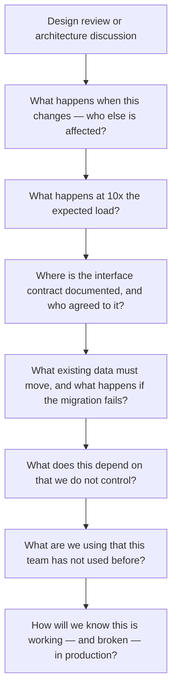

# Technical Risk Identification

> **Core skill:** Surfacing architecture and integration risks early — coupling, capacity, contract mismatch, data migration — by asking calibrated questions in design reviews and ensuring risks are owned, mitigated, and tracked before they become blockers.

## Why This Matters

Technical risks are the program's silent killers. They do not announce themselves in steering committee meetings. They surface in integration testing as "unexpected behavior," in production as outages, and in retrospectives as "we should have seen that coming." The TPM's job is to make them visible before they surface — to ask the questions that engineers may be too deep in the solution to ask, and to ensure every technical risk has an owner, a mitigation, and a place in the program's risk register.

The TPM does not identify technical risks through technical analysis. The TPM identifies them through pattern recognition: knowing the categories of risks that programs in this domain typically face, asking the same calibrated questions in every design review, and listening for the answers that sound like hand-waving. Technical risk identification is less about technical depth than about disciplined skepticism.

## Categories of Technical Risk

Technical risks fall into predictable categories. The TPM knows the categories and uses them as a checklist in every technical review.

| Risk Category | What It Means | How It Manifests in a Program | Example |
|--------------|---------------|------------------------------|---------|
| **Coupling risk** | Components are too tightly connected; a change in one forces changes in others; integration windows become serialized | Workstreams cannot proceed independently; every integration requires both teams to be available simultaneously | Shared database schema change blocks three workstreams for two weeks |
| **Capacity risk** | The system cannot handle the expected load, data volume, or concurrency | Performance degrades under load; system fails at peak; scaling plan is untested | Load test at 50 percent of target throughput reveals 30-second latency spikes |
| **Contract mismatch risk** | The interface contract is ambiguous, incomplete, or interpreted differently by provider and consumer | Components integrate and produce incorrect results; data is corrupted or lost at the boundary | Payment API returns amounts in cents; order service interprets them as dollars |
| **Data migration risk** | Existing data must be transformed, moved, or validated; the migration fails, corrupts data, or takes too long | Migration scripts fail in production; data integrity is compromised; rollback is impossible | Migration of 50 million records times out; half the records are in the new schema, half in the old |
| **External dependency risk** | The program depends on a system, team, or vendor outside its control | External system changes its API without notice; external team misses its delivery date; vendor goes out of business | Third-party authentication provider deprecates the API version the program is built on |
| **Novelty risk** | The program uses technology, patterns, or scale that the team has not used before | Estimates are wildly inaccurate; unknown unknowns surface late; the team learns on the critical path | Team adopts a new event streaming platform; discovers at integration that message ordering is not guaranteed |
| **Security and compliance risk** | The system has vulnerabilities or does not meet regulatory requirements | Security review fails late; compliance audit blocks launch; data breach occurs | Penetration test three weeks before launch finds critical vulnerabilities requiring architecture changes |
| **Operational risk** | The system cannot be operated reliably: monitoring is missing, runbooks are incomplete, rollback is untested | Incidents cannot be diagnosed; outages are prolonged; the on-call team cannot operate the system | System fails in production; monitoring shows the symptom but not the cause; incident lasts six hours |

The TPM uses these categories as a lens in every design review. Instead of asking "are there any risks?" — which produces "we have it covered" — the TPM asks "what is the coupling risk between these two components?" The category names the risk; the engineers describe the mitigation.

## The TPM's Risk Questions

Certain questions surface technical risk reliably. The TPM keeps them ready and asks them in design reviews, architecture discussions, and technical status updates.



| Risk Question | Category Targeted | Red-Flag Answer |
|--------------|-------------------|----------------|
| "What happens when this component changes — who else is affected?" | Coupling risk | "We will handle it when it happens" — no impact analysis; change propagation is unknown |
| "What happens at 10x the expected load?" | Capacity risk | "The architecture should handle it" — no load test; scaling assumptions are untested |
| "Where is the interface contract documented, and who agreed to it?" | Contract mismatch risk | "The teams discussed it in a meeting" — no written contract; assumptions will diverge |
| "What existing data must move, and what happens if the migration fails?" | Data migration risk | "The migration is straightforward" — no migration plan; no rollback tested |
| "What does this depend on that we do not control?" | External dependency risk | "The external team is reliable" — no SLA; no fallback if they are not |
| "What are we using that this team has not used before?" | Novelty risk | "We will figure it out" — no spike; no time allocated for learning |
| "How will we know this is working — and broken — in production?" | Operational risk | "We will add monitoring later" — monitoring deferred; operational blindness guaranteed |
| "What is the rollback plan if this does not work?" | Multiple categories | "We will not need to roll back" — irreversibility assumed; no contingency |

The TPM asks these questions in every technical forum. The questions do not change; the answers do. The TPM is not testing the engineers — the TPM is surfacing risks that the engineers may not have considered, and ensuring that every risk that is surfaced gets an owner, a mitigation, and a tracking entry.

## Surfacing Technical Risks from Design Reviews

Design reviews are the TPM's primary risk-identification venue. The TPM attends not to critique the design but to listen for risks.

| What the TPM Listens For | Why It Signals Risk | TPM Response |
|--------------------------|--------------------|-------------|
| "We assume..." | An unvalidated assumption is the seed of a future surprise | Ask: "How will we validate that assumption, and when?" |
| "It should work" | "Should" means untested; untested means unknown | Ask: "When will we know it works, and what test proves it?" |
| "We will handle that later" | Deferred work is often forgotten work; integration discovers it | Ask: "What is the latest date 'later' can be without risking the program?" |
| "The other team is handling that" | Shared ownership is often no ownership; the boundary is unclear | Ask: "Who on the other team, and have they confirmed?" |
| "That is an edge case" | Edge cases are where systems fail; dismissing them is dismissing risk | Ask: "How many edge cases have we catalogued, and which ones are in the test plan?" |
| "We did something similar before" | Similar is not identical; the differences carry risk | Ask: "What is different this time, and what does that difference mean for risk?" |

The TPM captures every risk heard in a design review, assigns an owner before leaving the room, and enters it into the program risk register. A risk heard and not captured is a risk that will surface later as a surprise.

## From Risk Identification to Risk Register

Identifying a risk is not managing it. The TPM ensures every technical risk moves from identification to the program risk register with a standard entry.

| Risk Register Field | What It Contains | Example |
|--------------------|-----------------|---------|
| **Risk ID** | Unique identifier | TR-014 |
| **Category** | From the technical risk categories | Contract mismatch risk |
| **Description** | One sentence: what could go wrong | Payment API amounts in cents misinterpreted as dollars by order service |
| **Probability** | Likelihood: high, medium, low | Medium |
| **Impact** | Consequence if it materializes: critical, high, medium, low | Critical — incorrect financial transactions |
| **Owner** | One person accountable for mitigation | Payment API tech lead |
| **Mitigation** | What is being done to prevent or reduce the risk | Contract specifies currency unit explicitly; contract test validates amount interpretation with edge cases |
| **Trigger** | What event or date makes this risk materialize | Integration milestone I-01: Payment API to Order Service pair integration |
| **Status** | Open, mitigated, closed, materialized | Open — mitigation in progress |

The TPM reviews the technical risk register at every program review. Risks that are "open" with no mitigation activity for two consecutive reviews are escalated. Risks that materialize move to the issue register and are managed as active issues.

## Practical Applications

**Technical risk identification checklist:**

- [ ] Every design review includes the TPM's standard risk questions
- [ ] Risks heard in design reviews are captured with owners before the review ends
- [ ] Every technical risk is categorized using the eight risk categories
- [ ] Every technical risk has a probability, impact, owner, mitigation, and trigger
- [ ] The technical risk register is reviewed at every program review
- [ ] Risks with no mitigation activity for two reviews are escalated
- [ ] Materialized risks move immediately to the issue register

**Design review risk capture template:**

```markdown
## Technical Risks Identified: [Design Review Name] — [Date]

| # | Risk | Category | Owner | Mitigation | Validated By |
|---|------|----------|-------|------------|-------------|
| 1 | [Risk description] | [Category] | [Name] | [Mitigation approach] | [Date/milestone] |

## Assumptions Requiring Validation
| # | Assumption | Validation Method | Validated By | Owner |
|---|-----------|-------------------|-------------|-------|
| 1 | [Assumption] | [How to prove or disprove] | [Date] | [Name] |
```

## Common Pitfalls

| Pitfall | Why It Is a Problem | Better Approach |
|---------|---------------------|-----------------|
| **"No technical risks" in a complex program** | Risks exist; claiming none means they are not being looked for or not being surfaced | Use the risk categories as a checklist; ask the calibrated questions; risks will surface |
| **Risk identification without ownership** | A risk is named but nobody is accountable for mitigating it; the risk drifts until it materializes | Assign an owner before leaving the room; the owner must accept the assignment |
| **Only identifying risks at program initiation** | Technical risks evolve as the design evolves; a risk identified at month one may be irrelevant at month six, while new risks have emerged | Review the technical risk register at every program review; add and retire risks continuously |
| **Risk description too vague to mitigate** | "Performance might be a problem" is a concern, not a risk; no specific mitigation is possible | Describe the risk specifically: "The order service p95 latency exceeds 200ms at 500 TPS, violating the SLA for the checkout flow" |
| **TPM identifying risks the engineers should own** | The TPM becomes the risk oracle; engineers stop identifying their own risks | The TPM asks the questions; the engineers name the risks; the TPM ensures they are captured and tracked |
| **Risk register as a document, not a practice** | The register exists but is never reviewed; risks are tracked on paper, not in decision-making | Review the register at every program review; use it to drive mitigation activity and escalation |

## Success Indicators

- Technical risks surface in design reviews, not in integration testing
- Every technical risk in the register has an owner who can describe their mitigation in one sentence
- The risk register shrinks over time — risks are mitigated, not accumulated
- Materialized risks move to the issue register within one review cycle
- Engineers volunteer risks in design reviews because they know the TPM will ensure they are managed, not punished

## Related Topics

- [[01_Technical_Fluency_for_TPMs]]: the technical context that makes the risk questions meaningful
- [[02_Understanding_System_Boundaries_and_Interfaces]]: boundaries are where technical risk concentrates
- [[03_Integration_Sequencing]]: integration sequencing is the program's plan for retiring technical risk
- [[04_Risk_and_Issue_Leadership/00_overview|Risk and Issue Leadership]]: the broader risk management framework this feeds into
- [[career-path/06_Software_Architect/01_Architecture_Fundamentals/04_Architecture_Decision_Making|Architecture Decision Making (Architect)]]: the architect's role in identifying and owning technical risk

## Summary

Technical risk identification is the TPM's disciplined skepticism: eight categories of risk as a checklist, calibrated questions asked in every design review, listening for the answers that signal unvalidated assumptions or deferred work, and ensuring every risk moves from identification to the program risk register with an owner, a mitigation, and a trigger date. The TPM does not identify risks through technical analysis — the TPM surfaces them through the questions that engineers, deep in the solution, may not have thought to ask.