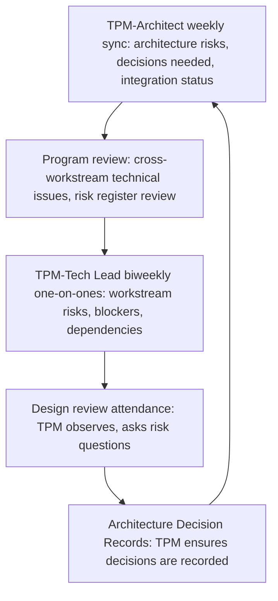

# Working with Architects and Tech Leads

> **Core skill:** Building a productive partnership with the program's technical authorities — architect and tech leads — where the TPM owns the integration flow, the cadence, and the decision process, while technical authorities own the technical content.

## Why This Matters

The TPM-architect and TPM-tech-lead relationship is the program's technical-operational axis. When it works, the architect identifies the technical risks, the TPM ensures they are tracked and mitigated on the program timeline. The tech leads own their workstream's technical execution; the TPM ensures cross-workstream technical issues are surfaced and resolved. When it does not work, the architect designs in isolation, the tech leads optimize locally, and the TPM discovers at integration that the pieces do not fit.

This relationship is not hierarchical. The TPM does not manage the architect or the tech leads. It is a partnership of equals with distinct domains: the TPM owns the process, the schedule, the risk tracking, and the cross-workstream coordination; the architect and tech leads own the technical decisions, the design, and the technical quality. The TPM who tries to own both domains loses the partnership; the TPM who abdicates the technical domain loses the program.

## Division of Responsibility

The partnership works when responsibilities are clearly divided and mutually understood. Ambiguity about who does what is the most common source of friction between TPMs and technical authorities.

| Responsibility | TPM | Architect | Tech Lead (Workstream) |
|---------------|-----|-----------|------------------------|
| Program-level architecture decisions | Facilitates the decision forum; ensures decisions are recorded and communicated | Owns the decision: frames options, recommends, decides or escalates | Consulted: provides workstream-level input |
| Workstream-level technical decisions | Aware of decisions; ensures they do not conflict across workstreams | Consulted on decisions with cross-workstream impact | Owns the decision within the workstream |
| Technical risk identification | Asks calibrated questions; ensures risks are captured and tracked | Identifies architecture-level risks; owns technical risk assessment | Identifies workstream-level risks; owns workstream mitigations |
| Integration sequencing | Owns the integration schedule and milestones | Advises on technical dependencies and sequencing constraints | Executes integration for their workstream |
| Technical status reporting | Aggregates workstream technical status into program-level view | Reports architecture status, technical debt, and architecture risks | Reports workstream technical status, blockers, and risks |
| Stakeholder technical communication | Translates technical status for non-technical stakeholders | Communicates architecture decisions and rationale to technical stakeholders | Communicates workstream technical approach to their team and peers |
| Technical quality standards | Ensures quality gates are in the program plan and enforced | Defines architecture quality standards; reviews for compliance | Implements quality standards within the workstream |

The division is simple: technical authorities decide what to build and how to build it; the TPM ensures they decide on time, with the right people in the room, and that the program acts on the decision. When either side crosses the line — the TPM making technical decisions, or the architect running the program review — the partnership strains and the program suffers.

## The Partnership Cadence

The TPM-architect and TPM-tech-lead relationship runs on a deliberate cadence of touchpoints. Ad-hoc communication is necessary but insufficient; the cadence ensures nothing falls through the gaps.



| Touchpoint | Frequency | Participants | Agenda |
|-----------|-----------|-------------|--------|
| **TPM-Architect sync** | Weekly | TPM, architect | Architecture risks; decisions needed and timeline; integration status; technical debt that affects program timeline; upcoming design reviews |
| **Program review (technical segment)** | Biweekly | TPM, architect, all tech leads | Cross-workstream technical issues; risk register review; dependency status; integration milestone readiness |
| **TPM-Tech Lead one-on-one** | Biweekly | TPM, individual tech lead | Workstream technical risks; blockers the tech lead cannot resolve; dependencies on other workstreams; upcoming decisions |
| **Design review attendance** | As scheduled | TPM (observer), architect, tech leads, engineers | TPM listens for risks and assumptions; asks calibrated questions; captures risks for the register |
| **Architecture Decision Record review** | After each significant decision | TPM, architect | TPM confirms decision is recorded; ensures impacted workstreams are informed; updates program timeline if decision affects schedule |

The TPM owns this cadence. It is the TPM's job to schedule the syncs, run them on time, and ensure they produce outcomes — not just conversation. A TPM-architect sync that ends with "no updates" for three consecutive weeks is a signal that the cadence is not working or the participants are not engaging.

## When to Bring Architecture In

The TPM decides when to pull the architect into a program conversation. Bringing architecture in too early wastes the architect's time on unformed problems; bringing them in too late produces decisions that must be reversed.

| Situation | When to Involve the Architect | TPM's Move |
|-----------|------------------------------|-----------|
| New workstream being formed | During workstream chartering — architect ensures technical coherence with program architecture | Schedule architect review of workstream charter before charter is signed |
| Cross-workstream technical conflict | As soon as the conflict is identified — architect mediates or decides | Bring architect into the next program review; frame the conflict as a decision needed |
| Significant scope change proposed | Before the scope change is approved — architect assesses technical impact | Request architect impact assessment; include in scope change proposal to steering committee |
| Integration milestone approaching | At prep review — architect confirms technical readiness | Architect reviews test results; confirms integration pass criteria are met |
| Technical risk materializes | Immediately — architect assesses impact and proposes response | Escalate to architect within 24 hours; convene technical response session |
| Stakeholder asks a technical question the TPM cannot answer | Before the TPM responds — architect provides the answer or joins the conversation | Route the question to the architect; do not guess |

The TPM treats the architect's time as a scarce resource. The architect is not in every meeting; the TPM brings them in when technical authority is needed. Between those moments, the weekly TPM-architect sync keeps the architect informed and the TPM equipped with enough context to operate independently.

## When the TPM Facilitates vs Observes

The TPM shifts between facilitator and observer depending on the technical forum. Knowing which role to play in which forum is a core TPM skill.

| Forum | TPM Role | What the TPM Does |
|-------|---------|-------------------|
| **Architecture decision forum** | Facilitator | Frames the decision; ensures options are documented; manages the discussion; drives toward closure; records the decision |
| **Design review** | Observer | Listens for risks and assumptions; asks calibrated questions; captures risks for the register; does not critique the design |
| **Technical deep-dive (e.g., performance analysis)** | Observer | Listens for implications on program timeline and risk; asks "what does this mean for the program?"; does not participate in technical analysis |
| **Incident response** | Facilitator | Runs the incident coordination; ensures communication flows; tracks action items; does not debug the system |
| **Cross-workstream technical negotiation** | Facilitator | Brings the right people together; keeps the conversation focused on interface contracts and dependencies; ensures agreement is reached and recorded |
| **Workstream standup** | Observer (infrequent) | Observes team health and blockers; does not run the standup or assign work |

The rule: the TPM facilitates when the forum's purpose is to produce a decision or agreement that affects the program; the TPM observes when the forum's purpose is technical analysis or design that the TPM is not qualified to lead. The TPM who facilitates a design review loses credibility; the TPM who observes during a decision forum loses control.

## Building the Partnership

The TPM-architect partnership does not happen by default. It is built deliberately, starting at program initiation.

| Phase | TPM Action | Outcome |
|-------|-----------|---------|
| **Program initiation** | Meet with architect; establish the division of responsibility; agree on the partnership cadence; review the architecture together | Shared understanding of who does what; calendar holds for all cadence touchpoints |
| **First month** | Run the first TPM-architect sync; attend the first design review as observer; establish the rhythm | Cadence is tested; adjustments made; trust begins to form |
| **First technical conflict** | Facilitate the resolution; keep the TPM in the facilitator role; ensure the architect's decision is recorded and communicated | Proof that the partnership works under pressure; both parties see the value |
| **Ongoing** | Maintain the cadence; protect the architect's time; escalate when the architect is not engaged | Sustained productive partnership; program benefits from aligned technical and operational leadership |

The TPM invests in the relationship. A weekly sync that is the first thing cancelled when schedules get busy is not a partnership — it is an intention. The TPM protects the cadence and shows up prepared.

## Practical Applications

**Partnership health checklist:**

- [ ] Division of responsibility is documented and agreed with architect and tech leads
- [ ] TPM-architect weekly sync is on the calendar and protected from cancellation
- [ ] TPM-tech lead biweekly one-on-ones are scheduled for every workstream tech lead
- [ ] The architect's role in governance forums is defined: steering committee, program review, design reviews
- [ ] The TPM knows when to facilitate and when to observe in every technical forum
- [ ] Architecture decisions are recorded in ADRs within one week of the decision
- [ ] The architect escalates technical concerns to the TPM; the TPM escalates program concerns to the architect

**Partnership agreement template:**

```markdown
## TPM-Architect Partnership: [Program Name]

### Division of Responsibility
- Architect owns: [list of technical domains and decisions]
- TPM owns: [list of program domains and processes]
- Shared: [list of joint responsibilities]

### Cadence
- Weekly sync: [day, time, duration]
- Program review attendance: architect attends [which segments]
- Design review attendance: TPM attends [which reviews]

### Communication
- Urgent technical issues: architect escalates to TPM via [channel]
- Urgent program issues: TPM escalates to architect via [channel]
- Stakeholder technical questions: TPM routes to architect; architect responds within [timeframe]

### Decision Recording
- Architecture decisions recorded as ADRs in [location]
- TPM reviews ADRs within one week for program impact
```

## Common Pitfalls

| Pitfall | Why It Is a Problem | Better Approach |
|---------|---------------------|-----------------|
| **TPM bypassing the architect** | The TPM makes or facilitates technical decisions without the architect present; decisions lack authority and may be reversed | Always include the architect in technical decision forums; the architect is not optional |
| **Architect bypassing the TPM** | The architect makes decisions that affect the program timeline without the TPM's knowledge; the TPM discovers the impact at the next milestone | Architect informs TPM of decisions immediately; TPM assesses program impact within 24 hours |
| **No regular cadence** | Communication is ad-hoc; risks and decisions fall through the gaps; the partnership is reactive | Establish and protect the cadence; a weekly sync that never gets cancelled is the partnership's backbone |
| **TPM in every technical meeting** | The TPM's calendar fills with meetings where they add no value; the TPM burns out and the program loses operational leadership | The TPM attends design reviews as observer, facilitates decision forums, and delegates the rest |
| **Architect as "the technical TPM"** | The architect is asked to run program processes — status tracking, risk register maintenance, stakeholder communication | The architect owns technical content; the TPM owns program process; do not blur the line |
| **TPM defers all technical questions to the architect** | The TPM abdicates technical context; cannot facilitate technical discussions because they cannot frame the issue | Maintain calibrated fluency; the TPM frames the question; the architect provides the answer |

## Success Indicators

- The architect proactively surfaces technical risks to the TPM before they become program issues
- The TPM-architect weekly sync is the first meeting rescheduled, not the first cancelled
- Design reviews produce captured risks and action items — not just design critique
- Architecture decisions are recorded within one week and communicated to affected workstreams
- Tech leads describe the TPM as "the person who makes cross-workstream technical work possible"

## Related Topics

- [[01_Technical_Fluency_for_TPMs]]: the technical context that makes the partnership productive
- [[06_Technical_Decision_Facilitation]]: the facilitation skill the TPM brings to architecture decisions
- [[04_Technical_Risk_Identification]]: the risks the architect identifies and the TPM tracks
- [[career-path/06_Software_Architect/01_Architecture_Fundamentals/04_Architecture_Decision_Making|Architecture Decision Making (Architect)]]: the architect's decision-making practice the TPM facilitates
- [[career-path/05_Tech_Lead/04_Team_Delivery_and_Execution_Leadership/00_overview|Delivery and Execution Leadership (TL)]]: the tech lead's delivery leadership the TPM coordinates across workstreams

## Summary

The TPM-architect and TPM-tech-lead partnership is the program's technical-operational axis: a division of responsibility where technical authorities own what and how, the TPM owns when and whether it integrates, running on a deliberate cadence of syncs and touchpoints, with the TPM shifting between facilitator and observer depending on the forum. The partnership is built deliberately at program initiation, protected through execution, and measured by whether technical risks surface before they become program crises.