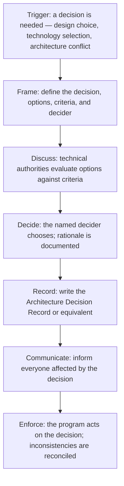

# Technical Decision Facilitation

> **Core skill:** Facilitating technical decisions the TPM does not make — framing architecture options, managing the discussion, driving toward closure, and recording decisions so they stick — without substituting the TPM's judgment for the technical authority's.

## Why This Matters

Programs are decision factories. Architecture choices, technology selections, integration approach decisions — every one of these shapes the program's timeline, risk profile, and cost. When these decisions are made in hallways, they are forgotten, challenged, and re-made. When they are made without the right people in the room, they are reversed. When they are not made at all, the program drifts into de-facto decisions that nobody chose and everyone is stuck with.

The TPM does not make technical decisions. But the TPM owns the decision process: ensuring decisions are framed clearly, the right people are in the room, the discussion stays productive, the decision gets made on time, and the outcome is recorded and communicated. Technical decision facilitation is the TPM's highest-leverage technical contribution — not choosing the answer, but making sure the answer is chosen well and sticks.

## The Technical Decision Lifecycle

Every significant technical decision follows a lifecycle. The TPM owns the lifecycle and ensures the decision moves through each stage without stalling.



| Stage | TPM Role | What the TPM Does | What the TPM Does Not Do |
|-------|---------|-------------------|------------------------|
| **Trigger** | Recognizes or surfaces the need for a decision | Identifies when indecision is blocking progress; names the decision needed | Determines whether a technical question is significant enough — the architect decides that |
| **Frame** | Facilitates framing | Works with the architect to define the decision statement, the options, the evaluation criteria, and who decides | Evaluates the options or recommends one — that is the architect's role |
| **Discuss** | Manages the discussion | Brings the right people together; keeps the discussion on track; ensures all options are heard; prevents premature closure or endless debate | Participates in the technical evaluation; argues for or against a technical option |
| **Decide** | Ensures closure | Asks "what is the decision?" when discussion has converged; confirms the decider is ready to commit; captures dissent | Makes the decision — unless the decider explicitly delegates and the TPM has the technical competence |
| **Record** | Ensures recording | Confirms the decision is written down in a standard format; reviews the ADR for completeness | Writes the ADR — the architect or decider writes it; the TPM reviews for process |
| **Communicate** | Drives communication | Identifies who needs to know; ensures the decision reaches them; confirms they understand the implications | Interprets the technical implications — the architect explains what the decision means technically |
| **Enforce** | Tracks consistency | Ensures workstream plans align with the decision; surfaces inconsistencies at program review | Enforces technical compliance — the architect does that through design reviews |

The TPM's role is process ownership from trigger to enforcement. When the decision stalls at any stage, the TPM diagnoses why and unblocks it — not by making the decision, but by fixing whatever is preventing it from being made.

## Framing the Decision

Badly framed decisions produce bad outcomes regardless of the quality of the discussion. The TPM ensures every technical decision is framed before the room gathers.

| Frame Element | What It Answers | Example |
|--------------|-----------------|---------|
| **Decision statement** | What exactly are we deciding? One sentence, no ambiguity | "Choose the message broker for cross-service communication: Kafka vs RabbitMQ vs cloud-native SQS" |
| **Options** | What are the viable alternatives? Include "do nothing" or "defer" if they are real options | Kafka (self-managed), RabbitMQ (self-managed), SQS (AWS managed), Defer decision until prototype validates throughput requirements |
| **Evaluation criteria** | How will we evaluate the options? Weighted, if weights matter | Throughput (weight 0.3), operational overhead (0.25), team experience (0.2), cost (0.15), ecosystem fit (0.1) |
| **Constraints** | What is off the table? Budget ceilings, technology standards, organizational mandates | Must run on AWS; cannot require dedicated operations team; must integrate with existing Python services |
| **Decider** | Who makes the final call? One person or a named group with a tie-breaker | Architect decides; tech leads provide input; TPM facilitates |
| **Deadline** | When must the decision be made? What depends on it? | Decision by October 15; Workstream 3 needs the broker choice to begin implementation on October 20 |

The TPM does not define these elements alone. The architect owns the technical content of the frame — the options, the criteria, the constraints. The TPM ensures the frame exists as a written document before the discussion begins. A discussion that starts without a frame is a debate, not a decision process — and debates do not reliably produce decisions.

## Managing the Discussion

The TPM runs the decision meeting. The content belongs to the technical authorities; the process belongs to the TPM.

| Discussion Phase | TPM Move | Anti-Pattern to Prevent |
|-----------------|---------|------------------------|
| **Opening** | Restate the decision statement, options, criteria, and decider from the frame document | Starting the discussion without re-grounding — participants argue from different frames |
| **Option presentation** | Each option is presented by its advocate; equal time; factual, not persuasive | One option dominates the conversation; alternatives are not fully explored |
| **Evaluation** | Walk through criteria one at a time; rate each option against the current criterion; capture disagreements | Criteria are skipped or collapsed; evaluation becomes "I like option A" without reference to criteria |
| **Deliberation** | Manage airtime: quiet voices are drawn out; dominant voices are contained; ensure the decider hears all perspectives | A few loud voices determine the outcome; the decider does not hear dissenting views |
| **Closure** | Ask the decider: "Based on this discussion, what is your decision?" Capture the decision and the rationale | Discussion ends with "we will think about it" — no decision, no next step |
| **Dissent recording** | Ask: "Does anyone disagree with this decision strongly enough to have their dissent recorded?" Capture dissent in the ADR | Dissent is suppressed; it resurfaces later as passive resistance or reversal |

The TPM's most important move in the discussion is neutrality. The TPM does not express a preference, does not argue for or against an option, and does not summarize the discussion in a way that favors one side. The TPM who advocates for a technical option loses the facilitator role and cannot recover it for the rest of the program.

## Reaching Closure

The hardest part of technical decision facilitation is closure. Groups naturally resist committing; the TPM's job is to recognize when the discussion has produced enough information to decide and to drive toward the decision.

| Closure State | What It Looks Like | TPM Move |
|--------------|--------------------|---------|
| **Consensus** | All participants agree on the best option; the decider confirms | Declare the decision; move to recording |
| **Consent** | Not everyone agrees it is the best option, but everyone can live with it; the decider chooses | Confirm the decider's choice; ask "can everyone live with this?"; record any dissent |
| **Decider decides** | Consensus and consent are not reached; the named decider makes the call | Ask the decider: "You have heard all perspectives. What is your decision?"; record the decision with the decider's rationale |
| **More information needed** | The discussion reveals a critical gap in information; deciding now would be guessing | Pause the decision; define exactly what information is needed, who will get it, and when the decision will resume |
| **Decision deferred** | The decision is genuinely not needed yet, and deferring has no cost | Confirm the deferral is deliberate; set a date to revisit; do not let it drift indefinitely |

The TPM's closure test: "If we do not decide now, when will we decide, and what changes between now and then?" If the answer is "nothing changes," the decision should be made now. If the answer identifies specific information that will arrive by a specific date, deferral is legitimate. If the answer is vague, the TPM pushes for closure — uncertainty is not a reason to defer; it is a reason to decide with a contingency.

## Recording Decisions with ADRs

Architecture Decision Records (ADRs) are the standard format for recording technical decisions. The TPM ensures every significant technical decision produces an ADR.

| ADR Section | Content | Who Writes It |
|------------|---------|---------------|
| **Title** | Decision statement: "ADR-014: Use Kafka for cross-service messaging" | Architect or decider |
| **Status** | Proposed, Accepted, Deprecated, Superseded | Architect or decider |
| **Context** | Why the decision is needed; what forces are at play; what constraints apply | Architect or decider |
| **Decision** | What was decided; one paragraph | Architect or decider |
| **Consequences** | What becomes easier, harder, or different because of this decision | Architect or decider |
| **Options Considered** | Each option with pros and cons against the evaluation criteria | Architect or decider |
| **Dissent** | Who dissented and why (if applicable) | TPM captures during the decision meeting |

The TPM does not write the ADR. The TPM ensures the ADR is written within one week of the decision, reviews it for completeness, and ensures it is published to a location accessible to all program participants. An ADR that lives in the architect's documents folder is not accessible; the TPM ensures it lives in the program's shared knowledge base.

## Practical Applications

**Decision facilitation checklist:**

- [ ] Decision is framed before the room gathers: statement, options, criteria, constraints, decider, deadline
- [ ] The right people are in the room: decider, technical authorities, stakeholders affected by the decision
- [ ] The TPM runs the meeting as a neutral facilitator; does not advocate for any option
- [ ] Discussion follows the evaluation criteria; options are rated against criteria, not preferences
- [ ] Decision reaches closure: consensus, consent, or decider decides
- [ ] Dissent is recorded if present
- [ ] ADR is written within one week and published to the program's shared knowledge base
- [ ] Decision is communicated to everyone affected within the same week

**Decision frame template:**

```markdown
## Decision Frame: [Decision Statement]

### Decision Statement
[One sentence: what exactly are we deciding?]

### Options
1. [Option A]: [One-sentence description]
2. [Option B]: [One-sentence description]
3. [Option C — include "do nothing" or "defer" if real options]

### Evaluation Criteria
| Criterion | Weight | Description |
|-----------|--------|-------------|
| [Criterion 1] | [Weight] | [How to evaluate options against this criterion] |

### Constraints
- [Constraint 1: budget, technology standard, organizational mandate]

### Decider
[Name/Role]: [Decision authority — decides, or recommends to whom]

### Deadline
[Date]: [What depends on this decision]
```

## Common Pitfalls

| Pitfall | Why It Is a Problem | Better Approach |
|---------|---------------------|-----------------|
| **Decision without a frame** | Participants argue from different assumptions; the discussion covers the same ground repeatedly; no closure | Frame every decision before the room gathers; distribute the frame 48 hours before the meeting |
| **TPM advocating for a technical option** | The TPM loses neutrality; the decision is seen as the TPM's preference; the facilitator role is permanently damaged | The TPM is neutral; if the TPM has technical expertise relevant to the decision, contribute it before the meeting, not during facilitation |
| **Closure by exhaustion** | The group discusses until everyone is too tired to continue; the last option discussed becomes the decision by default | The TPM watches for convergence; when discussion cycles over the same ground, drive toward closure |
| **Decision not recorded** | The decision is made verbally and forgotten; three months later, nobody remembers what was decided or why | ADR written within one week; published to the shared knowledge base; referenced in future decisions |
| **ADR without consequences** | The decision is recorded but its implications are not thought through; the program discovers the consequences at integration | The consequences section of the ADR is mandatory; review it with affected workstreams before finalizing |
| **Decision forum as design review** | The meeting intended to decide becomes a meeting to discuss technical details; the decision is deferred | Separate design review from decision forum; design review explores; decision forum decides |

## Success Indicators

- Technical decisions are made on the program timeline — not too early (without enough information), not too late (blocking workstreams)
- Decisions stick: they are not re-litigated in the next meeting or reversed by stakeholders who were not consulted
- Every significant technical decision has an ADR accessible to all program participants
- The decision forum includes the right people — the architect, the affected tech leads, the TPM — and nobody else
- Participants describe the TPM's facilitation as "neutral and productive" — not "the TPM pushed their preference"

## Related Topics

- [[01_Technical_Fluency_for_TPMs]]: the technical context to frame decisions without making them
- [[05_Working_with_Architects_and_Tech_Leads]]: the partnership that gives the TPM access to the deciders
- [[04_Technical_Risk_Identification]]: decisions that defer risk create technical risk entries
- [[06_Decision_Facilitation/00_overview|Decision Facilitation]]: the broader decision facilitation framework across all program domains
- [[career-path/06_Software_Architect/01_Architecture_Fundamentals/04_Architecture_Decision_Making|Architecture Decision Making (Architect)]]: the ADR practice the TPM facilitates and the architect owns

## Summary

Technical decision facilitation is the TPM's process ownership of decisions the TPM does not make: frame every decision before the room gathers, run the discussion as a neutral facilitator, drive toward closure when the discussion has produced enough to decide, ensure the decision is recorded in an ADR within a week, and communicate it to everyone affected. The TPM does not choose the answer — the TPM ensures the answer is chosen well, on time, and in a way that sticks.