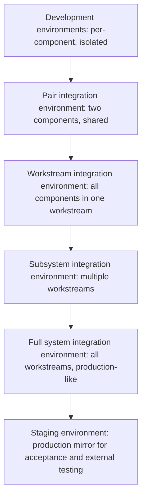

# Integration Testing and Validation Strategy

> **Core skill:** Ensuring the program has an integration validation plan — test levels, environments, data, and defect management — that catches integration failures before user-facing testing and provides evidence for every integration milestone.

## Why This Matters

Integration testing is where programs prove they work — or discover they do not. The difference between a program that discovers integration failures in a controlled test environment at month four, and a program that discovers them in production at month ten, is the integration testing and validation strategy. The TPM does not design the tests or write the test cases. But the TPM ensures the strategy exists, is resourced, is executed on the program timeline, and produces the evidence needed to declare integration milestones complete.

Programs that treat integration testing as "the QA team will handle it" discover at launch that the QA team tested components, not integrations — and the components worked, but the connections did not. The TPM's role is to ensure integration testing is planned at the program level, resourced across workstreams, and treated as a first-class program activity, not a tail-end quality gate.

## Test Levels in the Integration Validation Strategy

Integration validation spans multiple test levels, each with a distinct purpose, ownership, and place in the program timeline. The TPM ensures every level is planned and resourced.

| Test Level | Purpose | When It Runs | Who Owns It | TPM's Focus |
|-----------|---------|-------------|------------|-------------|
| **Component contract testing** | Validate that a single component meets its interface contract in isolation | During component development; before pair integration | Component owner | Ensure contracts are tested before components are handed off for integration |
| **Pair integration testing** | Validate that two components integrate correctly across their shared interface | After both components pass contract testing; before workstream internal integration | Both component owners jointly | Ensure test covers both happy paths and edge cases from the interface contract |
| **Workstream integration testing** | Validate that all components within a workstream integrate correctly end to end | After all pair integrations within the workstream pass | Workstream lead | Ensure the workstream is ready for cross-workstream integration; review test report at milestone |
| **Subsystem integration testing** | Validate that two or three workstreams integrate correctly across their interfaces | After workstream integration testing passes for all participating workstreams | Workstream leads jointly; TPM coordinates | Ensure cross-workstream data flow is correct; validate interface contracts at scale |
| **Full system integration testing** | Validate the complete program system end to end, including all workstreams | After all subsystem integrations pass | Architect and TPM jointly | Ensure the full system behaves correctly; performance, error handling, and edge cases at scale |
| **External integration testing** | Validate integration with external systems not under program control | After full system integration is stable; requires external partner availability | TPM and external partner lead | Ensure external interfaces work under real conditions; validate SLAs and failure modes |
| **Acceptance testing** | Validate that the system meets stakeholder requirements and outcome criteria | After full system integration passes; before launch | TPM and stakeholders | Ensure the system delivers the program's stated outcomes, not just technical correctness |

The TPM sequences these levels to match the integration sequencing plan. Each level gates the next: pair testing must pass before workstream testing; workstream testing must pass before subsystem testing. The TPM enforces the gate — a test level that is skipped or passed with known defects creates a debt that compounds at the next level.

## Integration Test Environments

Integration testing requires environments that match the integration scope. The TPM ensures environments are planned, provisioned, and available when the integration windows open.



| Environment | Scope | Required Fidelity | Common Failure Mode | TPM's Mitigation |
|------------|-------|-------------------|---------------------|-----------------|
| **Pair integration** | Two components only; minimal infrastructure | Must match the interface contract; low fidelity otherwise acceptable | Environment not available when both components are ready | Reserve environment in advance; confirm availability at prep review |
| **Workstream integration** | All components in one workstream; shared services available | Must match internal interfaces accurately; external dependencies can be stubbed | Stubs do not match real external behavior; tests pass but integration fails later | Validate stubs against external interface contracts; document stub limitations |
| **Subsystem integration** | Multiple workstreams; cross-workstream interfaces live | Must match cross-workstream interfaces; external dependencies stubbed or simulated | Test data does not exercise cross-workstream edge cases | Plan test data for cross-workstream scenarios; include error and edge cases |
| **Full system integration** | All workstreams; production-like configuration | Must closely match production: scale, configuration, network topology | Environment differs from production in ways that hide failures | Audit environment against production configuration; document and track differences |
| **Staging / Acceptance** | Production mirror; external interfaces live where possible | Must match production as closely as possible; real external systems where feasible | External partners unavailable during the test window | Coordinate external partner availability months in advance; have fallback simulation |

The TPM treats environment availability as a program dependency with the same rigor as a workstream deliverable. An environment that is not ready when the integration window opens is a schedule blocker — the TPM escalates it with the same urgency as a missed component delivery.

## Test Data Management

Test data is the most frequently underestimated integration testing dependency. The TPM ensures test data is planned, created, and verified before it is needed.

| Test Data Concern | Why It Matters | TPM's Question |
|------------------|----------------|---------------|
| **Volume** | Integration tests at production scale require production-scale data; synthetic data generation takes time | "How much data do we need, and when will it be ready?" |
| **Variety** | Tests that only exercise happy paths with clean data find no bugs; edge cases and error conditions must be represented | "What edge cases does this data cover? What scenarios are missing?" |
| **Privacy** | Production data cannot be used in test environments without anonymization or masking; compliance requirements apply | "Is this data compliant with our data handling policies? Has it been reviewed by security?" |
| **Freshness** | Stale test data hides integration issues that only surface with current data patterns; data must be refreshed | "When was this data last refreshed? Does it represent current production patterns?" |
| **Ownership** | Test data creation is often nobody's job; it falls between development and QA and is discovered missing at integration time | "Who owns creating and maintaining the test data for this integration level?" |

The TPM adds test data readiness as a line item in every integration milestone prep review. A workstream that declares "ready for integration" but has no test data is not ready. The TPM rejects the declaration and asks for the data.

## Defect Management During Integration Testing

Integration testing produces defects. The TPM's role is not to triage individual defects — that belongs to the technical team — but to manage the defect flow so that integration milestones are not declared complete while critical defects are open.

| Defect Severity | Definition | Impact on Integration Milestone |
|----------------|-----------|--------------------------------|
| **Critical** | System cannot function; data corruption; security vulnerability; no workaround | Milestone cannot pass while any critical defect is open |
| **High** | Major feature broken; significant performance degradation; workaround exists but is impractical | Milestone may pass if sponsor accepts the risk; TPM documents the acceptance |
| **Medium** | Feature partially broken; minor performance issue; workaround exists and is practical | Milestone can pass; defects tracked for resolution in next integration window |
| **Low** | Cosmetic issue; edge case with minimal user impact | Milestone can pass; defects tracked in backlog |

The TPM reviews the defect backlog at every integration milestone prep review. The rule: no open critical defects at milestone declaration; high defects require sponsor acceptance; medium and low defects are tracked but do not block the milestone. The TPM enforces this rule consistently — relaxing it for one milestone erodes it for all milestones.

## Defect Triage Cadence

During integration windows, defects arrive continuously. The TPM establishes a triage cadence that keeps the defect backlog manageable and ensures critical defects get immediate attention.

| Activity | Frequency | Participants | Output |
|----------|-----------|------------|--------|
| **Defect triage** | Daily during integration windows | TPM, architect, workstream leads with open defects | Defects assigned severity, owner, and target resolution date |
| **Defect burn-down review** | Every program review during integration | TPM, all workstream leads | Burn-down trend; identification of workstreams with growing backlogs |
| **Critical defect escalation** | Immediately on discovery | TPM, architect, affected workstream leads | Response plan within 4 hours; resolution plan within 24 hours |

The TPM runs the defect triage meeting. It is a 15-minute standup: new defects are presented, severity is assigned, owners are named, and target dates are set. Defects that linger without activity for two consecutive triage meetings are escalated to the workstream lead. The TPM's goal is not zero defects — it is a defect backlog that is understood, prioritized, and shrinking.

## Practical Applications

**Integration testing strategy checklist:**

- [ ] Every test level is defined with purpose, ownership, and pass criteria
- [ ] Test levels are sequenced to match the integration sequencing plan
- [ ] Integration environments are provisioned and confirmed available for every integration window
- [ ] Test data plan exists for every integration level: volume, variety, privacy, freshness, ownership
- [ ] Defect severity definitions are published and agreed before integration begins
- [ ] Defect triage cadence is established: daily during integration windows
- [ ] Milestone pass criteria include defect severity thresholds: no open critical defects
- [ ] Acceptance testing criteria are defined and agreed with stakeholders before full system integration

**Integration test plan template:**

```markdown
## Integration Test Plan: [Program Name]

### Test Levels
| Level | Purpose | Environment | Test Data | Owner | Pass Criteria | Window |
|-------|---------|------------|-----------|-------|---------------|--------|
| Pair: [A-B] | [Purpose] | [Env] | [Data] | [Name] | [Criteria] | [Dates] |
| Workstream: [WS1] | [Purpose] | [Env] | [Data] | [Name] | [Criteria] | [Dates] |
| Subsystem: [WS1+WS2] | [Purpose] | [Env] | [Data] | [Name] | [Criteria] | [Dates] |
| Full System | [Purpose] | [Env] | [Data] | [Name] | [Criteria] | [Dates] |
| External | [Purpose] | [Env] | [Data] | [Name] | [Criteria] | [Dates] |
| Acceptance | [Purpose] | [Env] | [Data] | [Name] | [Criteria] | [Dates] |

### Defect Severity Definitions
| Severity | Definition | Milestone Impact |
|----------|------------|-----------------|
| Critical | [Definition] | Blocks milestone |
| High | [Definition] | Requires sponsor acceptance |
| Medium | [Definition] | Tracked, does not block |
| Low | [Definition] | Tracked in backlog |

### Defect Triage
- Daily triage: [time, location, participants]
- Escalation: critical defects escalated to [channel] within [timeframe]
```

## Common Pitfalls

| Pitfall | Why It Is a Problem | Better Approach |
|---------|---------------------|-----------------|
| **Integration testing as a final phase** | Testing starts after all development is complete; failures are discovered when there is no time to fix them | Match test levels to integration sequence; test at each level as integration progresses |
| **No test data plan** | Integration starts and the data is not ready; teams test with ad-hoc data that misses edge cases | Plan test data as a dependency; track readiness with the same rigor as component readiness |
| **Environments not production-like** | Tests pass in the test environment; failures surface in production because the environments differ | Audit environments against production; document and track differences; close the gap before acceptance testing |
| **Passing milestones with open critical defects** | The milestone is declared green; the defect is never fixed; it surfaces in production | No open critical defects at milestone declaration; no exceptions without sponsor acceptance |
| **No defect triage cadence** | Defects accumulate; nobody knows which are critical; the backlog becomes unmanageable | Daily triage during integration windows; every defect gets severity, owner, and target date within 24 hours |
| **Acceptance criteria defined after testing starts** | Stakeholders see the system and change their definition of success; testing never ends | Define acceptance criteria before full system integration; stakeholders sign off on criteria before testing begins |
| **TPM designing the test plan** | The TPM specifies test cases without the technical depth to know what to test; the plan misses critical scenarios | The architect and tech leads design the test plan; the TPM ensures it is resourced, scheduled, and executed |

## Success Indicators

- Every integration level produces a test report with pass/fail evidence before the next level begins
- No critical defects are discovered at full system integration that could have been found at pair integration
- Test data is ready before the integration window opens for every test level
- Integration environments are available and production-like; differences are documented and tracked
- Defect burn-down during integration is predictable; no surprises in the final week
- Stakeholders sign off on acceptance criteria before acceptance testing begins, not during it

## Related Topics

- [[03_Integration_Sequencing]]: the integration sequence that determines the test level order
- [[02_Understanding_System_Boundaries_and_Interfaces]]: interface contracts are the basis for integration test cases
- [[04_Technical_Risk_Identification]]: risks that integration testing is designed to validate or retire
- [[04_Risk_and_Issue_Leadership/00_overview|Risk and Issue Leadership]]: defects that become issues if not resolved
- [[career-path/06_Software_Architect/01_Architecture_Fundamentals/04_Architecture_Decision_Making|Architecture Decision Making (Architect)]]: the architect's role in defining integration quality standards

## Summary

Integration testing and validation strategy is the TPM's quality assurance at program scale: test levels matched to the integration sequence, environments provisioned and verified before each window, test data planned as a first-class dependency, defect triage running daily during integration, and milestones gated on evidence — not assurances. The TPM does not design the tests, but the TPM ensures the strategy exists, is resourced, and produces the evidence the program needs to declare integration complete with confidence, not hope.