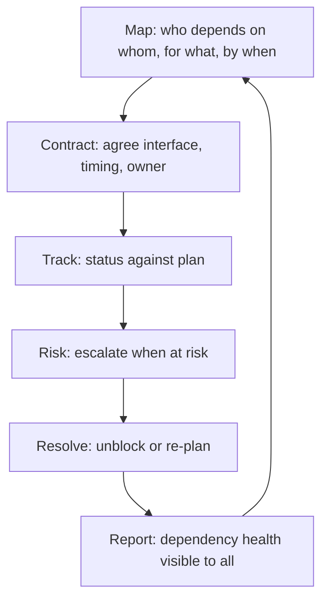

# Dependency Management

> **Core capability:** The TPM maps, tracks, and resolves dependencies across teams, suppliers, and external organizations — making invisible coupling visible and unblocking work before it stalls.

## Why This Matters

Dependencies are the silent killers of multi-team programs. A team finishes early but the team they depend on started late. A vendor delivers on time but the API contract changed. An infrastructure dependency was assumed available and was not. Each individual dependency is manageable; the web of them across six teams, two vendors, and a platform migration is not — unless someone owns the web.

The TPM owns the dependency map: who depends on whom, for what, by when, with what contract, and with what risk if the dependency fails. This is not project administration — it is the core coordination mechanism that makes multi-team delivery predictable.

## Topics in This Capability Area

| Topic | Core Skill | When It Matters |
|-------|------------|-----------------|
| [[01_Dependency_Mapping]] | Creating and maintaining the program dependency map | Program planning; replanning |
| [[02_Dependency_Classification]] | Categorizing dependencies by type, criticality, and risk | Triage and prioritization |
| [[03_Interface_Contracts]] | Establishing and tracking contracts between dependent teams | Cross-team work |
| [[04_External_Dependency_Management]] | Managing vendors, suppliers, and third-party dependencies | External integrations |
| [[05_Dependency_Risk_and_Contingency]] | Building contingency for high-risk dependencies | Before the dependency fails |
| [[06_Unblocking_Escalations]] | Escalating blocked dependencies through the governance structure | When teams cannot resolve alone |
| [[07_Dependency_Health_and_Reporting]] | Making dependency status visible and actionable | Program reviews; stakeholder updates |

## The Dependency Lifecycle

Dependencies don't disappear — they are resolved, re-planned, or escalated.

## Practical Applications

### Dependency Management Checklist

- [ ] A program dependency map exists and is visible to all teams
- [ ] Every cross-team dependency has a named owner on both sides
- [ ] Interface contracts are documented for critical dependencies
- [ ] External dependencies have contingency plans
- [ ] Dependency health is reviewed in every program status cycle
- [ ] Escalation paths are exercised before they are needed

## Common Pitfalls

| Pitfall | Why It Is a Problem | Better Approach |
|---------|---------------------|-----------------|
| **Dependency-by-assumption** | Teams assume others will deliver on time with the right interface | Contract every dependency explicitly |
| **Map-and-forget** | Dependency map created at planning, never updated | Living map; review in every status cycle |
| **External surprise** | Vendor delays discovered too late to re-plan | External dependency tracking with early warning indicators |
| **Escalation avoidance** | Blocked dependencies sit unresolved; program drifts | Escalate early with options; governance exists for this |

## Success Indicators

- Dependency surprises are rare — the map catches them before they block work
- Cross-team interfaces are contracted and changes are renegotiated, not assumed
- External dependencies have monitoring and contingency plans
- Escalations happen early and resolve in one governance cycle

## Related Capabilities

- [[01_Program_Structure_and_Charter/00_overview|Program Structure and Charter]]: workstream decomposition drives the dependency map
- [[04_Risk_and_Issue_Leadership/00_overview|Risk and Issue Leadership]]: dependencies are a primary source of program risk
- [[career-path/03_Staff_Engineer/02_Cross_Team_Technical_Leadership/04_Migration_Leadership|Migration Leadership (Staff)]]: dependency management at migration scale

## Summary

Dependency management is the TPM's coordination engine: a living map of who depends on whom, contracts that make interfaces explicit, tracking that catches drift early, and escalation that unblocks work through governance rather than heroics. Programs that ship on time don't have fewer dependencies — they have a better dependency system.