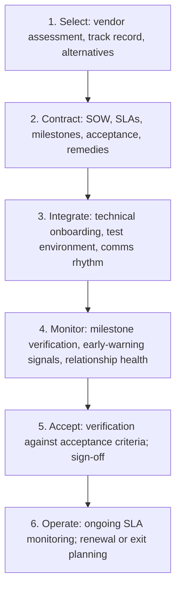

# External Dependency Management

> **Core skill:** Managing dependencies on vendors, suppliers, regulators, and third-party organizations — where the TPM has no authority, limited visibility, and must substitute influence, contract leverage, and early-warning systems for direct control.

## Why This Matters

Internal dependencies are hard. External dependencies are harder — because the people you depend on do not report to your company, attend your stand-ups, or feel your deadline pressure. The vendor's priority stack does not match yours. The regulator's timeline is not negotiable. The partner's roadmap changed without telling you.

External dependencies fail differently from internal ones. Internal dependencies slip with warning signs: the owner misses checkpoints, the team's velocity drops, the integration test fails. External dependencies slip silently — the vendor goes dark, the certification body has a backlog, the partner deprioritized your integration — and the first signal is the missed delivery date. By then, the program has no cheap options left.

The TPM's external dependency practice compensates for the lack of authority with: contract leverage where it exists, relationship investment where it does not, early-warning indicators that pierce the opacity, and contingency plans that assume external dependencies will slip until proven otherwise.

## Why External Is Different

| Dimension | Internal Dependency | External Dependency |
|-----------|-------------------|-------------------|
| **Authority** | Escalation through shared management chain | No authority; contract leverage or nothing |
| **Visibility** | Access to team's tracking, stand-ups, demos | Limited to what the vendor chooses to share |
| **Incentives** | Shared program success | Vendor's own P&L, roadmap, and customer stack |
| **Communication** | Direct, frequent, informal | Formal, mediated, relationship-dependent |
| **Recourse** | Re-plan, re-staff, escalate internally | Contractual remedies; slow and expensive |
| **Risk profile** | Classified as stable/volatile | Always external-risk by default |

The playbook for external dependencies starts from a different assumption: trust nothing that is not contractually committed and independently verified.

## The External Dependency Lifecycle

Each phase has a different failure mode. The TPM's job is to have the next phase's mitigation in place before the current phase fails.

## Phase 1: Vendor Selection and Assessment

Before the dependency exists, assess whether the vendor can deliver:

| Assessment Area | Questions |
|-----------------|-----------|
| **Track record** | Have they delivered similar work on schedule? References? |
| **Capacity** | Are they sized to handle your work alongside existing commitments? |
| **Financial health** | Will they exist for the duration of the dependency? |
| **Technical fit** | Does their technology integrate with your stack? |
| **Cultural alignment** | Do their communication and escalation norms match yours? |
| **Alternative vendors** | If they fail, who else can do this? |

Selection is the cheapest time to avoid an external dependency failure. A vendor that looks risky at selection will not become reliable at delivery.

## Phase 2: Contracting with External Parties

The external contract (SOW, MSA, service agreement) is both a legal instrument and the TPM's primary leverage. The TPM works with legal and procurement but owns the operational terms:

| Contract Element | TPM's Operational Concern |
|-----------------|--------------------------|
| **Milestones with dates** | External milestones map to internal program dates with buffer |
| **Acceptance criteria** | Testable, objective, tied to payment or delivery gates |
| **SLAs and penalties** | What happens when they miss: credits, expedited recovery, termination right |
| **Reporting requirements** | Minimum status information, cadence, format — written into the contract |
| **Escalation path** | Named contacts at each level; escalation triggers defined |
| **IP and data rights** | Who owns what; what happens to data at contract end |
| **Exit and transition** | How to move off the vendor; data extraction; transition assistance |

The contract is not the relationship — but it is the floor the relationship stands on. A good relationship can survive a light contract. A bad relationship cannot be saved by a heavy one.

## Phase 3: Integration and Communication Rhythm

Once the contract is signed, establish the operational relationship:

| Element | Setup | Cadence |
|---------|-------|---------|
| **Single point of contact** | Named person on each side; escalation contacts above them | Continuous |
| **Status reporting** | Agreed format: milestones, risks, blockers, decisions needed | Weekly minimum for critical; biweekly for others |
| **Technical integration** | Test environment, API access, integration test schedule | As defined in the integration plan |
| **Joint checkpoint meetings** | Agenda: progress against milestones, risks, changes, decisions | Weekly or biweekly depending on criticality |
| **Decision log** | Shared document; every decision with date, parties, rationale | Updated in real time |

The communication rhythm is more important with external partners than internal teams — because informal corridor conversations do not exist. If it is not in the structured rhythm, it does not happen.

## Phase 4: Monitoring and Early Warning

External dependencies need a different set of leading indicators because the internal ones (merge rate, velocity, stand-up tone) are not available:

| Leading Indicator | What to Watch | What It Signals |
|-------------------|---------------|-----------------|
| **Response latency** | Time to respond to emails, status requests, issue reports | Engagement decline; competing priorities |
| **Milestone check-in quality** | Are status reports detailed and honest, or vague and delayed? | They are hiding problems or have stopped tracking |
| **Key person stability** | Does the same person own the work, or does it rotate? | Internal churn; loss of context |
| **Invoice and payment friction** | Are invoices accurate and on time? Disputes? | Financial or relationship stress |
| **Scope creep requests** | Are they proposing changes that expand scope without date relief? | They are behind and trying to justify delay |
| **Third-party signals** | Industry news, Glassdoor reviews, funding announcements | Organizational instability |

When two or more indicators trend negative, escalate internally before the external delivery date arrives — see [[06_Unblocking_Escalations]].

## Phase 5: Acceptance and Sign-Off

External deliverable acceptance is the moment when assumptions become facts:

| Acceptance Practice | Why It Matters |
|--------------------|----------------|
| **Test against the contracted acceptance criteria** | Not against what you now wish they had built |
| **Test in your environment** | Not in theirs; their environment is always cleaner |
| **Test at production scale** | Or as close as you can; scale reveals what demos hide |
| **Document acceptance formally** | Date, what was accepted, any known deficiencies, sign-off |
| **Tie acceptance to payment** | Acceptance gates payment milestones; it is your last leverage |

Acceptance is not a ceremony — it is the verification that the external dependency is resolved. Until acceptance is complete, the dependency is open.

## When the External Dependency Fails

| Scenario | Immediate Action | Longer-Term |
|----------|-----------------|-------------|
| **Minor slip (days)** | Invoke the contingency buffer built into the schedule | Re-assess the vendor's recovery plan |
| **Significant slip (weeks)** | Execute contingency plan; activate alternative supplier if available | Escalate through vendor's management chain using contract provisions |
| **Non-delivery** | Stop work with the vendor; execute exit clause; activate alternative | Legal remedies; internal build assessment |
| **Quality failure** | Reject at acceptance; invoke remediation clause | Re-evaluate the relationship; may require re-procurement |

Every external dependency on the critical path must have a contingency plan before the dependency is committed — see [[05_Dependency_Risk_and_Contingency]].

## Practical Applications

- [ ] Every external dependency has a contract with operational terms the TPM can enforce
- [ ] External dependencies have a different monitoring regime from internal ones — leading indicators that pierce opacity
- [ ] Communication rhythm is structured and documented; nothing relies on informal contact
- [ ] Acceptance criteria are written into the contract and verified in your environment
- [ ] Contingency plans exist for every critical external dependency before the dependency begins

## Common Pitfalls

| Pitfall | Why It Is a Problem | Better Approach |
|---------|---------------------|-----------------|
| **Assuming external = internal** | Applying the same light-touch tracking to a vendor | External dependencies get a distinct, heavier tracking regime |
| **Contract without operational teeth** | Legal wrote the contract; TPM cannot enforce it operationally | TPM owns the operational terms: milestones, reporting, acceptance, escalation |
| **Single-vendor lock-in** | No alternative; dependency becomes a hostage situation | Assess and maintain alternatives even if not activated |
| **Relationship-only management** | "We have a great relationship" — until the one person leaves | Contract floor plus relationship; never relationship alone |
| **Late acceptance** | Delivered months ago; never formally accepted; now can't reject | Accept or reject at delivery; the clock runs against you |

## Success Indicators

- External dependency slips are detected through leading indicators, not missed delivery dates
- Critical external dependencies have exercised contingency plans
- Vendor status reports arrive on schedule with honest content
- Acceptance is formal, tested, and documented — never assumed

## Related Topics

- [[01_Dependency_Mapping]]: external dependencies marked distinctly on the map
- [[02_Dependency_Classification]]: all external dependencies start as external-risk profile
- [[03_Interface_Contracts]]: contract adaptations for external parties
- [[05_Dependency_Risk_and_Contingency]]: contingency planning for external dependency failure
- [[06_Unblocking_Escalations]]: escalating external failures through vendor management chains

## Summary

External dependency management is the TPM's discipline for dependencies where there is no shared manager to escalate through. It substitutes structured contracts, leading-indicator monitoring, and contingency planning for the authority and visibility that internal dependencies enjoy. The TPM's rule: every external dependency is assumed risky until proven otherwise, monitored differently from internal ones, and backed by a contingency plan that is in place before the dependency begins — not scrambled together when it fails.